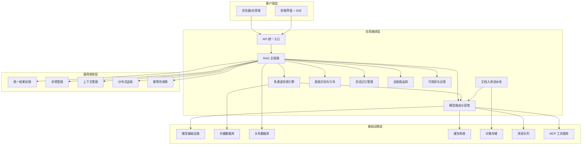
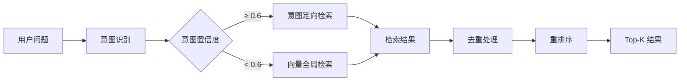
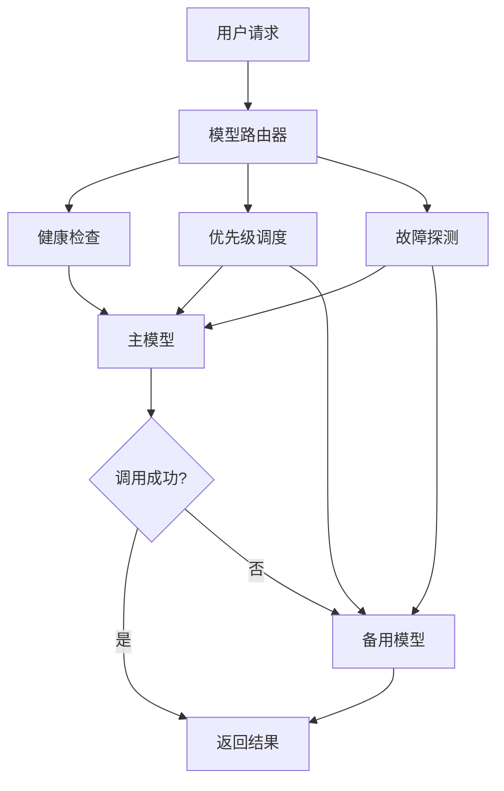
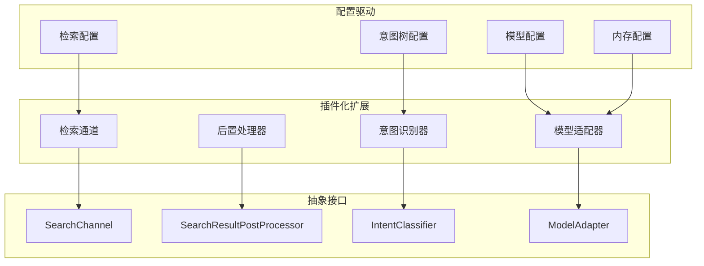

Ragent AI 是一个**企业级 RAG 智能体平台**，基于 Java 17 + Spring Boot 3 + React 18 构建。这是一个从 0 到 1 纯手工打造的完整 RAG 系统，真实在企业级环境中落地，不是玩具级别的 Demo 项目。项目涵盖了从文档入库到智能问答的全链路工程实现，为开发者提供了一套接近真实业务落地的 RAG 实践方案。  

**GitHub**：[https://github.com/nageoffer/ragent](https://github.com/nageoffer/ragent)  
**官方文档**：[https://nageoffer.com/ragent](https://nageoffer.com/ragent)  

## 项目背景与价值

在当前 AI 技术浪潮下，RAG（检索增强生成）已经成为企业级应用的核心技术。然而市面上很多项目要么是简单的 API 调用 Demo，要么是基于 Python 的实验性项目，难以满足企业级 Java 开发的实际需求。Ragent 的诞生就是为了解决这些问题：

- **简历差异化**：相对于传统的 CRUD 项目，Ragent AI 项目展现了复杂系统的设计和工程实践能力
- **面试有深度**：涵盖向量检索、意图识别、模型路由、全链路追踪等多个技术维度
- **实际可用性**：基于真实企业级经验，包含完整的工程化特性，如容错、监控、扩展等

## 核心技术架构

Ragent 采用**前后端分离的单体架构**，后端按职责分为四个 Maven 模块，确保代码的清晰职责划分和可维护性。

### 技术栈选型

| 层面 | 技术选型 | 作用说明 |
|------|---------|---------|
| **后端框架** | Java 17 + Spring Boot 3.5.7 | 现代化 Java 框架，提供企业级特性 |
| **前端框架** | React 18 + Vite + TypeScript | 现代化前端开发，组件化管理 |
| **关系数据库** | MySQL (20+ 业务表) | 结构化数据存储，业务数据管理 |
| **向量数据库** | Milvus 2.6 | 高维向量检索，语义相似度计算 |
| **缓存/限流** | Redis + Redisson | 会话管理、限流、缓存优化 |
| **对象存储** | S3 兼容存储 | 文件存储，文档管理 |
| **消息队列** | RocketMQ 5.x | 异步处理，任务调度 |
| **文档解析** | Apache Tika 3.2 | 多格式文档解析，PDF/Word 处理 |
| **统一监控** | 全链路追踪 | 性能监控，问题排查 |

## 核心能力模块

### 1. 多通道检索引擎

Ragent 实现了**意图定向检索 + 全局向量检索**的双通道并行检索架构，兼顾精准度与召回率。

| 检索通道 | 触发条件 | 技术特点 | 适用场景 |
|---------|---------|---------|---------|
| **意图定向检索** | 始终执行 | 基于预定义意图树，精确匹配 | 高频问题、标准流程查询 |
| **向量全局检索** | 意图置信度 < 0.6 | 语义相似度检索，兜底保障 | 复杂问题、模糊查询、新业务 |

### 2. 智能意图识别与引导

采用**树形多级意图分类**架构，置信度不足时主动引导澄清，避免硬猜答案。

- **意图树结构**：领域→类目→话题
- **置信度机制**：动态计算匹配分数
- **引导策略**：主动提供澄清建议
- **上下文感知**：考虑历史对话的影响

### 3. 问题重写与拆分

解决"用户说的不是想问的"问题，提升检索准确性：

- **多轮对话补全**：自动补充上下文信息
- **子问题拆分**：复杂问题分解为简单子问题
- **术语映射**：标准化用户表达方式
- **动态重写**：根据历史对话优化问题表达

### 4. 会话记忆管理

智能管理对话上下文，平衡成本与效果：

| 策略 | 实现方式 | 优势 | 适用场景 |
|------|---------|------|---------|
| **固定窗口** | 保留最近 N 轮 | 实现简单 | 短对话场景 |
| **摘要压缩** | LLM 自动摘要 | Token 成本低 | 长对话场景 |
| **重要性评分** | 关键信息保留 | 精准保留重点 | 复杂业务场景 |

### 5. 模型路由与容错

企业级模型调用架构，确保服务稳定性：

### 6. MCP 工具集成

当用户意图非知识检索时，自动提参调用业务工具，实现检索与工具调用的无缝融合。

### 7. 文档入库流水线

完整的 ETL 流程，支持多种文档格式：

**处理流程**：抓取 → 解析 → 增强 → 分块 → 丰富 → 索引  
**支持格式**：PDF、Word、PPT、网页、Markdown  
**输出目标**：Milvus 向量库 + 元数据存储  

## 项目特色与优势

### 1. 真实企业级落地

- **非 Demo 级别**：包含完整的工程化特性
- **实际业务验证**：经历过真实企业场景的打磨
- **性能优化**：针对高并发场景进行优化
- **监控完善**：全链路追踪，可观测性完整

### 2. 可扩展架构设计

### 3. 完善的管理后台

React 开发的精美控制台，提供完整的可视化管理功能：

- **知识库管理**：文档上传、索引管理、质量监控
- **意图树编辑**：可视化配置意图分类
- **入库监控**：实时查看文档处理进度
- **链路追踪**：检索问题排查与分析
- **系统设置**：模型配置、参数调优

### 4. 学习价值

**通过学习 Ragent 项目，你可以掌握：**

1. **RAG 核心技术**：从理论到实践的完整链路
2. **企业级架构设计**：复杂系统的设计模式与最佳实践
3. **AI 工程化**：模型调用的工程化实现
4. **性能优化**：检索性能优化、缓存策略、限流机制
5. **监控运维**：全链路追踪、问题排查、系统监控

### 5. 适用人群

- **初学者**：想学习 RAG 技术的 Java 开发者
- **进阶者**：希望深入了解 AI 工程化实践的工程师
- **架构师**：需要设计企业级 RAG 系统的技术负责人
- **求职者**：希望在简历中体现 AI 项目经验

## 下一步学习路径

完成项目概述了解后，建议按以下顺序深入学习：

1. **[快速开始指南](2-kuai-su-kai-shi-zhi-nan)**：环境搭建与第一个 Hello World
2. **[智能对话界面使用](6-zhi-neng-dui-hua-jie-mian-shi-yong)**：体验核心对话功能
3. **[知识库管理入门](7-zhi-shi-ku-guan-li-ru-men)**：学习文档入库与管理
4. **[整体系统架构设计](9-zheng-ti-xi-tong-jia-gou-she-ji)**：深入理解架构设计思想

## 总结

Ragent AI 不仅仅是一个 RAG 项目，更是一个完整的**企业级智能系统实现**。它涵盖了从底层基础设施到上层业务应用的完整技术栈，提供了真实可用的工程实践经验。无论你是想学习 AI 技术、提升架构设计能力，还是为简历增加亮点，Ragent 都是一个绝佳的选择。

通过这个项目，你将获得**真正能够落地的 RAG 实践经验**，而非停留在概念层面。每一个模块都经过精心设计和实现，确保在生产环境中稳定可靠。这正是 Ragent 最大的价值所在。