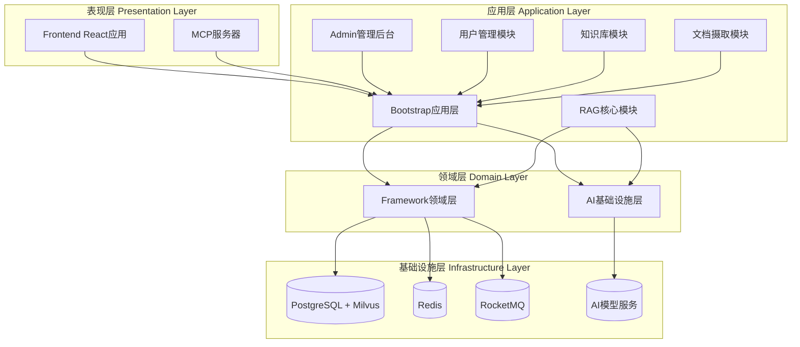
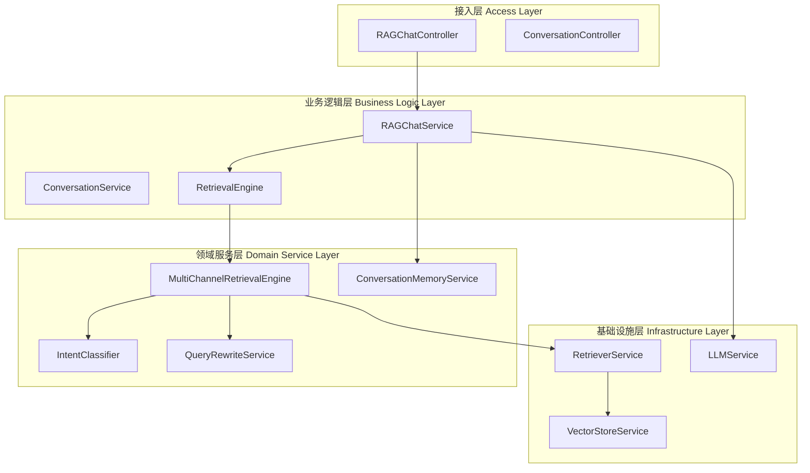
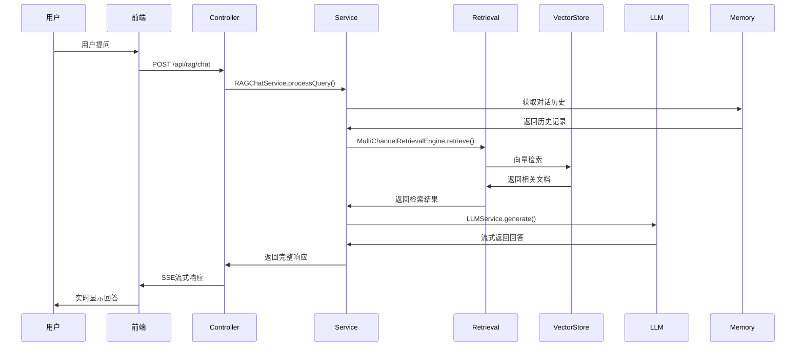

ragent 项目采用分层化、模块化的架构设计，各层职责明确、边界清晰，实现了高内聚低耦合的系统结构。本文档将详细分析系统的模块分层架构、各模块的职责划分以及它们之间的交互关系。

## 整体架构概览

### 模块分层架构图



### 模块依赖关系

| 模块 | 依赖关系 | 核心职责 |
|------|----------|----------|
| bootstrap | framework, infra-ai | 应用启动、业务逻辑集成 |
| framework | 基础设施 | 框架层抽象、通用组件 |
| infra-ai | framework | AI能力封装、模型调用 |
| mcp-server | 独立运行 | MCP协议实现 |
| frontend | bootstrap | 用户界面 |

## 详细模块分析

### 1. Bootstrap 模块 - 应用集成层

**职责定位**：作为应用的主要入口，负责整合所有业务模块和框架组件。

#### 核心子模块

| 子模块 | 职责描述 | 关键组件 |
|--------|----------|----------|
| **rag** | RAG核心业务逻辑 | 对话管理、检索引擎、意图识别、记忆管理 |
| **knowledge** | 知识库管理 | 知识库CRUD、文档处理、分块策略 |
| **ingestion** | 文档摄取流水线 | 文档解析、分块、向量化、索引 |
| **user** | 用户管理 | 认证授权、用户管理、权限控制 |
| **admin** | 管理后台 | 系统监控、配置管理、数据分析 |

#### 关键特性

- **统一的配置管理**：通过 `@MapperScan` 统一管理数据访问层
- **事务边界清晰**：每个业务模块独立管理其事务
- **模块化启动**：通过Spring Boot自动装配实现模块的按需加载

Sources: [RagentApplication.java](bootstrap/src/main/java/com/nageoffer/ai/ragent/RagentApplication.java#L1-L42)

### 2. Framework 模块 - 框架基础设施

**职责定位**：提供跨业务模块的通用基础设施和能力封装。

#### 核心能力矩阵

| 能力领域 | 核心组件 | 实现方式 |
|----------|----------|----------|
| **缓存管理** | RedisKeySerializer | Redis序列化定制 |
| **消息队列** | MessageQueueProducer | RocketMQ集成 |
| **分布式ID** | SnowflakeIdInitializer | 雪花算法实现 |
| **异常处理** | AbstractException | 统一异常体系 |
| **上下文管理** | UserContext | 用户上下文传递 |
| **全链路追踪** | RagTraceContext | 链路追踪框架 |
| **幂等性** | IdempotentConsume | 幂等消费实现 |

#### 关键设计模式

- **责任链模式**：异常处理链、消息处理链
- **策略模式**：不同类型的处理器、序列化器
- **工厂模式**：组件工厂、服务工厂

Sources: [framework 模块结构](framework/src/main/java/com/nageoffer/ai/ragent/framework#L1-L50)

### 3. Infra-ai 模块 - AI能力基础设施

**职责定位**：封装AI模型能力，提供统一的AI服务接口。

#### AI能力分类

| AI能力 | 实现组件 | 支持的模型提供商 |
|--------|----------|-----------------|
| **对话服务** | LLMService, RoutingLLMService | OpenAI, Ollama, SiliconFlow |
| **向量嵌入** | EmbeddingService, RoutingEmbeddingService | OpenAI, Ollama, SiliconFlow |
| **重排序** | RerankService, RoutingRerankService | 百炼, 通用重排序 |
| **模型路由** | ModelSelector, ModelRoutingExecutor | 智能路由、容错切换 |

#### 核心特性

- **统一接口**：`ChatClient`, `EmbeddingClient`, `RerankClient`
- **智能路由**：基于健康状态、响应时间、错误率的路由策略
- **流式处理**：支持SSE流式响应，实时返回生成内容
- **容错机制**：自动故障转移、降级处理

Sources: [infra-ai 模块结构](infra-ai/src/main/java/com/nageoffer/ai/ragent/infra#L1-L50)

### 4. MCP-Server 模块 - 工具集成服务

**职责定位**：实现Model Context Protocol，提供AI工具调用能力。

#### 核心组件架构

| 组件 | 职责 | 实现方式 |
|------|------|----------|
| **核心框架** | MCP协议实现 | Json-RPC 2.0协议 |
| **工具注册** | MCPToolRegistry | 工具发现与管理 |
| **工具执行** | MCPToolExecutor | 工具调用执行 |
| **端点处理** | MCPEndpoint | HTTP请求处理 |

#### 支持的工具类型

- **销售工具**：SalesMCPExecutor - 销售数据处理
- **工单工具**：TicketMCPExecutor - 工单管理
- **天气工具**：WeatherMCPExecutor - 天气查询

Sources: [mcp-server 模块结构](mcp-server/src/main/java/com/nageoffer/ai/ragent/mcp#L1-L50)

### 5. Frontend 模块 - 用户界面

**职责定位**：提供现代化的用户交互界面，支持Web和MCP工具集成。

#### 前端架构设计

| 层级 | 组件 | 技术栈 |
|------|------|--------|
| **页面层** | pages/* | React Router, TypeScript |
| **组件层** | components/* | 自定义组件库 |
| **服务层** | services/* | API封装 |
| **状态层** | stores/* | 状态管理 |
| **工具层** | utils/* | 工具函数 |

#### 关键功能模块

- **智能对话**：实时流式对话、Markdown渲染、反馈收集
- **知识库管理**：知识库CRUD、文档上传、分块管理
- **管理后台**：系统监控、配置管理、数据分析
- **会话管理**：会话列表、历史记录、记忆管理

Sources: [frontend 模块结构](frontend/src#L1-L30)

## 业务领域分层

### RAG 核心业务分层



### 核心领域服务职责

| 领域服务 | 核心职责 | 关键组件 |
|----------|----------|----------|
| **意图识别** | 用户意图分类与解析 | DefaultIntentClassifier, IntentTree |
| **查询重写** | 查询优化与扩展 | QueryRewriteService, QueryTermMapping |
| **多通道检索** | 多源信息检索 | MultiChannelRetrievalEngine, SearchChannel |
| **对话记忆** | 会话上下文管理 | ConversationMemoryService, MemoryStore |
| **向量存储** | 向量数据管理 | VectorStoreService, Milvus/PgVector |
| **提示工程** | 提示模板管理 | RAGPromptService, PromptTemplateLoader |

Sources: [RAG核心业务层](bootstrap/src/main/java/com/nageoffer/ai/ragent/rag/core#L1-L50)

## 数据流向与交互模式

### 典型RAG流程数据流



### 模块间交互模式

| 交互模式 | 使用场景 | 实现方式 |
|----------|----------|----------|
| **同步调用** | 实时请求响应 | Spring MVC, REST API |
| **异步消息** | 异步任务处理 | RocketMQ, 事件驱动 |
| **流式响应** | 长时间生成任务 | SSE, WebSocket |
| **缓存访问** | 性能优化 | Redis, 本地缓存 |
| **数据库查询** | 数据持久化 | MyBatis, JPA |

## 架构优势与特点

### 1. 高度模块化

- **松耦合设计**：各模块通过接口定义依赖，减少直接依赖
- **可插拔组件**：AI模型、存储后端、消息队列等均可替换
- **独立部署**：各模块可独立构建和部署

### 2. 横向扩展能力

- **多通道检索**：支持同时使用多个检索源
- **模型路由**：智能选择最优AI模型
- **负载均衡**：请求分发和容错处理

### 3. 运维友好

- **全链路追踪**：RagTrace提供完整的请求链路追踪
- **健康监控**：ModelHealthStore监控模型服务状态
- **配置管理**：统一的配置体系和环境隔离

### 4. 开发效率

- **代码生成**：MyBatis-Plus减少模板代码
- **统一异常**：AbstractException统一异常处理
- **工具集成**：MCP协议简化AI工具调用

## 模块扩展指南

### 添加新的AI模型支持

1. **在infra-ai模块中实现新的Client**
   ```java
   // 实现对应的Client接口
   public class NewModelChatClient implements ChatClient {
       // 实现具体逻辑
   }
   ```

2. **在RoutingLLMService中注册**
   ```java
   @Service
   public class RoutingLLMService {
       private final Map<ModelProvider, ChatClient> clients;
       // 添加新模型注册
   }
   ```

### 添加新的检索通道

1. **实现SearchChannel接口**
   ```java
   @Service
   public class CustomSearchChannel implements SearchChannel {
       // 实现自定义检索逻辑
   }
   ```

2. **在MultiChannelRetrievalEngine中注册**
   ```java
   @Service
   public class MultiChannelRetrievalEngine {
       private final List<SearchChannel> channels;
       // 添加新通道
   }
   ```

### 添加新的MCP工具

1. **实现MCPToolExecutor接口**
   ```java
   @Service
   public class CustomMCPExecutor implements MCPToolExecutor {
       // 实现工具逻辑
   }
   ```

2. **在DefaultMCPToolRegistry中注册**
   ```java
   @Service
   public class DefaultMCPToolRegistry implements MCPToolRegistry {
       // 注册新工具
   }
   ```

## 性能优化建议

### 1. 缓存策略

- **Redis缓存**：热点数据缓存，会话记忆缓存
- **本地缓存**：配置信息、字典数据
- **缓存一致性**：消息队列同步缓存更新

### 2. 数据库优化

- **索引优化**：高频查询字段建立索引
- **连接池**：合理的数据库连接池配置
- **读写分离**：主从数据库架构

### 3. AI服务优化

- **模型预热**：提前加载常用模型
- **批处理**：批量处理向量嵌入请求
- **缓存结果**：相似查询的缓存机制

### 4. 并发控制

- **限流机制**：ChatRateLimit控制并发请求
- **线程池**：合理的线程池配置
- **异步处理**：耗时操作异步化

通过这种模块化分层架构，ragent项目实现了职责清晰、易于维护、可扩展的系统设计，为构建企业级RAG应用提供了坚实的基础架构。