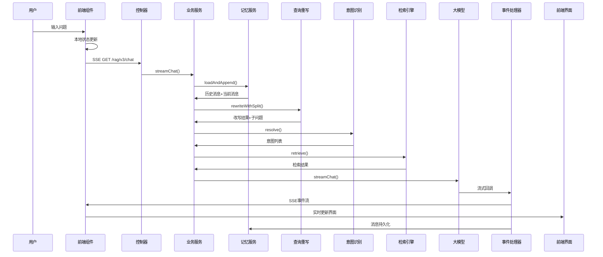

## 概述

RAGent 系统的全链路检索与生成流程是一个复杂的多阶段处理过程，从前端用户输入到后端AI响应形成完整的问答闭环。本流程集成了意图识别、知识库检索、工具调用、内容生成等多个核心组件，实现了智能化的文档检索与生成系统。

整个流程采用异步流式处理架构，通过SSE（Server-Sent Events）技术实现实时响应，确保用户体验的流畅性和系统的高并发处理能力。

## 架构总览

### 系统架构图

```mermaid
graph TB
    subgraph "前端层"
        A[用户输入] --> B[ChatInput组件]
        B --> C[chatStore状态管理]
        C --> D[useStreamResponse Hook]
        D --> E[SSE长连接]
    end
    
    subgraph "接入层"
        E --> F[RAGChatController]
        F --> G[@IdempotentSubmit防重复]
        G --> H[ChatRateLimit限流]
        H --> I[ChatQueueLimiter队列]
    end
    
    subgraph "业务编排层"
        I --> J[RAGChatServiceImpl]
        J --> K[记忆加载]
        J --> L[问题改写拆分]
        J --> M[意图识别]
        J --> N[歧义引导]
        J --> O[知识库检索]
        J --> P[提示词组装]
    end
    
    subgraph "AI能力层"
        O --> Q[MultiChannelRetrievalEngine]
        Q --> R[MCP工具执行]
        O --> S[重排序处理]
        P --> T[RoutingLLMService]
        T --> U[模型路由]
        U --> V[流式生成]
    end
    
    subgraph "事件处理层"
        V --> W[StreamChatEventHandler]
        W --> X[SSE事件发送]
        X --> Y[前端状态更新]
        Y --> Z[界面渲染]
    end
    
    subgraph "数据持久化层"
        K --> AA[ConversationMemoryService]
        W --> BB[消息落库]
        BB --> CC[会话管理]
    end
```

### 核心流程时序图



## 详细流程分析

### 1. 前端请求发起

#### 1.1 用户输入处理
用户在前端界面输入问题并触发发送操作，整个过程通过以下组件协同完成：

**关键组件：**
- `ChatInput.tsx`: 输入框组件，处理用户交互
- `chatStore.ts`: 状态管理，维护会话和消息状态
- `useStreamResponse.ts`: SSE连接管理

**处理流程：**
1. 用户输入问题，触发 `handleSubmit()` 方法
2. 进行本地乐观更新：创建临时user和assistant消息
3. 调用 `buildQuery()` 组装查询参数：
   - `question`: 原始问题
   - `conversationId`: 会话ID（可选）
   - `deepThinking`: 是否深度思考
4. 通过 `createStreamResponse()` 建立 SSE 连接

**实现要点：**
```typescript
// 关键代码位置：frontend/src/stores/chatStore.ts:221
sendMessage(content) {
  // 1. 本地乐观更新
  const userMessage = createUserMessage(content);
  const assistantMessage = createAssistantMessage();
  
  // 2. 组装查询参数
  const query = buildQuery({
    question: content,
    conversationId: currentConversationId,
    deepThinking: deepThinkingEnabled
  });
  
  // 3. 创建SSE连接
  const { start } = createStreamResponse(query);
  return start();
}
```

#### 1.2 SSE连接建立
前端采用 `fetch()` API 建立 SSE 连接，而非传统的 axios 请求：

**特点：**
- 使用 `Accept: text/event-stream` 头
- 支持重试机制
- 手动添加 Authorization 头
- 实现流式数据解析

**代码实现：**
```typescript
// 位置：frontend/src/hooks/useStreamResponse.ts:124
streamWithRetry() {
  return fetch(url, {
    method: 'GET',
    headers: {
      'Accept': 'text/event-stream',
      'Authorization': `Bearer ${token}`
    }
  });
}
```

### 2. 后端接入处理

#### 2.1 控制器层
`RAGChatController` 作为请求入口点，提供两个主要接口：

```java
@RestController
@RequiredArgsConstructor
public class RAGChatController {
    
    // SSE流式聊天接口
    @IdempotentSubmit(
        key = "T(com.nageoffer.ai.ragent.framework.context.UserContext).getUserId()",
        message = "当前会话处理中，请稍后再发起新的对话"
    )
    @GetMapping(value = "/rag/v3/chat", produces = "text/event-stream;charset=UTF-8")
    public SseEmitter chat(@RequestParam String question,
                         @RequestParam(required = false) String conversationId,
                         @RequestParam(required = false, defaultValue = "false") Boolean deepThinking) {
        SseEmitter emitter = new SseEmitter(0L);
        ragChatService.streamChat(question, conversationId, deepThinking, emitter);
        return emitter;
    }
    
    // 任务停止接口
    @PostMapping(value = "/rag/v3/stop")
    public Result<Void> stop(@RequestParam String taskId) {
        ragChatService.stopTask(taskId);
        return Results.success();
    }
}
```

#### 2.2 防重复与限流机制
系统采用多层防护机制确保服务稳定性：

**@IdempotentSubmit 防重复提交：**
- 基于 Redis 分布式锁
- 自定义 SpEL 表达式生成锁 key
- 防止用户重复点击

**ChatRateLimit 限流：**
- 全局限流与会话限流结合
- 使用 Redis 信号量控制并发
- 支持排队机制

**ChatQueueLimiter 队列管理：**
- Redis 队列 + 信号量控制
- 超时机制和拒绝策略
- 分布式任务状态同步

### 3. 核心业务编排

#### 3.1 记忆加载与持久化
`RAGChatServiceImpl.streamChat()` 方法是整个流程的核心编排器：

```java
@ChatRateLimit
public void streamChat(String question, String conversationId, Boolean deepThinking, SseEmitter emitter) {
    // 1. 规范化ID
    String actualConversationId = StrUtil.isBlank(conversationId) ? 
        IdUtil.getSnowflakeNextIdStr() : conversationId;
    String taskId = StrUtil.isBlank(RagTraceContext.getTaskId()) ? 
        IdUtil.getSnowflakeNextIdStr() : RagTraceContext.getTaskId();
    
    // 2. 创建事件处理器
    StreamCallback callback = callbackFactory.createChatEventHandler(emitter, actualConversationId, taskId);
    
    // 3. 加载记忆并追加当前消息
    String userId = UserContext.getUserId();
    List<ChatMessage> history = memoryService.loadAndAppend(actualConversationId, userId, 
        ChatMessage.user(question));
    
    // 4. 问题改写与拆分
    RewriteResult rewriteResult = queryRewriteService.rewriteWithSplit(question, history);
    
    // 5. 意图识别
    List<SubQuestionIntent> subIntents = intentResolver.resolve(rewriteResult);
    
    // 6. 歧义引导检测
    GuidanceDecision guidanceDecision = guidanceService.detectAmbiguity(rewriteResult.rewrittenQuestion(), subIntents);
    if (guidanceDecision.isPrompt()) {
        callback.onContent(guidanceDecision.getPrompt());
        callback.onComplete();
        return;
    }
    
    // 7. 纯系统意图检查
    boolean allSystemOnly = subIntents.stream()
        .allMatch(si -> intentResolver.isSystemOnly(si.nodeScores()));
    if (allSystemOnly) {
        // 处理纯系统响应
        return;
    }
    
    // 8. 知识库检索
    RetrievalContext ctx = retrievalEngine.retrieve(subIntents, DEFAULT_TOP_K);
    if (ctx.isEmpty()) {
        callback.onContent("未检索到与问题相关的文档内容。");
        callback.onComplete();
        return;
    }
    
    // 9. LLM响应生成
    StreamCancellationHandle handle = streamLLMResponse(rewriteResult, ctx, 
        intentResolver.mergeIntentGroup(subIntents), history, thinkingEnabled, callback);
    taskManager.bindHandle(taskId, handle);
}
```

#### 3.2 记忆服务实现
`ConversationMemoryService` 负责会话历史的管理：

```java
// 位置：bootstrap/src/main/java/com/nageoffer/ai/ragent/rag/core/memory/ConversationMemoryService.java
default List<ChatMessage> loadAndAppend(String conversationId, String userId, ChatMessage newMessage) {
    // 1. 加载历史消息
    List<ChatMessage> history = load(conversationId, userId);
    
    // 2. 追加新消息
    append(conversationId, userId, newMessage);
    
    // 3. 返回包含新消息的历史
    List<ChatMessage> result = new ArrayList<>(history);
    result.add(newMessage);
    return result;
}
```

**重要特性：**
- 新会话创建时机：第一次追加 USER 消息时
- 历史消息限制：避免上下文过长
- 并行加载摘要和详细历史
- 异常情况下的降级处理

#### 3.3 问题改写与拆分
`MultiQuestionRewriteService` 实现智能的问题预处理：

```java
@Override
public RewriteResult rewriteWithSplit(String userQuestion, List<ChatMessage> history) {
    // 1. 术语归一化
    String normalizedQuestion = queryTermMappingService.normalize(userQuestion);
    
    if (!ragConfigProperties.getQueryRewriteEnabled()) {
        // 2. 规则拆分（LLM关闭时）
        List<String> subs = ruleBasedSplit(normalizedQuestion);
        return new RewriteResult(normalizedQuestion, subs);
    }
    
    // 3. LLM改写+拆分
    return callLLMRewriteAndSplit(normalizedQuestion, userQuestion, history);
}
```

**改写策略：**
- 术语归一化：统一专业术语表达
- 多子问题拆分：复杂问题分解
- 历史上下文融合：结合对话历史优化
- 兜底机制：LLM失败时回退到规则处理

#### 3.4 意图识别与分类
`IntentResolver` 负责理解用户问题的真实意图：

```java
public List<SubQuestionIntent> resolve(RewriteResult rewriteResult) {
    List<String> subQuestions = rewriteResult.subQuestions();
    
    // 并行处理每个子问题的意图分类
    List<CompletableFuture<SubQuestionIntent>> tasks = subQuestions.stream()
        .map(q -> CompletableFuture.supplyAsync(
            () -> new SubQuestionIntent(q, classifyIntents(q)),
            intentClassifyExecutor
        ))
        .toList();
    
    return capTotalIntents(tasks.stream().map(CompletableFuture::join).toList());
}
```

**意图类型：**
- `KB`: 知识库检索意图
- `MCP`: 工具调用意图
- `SYSTEM`: 系统响应意图
- 混合意图：多种意图组合

**意图限制策略：**
- 总意图数量不超过 `MAX_INTENT_COUNT`
- 每个子问题至少保留1个最高分意图
- 按分数从高到低分配剩余配额

#### 3.5 歧义引导机制
`IntentGuidanceService` 检测需要澄清的情况：

```java
public GuidanceDecision detectAmbiguity(String question, List<SubQuestionIntent> subIntents) {
    // 检查是否命中多个近似系统
    boolean hasAmbiguity = subIntents.stream()
        .anyMatch(si -> si.nodeScores().stream()
            .filter(ns -> ns.getScore() >= AMBIGUITY_THRESHOLD)
            .count() > 1);
    
    if (hasAmbiguity) {
        return GuidanceDecision.prompt("请选择您要查询的系统范围：...");
    }
    
    return GuidanceDecision.continueProcessing();
}
```

### 4. 检索引擎架构

#### 4.1 多通道检索设计
`RetrievalEngine` 协调多种检索渠道：

```java
public RetrievalContext retrieve(List<SubQuestionIntent> subIntents, int topK) {
    // 对每个子问题并行执行检索
    List<CompletableFuture<SubQuestionContext>> tasks = subIntents.stream()
        .map(si -> CompletableFuture.supplyAsync(
            () -> buildSubQuestionContext(si, resolveSubQuestionTopK(si, topK)),
            ragContextExecutor
        ))
        .toList();
    
    // 合并检索结果
    return tasks.stream()
        .map(CompletableFuture::join)
        .collect(RetrievalContext::builder, 
            (builder, context) -> {
                if (StrUtil.isNotBlank(context.kbContext())) {
                    appendSection(builder.kbContext, context.question(), context.kbContext());
                }
                if (StrUtil.isNotBlank(context.mcpContext())) {
                    appendSection(builder.mcpContext, context.question(), context.mcpContext());
                }
            }, RetrievalContext.Builder::merge)
        .build();
}
```

#### 4.2 知识库检索通道
`MultiChannelRetrievalEngine` 实现多通道检索：

```java
public List<RetrievedChunk> retrieveKnowledgeChannels(List<SubQuestionIntent> subIntents, int topK) {
    // 1. 执行多个检索通道
    List<SearchChannelResult> channelResults = executeSearchChannels(subIntents, topK);
    
    // 2. 后处理：去重、重排序
    List<RetrievedChunk> allChunks = channelResults.stream()
        .map(SearchChannelResult::getChunks)
        .flatMap(List::stream)
        .toList();
    
    return executePostProcessors(allChunks, topK);
}
```

**检索通道类型：**
- 向量相似度检索：Milvus向量数据库
- 全文检索：PostgreSQL pgvector
- 混合检索：向量+关键词
- 意图引导检索：基于意图节点的定向检索

#### 4.3 MCP工具调用
系统支持 Model Context Protocol (MCP) 工具集成：

```java
private String executeMcpAndMerge(String question, List<NodeScore> mcpIntents) {
    // 1. 构建MCP请求
    List<MCPRequest> requests = mcpIntents.stream()
        .map(ns -> buildMcpRequest(question, ns.getNode()))
        .filter(Objects::nonNull)
        .toList();
    
    // 2. 并行执行工具调用
    List<MCPResponse> responses = requests.stream()
        .map(request -> CompletableFuture.supplyAsync(
            () -> executeSingleMcpTool(request), 
            mcpBatchExecutor
        ))
        .map(CompletableFuture::join)
        .toList();
    
    // 3. 格式化工具结果
    return contextFormatter.formatMcpContext(responses, mcpIntents);
}
```

**工具执行特性：**
- 并行执行多个工具
- 错误隔离和容错
- 参数自动提取
- 结果格式化输出

#### 4.4 检索结果后处理
检索结果经过多轮后处理优化：

```java
List<RetrievedChunk> executePostProcessors(List<RetrievedChunk> chunks, int topK) {
    // 1. 去重处理
    chunks = deduplicationPostProcessor.process(chunks);
    
    // 2. 重排序
    chunks = rerankPostProcessor.process(chunks);
    
    // 3. 截断TopK
    return chunks.stream()
        .limit(topK)
        .toList();
}
```

**后处理组件：**
- `DeduplicationPostProcessor`: 内容去重
- `RerankPostProcessor`: 重排序优化
- `IntentGroupingPostProcessor`: 意图分组

### 5. AI响应生成

#### 5.1 提示词构建
`RAGPromptService` 负责组装结构化的提示词：

```java
public List<ChatMessage> buildStructuredMessages(PromptContext promptContext, 
                                                 List<ChatMessage> history,
                                                 String question,
                                                 List<String> subQuestions) {
    List<ChatMessage> messages = new ArrayList<>();
    
    // 1. 系统提示词
    String systemPrompt = buildSystemPrompt(promptContext);
    messages.add(ChatMessage.system(systemPrompt));
    
    // 2. MCP工具结果
    if (StrUtil.isNotBlank(promptContext.getMcpContext())) {
        messages.add(ChatMessage.user("工具调用结果：\n" + promptContext.getMcpContext()));
    }
    
    // 3. 知识库证据
    if (StrUtil.isNotBlank(promptContext.getKbContext())) {
        messages.add(ChatMessage.user("相关文档：\n" + promptContext.getKbContext()));
    }
    
    // 4. 历史消息
    messages.addAll(history);
    
    // 5. 用户问题
    messages.add(ChatMessage.user(question));
    
    return messages;
}
```

#### 5.2 模型路由与容错
`RoutingLLMService` 实现智能的模型路由：

```java
public StreamCancellationHandle streamChat(ChatRequest request, StreamCallback callback) {
    // 1. 选择候选模型
    List<ModelCandidate> candidates = ModelSelector.selectChatCandidates(request.isThinking());
    
    // 2. 循环尝试直到成功
    for (ModelCandidate candidate : candidates) {
        try {
            ChatClient client = modelRegistry.getChatClient(candidate.getModelId());
            return client.streamChat(request, callback);
        } catch (Exception e) {
            log.warn("模型 {} 调用失败，尝试下一个候选", candidate.getModelId(), e);
            continue;
        }
    }
    
    // 3. 所有模型都失败
    callback.onError(new AllModelsFailedException("所有候选模型均不可用"));
    return null;
}
```

**模型选择策略：**
- 深度思考模式优先选择 thinking 模型
- 常规模式选择 default 模型
- 健康状态检查和故障转移
- 支持自定义权重配置

#### 5.3 流式事件处理
`StreamChatEventHandler` 管理SSE事件流：

```java
public void onContent(String chunk) {
    if (taskManager.isCancelled(taskId)) return;
    
    if (StrUtil.isBlank(chunk)) return;
    
    answer.append(chunk);
    // 分块发送，避免前端渲染压力
    sendChunked(TYPE_RESPONSE, chunk);
}

public void onComplete() {
    // 1. 持久化完整回答
    String messageId = memoryService.append(conversationId, UserContext.getUserId(),
        ChatMessage.assistant(answer.toString()));
    
    // 2. 发送完成事件
    sender.sendEvent(SSEEventType.FINISH.value(), 
        new CompletionPayload(messageId, resolveTitleForEvent()));
    
    // 3. 发送结束事件
    sender.sendEvent(SSEEventType.DONE.value(), "[DONE]");
    
    // 4. 清理资源
    taskManager.unregister(taskId);
    sender.complete();
}
```

**事件类型定义：**
- `meta`: 会话和任务元信息
- `message(type=think)`: 思考过程
- `message(type=response)`: 回答内容
- `finish`: 完成状态和消息ID
- `done`: 连接结束
- `cancel`: 取消状态

### 6. 任务管理与取消

#### 6.1 StreamTaskManager
任务管理器负责跟踪和取消正在进行的任务：

```java
@Component
public class StreamTaskManager {
    private final Cache<String, StreamTaskInfo> tasks = CacheBuilder.newBuilder()
        .expireAfterWrite(Duration.ofMinutes(30))
        .maximumSize(10000)
        .build();
    
    public void register(String taskId, SseEmitterSender sender, 
                       Supplier<CompletionPayload> onCancelSupplier) {
        StreamTaskInfo taskInfo = getOrCreate(taskId);
        taskInfo.sender = sender;
        taskInfo.onCancelSupplier = onCancelSupplier;
        
        // 检查是否已在Redis中被取消
        if (isTaskCancelledInRedis(taskId, taskInfo)) {
            CompletionPayload payload = taskInfo.onCancelSupplier.get();
            sendCancelAndDone(sender, payload);
            sender.complete();
        }
    }
    
    public void cancel(String taskId) {
        // 1. 设置Redis取消标记
        RBucket<Boolean> bucket = redissonClient.getBucket(cancelKey(taskId));
        bucket.set(Boolean.TRUE, CANCEL_TTL);
        
        // 2. 发布取消消息通知所有节点
        redissonClient.getTopic(CANCEL_TOPIC).publish(taskId);
    }
}
```

#### 6.2 取消处理流程
任务取消涉及多个层面的协调：

```java
private void cancelLocal(String taskId) {
    StreamTaskInfo taskInfo = tasks.getIfPresent(taskId);
    if (taskInfo == null) return;
    
    // 使用CAS确保只执行一次取消
    if (!taskInfo.cancelled.compareAndSet(false, true)) return;
    
    // 1. 取消LLM请求
    if (taskInfo.handle != null) {
        taskInfo.handle.cancel();
    }
    
    // 2. 保存已生成内容
    if (taskInfo.sender != null) {
        CompletionPayload payload = taskInfo.onCancelSupplier.get();
        sendCancelAndDone(taskInfo.sender, payload);
        taskInfo.sender.complete();
    }
}
```

### 7. 边界情况处理

#### 7.1 短路出口
系统提供多个短路出口，优化性能：

1. **歧义澄清**: 检测到多意图歧义时直接返回引导提示
2. **纯系统意图**: 无需检索，直接调用系统Prompt
3. **检索为空**: 未检索到相关内容时返回固定话术
4. **排队超时**: 系统繁忙时返回拒绝消息

#### 7.2 异常处理与降级

**查询改写失败：**
```java
private RewriteResult callLLMRewriteAndSplit(...) {
    try {
        String raw = llmService.chat(req);
        RewriteResult parsed = parseRewriteAndSplit(raw);
        return parsed != null ? parsed : createFallbackRewrite(question);
    } catch (Exception e) {
        log.warn("查询改写失败，使用兜底逻辑", e);
        return createFallbackRewrite(question);
    }
}
```

**检索服务异常：**
```java
private KbResult retrieveAndRerank(...) {
    try {
        List<RetrievedChunk> chunks = multiChannelRetrievalEngine.retrieve(...);
        return CollUtil.isEmpty(chunks) ? KbResult.empty() : processChunks(chunks);
    } catch (Exception e) {
        log.error("检索异常，返回空结果", e);
        return KbResult.empty();
    }
}
```

**模型调用失败：**
```java
private StreamCancellationHandle tryModels(ChatRequest request, StreamCallback callback) {
    for (ModelCandidate candidate : candidates) {
        try {
            return modelClient.streamChat(request, callback);
        } catch (Exception e) {
            log.warn("模型 {} 调用失败", candidate.getModelId(), e);
            continue;
        }
    }
    throw new AllModelsFailedException("所有模型均不可用");
}
```

## 关键实现特性

### 1. 性能优化策略

**并行处理：**
- 子问题意图分类并行化
- 检索通道并行执行
- MCP工具调用批量处理
- 历史消息并行加载

**缓存机制：**
- 意图树缓存
- 提示词模板缓存
- LLM响应缓存
- 模型健康状态缓存

**流式处理：**
- 分块发送减少延迟
- 前端实时渲染
- 增量内容更新
- 资源及时释放

### 2. 可观测性设计

**全链路追踪：**
- 使用 `@RagTraceNode` 注解关键节点
- 分布式上下文传递
- 性能指标收集
- 错误日志记录

**监控指标：**
- 请求处理时间
- 检索成功率
- 模型调用延迟
- 用户满意度统计

### 3. 扩展性设计

**插件化架构：**
- 检索通道可插拔
- 后处理器可扩展
- 意图分类器可替换
- MCP工具可注册

**配置驱动：**
- 模型配置外部化
- 检索参数可调整
- 限流策略可配置
- 提示词模板可替换

## 总结

RAGent的全链路检索与生成流程是一个高度工程化的复杂系统，通过精心设计的架构和实现，实现了：

1. **智能化问题处理**：从用户输入到最终回答的完整智能处理链路
2. **高性能并发处理**：通过并行化、缓存、流式处理等技术实现高并发
3. **高可用容错机制**：多层防护、故障转移、优雅降级确保系统稳定性
4. **可观测可维护**：完善的监控、日志、追踪体系便于运维和调试
5. **灵活可扩展**：插件化架构支持功能扩展和定制化开发

整个系统体现了现代AI工程的最佳实践，为企业级RAG应用提供了完整的解决方案。