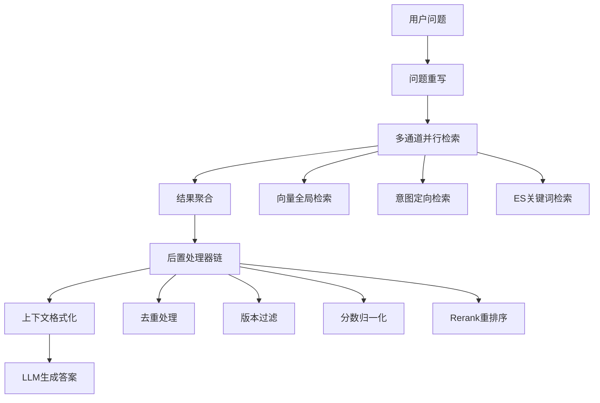
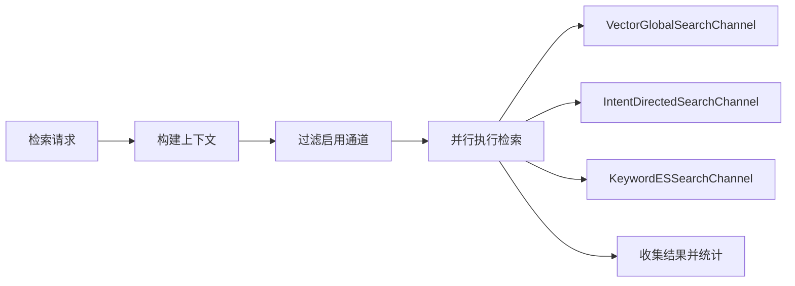
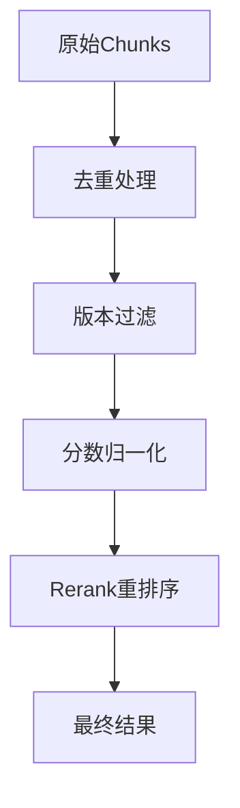

本项目实现了一个可扩展的多通道检索架构，通过并行执行多种检索策略并统一进行后处理，实现了高覆盖率和准确率的智能检索系统。

## 架构概览

多通道检索架构采用"并行检索 + 统一后处理"的设计模式，通过不同的检索通道覆盖多种场景，再通过后置处理器链对结果进行优化和去重。

### 核心架构流程



### 系统特点

- **高覆盖率**：多通道并行检索，即使意图识别失败也能通过全局检索兜底
- **高准确率**：意图定向检索提供精确结果，Rerank进一步优化排序
- **易扩展**：新增通道或处理器只需实现接口，无需修改核心代码
- **灵活配置**：通过配置文件控制通道和处理器的启用状态
- **性能优化**：通道并行执行，处理器按需启用

## 核心组件详解

### 1. 多通道检索引擎（MultiChannelRetrievalEngine）

`MultiChannelRetrievalEngine` 是整个架构的核心协调器，负责：

- 协调多个检索通道的并行执行
- 管理后置处理器链的顺序执行
- 提供统一的检索入口和结果输出

**关键方法**：
```java
@RagTraceNode(name = "multi-channel-retrieval", type = "RETRIEVE_CHANNEL")
public List<RetrievedChunk> retrieveKnowledgeChannels(List<SubQuestionIntent> subIntents, int topK) {
    // 构建检索上下文
    SearchContext context = buildSearchContext(subIntents, topK);
    
    // 【阶段1：多通道并行检索】
    List<SearchChannelResult> channelResults = executeSearchChannels(context);
    
    // 【阶段2：后置处理器链】
    return executePostProcessors(channelResults, context);
}
```

**Sources**: [MultiChannelRetrievalEngine.java](bootstrap/src/main/java/com/nageoffer/ai/ragent/rag/core/retrieve/MultiChannelRetrievalEngine.java#L35-L45)

### 2. 检索通道（SearchChannel）

检索通道执行具体的检索策略，所有通道实现 `SearchChannel` 接口：

```java
public interface SearchChannel {
    String getName();                              // 通道名称
    int getPriority();                             // 优先级
    boolean isEnabled(SearchContext context);      // 是否启用
    SearchChannelResult search(SearchContext context);  // 执行检索
    SearchChannelType getType();                   // 通道类型
}
```

#### 已实现的通道

**2.1 向量全局检索通道（VectorGlobalSearchChannel）**

在所有知识库中进行向量检索，作为兜底策略。

- **启用条件**：当意图识别失败或置信度低于阈值时启用
- **优先级**：10（较低优先级）
- **配置参数**：
  - `confidence-threshold: 0.6`：意图置信度阈值
  - `top-k-multiplier: 3`：TopK倍数，用于增加召回候选

**Sources**: [VectorGlobalSearchChannel.java](bootstrap/src/main/java/com/nageoffer/ai/ragent/rag/core/retrieve/channel/VectorGlobalSearchChannel.java#L35-L57)

**2.2 意图定向检索通道（IntentDirectedSearchChannel）**

基于意图识别结果，在特定知识库中进行精确检索。

- **启用条件**：存在有效的KB意图且分数高于阈值时启用
- **优先级**：1（最高优先级）
- **配置参数**：
  - `min-intent-score: 0.4`：最低意图分数
  - `top-k-multiplier: 2`：TopK倍数

**Sources**: [IntentDirectedSearchChannel.java](bootstrap/src/main/java/com/nageoffer/ai/ragent/rag/core/retrieve/channel/IntentDirectedSearchChannel.java#L35-L58)

### 3. 检索通道类型（SearchChannelType）

```java
public enum SearchChannelType {
    VECTOR_GLOBAL,    // 向量全局检索
    INTENT_DIRECTED,  // 意图定向检索
    KEYWORD_ES,       // ES关键词检索（未来扩展）
    HYBRID           // 混合检索
}
```

**Sources**: [SearchChannelType.java](bootstrap/src/main/java/com/nageoffer/ai/ragent/rag/core/retrieve/channel/SearchChannelType.java#L1-49)

### 4. 检索上下文（SearchContext）

```java
@Data
@Builder
public class SearchContext {
    private String originalQuestion;        // 原始问题
    private String rewrittenQuestion;       // 重写后的问题
    private List<String> subQuestions;      // 子问题列表
    private List<SubQuestionIntent> intents; // 意图识别结果
    private int topK;                        // 期望返回结果数量
    private Map<String, Object> metadata;   // 扩展元数据
}
```

**Sources**: [SearchContext.java](bootstrap/src/main/java/com/nageoffer/ai/ragent/rag/core/retrieve/channel/SearchContext.java#L1-75)

### 5. 检索通道结果（SearchChannelResult）

```java
@Data
@Builder
public class SearchChannelResult {
    private SearchChannelType channelType;  // 通道类型
    private String channelName;             // 通道名称
    private List<RetrievedChunk> chunks;    // 检索到的Chunk列表
    private double confidence;              // 通道置信度
    private long latencyMs;                // 检索耗时
    private Map<String, Object> metadata;   // 扩展元数据
}
```

**Sources**: [SearchChannelResult.java](bootstrap/src/main/java/com/nageoffer/ai/ragent/rag/core/retrieve/channel/SearchChannelResult.java#L1-69)

### 6. 后置处理器（SearchResultPostProcessor）

后置处理器对检索结果进行统一的后处理，所有处理器实现 `SearchResultPostProcessor` 接口：

```java
public interface SearchResultPostProcessor {
    String getName();                              // 处理器名称
    int getOrder();                                // 执行顺序
    boolean isEnabled(SearchContext context);      // 是否启用
    List<RetrievedChunk> process(                  // 处理结果
        List<RetrievedChunk> chunks,
        List<SearchChannelResult> results,
        SearchContext context
    );
}
```

#### 已实现的处理器

**6.1 去重处理器（DeduplicationPostProcessor）**

- **执行顺序**：1（最先执行）
- **功能**：合并多个通道的结果，保留分数最高的相同Chunk
- **去重策略**：基于Chunk的ID或内容哈希生成唯一键，优先保留高优先级通道的结果

**Sources**: [DeduplicationPostProcessor.java](bootstrap/src/main/java/com/nageoffer/ai/ragent/rag/core/retrieve/postprocessor/DeduplicationPostProcessor.java#L35-45)

**6.2 Rerank处理器（RerankPostProcessor）**

- **执行顺序**：10（最后执行）
- **功能**：使用Rerank模型对结果进行重排序，输出最终的Top-K结果
- **优先级策略**：INTENT_DIRECTED(1) > KEYWORD_ES(2) > VECTOR_GLOBAL(3)

**Sources**: [RerankPostProcessor.java](bootstrap/src/main/java/com/nageoffer/ai/ragent/rag/core/retrieve/postprocessor/RerankPostProcessor.java#L35-45)

## 配置管理

### 检索通道配置

在 `application.yaml` 中配置检索通道：

```yaml
rag:
  search:
    channels:
      vector-global:
        enabled: true
        confidence-threshold: 0.6
        top-k-multiplier: 3
      intent-directed:
        enabled: true
        min-intent-score: 0.4
        top-k-multiplier: 2
```

**Sources**: [application.yaml](bootstrap/src/main/resources/application.yaml#L101-110)

### 配置类定义

```java
@Data
@Component
@ConfigurationProperties(prefix = "rag.search")
public class SearchChannelProperties {
    private Channels channels = new Channels();
    
    @Data
    public static class Channels {
        private VectorGlobal vectorGlobal = new VectorGlobal();
        private IntentDirected intentDirected = new IntentDirected();
    }
    
    @Data
    public static class VectorGlobal {
        private boolean enabled = true;
        private double confidenceThreshold = 0.6;
        private int topKMultiplier = 3;
    }
    
    @Data
    public static class IntentDirected {
        private boolean enabled = true;
        private double minIntentScore = 0.4;
        private int topKMultiplier = 2;
    }
}
```

**Sources**: [SearchChannelProperties.java](bootstrap/src/main/java/com/nageoffer/ai/ragent/rag/config/SearchChannelProperties.java#L1-92)

## 工作流程详解

### 1. 检索阶段

多个检索通道并行执行，互不影响：



**并行执行特点**：
- 所有启用的通道同时执行
- 每个通道独立处理，互不影响
- 支持超时和异常处理，避免单个通道失败影响整体

### 2. 后处理阶段

后置处理器按照 `order` 顺序依次执行，形成处理链：



**处理链特点**：
- 处理器按顺序执行，每个处理器的输出成为下一个处理器的输入
- 支持跳过处理器的执行（通过 `isEnabled` 方法）
- 异常处理：单个处理器失败不会中断整个处理链

## 扩展开发

### 1. 新增检索通道

实现 `SearchChannel` 接口并注册为Spring Bean：

```java
@Component
public class CustomSearchChannel implements SearchChannel {
    @Override
    public String getName() {
        return "CustomSearch";
    }

    @Override
    public int getPriority() {
        return 5;
    }

    @Override
    public boolean isEnabled(SearchContext context) {
        return true;
    }

    @Override
    public SearchChannelResult search(SearchContext context) {
        // 实现自定义检索逻辑
        List<RetrievedChunk> chunks = ...;
        return SearchChannelResult.builder()
            .channelType(SearchChannelType.HYBRID)
            .channelName(getName())
            .chunks(chunks)
            .confidence(0.8)
            .build();
    }

    @Override
    public SearchChannelType getType() {
        return SearchChannelType.HYBRID;
    }
}
```

### 2. 新增后置处理器

实现 `SearchResultPostProcessor` 接口并注册为Spring Bean：

```java
@Component
public class CustomPostProcessor implements SearchResultPostProcessor {
    @Override
    public String getName() {
        return "CustomProcessor";
    }

    @Override
    public int getOrder() {
        return 5;
    }

    @Override
    public boolean isEnabled(SearchContext context) {
        return true;
    }

    @Override
    public List<RetrievedChunk> process(
        List<RetrievedChunk> chunks,
        List<SearchChannelResult> results,
        SearchContext context
    ) {
        // 实现自定义处理逻辑
        return chunks.stream()
            .filter(chunk -> chunk.getScore() > 0.5)
            .toList();
    }
}
```

## 性能优化与监控

### 1. 性能特点

- **并行执行**：检索通道并行执行，充分利用系统资源
- **可配置的TopK倍数**：根据不同通道特点调整召回量
- **失败容错**：单个通道失败不影响其他通道执行
- **内存优化**：使用流式处理，避免大对象创建

### 2. 监控指标

系统提供了详细的执行统计信息：

- **通道执行统计**：成功/失败通道数，检索到的Chunk数量
- **性能指标**：每个通道的执行耗时，置信度
- **处理链统计**：每个处理器的输入/输出数量，变化情况

**日志示例**：
```
INFO  - 启用的检索通道：[VectorGlobalSearch, IntentDirectedSearch]
INFO  - 通道 VectorGlobalSearch 完成 ✓ - 检索到 15 个 Chunk，置信度：0.7，耗时：125ms
INFO  - 通道 IntentDirectedSearch 完成 ✓ - 检索到 8 个 Chunk，置信度：0.85，耗时：89ms
INFO  - 多通道检索统计 - 总通道数: 2, 有结果: 2, 无结果: 0, Chunk 总数: 23
INFO  - 后置处理器 Deduplication 完成 - 输入: 23 个 Chunk, 输出: 18 个 Chunk, 变化: -5
INFO  - 后置处理器 Rerank 完成 - 输入: 18 个 Chunk, 输出: 5 个 Chunk, 变化: -13
```

### 3. 调参建议

**通道配置优化**：
- `confidence-threshold`：根据意图识别准确率调整，通常0.5-0.7
- `top-k-multiplier`：根据知识库大小调整，通常2-5

**处理器顺序优化**：
- 去重应该最先执行（order=1）
- Rerank应该最后执行（order=10）
- 其他处理器根据业务需求插入中间

## 总结

多通道检索架构通过以下关键特性实现了高性能、高可扩展的智能检索系统：

1. **多通道并行执行**：覆盖多种检索场景，提供高覆盖率
2. **统一的后处理链**：通过去重、Rerank等操作提升结果质量
3. **灵活的配置管理**：支持动态启用/禁用通道和处理器
4. **完善的扩展机制**：新增通道和处理器无需修改核心代码
5. **详细的监控统计**：提供执行过程的全链路可观测性

该架构为RAG系统提供了坚实的技术基础，能够适应各种复杂的应用场景需求。

**Sources**: [SearchChannel.java](bootstrap/src/main/java/com/nageoffer/ai/ragent/rag/core/retrieve/channel/SearchChannel.java#L1-64), [SearchResultPostProcessor.java](bootstrap/src/main/java/com/nageoffer/ai/ragent/rag/core/retrieve/postprocessor/SearchResultPostProcessor.java#L1-69)