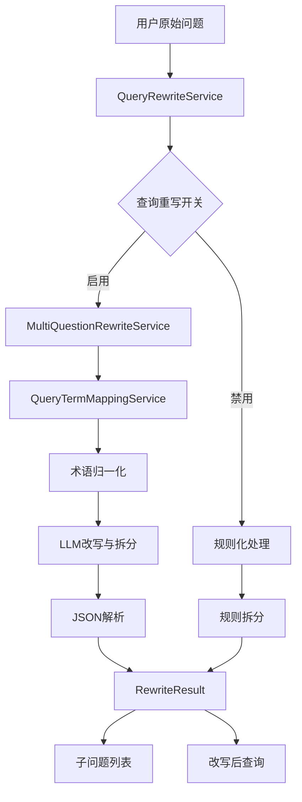
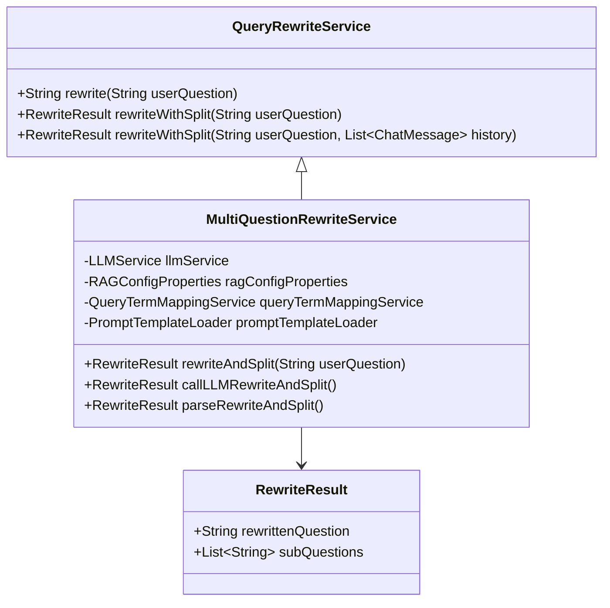
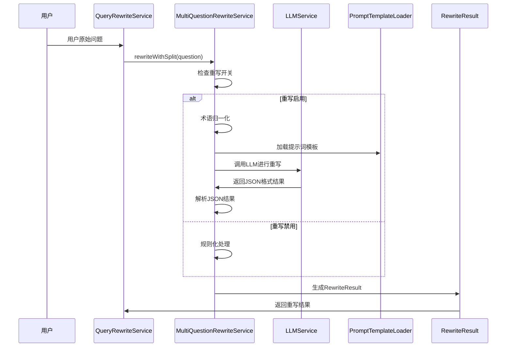
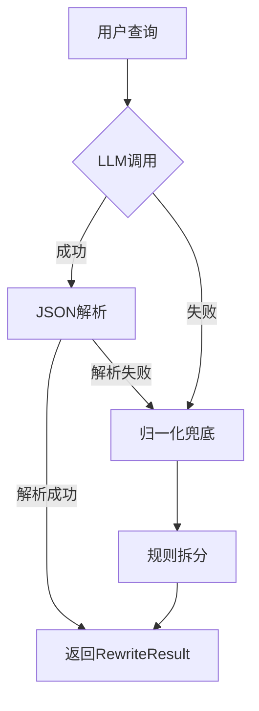

问题重写与拆分是RAG系统中提升检索质量的关键环节，通过智能优化用户查询语句，显著提高知识库检索的相关性和准确性。本文档详细介绍RAGent系统中的问题重写与拆分策略的实现原理、技术架构和最佳实践。

## 架构概览

### 核心组件架构



### 核心接口设计



## 核心功能详解

### 1. 查询归一化

**QueryTermMappingService** 负责将用户的原始查询进行术语归一化，通过预定义的映射规则优化查询质量。

#### 核心特性
- **优先级排序**：映射规则按优先级和长度排序，确保长词优先匹配
- **匹配类型**：支持精确匹配、前缀匹配、正则匹配等多种类型
- **安全替换**：避免重复替换，确保映射的准确性

```java
// 归一化处理流程
public String normalize(String text) {
    if (text == null || text.isEmpty() || cachedMappings.isEmpty()) {
        return text;
    }
    String result = text;
    for (QueryTermMappingDO mapping : cachedMappings) {
        result = QueryTermMappingUtil.applyMapping(result, 
            mapping.getSourceTerm(), mapping.getTargetTerm());
    }
    return result;
}
```

#### 数据结构

| 字段 | 说明 | 示例 |
|------|------|------|
| sourceTerm | 用户原始短语 | "平安保司" |
| targetTerm | 归一化后的目标短语 | "平安保险公司" |
| matchType | 匹配类型 (1=精确, 2=前缀, 3=正则, 4=整词) | 1 |
| priority | 优先级，数值越小优先级越高 | 1 |
| enabled | 是否生效 (1=生效, 0=禁用) | 1 |

### 2. 查询重写

**MultiQuestionRewriteService** 实现智能查询重写，结合规则化和LLM处理两种方式。

#### 处理流程



#### 提示词模板设计

系统使用结构化的提示词模板指导LLM进行查询重写：

```json
{
  "rewrite": "改写后的查询",
  "should_split": true/false,
  "sub_questions": ["子问题1", "子问题2"]
}
```

#### 重写规则

**保留内容**：
- 专有名词（系统名、产品名、模块名等）
- 关键限制（时间范围、环境、终端类型、角色身份等）
- 业务场景（流程、规范、配置等）

**删除内容**：
- 礼貌用语："请帮我"、"麻烦"、"谢谢"
- 回答指令："详细说明"、"分点回答"、"一步步分析"
- 无关描述："我是新人"、"我刚入职"

**禁止行为**：
- 不得添加原文没有的条件、维度、假设
- 不得修改专有名词的写法
- 不得引入"方面/维度/角度"等枚举词

### 3. 多问句拆分

系统智能识别需要拆分的复合问题，将其分解为多个独立的子问题进行检索。

#### 拆分判断标准

**何时拆分**：
- 多个问号："系统A怎么用？系统B呢？"
- 显式列举："1) ... 2) ..."、"A和B分别是什么？"
- 分号/换行分隔

**何时不拆分**：
- 抽象对比："X和Y有什么区别？" → 不拆分
- 笼统询问："从哪些方面考虑？" → 不拆分
- 不确定时 → 不拆分

#### 拆分示例

**示例1：删除礼貌用语**
```
输入：请帮我详细介绍一下12306系统的架构
输出：
{
  "rewrite": "12306系统的架构",
  "should_split": false,
  "sub_questions": ["12306系统的架构"]
}
```

**示例2：拆分多问句**
```
输入：12306的订单流程是什么？支付环节怎么处理？
输出：
{
  "rewrite": "12306的订单流程和支付环节处理",
  "should_split": true,
  "sub_questions": [
    "12306的订单流程是什么",
    "12306的支付环节怎么处理"
  ]
}
```

## 配置管理

### 功能开关控制

```yaml
rag:
  query-rewrite:
    enabled: true  # 查询重写功能开关
    max-history-messages: 4  # 最大历史消息数
    max-history-chars: 500   # 最大历史字符数
```

### 运行时策略

| 策略 | 触发条件 | 处理方式 | 优势 | 适用场景 |
|------|----------|----------|------|----------|
| LLM重写 | 开启且LLM可用 | 结构化提示词+JSON解析 | 智能理解上下文 | 复杂查询、多轮对话 |
| 规则化处理 | 开启但LLM不可用 | 术语映射+规则拆分 | 稳定可靠 | LLM服务故障时 |
| 直接使用 | 重写功能关闭 | 原始问题直接使用 | 零延迟 | 简单查询、调试模式 |

## 异常处理与兜底机制

### 多层兜底策略



### 错误处理场景

1. **LLM调用失败**：
   - 自动降级到术语归一化
   - 使用规则拆分作为兜底

2. **JSON解析失败**：
   - 记录警告日志
   - 返回归一化后的单一问题

3. **术语映射失败**：
   - 保持原始问题不变
   - 确保查询始终有效

### 日志记录

系统详细记录重写过程，便于调试和优化：

```java
log.info("""
    RAG用户问题查询改写+拆分：
    原始问题：{}
    归一化后：{}
    改写结果：{}
    子问题：{}
    """, originalQuestion, normalizedQuestion, parsed.rewrittenQuestion(), parsed.subQuestions());
```

## 性能优化

### 缓存策略

- **映射规则缓存**：术语映射规则在内存中缓存，避免重复查询数据库
- **历史对话优化**：只保留最近2-4条对话消息，控制上下文长度
- **Token优化**：设置较低temperature(0.1)和topP(0.3)，提高输出一致性

### 并发控制

- 线程安全的缓存更新机制
- 异步LLM调用处理
- 合理的超时设置

## 测试用例

### 基础重写测试

```java
@Test
public void shouldReturnRewriteAndSubQuestions() {
    String question = "你好呀，淘宝和天猫数据安全怎么做的？";
    
    RewriteResult result = multiQuestionRewriteService.rewriteWithSplit(question);
    
    Assertions.assertNotNull(result);
    Assertions.assertNotNull(result.rewrittenQuestion());
    Assertions.assertFalse(result.rewrittenQuestion().isBlank());
    
    List<String> subs = result.subQuestions();
    Assertions.assertNotNull(subs);
    Assertions.assertFalse(subs.isEmpty());
    Assertions.assertTrue(subs.stream().allMatch(s -> s != null && !s.isBlank()));
    boolean hasTaobao = subs.stream().anyMatch(s -> s.contains("淘宝"));
    boolean hasTmall = subs.stream().anyMatch(s -> s.contains("天猫"));
    Assertions.assertTrue(hasTaobao && hasTmall, "期望子问题能覆盖并列主体：淘宝和天猫");
}
```

### 参数化测试场景

```java
@ParameterizedTest(name = "QueryRewrite 用例 {index}：{0}")
@ValueSource(strings = {
    "请帮我查询下直快赔数据安全文档",
    "你底层用的什么模型",
    "OA 系统主要提供哪些功能？测试环境 Redis 地址是多少？数据安全怎么做的？",
    "OA 系统和保险系统主要提供哪些功能？数据安全怎么做的？"
})
public void testQueryRewrite(String question) {
    String rewritten = rewriteQuery(question);
    Assertions.assertNotNull(rewritten);
    Assertions.assertFalse(rewritten.isBlank());
}
```

## 最佳实践

### 1. 术语映射管理

- **优先级设置**：专有名词优先级高于通用词汇
- **长度排序**：长词优先匹配，避免短词干扰
- **定期更新**：根据用户反馈持续优化映射规则

### 2. 提示词优化

- **结构化输出**：强制JSON格式，提高解析成功率
- **示例丰富**：提供多样化的使用示例
- **约束明确**：清晰定义改写边界和行为规则

### 3. 监控与调优

- **成功率监控**：跟踪LLM调用成功率和JSON解析成功率
- **性能指标**：监控重写延迟和资源消耗
- **用户反馈**：收集重写效果的用户反馈

### 4. 容错设计

- **优雅降级**：LLM失败时自动降级到规则化处理
- **兜底策略**：确保任何情况下都能返回有效查询
- **错误日志**：详细记录异常情况，便于问题排查

## 扩展开发指南

### 自定义匹配策略

```java
// 扩展QueryTermMappingUtil支持更多匹配类型
public static String applyRegexMapping(String text, String pattern, String replacement) {
    Pattern regex = Pattern.compile(pattern);
    Matcher matcher = regex.matcher(text);
    return matcher.replaceAll(replacement);
}
```

### 自定义拆分规则

```java
// 扩展规则化拆分逻辑
private List<String> advancedRuleBasedSplit(String question) {
    // 实现更复杂的拆分逻辑
    // 例如：基于语义相似度的拆分
}
```

通过本文档的详细说明，开发者可以深入理解RAGent系统中的问题重写与拆分策略，有效提升RAG系统的检索质量和用户体验。

Sources: 
- [MultiQuestionRewriteService.java](bootstrap/src/main/java/com/nageoffer/ai/ragent/rag/core/rewrite/MultiQuestionRewriteService.java)
- [QueryRewriteService.java](bootstrap/src/main/java/com/nageoffer/ai/ragent/rag/core/rewrite/QueryRewriteService.java)
- [RewriteResult.java](bootstrap/src/main/java/com/nageoffer/ai/ragent/rag/core/rewrite/RewriteResult.java)
- [QueryTermMappingService.java](bootstrap/src/main/java/com/nageoffer/ai/ragent/rag/core/rewrite/QueryTermMappingService.java)
- [QueryTermMappingUtil.java](bootstrap/src/main/java/com/nageoffer/ai/ragent/rag/core/rewrite/QueryTermMappingUtil.java)
- [user-question-rewrite.st](bootstrap/src/main/resources/prompt/user-question-rewrite.st)
- [RAGConfigProperties.java](bootstrap/src/main/java/com/nageoffer/ai/ragent/rag/config/RAGConfigProperties.java)