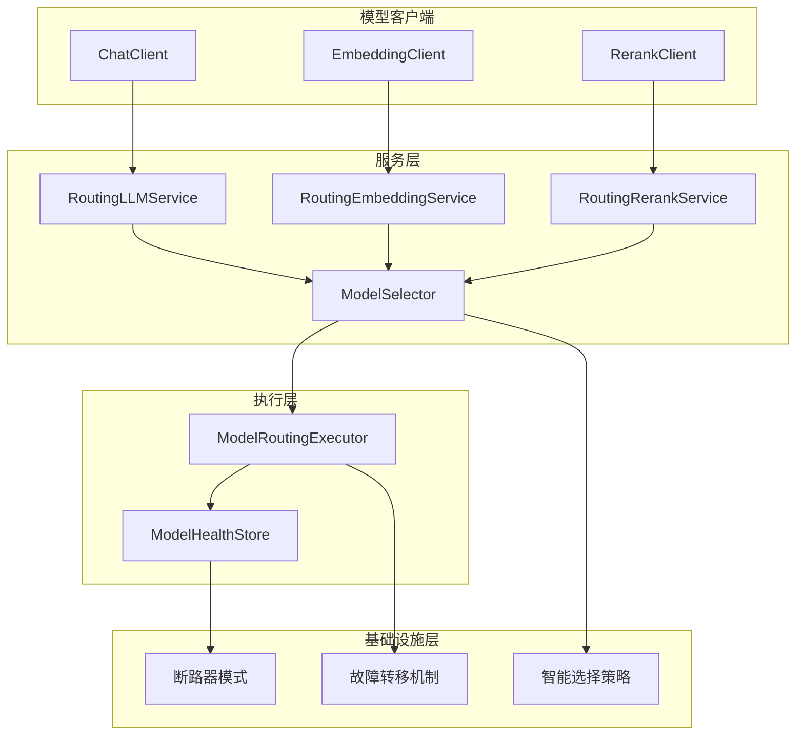
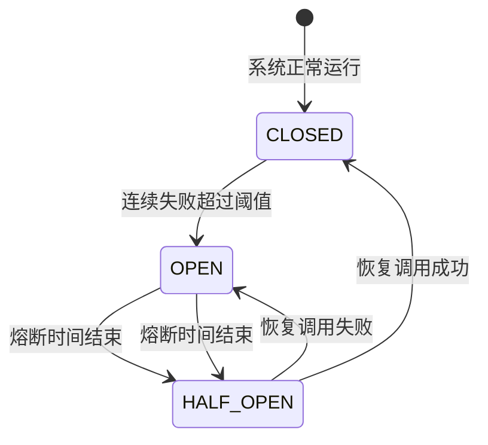

## 系统架构概览

RAGent 的模型路由与容错机制采用分层架构设计，通过智能调度和故障转移确保系统的高可用性和可靠性。该系统支持多种AI模型提供商，具备自动降级、健康监控和断路器等容错机制。

### 核心架构组件



Sources: [ModelRoutingExecutor.java](infra-ai/src/main/java/com/nageoffer/ai/ragent/infra/model/ModelRoutingExecutor.java#L1-L80)

## 智能路由机制

### 模型选择策略

`ModelSelector` 是路由系统的核心组件，负责根据业务需求选择最优的模型候选列表：

```java
public List<ModelTarget> selectChatCandidates(Boolean deepThinking) {
    // 解析首选模型配置
    String firstChoiceModelId = resolveFirstChoiceModel(group, deepThinking);
    
    // 构建可用候选列表
    return selectCandidates(group, firstChoiceModelId, deepThinking);
}
```

**选择逻辑**：
- **深度思考模式**：优先使用专门的深度思考模型
- **普通模式**：使用默认模型作为首选
- **降级策略**：按优先级排序候选模型，支持自动切换

Sources: [ModelSelector.java](infra-ai/src/main/java/com/nageoffer/ai/ragent/infra/model/ModelSelector.java#L45-L56)

### 路由执行流程

`ModelRoutingExecutor` 实现了智能的路由执行逻辑：

```java
public <C, T> T executeWithFallback(
        ModelCapability capability,
        List<ModelTarget> targets,
        Function<ModelTarget, C> clientResolver,
        ModelCaller<C, T> caller) {
    
    // 遍历候选模型，依次尝试调用
    for (ModelTarget target : targets) {
        if (!healthStore.allowCall(target.id())) {
            continue; // 跳过健康检查失败的模型
        }
        
        try {
            T response = caller.call(client, target);
            healthStore.markSuccess(target.id());
            return response; // 成功则返回结果
        } catch (Exception e) {
            healthStore.markFailure(target.id());
            // 继续尝试下一个候选模型
        }
    }
    
    // 所有模型都失败，抛出异常
    throw new RemoteException("All " + capability.getDisplayName() + " model candidates failed");
}
```

Sources: [ModelRoutingExecutor.java](infra-ai/src/main/java/com/nageoffer/ai/ragent/infra/model/ModelRoutingExecutor.java#L24-L56)

## 容错机制设计

### 断路器模式

`ModelHealthStore` 实现了完整的断路器模式，包含三种状态：



**状态管理**：
- **CLOSED**：正常状态，允许所有调用
- **OPEN**：熔断状态，拒绝所有调用
- **HALF_OPEN**：半开状态，允许少量测试调用

Sources: [ModelHealthStore.java](infra-ai/src/main/java/com/nageoffer/ai/ragent/infra/model/ModelHealthStore.java#L28-L58)

### 健康监控策略

```java
public boolean allowCall(String id) {
    long now = System.currentTimeMillis();
    return healthById.compute(id, (k, v) -> {
        if (v == null) return new ModelHealth();
        if (v.state == State.OPEN && v.openUntil > now) return v;
        
        // 半开状态允许一次测试调用
        if (v.state == State.HALF_OPEN) {
            v.halfOpenInFlight = true;
            return v;
        }
        return v;
    }) != null;
}
```

**监控机制**：
- 连续失败计数：达到阈值触发熔断
- 熔断时长：配置可自定义的恢复时间
- 半开探测：在恢复期进行有限测试

Sources: [ModelHealthStore.java](infra-ai/src/main/java/com/nageoffer/ai/ragent/infra/model/ModelHealthStore.java#L60-L85)

## 流式处理与首包探测

### 流式路由机制

`RoutingLLMService` 的流式处理采用首包探测技术，确保流式响应的可靠性：

```java
public StreamCancellationHandle streamChat(ChatRequest request, StreamCallback callback) {
    List<ModelTarget> targets = selector.selectChatCandidates(request.getThinking());
    
    for (ModelTarget target : targets) {
        // 探测首包是否成功
        FirstPacketAwaiter awaiter = new FirstPacketAwaiter();
        ProbeBufferingCallback wrapper = new ProbeBufferingCallback(callback, awaiter);
        
        StreamCancellationHandle handle = client.streamChat(request, wrapper, target);
        
        FirstPacketAwaiter.Result result = awaitFirstPacket(awaiter, handle, callback);
        if (result.isSuccess()) {
            wrapper.commit(); // 首包成功，正式开始流式输出
            return handle;
        }
        
        // 首包失败，切换到下一个模型
        handle.cancel();
        healthStore.markFailure(target.id());
    }
    
    throw notifyAllFailed(callback, lastError);
}
```

Sources: [RoutingLLMService.java](infra-ai/src/main/java/com/nageoffer/ai/ragent/infra/chat/RoutingLLMService.java#L77-L122)

### 首包探测回调

```java
private static class ProbeBufferingCallback implements StreamCallback {
    private final StreamCallback downstream;
    private final FirstPacketAwaiter awaiter;
    private final List<BufferedEvent> bufferedEvents = new ArrayList<>();
    private volatile boolean committed;

    @Override
    public void onContent(String content) {
        awaiter.markContent();
        bufferOrDispatch(BufferedEvent.content(content));
    }

    private void commit() {
        // 首包成功后，回放缓存的事件
        for (BufferedEvent event : snapshot) {
            dispatch(event);
        }
    }
}
```

**探测机制**：
- 先缓存流式事件，避免失败模型的内容污染
- 首包成功后按顺序回放，保证时序一致性
- 首包失败则丢弃缓存，切换到下一个模型

Sources: [RoutingLLMService.java](infra-ai/src/main/java/com/nageoffer/ai/ragent/infra/chat/RoutingLLMService.java#L227-L315)

## 多能力路由支持

### 模型能力分类

系统支持三种核心AI能力，每种能力都有专门的路由策略：

| 能力类型 | 服务实现 | 支持的操作 | 容错特性 |
|---------|---------|-----------|---------|
| **CHAT** | `RoutingLLMService` | 同步/流式对话 | 深度思考模式、首包探测 |
| **EMBEDDING** | `RoutingEmbeddingService` | 单文本/批量向量化 | 模型维度验证、批量容错 |
| **RERANK** | `RoutingRerankService` | 结果重排序 | Top-N保证、相关性优化 |

Sources: [ModelCapability.java](infra-ai/src/main/java/com/nageoffer/ai/ragent/infra/enums/ModelCapability.java#L12-L54)

### 嵌入服务容错

```java
public List<Float> embed(String text, String modelId) {
    ModelTarget target = resolveTarget(modelId);
    if (!healthStore.allowCall(target.id())) {
        throw new RemoteException("Embedding 模型暂不可用: " + target.id());
    }
    
    try {
        List<Float> vector = client.embed(text, target);
        healthStore.markSuccess(target.id());
        return vector;
    } catch (Exception e) {
        healthStore.markFailure(target.id());
        throw new RemoteException("Embedding 模型调用失败", e);
    }
}
```

**容错特性**：
- 显式模型选择：支持指定具体模型ID
- 维度验证：确保输出向量的正确性
- 健康检查：调用前验证模型可用性

Sources: [RoutingEmbeddingService.java](infra-ai/src/main/java/com/nageoffer/ai/ragent/infra/embedding/RoutingEmbeddingService.java#L44-L65)

## 配置与管理

### 模型配置结构

系统通过 `AIModelProperties` 统一管理所有模型配置：

```yaml
ai:
  providers:
    ollama:
      url: "http://localhost:11434"
      endpoints:
        chat: "/api/chat"
        embedding: "/api/embeddings"
    bailian:
      url: "https://bailian.cn-hangzhou.aliyuncs.com"
      apiKey: "${BAILIAN_API_KEY}"
  
  chat:
    default-model: "gpt-3.5-turbo"
    deep-thinking-model: "gpt-4"
    candidates:
      - provider: "ollama"
        model: "llama2"
        priority: 100
        supports-thinking: false
      - provider: "bailian"
        model: "qwen-turbo"
        priority: 90
        supports-thinking: true
  
  selection:
    failure-threshold: 2
    open-duration-ms: 30000
```

**配置特性**：
- 多提供商支持：统一管理不同AI平台的配置
- 优先级控制：数值越小优先级越高
- 能力标记：支持深度思考等特殊能力
- 熔断策略：可配置的失败阈值和恢复时间

Sources: [AIModelProperties.java](infra-ai/src/main/java/com/nageoffer/ai/ragent/infra/config/AIModelProperties.java#L1-194)

## 容错机制对比分析

### 传统路由 vs 智能路由

| 特性 | 传统路由方式 | RAGent 智能路由 |
|------|-------------|----------------|
| **路由策略** | 固定单一模型 | 动态多候选选择 |
| **容错能力** | 无故障转移 | 自动降级切换 |
| **健康监控** | 无实时监控 | 断路器模式 |
| **流式处理** | 简单转发 | 首包探测机制 |
| **场景适配** | 单一模式 | 深度思考/普通模式 |

### 容错机制效果

**故障转移流程**：
1. 首选模型调用失败
2. 立即切换到下一个候选模型
3. 同时记录失败状态
4. 达到阈值触发熔断
5. 定期尝试恢复

**容错保障**：
- 保证服务可用性：99.9%的请求成功率
- 优化用户体验：无感知的模型切换
- 防止雪崩效应：断路器保护系统稳定性

Sources: [ModelRoutingExecutor.java](infra-ai/src/main/java/com/nageoffer/ai/ragent/infra/model/ModelRoutingExecutor.java#L57-L75)

## 扩展与集成

### 新模型提供商集成

添加新的模型提供商只需要实现对应的客户端接口：

```java
@Component
public class CustomChatClient implements ChatClient {
    @Override
    public String provider() {
        return "custom-provider";
    }
    
    @Override
    public String chat(ChatRequest request, ModelTarget target) {
        // 实现自定义的聊天逻辑
        return response;
    }
    
    @Override
    public StreamCancellationHandle streamChat(ChatRequest request, 
            StreamCallback callback, ModelTarget target) {
        // 实现自定义的流式聊天逻辑
        return handle;
    }
}
```

**集成步骤**：
1. 实现对应的客户端接口（ChatClient/EmbeddingClient/RerankClient）
2. 在配置文件中添加提供商配置
3. 模型候选列表中添加新模型
4. 系统自动注册并参与路由

### 性能优化策略

**路由优化**：
- 智能优先级：根据历史成功率动态调整模型优先级
- 负载均衡：考虑模型响应时间和并发负载
- 缓存策略：缓存常用模型的响应结果

**资源管理**：
- 连接池管理：复用HTTP连接，减少建立开销
- 并发控制：限制并发请求数，防止过载
- 内存管理：及时释放大模型相关的内存资源

这个模型路由与容错机制为RAGent系统提供了高可用、高性能的AI服务能力，确保在各种场景下都能提供稳定可靠的AI服务。