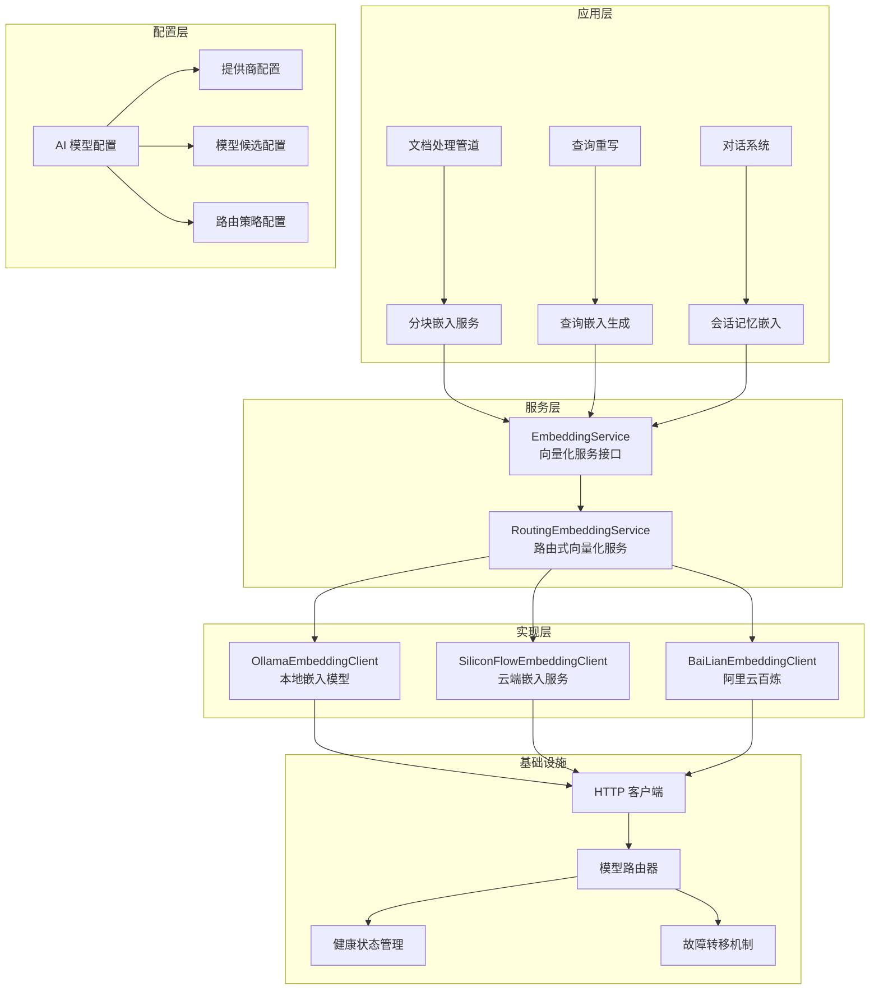
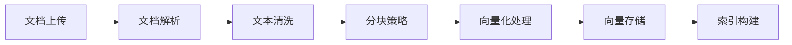

Embedding 向量化处理是 RAG 系统的核心基础组件，负责将文本转换为高质量的向量表示，为语义检索提供数学基础。本系统采用多提供商架构、智能路由机制和批量优化策略，支持多种开源和商业嵌入模型。

## 架构概览

### 整体架构图



### 核心组件职责划分

| 组件 | 职责 | 位置 |
|------|------|------|
| **EmbeddingService** | 向量化服务统一接口，定义单文本和批量向量化方法 | [EmbeddingService.java](infra-ai/src/main/java/com/nageoffer/ai/ragent/infra/embedding/EmbeddingService.java) |
| **EmbeddingClient** | 底层嵌入模型客户端接口，支持不同提供商的API调用 | [EmbeddingClient.java](infra-ai/src/main/java/com/nageoffer/ai/ragent/infra/embedding/EmbeddingClient.java) |
| **RoutingEmbeddingService** | 路由式向量化服务，实现模型选择、故障转移和健康检查 | [RoutingEmbeddingService.java](infra-ai/src/main/java/com/nageoffer/ai/ragent/infra/embedding/RoutingEmbeddingService.java) |
| **ChunkEmbeddingService** | 分块向量化服务，专门用于文档分块的批量嵌入处理 | [ChunkEmbeddingService.java](bootstrap/src/main/java/com/nageoffer/ai/ragent/core/chunk/ChunkEmbeddingService.java) |
| **IndexerNode** | 索引节点，将嵌入向量写入向量数据库 | [IndexerNode.java](bootstrap/src/main/java/com/nageoffer/ai/ragent/ingestion/node/IndexerNode.java) |

## 核心接口设计

### EmbeddingService 接口

```java
public interface EmbeddingService {
    // 单文本向量化，通常用于查询
    List<Float> embed(String text);
    
    // 指定模型进行单文本向量化
    List<Float> embed(String text, String modelId);
    
    // 批量向量化，用于文档索引构建
    List<List<Float>> embedBatch(List<String> texts);
    
    // 指定模型进行批量向量化
    List<List<Float>> embedBatch(List<String> texts, String modelId);
    
    // 获取向量维度
    default int dimension() { return 0; }
}
```

**使用场景说明**：
- **`embed(text)`**: 查询问题向量化，用于语义检索
- **`embedBatch(texts)`**: 文档分块批量向量化，用于构建索引
- **`dimension()`**: 返回向量维度，用于向量库schema定义

### EmbeddingClient 接口

```java
public interface EmbeddingClient {
    // 获取提供商标识
    String provider();
    
    // 单文本嵌入转换
    List<Float> embed(String text, ModelTarget target);
    
    // 批量文本嵌入转换
    List<List<Float>> embedBatch(List<String> texts, ModelTarget target);
}
```

## 实现分析

### 1. 路由式向量化服务 (RoutingEmbeddingService)

**核心特性**：
- **智能模型选择**: 基于配置和健康状态选择最佳模型
- **故障自动转移**: 主模型失败时自动切换到备用模型
- **健康状态管理**: 实时监控模型可用性
- **批量优化**: 利用模型批量计算能力提升性能

**关键实现逻辑**：

```java
@Override
public List<Float> embed(String text) {
    return executor.executeWithFallback(
        ModelCapability.EMBEDDING,
        selector.selectEmbeddingCandidates(),  // 选择候选模型
        target -> clientsByProvider.get(target.candidate().getProvider()),  // 获取客户端
        (client, target) -> client.embed(text, target)  // 执行向量化
    );
}
```

Sources: [RoutingEmbeddingService.java](infra-ai/src/main/java/com/nageoffer/ai/ragent/infra/embedding/RoutingEmbeddingService.java#L45-L56)

### 2. 分块向量化服务 (ChunkEmbeddingService)

**设计目标**：
- **高效批量处理**: 专门针对文档分块的批量向量化场景
- **内存优化**: 智能处理分块内容和向量的内存映射
- **容错处理**: 妥善处理向量化失败的情况

**核心流程**：

1. **验证输入**: 检查分块列表和现有嵌入向量
2. **模型解析**: 根据配置选择或解析目标模型
3. **批量调用**: 使用客户端进行批量向量化
4. **结果应用**: 将生成的向量填充到对应的分块对象中

Sources: [ChunkEmbeddingService.java](bootstrap/src/main/java/com/nageoffer/ai/ragent/core/chunk/ChunkEmbeddingService.java#L30-L51)

### 3. 具体嵌入客户端实现

#### OllamaEmbeddingClient (本地模型服务)

**特点**：
- **本地部署**: 无需网络连接，数据安全性高
- **高性能**: 低延迟响应，适合生产环境
- **多模型支持**: 支持多种开源嵌入模型

**API调用流程**：
```java
// 构建请求体
JsonObject body = new JsonObject();
body.addProperty("model", requireModel(target));
body.addProperty("input", text);
if (target.candidate().getDimension() != null) {
    body.addProperty("dimensions", target.candidate().getDimension());
}

// 发送HTTP请求
Request request = new Request.Builder()
    .url(url)
    .post(RequestBody.create(body.toString(), HttpMediaTypes.JSON))
    .build();

// 解析响应
JsonObject json = parseJsonBody(response.body());
var embeddings = json.getAsJsonArray("embeddings");
```

Sources: [OllamaEmbeddingClient.java](infra-ai/src/main/java/com/nageoffer/ai/ragent/infra/embedding/OllamaEmbeddingClient.java#L50-L78)

#### SiliconFlowEmbeddingClient (云端服务)

**特点**：
- **云端部署**: 无需维护基础设施
- **高可用性**: 服务稳定性高
- **批处理优化**: 支持大批量文本处理

**批处理策略**：
```java
// 分批处理以避免内存溢出
final int maxBatch = 32;
List<List<Float>> results = new ArrayList<>(Collections.nCopies(texts.size(), null));
for (int i = 0, n = texts.size(); i < n; i += maxBatch) {
    int end = Math.min(i + maxBatch, n);
    List<String> slice = texts.subList(i, end);
    List<List<Float>> part = doEmbedOnce(slice, target);
    // 合并结果
}
```

Sources: [SiliconFlowEmbeddingClient.java](infra-ai/src/main/java/com/nageoffer/ai/ragent/infra/embedding/SiliconFlowEmbeddingClient.java#L40-L64)

## 文档摄入管道集成

### 文档处理流程



### 集成点详解

#### 1. 分块处理阶段

在文档被切分为多个分块后，`ChunkEmbeddingService` 负责为每个分块生成嵌入向量：

```java
// 嵌入向量生成
public void embed(List<VectorChunk> chunks, String embeddingModel) {
    // 检查是否已有嵌入向量
    if (chunks.stream().allMatch(c -> c.getEmbedding() != null && c.getEmbedding().length > 0)) {
        return;
    }
    
    // 选择目标模型
    ModelTarget target = resolveTarget(embeddingModel);
    
    // 批量向量化
    List<List<Float>> vectors = embedBatch(chunks, target);
    
    // 应用嵌入结果
    applyEmbeddings(chunks, vectors);
}
```

Sources: [ChunkEmbeddingService.java](bootstrap/src/main/java/com/nageoffer/ai/ragent/core/chunk/ChunkEmbeddingService.java#L22-L47)

#### 2. 索引写入阶段

`IndexerNode` 负责将向量化后的分块数据写入向量数据库：

```java
// 构建向量数据
private float[][] toArrayFromChunks(List<VectorChunk> chunks, int expectedDim) {
    float[][] out = new float[chunks.size()][];
    for (int i = 0; i < chunks.size(); i++) {
        float[] vector = chunks.get(i).getEmbedding();
        if (vector == null || vector.length == 0) {
            throw new ClientException("向量结果缺失，索引: " + i);
        }
        out[i] = vector;
    }
    return out;
}
```

Sources: [IndexerNode.java](bootstrap/src/main/java/com/nageoffer/ai/ragent/ingestion/node/IndexerNode.java#L180-L195)

## 配置管理

### AI 模型配置结构

```yaml
ai:
  providers:
    # 提供商基础配置
    ollama:
      url: http://localhost:11434
      endpoints:
        chat: /api/chat
        embedding: /api/embed
    
    siliconflow:
      url: https://api.siliconflow.cn
      api-key: ${SILICONFLOW_API_KEY}
      endpoints:
        chat: /v1/chat/completions
        embedding: /v1/embeddings
  
  # 嵌入模型配置
  embedding:
    default-model: qwen-emb-local
    candidates:
      - id: qwen-emb-local
        provider: ollama
        model: qwen3-embedding:8b-fp16
        dimension: 1536
        priority: 2
      - id: qwen-emb-8b
        provider: siliconflow
        model: Qwen/Qwen3-Embedding-8B
        dimension: 1536
        priority: 1
```

### 配置参数说明

| 参数 | 类型 | 必填 | 说明 |
|------|------|------|------|
| `ai.providers.[name].url` | String | 是 | 提供商基础URL |
| `ai.providers.[name].api-key` | String | 否 | API密钥 |
| `ai.embedding.default-model` | String | 是 | 默认嵌入模型ID |
| `ai.embedding.candidates` | Array | 是 | 候选模型列表 |
| `ai.embedding.candidates[].id` | String | 是 | 模型唯一标识 |
| `ai.embedding.candidates[].provider` | String | 是 | 模型提供商 |
| `ai.embedding.candidates[].model` | String | 是 | 模型名称 |
| `ai.embedding.candidates[].dimension` | Integer | 否 | 向量维度 |
| `ai.embedding.candidates[].priority` | Integer | 否 | 优先级(数值越小优先级越高) |

Sources: [AIModelProperties.java](infra-ai/src/main/java/com/nageoffer/ai/ragent/infra/config/AIModelProperties.java#L47-L95)

## 使用模式

### 1. 文档索引构建模式

```java
// 文档处理管道中的使用
@Service
public class DocumentIngestionPipeline {
    
    public void ingestDocument(Document document) {
        // 1. 文档解析和分块
        List<VectorChunk> chunks = documentParser.parse(document);
        
        // 2. 分块向量化
        chunkEmbeddingService.embed(chunks, null); // 使用默认模型
        
        // 3. 向量存储
        indexerNode.index(chunks);
    }
}
```

### 2. 查询语义检索模式

```java
// 查询处理中的使用
@Service
public class QueryRetrievalService {
    
    public List<RetrievedChunk> retrieve(String query, String collectionName) {
        // 1. 查询向量化
        List<Float> queryVector = embeddingService.embed(query);
        
        // 2. 向量检索
        List<VectorChunk> chunks = vectorStoreService.similaritySearch(
            collectionName, queryVector, 10);
        
        // 3. 结果处理
        return convertToRetrievedChunks(chunks);
    }
}
```

### 3. 批量处理模式

```java
// 大批量文档处理
@Service
public class BatchDocumentProcessor {
    
    public void processBatch(List<Document> documents) {
        // 分批处理避免内存溢出
        int batchSize = 50;
        for (int i = 0; i < documents.size(); i += batchSize) {
            List<Document> batch = documents.subList(i, Math.min(i + batchSize, documents.size()));
            
            // 批量向量化
            List<String> texts = batch.stream()
                .map(Document::getContent)
                .collect(Collectors.toList());
            
            List<List<Float>> embeddings = embeddingService.embedBatch(texts);
            
            // 处理结果...
        }
    }
}
```

## 性能优化策略

### 1. 批量优化

**原理**: 利用模型的批量计算能力，减少网络开销和推理时间

**实现方式**:
```java
// SiliconFlow客户端的批量处理
@Override
public List<List<Float>> embedBatch(List<String> texts, ModelTarget target) {
    final int maxBatch = 32;  // 控制批次大小
    List<List<Float>> results = new ArrayList<>(texts.size());
    
    for (int i = 0; i < texts.size(); i += maxBatch) {
        int end = Math.min(i + maxBatch, texts.size());
        List<String> slice = texts.subList(i, end);
        List<List<Float>> part = doEmbedOnce(slice, target);
        results.addAll(part);
    }
    
    return results;
}
```

### 2. 缓存策略

**场景**: 相同或相似的文本请求
**实现**: 可在服务层添加文本-向量缓存机制

### 3. 异步处理

**场景**: 文档索引构建过程中
**实现**: 使用消息队列进行异步向量化处理

## 错误处理和容错

### 1. 模型故障转移

```java
// 路由服务的故障转移逻辑
@Override
public List<Float> embed(String text, String modelId) {
    ModelTarget target = resolveTarget(modelId);
    EmbeddingClient client = resolveClient(target);
    
    if (!healthStore.allowCall(target.id())) {
        throw new RemoteException("Embedding 模型暂不可用: " + target.id());
    }
    
    try {
        List<Float> vector = client.embed(text, target);
        healthStore.markSuccess(target.id());
        return vector;
    } catch (Exception e) {
        healthStore.markFailure(target.id());
        throw new RemoteException("Embedding 模型调用失败: " + target.id(), e);
    }
}
```

Sources: [RoutingEmbeddingService.java](infra-ai/src/main/java/com/nageoffer/ai/ragent/infra/embedding/RoutingEmbeddingService.java#L67-L85)

### 2. 健康状态管理

**监控指标**:
- 模型可用性状态
- 调用成功率
- 响应延迟
- 错误率统计

### 3. 配置验证

**启动时检查**:
- 模型配置完整性
- API连接性
- 向量维度一致性

## 最佳实践

### 1. 模型选择原则

| 场景 | 推荐模型 | 原因 |
|------|----------|------|
| 生产环境 | Ollama本地模型 | 性能稳定、低延迟、数据安全 |
| 开发测试 | SiliconFlow云端模型 | 快速部署、无需维护基础设施 |
| 大规模部署 | 混合架构 | 本地+云端，平衡性能和成本 |

### 2. 向量维度配置

**考虑因素**:
- **模型兼容性**: 确保向量库schema与模型维度匹配
- **检索精度**: 更高维度通常带来更好的语义表示
- **存储成本**: 维度过高会增加存储和计算开销

**推荐配置**:
```yaml
rag:
  default:
    dimension: 1536  # 适用于大多数现代嵌入模型
    metric-type: COSINE  # 余弦相似度，适合语义检索
```

### 3. 批处理参数调优

**关键参数**:
- **批次大小**: 根据模型内存限制和API限制调整
- **并发控制**: 避免过载模型服务
- **超时设置**: 合理设置API调用超时时间

### 4. 监控和日志

**关键监控点**:
- 向量化成功率
- 平均响应时间
- 模型切换频率
- 内存使用情况

## 扩展开发

### 添加新的嵌入模型提供商

1. **实现 EmbeddingClient 接口**:
```java
@Service
public class CustomEmbeddingClient implements EmbeddingClient {
    
    @Override
    public String provider() {
        return "custom-provider";
    }
    
    @Override
    public List<Float> embed(String text, ModelTarget target) {
        // 实现具体的API调用逻辑
    }
    
    @Override
    public List<List<Float>> embedBatch(List<String> texts, ModelTarget target) {
        // 实现批量处理逻辑
    }
}
```

2. **配置模型参数**:
```yaml
ai:
  providers:
    custom:
      url: https://api.custom.com
      api-key: ${CUSTOM_API_KEY}
      endpoints:
        embedding: /v1/embeddings
  
  embedding:
    candidates:
      - id: custom-embedding-model
        provider: custom
        model: custom-embedding-v1
        dimension: 768
        priority: 10
```

Sources: [ModelProvider.java](infra-ai/src/main/java/com/nageoffer/ai/ragent/infra/enums/ModelProvider.java#L22-L33)

## 相关页面

为了深入理解 Embedding 向量化处理在整个 RAG 系统中的位置和作用，建议按照以下顺序学习相关模块：

- [文档摄取流水线](19-wen-dang-she-qu-liu-shui-xian) - 了解文档如何从上传到向量化的完整流程
- [多通道检索架构设计](12-duo-tong-dao-jian-suo-jia-gou-she-ji) - 学习向量化在检索系统中的应用
- [RAG 核心流程](11-quan-lian-lu-jian-suo-yu-sheng-cheng-liu-cheng) - 掌握RAG系统的整体运行机制