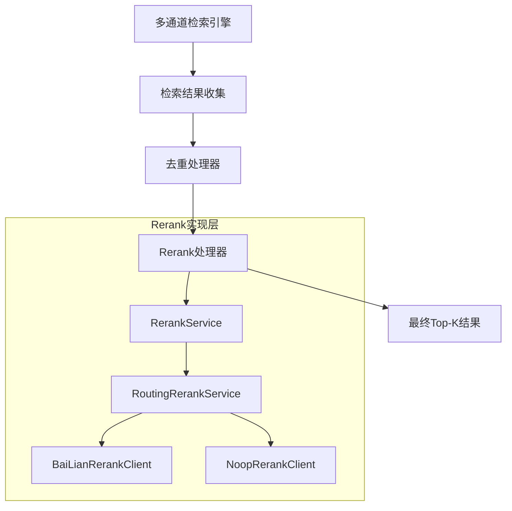
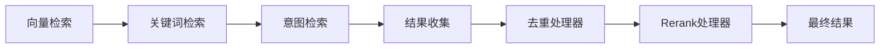

Rerank（重排序）是RAG系统中的关键环节，用于在向量检索的基础上进一步提升检索结果的相关性。通过对多通道检索到的候选文档进行相关性重新排序，Rerank能够显著提升最终输入给大模型的文档质量。

## 架构概览

### 整体架构



### 核心组件

| 组件 | 作用 | 位置 |
|------|------|------|
| `RerankService` | Rerank服务接口，定义重排序的核心规范 | `infra-ai/src/main/java/com/nageoffer/ai/ragent/infra/rerank/RerankService.java` |
| `RoutingRerankService` | 主要实现，支持模型路由和容错机制 | `infra-ai/src/main/java/com/nageoffer/ai/ragent/infra/rerank/RoutingRerankService.java` |
| `RerankClient` | Rerank客户端接口，具体执行重排序逻辑 | `infra-ai/src/main/java/com/nageoffer/ai/ragent/infra/rerank/RerankClient.java` |
| `RerankPostProcessor` | 检索后处理器，集成到多通道检索流程中 | `bootstrap/src/main/java/com/nageoffer/ai/ragent/rag/core/retrieve/postprocessor/RerankPostProcessor.java` |

## 实现细节

### 1. 服务接口定义

`RerankService` 定义了重排序的核心接口：

```java
public interface RerankService {
    /**
     * 对向量检索出来的一批候选文档进行精排，按"和 query 的相关度"重新排序，并只返回前 topN 条
     *
     * @param query      用户问题
     * @param candidates 向量检索出来的一批候选文档（通常是 topK 的 3~5 倍）
     * @param topN       最终希望保留的条数（喂给大模型的 K）
     * @return 经过精排后的前 topN 条文档
     */
    List<RetrievedChunk> rerank(String query, List<RetrievedChunk> candidates, int topN);
}
```

**关键特点**：
- 接受比最终需求更多的候选文档（通常是topK的3-5倍），确保有足够的选择空间
- 基于用户问题进行相关性重新排序
- 输出精排后的前N条最相关结果

### 2. 路由式重排序服务

`RoutingRerankService` 作为主要实现，提供了强大的模型路由能力：

```java
@Service
@Primary
public class RoutingRerankService implements RerankService {
    private final ModelSelector selector;
    private final ModelRoutingExecutor executor;
    private final Map<String, RerankClient> clientsByProvider;
    
    public List<RetrievedChunk> rerank(String query, List<RetrievedChunk> candidates, int topN) {
        return executor.executeWithFallback(
            ModelCapability.RERANK,
            selector.selectRerankCandidates(),
            target -> clientsByProvider.get(target.candidate().getProvider()),
            (client, target) -> client.rerank(query, candidates, topN, target)
        );
    }
}
```

**核心特性**：
- **智能模型选择**：根据配置和模型状态动态选择最佳重排模型
- **容错机制**：支持多级降级，确保服务可用性
- **提供商支持**：可同时支持多个AI提供商的重排服务

### 3. 百炼重排客户端

`BaiLianRerankClient` 实现了阿里云百炼的重排服务：

```java
@Service
@Slf4j
@RequiredArgsConstructor
public class BaiLianRerankClient implements RerankClient {
    
    public List<RetrievedChunk> rerank(String query, List<RetrievedChunk> candidates, int topN, ModelTarget target) {
        // 1. 去重处理
        List<RetrievedChunk> dedup = new ArrayList<>(candidates.size());
        Set<String> seen = new HashSet<>();
        for (RetrievedChunk rc : candidates) {
            if (seen.add(rc.getId())) {
                dedup.add(rc);
            }
        }
        
        // 2. 构建请求
        JsonObject reqBody = new JsonObject();
        JsonObject input = new JsonObject();
        input.addProperty("query", query);
        
        JsonArray documentsArray = new JsonArray();
        for (RetrievedChunk each : dedup) {
            documentsArray.add(each.getText() == null ? "" : each.getText());
        }
        input.add("documents", documentsArray);
        
        // 3. 发送请求并处理响应
        // ...
    }
}
```

**请求格式**：
```json
{
  "model": "qwen3-rerank",
  "input": {
    "query": "用户问题",
    "documents": ["文档1内容", "文档2内容", ...]
  },
  "parameters": {
    "top_n": 10,
    "return_documents": true
  }
}
```

**响应处理**：
- 提取相关性分数和排序索引
- 按相关性重新排序文档
- 确保返回指定数量的结果

### 4. 空操作实现

`NoopRerankClient` 提供了一个轻量级的空操作实现：

```java
@Service
public class NoopRerankClient implements RerankClient {
    
    @Override
    public List<RetrievedChunk> rerank(String query, List<RetrievedChunk> candidates, int topN, ModelTarget target) {
        if (candidates == null || candidates.isEmpty()) {
            return List.of();
        }
        if (topN <= 0 || candidates.size() <= topN) {
            return candidates;
        }
        return candidates.stream()
            .limit(topN)
            .collect(Collectors.toList());
    }
}
```

**适用场景**：
- 调试和开发阶段
- 性能基准测试
- 作为降级策略使用

## 集成方式

### 1. 检索后处理链

Rerank在多通道检索流程中的位置：



### 2. 后处理器实现

`RerankPostProcessor` 是整个检索流程中的最后一级处理器：

```java
@Slf4j
@Component
@RequiredArgsConstructor
public class RerankPostProcessor implements SearchResultPostProcessor {

    private final RerankService rerankService;

    @Override
    public String getName() {
        return "Rerank";
    }

    @Override
    public int getOrder() {
        return 10;  // 最后执行
    }

    @Override
    public List<RetrievedChunk> process(List<RetrievedChunk> chunks,
                                        List<SearchChannelResult> results,
                                        SearchContext context) {
        if (chunks.isEmpty()) {
            log.info("Chunk 列表为空，跳过 Rerank");
            return chunks;
        }

        return rerankService.rerank(
                context.getMainQuestion(),
                chunks,
                context.getTopK()
        );
    }
}
```

**处理顺序**：
- 去重处理器（order=1）
- Rerank处理器（order=10）- 最后执行

### 3. 多通道检索引擎

在`MultiChannelRetrievalEngine`中，Rerank作为后处理链的重要组成部分：

```java
private List<RetrievedChunk> executePostProcessors(List<SearchChannelResult> results,
                                                   SearchContext context) {
    // 过滤启用的处理器并排序
    List<SearchResultPostProcessor> enabledProcessors = postProcessors.stream()
            .filter(processor -> processor.isEnabled(context))
            .sorted(Comparator.comparingInt(SearchResultPostProcessor::getOrder))
            .toList();

    // 初始 Chunk 列表
    List<RetrievedChunk> chunks = results.stream()
            .flatMap(r -> r.getChunks().stream())
            .collect(Collectors.toList());

    // 依次执行处理器
    for (SearchResultPostProcessor processor : enabledProcessors) {
        chunks = processor.process(chunks, results, context);
    }

    return chunks;
}
```

## 配置管理

### 1. 应用配置

在`application.yaml`中配置重排模型：

```yaml
ai:
  rerank:
    default-model: qwen3-rerank
    candidates:
      - id: qwen3-rerank
        provider: siliconflow
        model: qwen/qwen3-reranker-8b
        priority: 1
      - id: rerank-noop
        provider: noop
        model: noop
        priority: 100  # 最低优先级，用作降级
```

### 2. 搜索通道配置

```yaml
rag:
  search:
    channels:
      vector-global:
        confidence-threshold: 0.6
        top-k-multiplier: 3  # 获取3倍的候选文档供Rerank选择
      intent-directed:
        min-intent-score: 0.4
        top-k-multiplier: 2
```

**关键配置项**：
- `top-k-multiplier`: 控制候选文档数量，影响Rerank的选择空间
- `confidence-threshold`: 设置检索结果的置信度阈值

## 性能优化

### 1. 候选文档数量策略

| 策略 | 优点 | 缺点 | 适用场景 |
|------|------|------|----------|
| 3倍topK | 平衡质量和性能 | 计算成本适中 | 通用场景 |
| 5倍topK | 更高的召回率 | 延迟增加 | 高精度需求 |
| 2倍topK | 低延迟 | 可能遗漏重要文档 | 性能敏感场景 |

### 2. 批处理优化

```java
// 百炼客户端的批处理逻辑
JsonArray documentsArray = new JsonArray();
for (RetrievedChunk each : dedup) {
    documentsArray.add(each.getText() == null ? "" : each.getText());
}
```

### 3. 缓存策略

- **结果缓存**：对相同的查询和候选文档组合进行缓存
- **模型路由缓存**：缓存模型选择结果，减少决策开销

## 错误处理

### 1. 网络异常处理

```java
try (Response response = httpClient.newCall(request).execute()) {
    if (!response.isSuccessful()) {
        String body = readBody(response.body());
        log.warn("百炼 rerank 请求失败: status={}, body={}", response.code(), body);
        throw new ModelClientException(
                "百炼 rerank 请求失败: HTTP " + response.code(),
                classifyStatus(response.code()),
                response.code()
        );
    }
    // 处理成功响应...
} catch (IOException e) {
    throw new ModelClientException("百炼 rerank 请求失败: " + e.getMessage(), 
                                   ModelClientErrorType.NETWORK_ERROR, null, e);
}
```

### 2. 降级策略

```java
// 在RoutingRerankService中的容错执行
return executor.executeWithFallback(
    ModelCapability.RERANK,
    selector.selectRerankCandidates(),
    target -> clientsByProvider.get(target.candidate().getProvider()),
    (client, target) -> client.rerank(query, candidates, topN, target)
);
```

## 监控与日志

### 1. 处理过程日志

```java
log.info("后置处理器 {} 完成 - 输入: {} 个 Chunk, 输出: {} 个 Chunk, 变化: {}",
        processor.getName(),
        beforeSize,
        afterSize,
        (afterSize - beforeSize > 0 ? "+" : "") + (afterSize - beforeSize)
);
```

### 2. 性能指标

- **处理延迟**：单次重排序耗时
- **吞吐量**：每秒处理请求数
- **成功率**：重排序成功比例
- **分数分布**：相关性分数的统计分布

## 最佳实践

### 1. 模型选择策略

1. **优先级配置**：根据模型性能设置合适的优先级
2. **负载均衡**：在多个高优先级模型间进行负载分布
3. **健康检查**：定期检查模型可用性

### 2. 参数调优

```java
// 请求参数优化
JsonObject parameters = new JsonObject();
parameters.addProperty("top_n", topN);
parameters.addProperty("return_documents", true);
```

### 3. 资源管理

- **连接池配置**：优化HTTP客户端连接池
- **内存管理**：控制候选文档数量，避免内存溢出
- **并发控制**：限制并发重排序请求数量

## 扩展开发

### 1. 新增Rerank客户端

实现`RerankClient`接口：

```java
@Service
public class CustomRerankClient implements RerankClient {
    
    @Override
    public String provider() {
        return "custom-provider";
    }
    
    @Override
    public List<RetrievedChunk> rerank(String query, List<RetrievedChunk> candidates, int topN, ModelTarget target) {
        // 实现自定义重排序逻辑
        return customRerankImplementation(query, candidates, topN);
    }
}
```

### 2. 自定义后处理器

扩展`SearchResultPostProcessor`接口，实现特定的重排序逻辑。