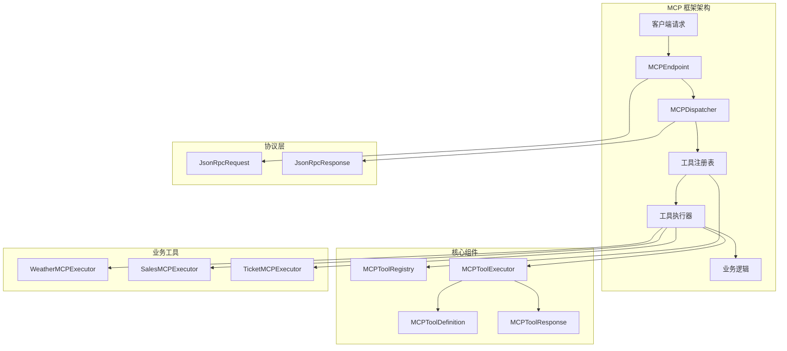

MCP (Model Context Protocol) 工具集成框架为 ragent 系统提供了标准化的工具调用能力，支持通过 JSON-RPC 2.0 协议与外部 AI 模型进行交互，实现了工具的动态注册、管理和执行。

## 架构概览

MCP 框架采用模块化设计，包含以下几个核心组件：



## 核心组件详解

### 1. MCP 服务器启动类

[`MCPServerApplication`](mcp-server/src/main/java/com/nageoffer/ai/ragent/mcp/MCPServerApplication.java) 是 MCP 服务器的 Spring Boot 启动类，负责初始化整个 MCP 框架。

```java
@SpringBootApplication
public class MCPServerApplication {
    public static void main(String[] args) {
        SpringApplication.run(MCPServerApplication.class, args);
    }
}
```

### 2. 工具注册表

[`MCPToolRegistry`](mcp-server/src/main/java/com/nageoffer/ai/ragent/mcp/core/MCPToolRegistry.java) 接口及其默认实现 [`DefaultMCPToolRegistry`](mcp-server/src/main/java/com/nageoffer/ai/ragent/mcp/core/DefaultMCPToolRegistry.java) 负责管理所有注册的工具执行器。

**核心功能：**
- 工具执行器的注册和查询
- 自动发现 Spring 容器中的工具执行器
- 提供工具列表和定义信息的获取

```java
@Component
public class DefaultMCPToolRegistry implements MCPToolRegistry {
    private final Map<String, MCPToolExecutor> executorMap = new ConcurrentHashMap<>();
    private final List<MCPToolExecutor> autoDiscoveredExecutors;
    
    @PostConstruct
    public void init() {
        // 自动发现并注册工具执行器
    }
}
```

### 3. 工具执行器接口

[`MCPToolExecutor`](mcp-server/src/main/java/com/nageoffer/ai/ragent/mcp/core/MCPToolExecutor.java) 是所有工具实现必须遵循的核心接口。

**核心方法：**
- `getToolDefinition()` - 返回工具的元数据定义
- `execute()` - 执行具体的工具逻辑
- `getToolId()` - 获取工具唯一标识符（默认实现）

### 4. 工具定义类

[`MCPToolDefinition`](mcp-server/src/main/java/com/nageoffer/ai/ragent/mcp/core/MCPToolDefinition.java) 定义工具的完整元数据信息，包括：

```java
@Data
@Builder
public class MCPToolDefinition {
    private String toolId;                    // 工具唯一标识
    private String description;               // 工具详细描述
    private Map<String, ParameterDef> parameters; // 参数定义
    private boolean requireUserId = true;     // 是否需要用户ID
}
```

**参数定义包括：**
- 描述、类型、必填性、默认值、枚举值等

### 5. 请求响应处理

**工具请求：** [`MCPToolRequest`](mcp-server/src/main/java/com/nageoffer/ai/ragent/mcp/core/MCPToolRequest.java)
- 包含工具ID、用户ID、会话ID、原始问题等上下文信息
- 提供类型安全的参数访问方法

**工具响应：** [`MCPToolResponse`](mcp-server/src/main/java/com/nageoffer/ai/ragent/mcp/core/MCPToolResponse.java)
- 支持成功/失败状态
- 包含文本结果和结构化数据
- 提供便捷的构建方法

## JSON-RPC 协议实现

### 协议结构

框架实现了完整的 JSON-RPC 2.0 协议支持：

**请求结构：** [`JsonRpcRequest`](mcp-server/src/main/java/com/nageoffer/ai/ragent/mcp/protocol/JsonRpcRequest.java)
```json
{
  "jsonrpc": "2.0",
  "id": "request-id",
  "method": "tools/call",
  "params": {
    "name": "weather_query",
    "arguments": {
      "city": "北京",
      "queryType": "current"
    }
  }
}
```

**响应结构：** [`JsonRpcResponse`](mcp-server/src/main/java/com/nageoffer/ai/ragent/mcp/protocol/JsonRpcResponse.java)
```json
{
  "jsonrpc": "2.0",
  "id": "request-id",
  "result": {
    "content": [
      {
        "type": "text",
        "text": "【北京今日天气】\n\n日期: 2024年01月15日\n天气: 晴\n..."
      }
    ],
    "isError": false
  }
}
```

### 核心操作

框架支持三个核心 JSON-RPC 方法：

1. **initialize** - 服务器初始化
   - 返回协议版本、服务器信息和能力
   
2. **tools/list** - 列出所有可用工具
   - 返回工具列表和 Schema 定义
   - 使用 [`MCPToolSchema`](mcp-server/src/main/java/com/nageoffer/ai/ragent/mcp/protocol/MCPToolSchema.java) 格式化输出

3. **tools/call** - 执行指定工具
   - 通过工具名称查找执行器
   - 解析参数并调用业务逻辑
   - 返回执行结果

## 实现示例

### 1. 天气查询工具

[`WeatherMCPExecutor`](mcp-server/src/main/java/com/nageoffer/ai/ragent/mcp/executor/WeatherMCPExecutor.java) 实现了城市天气查询功能：

**工具定义：**
```java
public MCPToolDefinition getToolDefinition() {
    Map<String, ParameterDef> parameters = new LinkedHashMap<>();
    parameters.put("city", ParameterDef.builder()
        .description("城市名称，如北京、上海、广州等")
        .type("string")
        .required(true)
        .build());
    
    return MCPToolDefinition.builder()
        .toolId("weather_query")
        .description("查询城市天气信息...")
        .parameters(parameters)
        .requireUserId(false)
        .build();
}
```

**执行逻辑：**
- 支持当前天气和未来预报两种查询类型
- 包含温度、湿度、风力、空气质量等详细信息
- 根据季节和地理位置生成模拟数据

### 2. 销售数据查询工具

[`SalesMCPExecutor`](mcp-server/src/main/java/com/nageoffer/ai/ragent/mcp/executor/SalesMCPExecutor.java) 实现了销售数据分析功能：

**查询类型支持：**
- **summary** - 汇总统计
- **ranking** - 销售排名
- **detail** - 明细列表
- **trend** - 趋势分析

**筛选维度：**
- 地区：华东、华南、华北、西南、西北
- 时间段：本月、上月、本季度、上季度、本年
- 产品：企业版、专业版、基础版
- 销售人员

## 工具开发指南

### 创建新工具执行器

1. **实现接口**：
```java
@Component
public class MyToolExecutor implements MCPToolExecutor {
    
    @Override
    public MCPToolDefinition getToolDefinition() {
        // 定义工具元数据
    }
    
    @Override
    public MCPToolResponse execute(MCPToolRequest request) {
        // 实现业务逻辑
    }
}
```

2. **参数处理**：
```java
String param1 = request.getStringParameter("param1");
Integer param2 = request.getParameter("param2");
```

3. **返回结果**：
```java
// 成功响应
return MCPToolResponse.success("my_tool", "执行成功结果");

// 失败响应
return MCPToolResponse.error("my_tool", "INVALID_PARAMS", "参数错误");
```

### 最佳实践

1. **参数验证**：对必填参数进行验证，返回清晰的错误信息
2. **错误处理**：捕获异常并返回结构化的错误响应
3. **性能优化**：对频繁访问的数据进行缓存
4. **描述清晰**：提供详细的工具描述和参数说明
5. **类型安全**：使用框架提供的类型安全方法获取参数

## 集成与配置

### 依赖配置

```xml
<dependency>
    <groupId>org.springframework.boot</groupId>
    <artifactId>spring-boot-starter-web</artifactId>
</dependency>
<dependency>
    <groupId>com.google.code.gson</groupId>
    <artifactId>gson</artifactId>
</dependency>
```

### 运行配置

MCP 服务器默认提供 `/mcp` 端点，支持 JSON-RPC 2.0 协议。可以通过以下方式配置：

- 服务器端口：`server.port=8080`
- 上下文路径：`server.servlet.context-path=/api`

## 扩展能力

### 工具自动发现

框架通过 Spring 组件扫描自动发现所有实现 `MCPToolExecutor` 接口的组件，无需手动注册。

### 动态工具管理

支持运行时的动态工具注册和卸载，可以基于业务需求动态扩展工具集。

### 多协议支持

虽然当前实现基于 JSON-RPC 2.0，但框架设计支持未来扩展其他协议支持。

## 下一步建议

要深入了解 MCP 框架的应用，建议参考以下页面：

- [模型路由与容错机制](15-mo-xing-lu-you-yu-rong-cuo-ji-zhi) - 了解 MCP 工具在 AI 模型调用中的应用
- [MCP 工具开发指南](36-mcp-gong-ju-kai-fa-zhi-nan) - 详细的工具开发教程
- [检索通道扩展开发](34-jian-suo-tong-dao-kuo-zhan-kai-fa) - 了解如何在检索系统中集成 MCP 工具