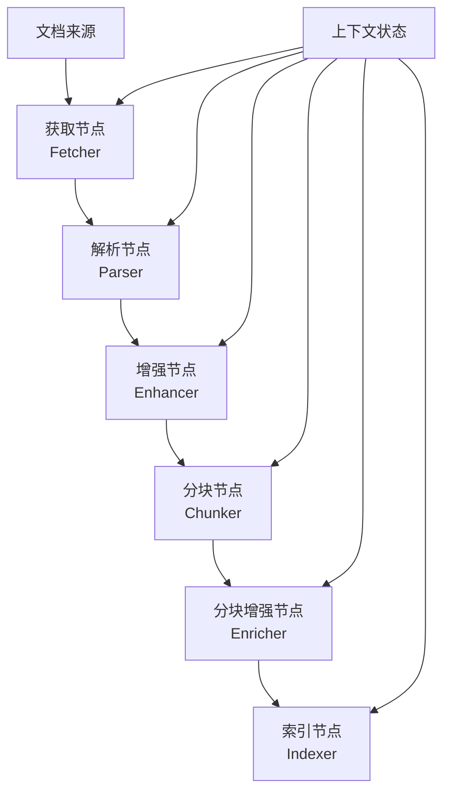
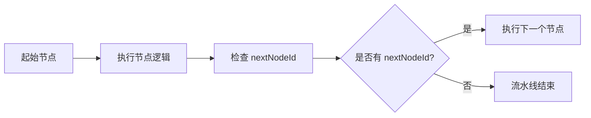

文档摄取流水线是 RAGent 系统的核心组件，负责将各种格式的文档转换为可检索的向量知识库。该流水线采用模块化、可配置的链式架构，支持多种文档格式和来源，并集成了 AI 增强能力。

## 🏗️ 整体架构

文档摄取流水线基于**节点链式执行**架构，每个节点负责特定的处理逻辑，通过 `nextNodeId` 形成执行链条。



### 核心特点

- ✅ **链式执行**: 基于 `nextNodeId` 明确连线关系，形成清晰的执行路径
- ✅ **可扩展节点**: 支持自定义节点类型，易于扩展新的处理逻辑
- ✅ **上下文传递**: 通过 `IngestionContext` 在节点间传递数据状态
- ✅ **条件控制**: 支持基于条件表达式的节点执行控制
- ✅ **错误处理**: 完整的错误检测和处理机制

## 📋 支持的节点类型

| 节点类型 | 功能描述 | 主要职责 |
|----------|----------|----------|
| **FETCHER** | 文档获取 | 从本地文件、URL、飞书、S3 等源获取原始字节流 |
| **PARSER** | 文档解析 | 将 PDF、Word、Excel 等格式解析为结构化文本 |
| **ENHANCER** | 文档增强 | 对整个文档进行 AI 增强处理，提升文本质量 |
| **CHUNKER** | 文档分块 | 将长文档按策略切分为适合检索的文本块 |
| **ENRICHER** | 分块增强 | 对每个文本块进行 AI 增强处理 |
| **INDEXER** | 索引构建 | 将文本块向量化并存储到向量数据库 |

## 🔧 流水线配置

### 创建流水线示例

```json
{
  "name": "pdf-ingestion-pipeline",
  "description": "PDF文档摄取流水线",
  "nodes": [
    {
      "nodeId": "fetcher-1",
      "nodeType": "fetcher",
      "nextNodeId": "parser-1"
    },
    {
      "nodeId": "parser-1",
      "nodeType": "parser",
      "settings": {
        "rules": [
          {
            "mimeType": "PDF"
          }
        ]
      },
      "nextNodeId": "enhancer-1"
    },
    {
      "nodeId": "enhancer-1",
      "nodeType": "enhancer",
      "settings": {
        "modelId": "qwen-plus",
        "tasks": [
          {
            "type": "context_enhance",
            "systemPrompt": "文本修复模板",
            "userPromptTemplate": "请整理以下PDF文档内容：\n\n{{text}}"
          }
        ]
      },
      "nextNodeId": "chunker-1"
    },
    {
      "nodeId": "chunker-1",
      "nodeType": "chunker",
      "settings": {
        "strategy": "fixed_size",
        "chunkSize": 512,
        "overlapSize": 128
      },
      "nextNodeId": "indexer-1"
    },
    {
      "nodeId": "indexer-1",
      "nodeType": "indexer",
      "settings": {
        "embeddingModel": "qwen-emb-8b",
        "includeEnhancedContent": true,
        "metadataFields": ["category", "department"]
      }
    }
  ]
}
```

### 配置字段说明

| 字段 | 类型 | 必填 | 说明 |
|------|------|------|------|
| `nodeId` | String | ✅ | 节点唯一标识符 |
| `nodeType` | String | ✅ | 节点类型（fetcher/parser/enhancer/chunker/enricher/indexer） |
| `nextNodeId` | String | ❌ | 下一个节点ID（最后一个节点不需要） |
| `settings` | Object | ❌ | 节点特定配置 |
| `condition` | String | ❌ | 条件表达式（可选） |

## 🔄 执行流程

### 1. 流水线验证

在执行前，系统会自动验证流水线配置：

- **循环依赖检测**: 防止 A→B→C→A 这样的循环执行
- **节点引用验证**: 确保所有 `nextNodeId` 都指向存在的节点
- **起始节点检测**: 自动找到没有被其他节点引用的起始节点

### 2. 链式执行机制



### 3. 上下文传递

`IngestionContext` 在整个执行过程中传递数据状态：

```java
public class IngestionContext {
    private String taskId;
    private String pipelineId;
    private DocumentSource source;
    private byte[] rawBytes;
    private String mimeType;
    private String rawText;
    private StructuredDocument document;
    private List<VectorChunk> chunks;
    private String enhancedText;
    private List<String> keywords;
    private List<String> questions;
    private Map<String, Object> metadata;
    private IngestionStatus status;
    private List<NodeLog> logs;
    private Throwable error;
}
```

## 🚀 API 使用指南

### 创建流水线

```bash
curl -X POST "http://localhost:8080/api/ragent/ingestion/pipelines" \
  -H "Content-Type: application/json" \
  -d @pipeline-config.json
```

### 上传文档执行任务

```bash
curl -X POST "http://localhost:8080/api/ragent/ingestion/tasks/upload" \
  -F "pipelineId=1" \
  -F "file=@/path/to/document.pdf" \
  -F "metadata={\"category\":\"manual\",\"department\":\"IT\"}"
```

### 查看任务状态

```bash
curl "http://localhost:8080/api/ragent/ingestion/tasks/{taskId}"
```

### 任务状态说明

| 状态 | 描述 |
|------|------|
| **PENDING** | 任务等待执行 |
| **RUNNING** | 任务正在执行 |
| **COMPLETED** | 任务执行成功 |
| **FAILED** | 任务执行失败 |
| **CANCELLED** | 任务被取消 |

## ⚙️ 节点详解

### 获取节点 (FETCHER)

支持多种文档来源：

- **FILE**: 本地文件系统
- **URL**: HTTP/HTTPS 网络地址
- **FEISHU**: 飞书文档
- **S3**: S3 兼容对象存储

**配置示例**:
```json
{
  "nodeType": "fetcher",
  "settings": {
    "timeout": 30000,
    "maxRetries": 3
  }
}
```

### 解析节点 (PARSER)

支持多种文档格式：

- **PDF**: PDF 文档解析
- **Word**: Word 文档 (.docx)
- **Excel**: Excel 文档 (.xlsx)
- **TXT**: 纯文本文件
- **HTML**: HTML 文档

**配置示例**:
```json
{
  "nodeType": "parser",
  "settings": {
    "rules": [
      {
        "mimeType": "PDF",
        "extractImages": true
      }
    ]
  }
}
```

### 增强节点 (ENHANCER)

使用 AI 模型对文档进行整体增强：

**配置示例**:
```json
{
  "nodeType": "enhancer",
  "settings": {
    "modelId": "qwen-plus",
    "tasks": [
      {
        "type": "context_enhance",
        "systemPrompt": "你是一个专业的文本修复器...",
        "userPromptTemplate": "请整理以下内容：\n\n{{text}}"
      }
    ]
  }
}
```

### 分块节点 (CHUNKER)

将文档切分为适合检索的文本块：

**分块策略**:

| 策略 | 特点 | 适用场景 |
|------|------|----------|
| **fixed_size** | 固定大小分块 | 通用场景 |
| **semantic** | 语义分块 | 保持语义完整性 |
| **recursive** | 递归字符分块 | 处理嵌套结构 |

**配置示例**:
```json
{
  "nodeType": "chunker",
  "settings": {
    "strategy": "fixed_size",
    "chunkSize": 512,
    "overlapSize": 128,
    "separators": ["\n\n", "\n", ".", "。", "！", "？"]
  }
}
```

### 索引节点 (INDEXER)

将文本块向量化并存储到向量数据库：

**配置示例**:
```json
{
  "nodeType": "indexer",
  "settings": {
    "embeddingModel": "qwen-emb-8b",
    "includeEnhancedContent": true,
    "metadataFields": ["category", "department", "source"],
    "batchSize": 100
  }
}
```

## 📊 错误处理与日志

### 常见错误类型

| 错误类型 | 原因 | 解决方案 |
|----------|------|----------|
| **循环依赖** | 节点间形成循环引用 | 检查 `nextNodeId` 配置 |
| **节点不存在** | 引用了不存在的节点 | 确认节点ID正确 |
| **无起始节点** | 所有节点都被引用 | 至少需要一个无 `nextNodeId` 的节点 |
| **文档格式不支持** | 解析器无法处理文件格式 | 检查文档格式或添加相应解析器 |
| **AI服务异常** | 增强服务不可用 | 检查AI服务连接和配置 |

### 日志记录

系统会记录每个节点的执行日志：

```json
{
  "taskId": "123",
  "pipelineId": "1",
  "status": "RUNNING",
  "logs": [
    {
      "nodeId": "fetcher-1",
      "startTime": "2026-01-22T14:30:00",
      "endTime": "2026-01-22T14:30:01",
      "status": "SUCCESS",
      "message": "已获取 102400 字节",
      "error": null
    },
    {
      "nodeId": "parser-1", 
      "startTime": "2026-01-22T14:30:01",
      "endTime": "2026-01-22T14:30:05",
      "status": "SUCCESS",
      "message": "解析完成，提取文本 5000 字符",
      "error": null
    }
  ]
}
```

## 🎯 最佳实践

### 1. 流水线设计原则

- **单一职责**: 每个节点只负责一种类型的处理
- **合理分块**: 根据文档类型选择合适的分块策略
- **错误容错**: 在关键节点添加错误处理和重试机制
- **性能优化**: 合理配置批处理大小和并发度

### 2. 配置建议

- **文档类型匹配**: 根据文档类型选择合适的解析规则
- **分块大小**: 一般推荐 256-1024 字符，根据内容调整
- **重叠大小**: 通常设置为块大小的 10%-25%
- **AI增强**: 使用合适的提示词模板提升处理质量

### 3. 监控与维护

- 定期检查流水线执行状态和错误日志
- 监控向量数据库的存储和查询性能
- 根据业务需求调整流水线配置
- 及时更新AI模型以获得更好的处理效果

## 🔗 相关页面

- [分块策略与实现](20-fen-kuai-ce-lue-yu-shi-xian): 深入了解文档分块策略和实现细节
- [Embedding 向量化处理](16-embedding-xiang-liang-hua-chu-li): 了解向量化和Embedding处理
- [API 接口规范](38-api-jie-kou-gui-fan): 查看完整的API接口文档