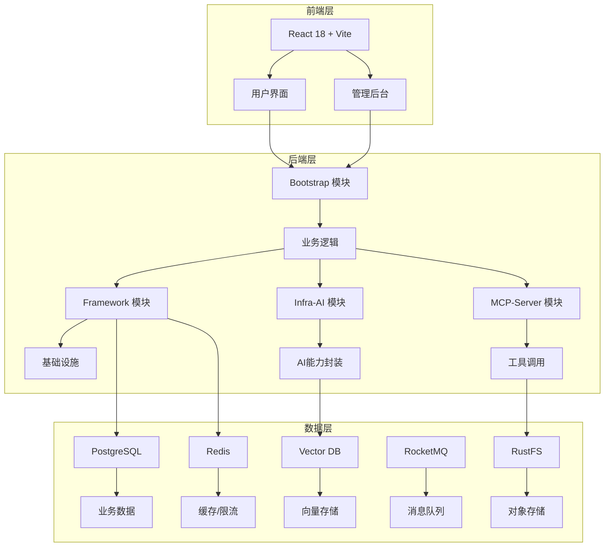

本文档将帮助你快速搭建和运行 Ragent AI 系统，通过本指南你将能够：
- 了解项目整体架构
- 完成环境搭建
- 启动前后端服务
- 体验基本功能

## 项目概述

Ragent 是一个企业级 RAG（检索增强生成）智能体平台，基于 Java 17 + Spring Boot 3 + React 18 构建。它实现了从文档入库到智能问答的全链路能力，包含多路检索引擎、意图识别、问题重写、会话记忆、模型路由等核心特性。

### 核心特性

- **多通道检索引擎**：意图定向检索 + 全局向量检索并行执行，结果经去重、重排序后处理
- **意图识别与引导**：树形多级意图分类，置信度不足时主动引导澄清
- **问题重写与拆分**：多轮对话自动补全上下文，复杂问题拆为子问题分别检索
- **会话记忆管理**：滑动窗口 + 自动摘要压缩，控Token成本不丢上下文
- **模型路由与容错**：多模型优先级调度、首包探测、健康检查、自动降级
- **MCP工具集成**：意图非知识检索时自动提参调用业务工具
- **全链路追踪**：重写、意图、检索、生成每个环节均有Trace记录

## 系统架构



## 系统环境要求

### 必需组件

| 组件 | 版本要求 | 说明 |
|------|----------|------|
| Java | JDK 17+ | 项目核心运行环境 |
| Node.js | 18+ | 前端开发环境 |
| PostgreSQL | 14+ | 主数据库 |
| Redis | 6.0+ | 缓存和限流 |
| Milvus | 2.6.x | 向量数据库（可选） |
| RocketMQ | 5.2.0 | 消息队列 |
| Ollama | 可选 | 本地模型服务 |

### 服务器推荐配置

```yaml
# 小型测试环境
CPU: 4核
内存: 8GB
存储: 50GB

# 生产环境
CPU: 8核+
内存: 16GB+
存储: 200GB SSD
```

## 快速安装步骤

### 1. 克隆项目

```bash
# 克隆项目
git clone https://github.com/nageoffer/ragent.git
cd ragent

# 或者直接使用本地目录
cd D:\Projects\Java_JS\Agent\ragent
```

### 2. 环境配置

#### 系统环境变量

```bash
# Java环境
export JAVA_HOME=/path/to/jdk17
export PATH=$JAVA_HOME/bin:$PATH

# Node.js环境
export NODE_HOME=/path/to/node18
export PATH=$NODE_HOME/bin:$PATH
```

#### 配置文件修改

编辑 `bootstrap/src/main/resources/application.yaml`：

```yaml
# 数据库配置
spring:
  datasource:
    driver-class-name: org.postgresql.Driver
    username: postgres
    password: postgres
    url: jdbc:postgresql://localhost:5432/ragent?client_encoding=UTF8
    
# Redis配置
  data:
    redis:
      host: localhost
      port: 6379
      password: # 如果有密码的话

# 向量数据库配置
milvus:
  uri: http://localhost:19530

# AI模型配置
ai:
  providers:
    ollama:
      url: http://localhost:11434
    # 其他模型供应商配置
```

### 3. 数据库初始化

```bash
# 启动PostgreSQL
docker run -d --name postgres -e POSTGRES_PASSWORD=postgres -p 5432:5432 postgres:14

# 创建数据库
createdb ragent

# 导入数据库结构
psql -d ragent -f resources/database/schema_pg.sql

# 导入初始数据（可选）
psql -d ragent -f resources/database/init_data_pg.sql
```

### 4. 启动依赖服务

#### 使用Docker Compose启动

```bash
# 启动RocketMQ
cd resources/docker
docker-compose -f rocketmq-stack-5.2.0.compose.yaml up -d

# 启动Milvus（如果使用）
docker-compose -f milvus-stack-2.6.6.compose.yaml up -d

# 启动Redis
docker run -d --name redis -p 6379:6379 redis:6-alpine
```

#### 手动启动各服务

```bash
# 启动RocketMQ
docker run -d --name rmqnamesrv -p 9876:9876 apache/rocketmq:5.2.0 sh mqnamesrv
docker run -d --name rmqbroker -p 10909:10909 -p 10911:10911 -p 10912:10912 apache/rocketmq:5.2.0 sh mqbroker

# 启动Milvus（可选）
docker run -d --name milvus -p 19530:19530 milvusdb/milvus:v2.6.6

# 启动Redis
docker run -d --name redis -p 6379:6379 redis:6-alpine
```

### 5. 后端服务启动

```bash
# 使用Maven编译
mvn clean compile

# 打包
mvn clean package -DskipTests

# 运行Bootstrap模块
cd bootstrap
java -jar target/bootstrap-0.0.1-SNAPSHOT.jar --server.port=9090

# 或者使用IDE直接运行
# 在IntelliJ IDEA或Eclipse中直接运行BootstrapApplication类
```

### 6. 前端服务启动

```bash
# 进入前端目录
cd frontend

# 安装依赖
npm install
# 或者使用pnpm
pnpm install

# 启动开发服务器
npm run dev
# 或者
pnpm dev

# 构建生产版本
npm run build
```

## 服务访问地址

### 前端界面

- **用户问答界面**：http://localhost:5173/
- **管理后台**：http://localhost:5173/admin

### 后端API

- **API基础路径**：http://localhost:9090/api/ragent
- **健康检查**：http://localhost:9090/api/ragent/actuator/health

### 依赖服务

- **RocketMQ控制台**：http://localhost:8080
- **Milvus控制台**：http://localhost:9091
- **Redis命令行**：redis-cli -h localhost -p 6379

## 功能体验

### 1. 用户问答

1. 打开浏览器访问 http://localhost:5173/
2. 输入框中输入问题，如："OA系统如何保证数据安全？"
3. 点击发送或按Enter键
4. 查看AI生成的回答

### 2. 管理后台功能

#### 知识库管理
- 查看已上传的文档
- 上传新文档支持PDF、Word、PPT等格式
- 配置文档处理参数

#### 意图树管理
- 查看和管理意图分类树
- 编辑意图节点和配置
- 测试意图识别效果

#### 模型管理
- 配置AI模型提供商
- 设置模型优先级和参数
- 查看模型运行状态

#### 链路追踪
- 查看RAG处理流程
- 分析各环节耗时
- 排查性能问题

### 3. 文档上传与处理

1. 在管理后台进入"知识库管理"
2. 点击"上传文档"按钮
3. 选择文档文件（PDF、Word、PPT等）
4. 等待文档处理完成
5. 处理完成后即可在问答中使用

## 常见问题排查

### 1. 服务启动失败

**问题**：后端启动失败
```bash
# 检查端口占用
netstat -ano | findstr 9090

# 查看详细错误日志
java -jar bootstrap/target/bootstrap-0.0.1-SNAPSHOT.jar
```

**解决方案**：
- 确保端口未被占用
- 检查数据库连接配置
- 确认所有依赖服务已启动

### 2. 数据库连接失败

**问题**：PostgreSQL连接异常
```sql
-- 测试连接
psql -h localhost -U postgres -p 5432
```

**解决方案**：
- 确认PostgreSQL服务正在运行
- 检查用户名和密码
- 确认数据库已创建

### 3. 向量检索失败

**问题**：Milvus连接失败
```bash
# 检查Milvus状态
curl http://localhost:19530/
```

**解决方案**：
- 确认Milvus服务正在运行
- 检查网络连接
- 确认Milvus配置正确

### 4. AI模型调用失败

**问题**：模型响应超时或错误
```bash
# 测试Ollama连接
curl http://localhost:11434/api/version
```

**解决方案**：
- 确认模型服务正常运行
- 检查API密钥配置
- 查看详细错误日志

## 下一步学习

完成快速启动后，建议按照以下顺序深入学习：

1. **[项目概述与核心价值](1-xiang-mu-gai-shu-yu-he-xin-jie-zhi)** - 了解项目背景和设计理念
2. **[系统环境要求](3-xi-tong-huan-jing-yao-qiu)** - 详细环境配置指南
3. **[数据库初始化配置](4-shu-ju-ku-chu-shi-hua-pe-zhi)** - 数据库详细配置
4. **[Docker部署方案](5-docker-bu-shu-fang-an)** - 容器化部署指南
5. **[智能对话界面使用](6-zhi-neng-dui-hua-jie-mian-shi-yong)** - 用户功能详解
6. **[知识库管理入门](7-zhi-shi-ku-guan-li-ru-men)** - 知识库管理指南

## 获取帮助

如果遇到问题，可以通过以下方式获取帮助：

- **GitHub Issues**：[https://github.com/nageoffer/ragent/issues](https://github.com/nageoffer/ragent/issues)
- **项目文档**：[https://nageoffer.com/ragent](https://nageoffer.com/ragent)
- **查看源码**：项目根目录下各模块源码
- **日志分析**：查看 `bootstrap/logs/` 目录下的日志文件