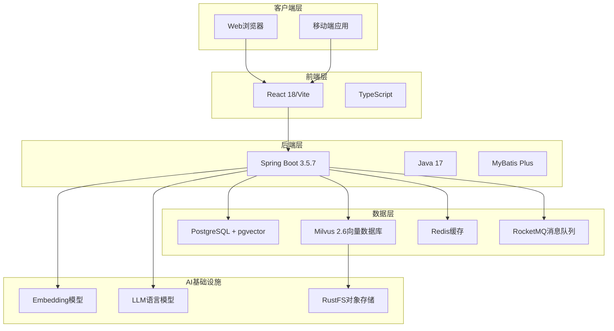

Ragent 是一个企业级 RAG 智能体平台，本页面详细说明运行和开发该系统所需的硬件、软件及环境配置要求。在开始部署之前，请确保您的环境满足以下基本要求。

## 系统架构概览

Ragent 采用现代微服务架构，包含前端界面、后端服务、AI基础设施等多个组件。以下是系统的核心架构图：



## 硬件要求

### 开发环境

| 组件 | 最低配置 | 推荐配置 | 说明 |
|------|----------|----------|------|
| CPU | 4核 | 8核+ | 支持多线程编译和运行 |
| 内存 | 8GB | 16GB+ | 包括Docker容器和IDE占用 |
| 存储 | 50GB | 100GB+ | 项目代码+依赖+本地数据库 |
| 操作系统 | Windows 10/11, macOS 10.14+, Ubuntu 18.04+ | 支持主流操作系统 | Windows推荐WSL2 |

### 生产环境

| 组件 | 最低配置 | 推荐配置 | 说明 |
|------|----------|----------|------|
| CPU | 8核 | 16核+ | 支持高并发请求处理 |
| 内存 | 16GB | 32GB+ | AI模型推理和向量检索 |
| 存储 | 200GB | 500GB+ | SSD，支持向量数据存储 |
| 网络 | 100Mbps | 1Gbps | 确保模型调用性能 |
| GPU | 可选 | NVIDIA V100/A100 | 大规模AI推理加速 |

## 软件要求

### 开发环境基础软件

| 类别 | 软件 | 版本 | 说明 |
|------|------|------|------|
| **运行时环境** | Java Development Kit | 17+ | 必须安装JDK 17或更高版本 |
| | Node.js | 18+ | 前端开发依赖 |
| | Maven | 3.8+ | 后端项目构建和管理 |
| | Git | 2.30+ | 版本控制 |
| | Docker | 20.10+ | 容器化部署（推荐） |

| 类别 | 软件 | 版本 | 说明 |
|------|------|------|------|
| **开发工具** | IDE | IntelliJ IDEA 2023+ | 后端Java开发 |
| | VS Code | 1.70+ | 前端React开发 |
| | Chrome | 最新版 | 前端调试 |
| | Postman | 最新版 | API测试 |

### 数据库要求

| 数据库 | 版本 | 配置要求 | 说明 |
|--------|------|----------|------|
| PostgreSQL | 14+ | 4GB+内存 | 需要启用pgvector扩展 |
| Milvus | 2.6.x | 根据数据量配置 | 向量数据库，支持大规模向量检索 |
| Redis | 6.2+ | 2GB+内存 | 缓存和会话管理 |
| RocketMQ | 5.2.0 | 根据消息量配置 | 消息队列 |

### AI组件要求

| 组件 | 版本 | 配置要求 | 说明 |
|------|------|----------|------|
| Embedding模型 | OpenAI/Sentence-Bert | - | 文本向量化 |
| LLM模型 | GPT-4/国产模型 | - | 内容生成 |
| 向量数据库 | Milvus 2.6.6 | 最低8GB内存 | 高性能向量检索 |

## 环境配置详情

### 后端开发环境配置

**Java环境要求：**
```bash
# 检查Java版本
java -version  # 要求17+
javac -version

# 设置JAVA_HOME（Windows示例）
set JAVA_HOME=C:\Program Files\Java\jdk-17
```

**Maven配置：**
```bash
# 检查Maven版本
mvn -version

# 配置镜像加速（可选）
mkdir -p ~/.m2
cat > ~/.m2/settings.xml << 'EOF'
<settings>
  <mirrors>
    <mirror>
      <id>aliyun</id>
      <mirrorOf>central</mirrorOf>
      <url>https://maven.aliyun.com/repository/public</url>
    </mirror>
  </mirrors>
</settings>
EOF
```

Sources: [pom.xml](pom.xml#L8-L10)

### 前端开发环境配置

**Node.js环境要求：**
```bash
# 检查Node.js版本
node --version  # 要求18+
npm --version

# 设置npm镜像（可选）
npm config set registry https://registry.npmmirror.com
```

**前端项目依赖：**
```bash
# 进入前端目录
cd frontend

# 安装依赖
npm install
# 或使用pnpm（推荐更快）
pnpm install

# 开发模式运行
npm run dev
```

Sources: [frontend/package.json](frontend/package.json#L1-L15)

### 数据库环境配置

**PostgreSQL配置：**
```sql
-- 安装pgvector扩展
CREATE EXTENSION IF NOT EXISTS vector;

-- 验证安装
SELECT vector_dims('[1,2,3]'::vector);
```

**Milvus配置（Docker）：**
```bash
# 使用提供的docker-compose启动
cd resources/docker
docker-compose -f milvus-stack-2.6.6.compose.yaml up -d

# 检查服务状态
docker-compose -f milvus-stack-2.6.6.compose.yaml ps
```

Sources: [resources/docker/milvus-stack-2.6.6.compose.yaml](resources/docker/milvus-stack-2.6.6.compose.yaml#L1-L10)

## 容器化部署要求

### Docker环境配置

**Docker版本要求：**
```bash
# 检查Docker版本
docker --version  # 要求20.10+
docker-compose --version

# 启动Docker服务（Windows）
# 建议启用WSL2支持以获得更好性能
```

### 服务编排配置

**完整环境启动：**
```bash
# 启动所有基础服务
cd resources/docker

# 启动RocketMQ
docker-compose -f rocketmq-stack-5.2.0.compose.yaml up -d

# 启动Milvus
docker-compose -f milvus-stack-2.6.6.compose.yaml up -d
```

Sources: [resources/docker/docker-compose.yml](resources/docker/docker-compose.yml#L1-L15)

## 网络配置要求

### 开发环境网络

| 组件 | 端口 | 说明 |
|------|------|------|
| 前端开发服务器 | 5173 | Vite开发服务器 |
| 后端API服务 | 8080 | Spring Boot应用 |
| PostgreSQL | 5432 | 数据库连接 |
| Milvus | 19530 | 向量数据库API |
| Redis | 6379 | 缓存服务 |
| RocketMQ | 9876 | NameServer端口 |

### 生产环境网络

| 组件 | 端口 | 说明 | 安全要求 |
|------|------|------|----------|
| 前端Nginx | 80/443 | 反向代理 | HTTPS强制 |
| 后端API服务 | 8080 | 应用服务 | 防火墙限制 |
| 数据库 | 5432 | PostgreSQL | 仅内网访问 |
| 向量数据库 | 19530 | Milvus | 内网访问 |
| 消息队列 | 9876 | RocketMQ | 内网访问 |

## 系统依赖组件

### 必需的第三方服务

1. **AI模型服务**
   - OpenAI API Key（可选）
   - 国产大模型API接入
   - Embedding模型服务

2. **存储服务**
   - S3兼容存储（RustFS）
   - 本地文件存储

3. **监控服务**
   - 应用日志收集
   - 性能监控

Sources: [README.md](README.md#L200-L250)

## 性能基准要求

### 开发环境性能指标

| 指标 | 最低要求 | 推荐配置 | 影响 |
|------|----------|----------|------|
| 启动时间 | < 30秒 | < 15秒 | 开发效率 |
| API响应 | < 500ms | < 200ms | 用户体验 |
| 检索延迟 | < 1秒 | < 500ms | 智能问答 |
| 内存占用 | < 2GB | < 1GB | 系统稳定性 |

### 生产环境性能指标

| 指标 | 最低要求 | 目标配置 | 影响 |
|------|----------|----------|------|
| 并发用户 | 100+ | 500+ | 系统容量 |
| QPS | 100+ | 500+ | 处理能力 |
| 检索延迟 | < 2秒 | < 800ms | 用户体验 |
| 可用性 | 99.9% | 99.95% | 服务稳定性 |

## 环境验证检查

### 开发环境自检清单

```bash
# 1. 检查Java环境
java -version
javac -version

# 2. 检查Maven环境
mvn -version

# 3. 检查Node.js环境
node --version
npm --version

# 4. 检查Docker环境
docker --version
docker-compose --version

# 5. 启动项目测试
mvn clean install
cd frontend && npm install && npm run build
```

### 生产环境部署前检查

```bash
# 1. 检查系统资源
free -h
df -h
uname -a

# 2. 检查网络连通性
ping database-host
ping vector-db-host

# 3. 检查服务状态
systemctl status postgresql
systemctl status redis
systemctl status docker

# 4. 检查磁盘空间
df -h /var/lib/docker
```

## 下一步操作

完成环境配置后，建议按以下顺序进行后续操作：

1. **[数据库初始化配置](4-shu-ju-ku-chu-shi-hua-pei-zhi)** - 配置PostgreSQL和Milvus数据库
2. **[Docker部署方案](5-docker-bu-shu-fang-an)** - 使用容器化部署完整系统
3. **[智能对话界面使用](6-zhi-neng-dui-hua-jie-mian-shi-yong)** - 体验系统的核心功能

通过以上环境配置，您将具备开发和运行Ragent企业级RAG智能体平台的完整环境。