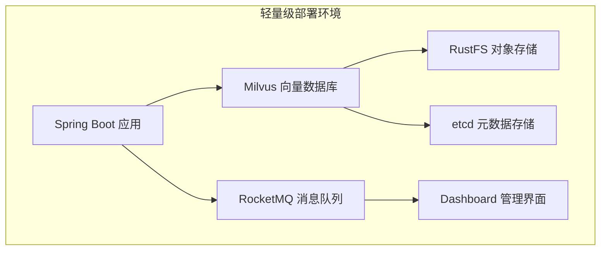
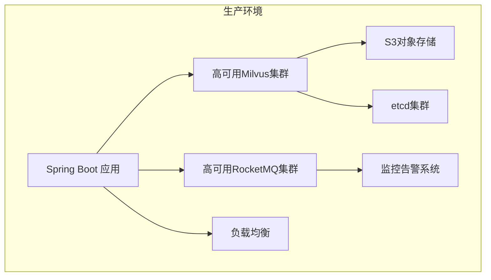
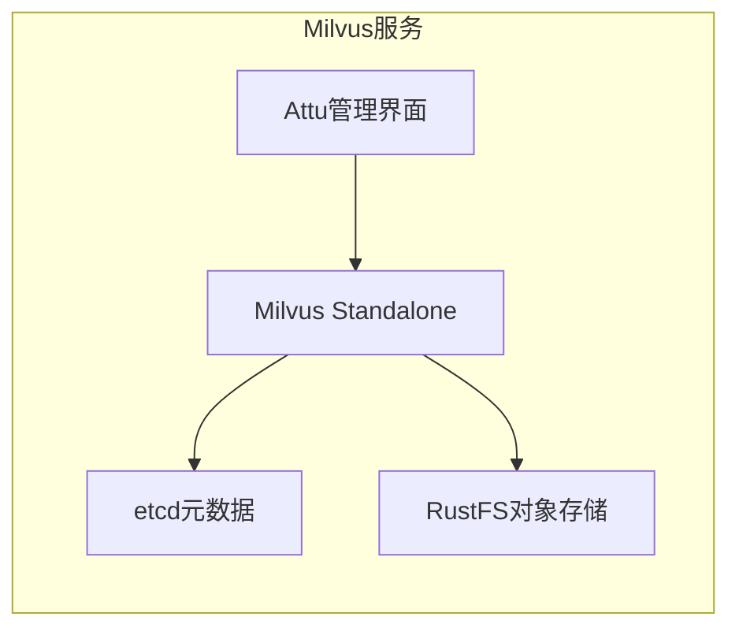
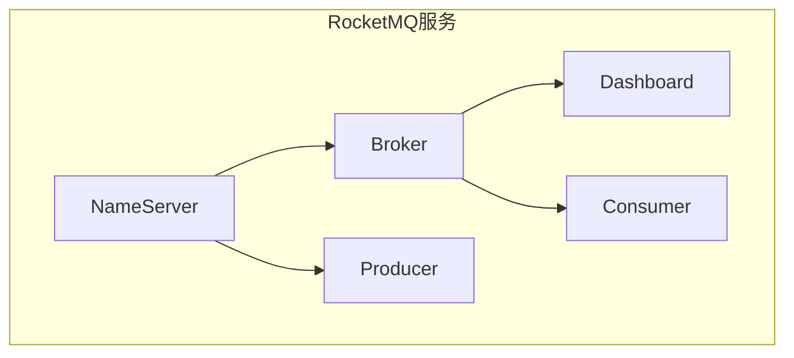
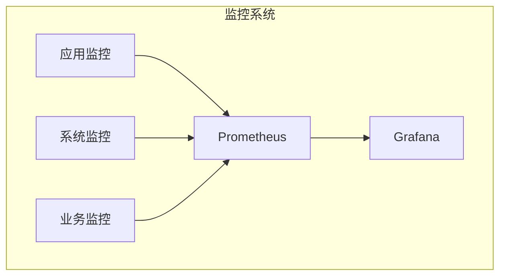
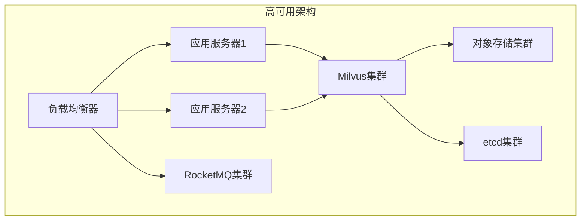
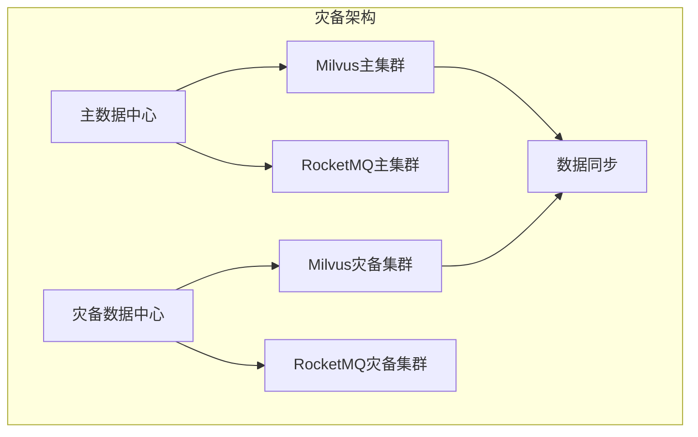

本文档提供 RAGent 智能系统的完整 Docker 部署指南，涵盖从轻量级开发环境到生产环境的各种部署场景。

## 部署方案概览

RAGent 系统采用微服务架构，通过 Docker Compose 实现容器化部署，支持以下部署模式：

| 部署模式 | 适用场景 | 资源需求 | 包含组件 | 文件位置 |
|---------|---------|---------|---------|----------|
| 轻量级部署 | 本地开发、低配服务器、快速体验 | 4GB+ 内存 | Milvus + RocketMQ + 应用 | `lightweight/` |
| 完整部署 | 生产环境、高并发场景 | 8GB+ 内存 | Milvus + RocketMQ + 应用 + 监控 | 根目录 `docker-compose.yml` |
| 单独服务 | 按需扩展、独立部署 | 按需配置 | Milvus 或 RocketMQ | 各自 compose 文件 |

## 轻量级部署方案

轻量级部署专门为资源受限环境设计，通过内存限制确保系统在低配置环境中稳定运行。

### 架构组件



### 内存配置

| 服务 | 内存限制 | 说明 |
|------|---------|------|
| Milvus | 3GB | 向量索引和查询主要消耗内存 |
| RustFS | 256MB | 对象存储，IO密集型 |
| etcd | 256MB | 元数据存储，轻量级足够 |
| Attu | 256MB | Web管理界面 |
| RocketMQ | 512MB | 消息队列核心服务 |
| Dashboard | 512MB | 监控管理界面 |

### 部署步骤

1. **环境准备**
   ```bash
   # 确保Docker和Docker Compose已安装
   docker --version
   docker-compose --version
   
   # 创建部署工作目录
   mkdir -p ragent-deploy
   cd ragent-deploy
   ```

2. **下载配置文件**
   ```bash
   # 轻量级Milvus配置
   wget https://github.com/your-repo/ragent/blob/main/resources/docker/lightweight/milvus-stack-2.6.6.compose.yaml
   
   # 轻量级RocketMQ配置
   cp ../resources/docker/rocketmq-stack-5.2.0.compose.yaml .
   ```

3. **启动Milvus服务**
   ```bash
   # 启动Milvus栈
   docker compose -f milvus-stack-2.6.6.compose.yaml up -d
   
   # 验证服务状态
   docker compose ps
   curl http://localhost:8000
   ```

4. **启动RocketMQ服务**
   ```bash
   # 启动RocketMQ栈
   docker compose -f rocketmq-stack-5.2.0.compose.yaml up -d
   
   # 访问Dashboard
   open http://localhost:8082
   ```

5. **启动应用服务**
   ```bash
   # 构建并启动Spring Boot应用
   mvn clean package
   java -jar bootstrap/target/ragent-0.0.1-SNAPSHOT.jar
   ```

### 兼容性配置

对于不兼容Milvus 2.6.6的环境（如CentOS 7），可使用降级版本：

```bash
# 使用Milvus 2.5.8降级版本
docker compose -f milvus-stack-2.5.8.compose.yaml up -d
```

### 监控与管理

```bash
# 查看所有容器状态
docker ps

# 查看服务日志
docker compose logs -f milvus-standalone
docker compose logs -f rmqnamesrv

# 健康检查
docker compose ps
curl http://localhost:9091/healthz
```

Sources: [resources/docker/lightweight/README.md](resources/docker/lightweight/README.md#L1-L38), [resources/docker/lightweight/milvus-stack-2.6.6.compose.yaml](resources/docker/lightweight/milvus-stack-2.6.6.compose.yaml#L1-L90)

## 完整生产部署方案

生产环境部署采用无内存限制配置，适合高并发和大规模数据处理场景。

### 架构设计



### 服务配置对比

| 配置项 | 轻量级 | 生产环境 |
|--------|--------|----------|
| 内存限制 | 有限制 | 无限制 |
| 健康检查 | 基础 | 完整 |
| 持久化存储 | 基础 | 高可用 |
| 监控 | 内置 | 完整监控栈 |
| 网络配置 | 简单 | 安全网络隔离 |

### 部署步骤

1. **环境准备**
   ```bash
   # 生产环境要求
   # CPU: 8核+
   # 内存: 8GB+
   # 磁盘: 50GB+ SSD
   
   # 创建生产配置目录
   mkdir -p /opt/ragent-prod
   cd /opt/ragent-prod
   ```

2. **配置网络**
   ```yaml
   # 创建自定义网络
   docker network create ragent-net
   ```

3. **启动基础服务**
   ```bash
   # 启动Milvus服务
   cp /path/to/resources/docker/milvus-stack-2.6.6.compose.yaml .
   docker compose -f milvus-stack-2.6.6.compose.yaml up -d
   
   # 启动RocketMQ服务
   cp /path/to/resources/docker/rocketmq-stack-5.2.0.compose.yaml .
   docker compose -f rocketmq-stack-5.2.0.compose.yaml up -d
   ```

4. **应用配置优化**
   ```properties
   # application-prod.properties
   server.port=8080
   spring.datasource.url=jdbc:postgresql://postgres:5432/ragent
   spring.datasource.username=ragent
   spring.datasource.password=secure-password
   
   # Milvus配置
   milvus.host=milvus-standalone
   milvus.port=19530
   
   # RocketMQ配置
   rocketmq.name-server=rmqnamesrv:9876
   ```

5. **部署应用**
   ```bash
   # 构建生产版本
   mvn clean package -Pprod
   
   # 创建Dockerfile（如需要）
   cat > Dockerfile << EOF
   FROM openjdk:17-jre-slim
   COPY target/ragent-0.0.1-SNAPSHOT.jar app.jar
   EXPOSE 8080
   ENTRYPOINT ["java", "-jar", "/app.jar"]
   EOF
   
   # 构建并启动
   docker build -t ragent:latest .
   docker run -d --name ragent-app \
     --network ragent-net \
     -p 8080:8080 \
     ragent:latest
   ```

Sources: [resources/docker/milvus-stack-2.6.6.compose.yaml](resources/docker/milvus-stack-2.6.6.compose.yaml#L1-L99), [resources/docker/rocketmq-stack-5.2.0.compose.yaml](resources/docker/rocketmq-stack-5.2.0.compose.yaml#L1-L76)

## 单独服务部署

### Milvus 向量数据库部署



#### 快速启动
```bash
# 生产环境Milvus
docker compose -f milvus-stack-2.6.6.compose.yaml up -d

# 轻量级Milvus
docker compose -f milvus-stack-2.6.6.compose.yaml up -d \
  --memory standalone=3g --memory rustfs=256m --memory etcd=256m

# 访问管理界面
open http://localhost:8000
```

### RocketMQ 消息队列部署



#### 快速启动
```bash
# 完整RocketMQ栈
docker compose -f rocketmq-stack-5.2.0.compose.yaml up -d

# 验证部署
curl http://localhost:9876
open http://localhost:8082
```

#### 消息测试
```bash
# 发送测试消息
docker exec -it rmqbroker /bin/bash
cd /home/rocketmq/bin/
./tools.sh org.apache.rocketmq.tools.cli.BrokerCli
```

Sources: [resources/docker/docker-compose.yml](resources/docker/docker-compose.yml#L1-L76), [resources/docker/lightweight/milvus-stack-2.5.8.compose.yaml](resources/docker/lightweight/milvus-stack-2.5.8.compose.yaml#L1-L90)

## 配置参数详解

### Milvus 配置参数

| 参数 | 默认值 | 说明 | 调整建议 |
|------|--------|------|----------|
| ETCD_ENDPOINTS | etcd:2379 | 元数据服务地址 | 生产环境建议集群部署 |
| MINIO_ADDRESS | rustfs:9000 | 对象存储地址 | 建议使用高性能存储 |
| standalone_memory_limit | 3G | 内存限制 | 根据数据量调整 |
| rustfs_memory_limit | 256M | 对象存储内存 | 256MB足够 |

### RocketMQ 配置参数

| 参数 | 默认值 | 说明 | 调整建议 |
|------|--------|------|----------|
| NAMESRV_ADDR | rmqnamesrv:9876 | 名称服务器地址 | 生产环境建议集群 |
| JAVA_OPT_EXT | -Xms512m -Xmx512m | JVM内存配置 | 根据消息量调整 |
| brokerIP1 | 127.0.0.1 | Broker IP地址 | 生产环境配置实际IP |
| brokerRole | ASYNC_MASTER | Broker角色 | 生产环境建议异步复制 |

### 应用配置参数

```properties
# 数据库配置
spring.datasource.url=jdbc:postgresql://localhost:5432/ragent
spring.datasource.username=ragent
spring.datasource.password=your_password

# Milvus配置
milvus.host=localhost
milvus.port=19530
milvus.database=ragent

# RocketMQ配置
rocketmq.name-server=localhost:9876
rocketmq.producer.group=ragent-producer

# 文件存储
file.storage.type=s3
file.storage.endpoint=http://localhost:9000
file.storage.access-key=rustfsadmin
file.storage.secret-key=rustfsadmin
```

Sources: [resources/docker/milvus-stack-2.6.6.compose.yaml](resources/docker/milvus-stack-2.6.6.compose.yaml#L1-L99), [resources/docker/rocketmq-stack-5.2.0.compose.yaml](resources/docker/rocketmq-stack-5.2.0.compose.yaml#L1-L76)

## 监控与运维

### 服务健康检查

```bash
# Milvus健康检查
curl http://localhost:9091/healthz

# RocketMQ健康检查
docker logs rmqnamesrv | grep "boot success"
docker logs rmqbroker | grep "boot success"

# 应用健康检查
curl http://localhost:8080/actuator/health
```

### 日志管理

```bash
# 查看实时日志
docker compose logs -f --tail=100

# 持久化日志
docker compose logs > ragent-logs-$(date +%Y%m%d).txt

# 日志轮转配置
cat > docker-compose.override.yml << EOF
services:
  milvus-standalone:
    logging:
      driver: "json-file"
      options:
        max-size: "10m"
        max-file: "3"
EOF
```

### 性能监控



#### 关键监控指标

| 指标类型 | 监控项 | 告警阈值 |
|----------|--------|----------|
| Milvus | QPS | >1000 |
| Milvus | 内存使用率 | >80% |
| RocketMQ | 消息堆积 | >1000 |
| RocketMQ | CPU使用率 | >70% |
| 应用 | 响应时间 | >2s |
| 应用 | 错误率 | >1% |

### 故障排查

#### 常见问题诊断

1. **Milvus启动失败**
   ```bash
   # 检查依赖服务
   docker compose ps
   docker compose logs etcd
   docker compose logs rustfs
   
   # 检查端口占用
   netstat -tulpn | grep 19530
   ```

2. **RocketMQ消息延迟**
   ```bash
   # 检查Broker状态
   docker exec rmqbroker /home/rocketmq/bin/mqadmin brokerStatus -n localhost:9876
   
   # 检查消费者状态
   docker exec rmqbroker /home/rocketmq/bin/mqadmin consumerStatus -n localhost:9876
   ```

3. **应用连接失败**
   ```bash
   # 检查网络连通性
   docker exec ragent-app ping milvus-standalone
   docker exec ragent-app ping rmqnamesrv
   
   # 检查配置文件
   cat /app/config/application-prod.properties
   ```

Sources: [resources/docker/lightweight/milvus-stack-2.6.6.compose.yaml](resources/docker/lightmous-stack-2.6.6.compose.yaml#L1-L90), [resources/docker/docker-compose.yml](resources/docker/docker-compose.yml#L1-L76)

## 扩展部署方案

### 高可用架构

对于生产环境高可用需求，建议采用以下架构：



#### 实施步骤

1. **配置负载均衡**
   ```bash
   # 使用Nginx作为负载均衡
   cat > nginx.conf << EOF
   upstream ragent-apps {
       server app1:8080;
       server app2:8080;
   }
   
   server {
       listen 80;
       location / {
           proxy_pass http://ragent-apps;
           proxy_set_header Host \$host;
       }
   }
   EOF
   ```

2. **扩展Milvus集群**
   ```yaml
   # docker-compose.cluster.yml
   services:
     milvus1:
       image: milvusdb/milvus:v2.6.6
       command: ["milvus", "run", "standalone"]
       environment:
         ETCD_ENDPOINTS: etcd1:2379,etcd2:2379,etcd3:2379
       
     milvus2:
       image: milvusdb/milvus:v2.6.6
       command: ["milvus", "run", "standalone"]
       environment:
         ETCD_ENDPOINTS: etcd1:2379,etcd2:2379,etcd3:2379
   ```

### 水平扩展

```bash
# 水平扩展应用实例
docker compose up -d --scale ragent-app=3

# 水平扩展RocketMQ Broker
docker compose up -d --scale rmqbroker=2
```

### 灾备方案



#### 数据备份策略

1. **Milvus数据备份**
   ```bash
   # 创建备份
   docker exec milvus-standalone milvusctl backup create \
     --backup-dir /backup/$(date +%Y%m%d)
   
   # 定时备份脚本
   cat > backup-milvus.sh << EOF
   #!/bin/bash
   DATE=\$(date +%Y%m%d)
   docker exec milvus-standalone milvusctl backup create \
     --backup-dir /backup/\$DATE
   EOF
   ```

2. **数据库备份**
   ```bash
   # PostgreSQL备份
   pg_dump -U ragent ragent > backup-\$(date +%Y%m%d).sql
   
   # 定时备份
   0 2 * * * pg_dump -U ragent ragent > /backup/db-\$(date +\%Y\%m\%d).sql
   ```

Sources: [resources/docker/milvus-stack-2.6.6.compose.yaml](resources/docker/milvus-stack-2.6.6.compose.yaml#L1-L99), [resources/docker/rocketmq-stack-5.2.0.compose.yaml](resources/docker/rocketmq-stack-5.2.0.compose.yaml#L1-L76)

## 最佳实践建议

### 环境配置建议

| 环境 | CPU核心 | 内存 | 磁盘空间 | 网络带宽 |
|------|---------|------|----------|----------|
| 开发环境 | 4核 | 8GB | 50GB | 100Mbps |
| 测试环境 | 8核 | 16GB | 100GB | 1Gbps |
| 生产环境 | 16核+ | 32GB+ | 500GB+ | 10Gbps+ |

### 安全配置

1. **网络安全**
   ```yaml
   # 配置防火墙规则
   services:
     ragent-app:
       networks:
         - ragent-net
     milvus-standalone:
       networks:
         - ragent-net
     rmqnamesrv:
       networks:
         - ragent-net
   ```

2. **访问控制**
   ```properties
   # 应用安全配置
   spring.security.enabled=true
   spring.security.jwt.secret=your-secret-key
   spring.security.jwt.expiration=86400000
   ```

### 性能优化

1. **Milvus优化**
   ```properties
   # 内存配置
   milvus.cpu_cache_capacity=4GB
   milvus.gpu_cache_capacity=8GB
   
   # 索引配置
   milvus.index_type=HNSW
   milvus.metric_type=L2
   ```

2. **RocketMQ优化**
   ```properties
   # 消息存储配置
   rocketmq.brokerCommitLogFileSize=1073741824
   rocketmq.brokerMappedFileSize=1073741824
   ```

### 部署自动化

```bash
#!/bin/bash
# deploy.sh - 自动化部署脚本
set -e

ENVIRONMENT=${1:-dev}
COMPOSE_FILE="docker-compose.${ENVIRONMENT}.yml"

echo "开始部署环境: $ENVIRONMENT"
docker compose -f $COMPOSE_FILE pull
docker compose -f $COMPOSE_FILE up -d
docker compose -f $COMPOSE ps
```

## 下一步建议

完成 Docker 部署后，建议按以下顺序继续学习和配置：

1. **[环境搭建与部署](3-xi-tong-huan-jing-yao-qiu)** - 了解系统环境要求
2. **[数据库初始化配置](4-shu-ju-ku-chu-shi-hua-pei-zhi)** - 配置PostgreSQL数据库
3. **[智能对话界面使用](6-zhi-neng-dui-hua-jie-mian-shi-yong)** - 体验基础功能
4. **[知识库管理入门](7-zhi-shi-ku-guan-li-ru-men)** - 学习知识库管理

通过完整的 Docker 部署方案，您可以快速搭建 RAGent 系统，并根据实际需求选择适合的部署模式。轻量级部署适合快速上手，完整部署方案则能满足生产环境的高可用和性能需求。