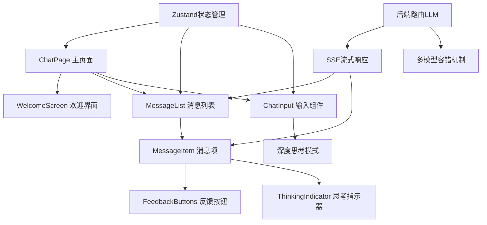
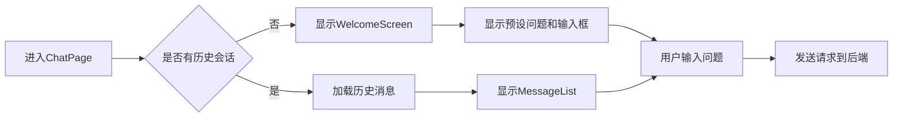
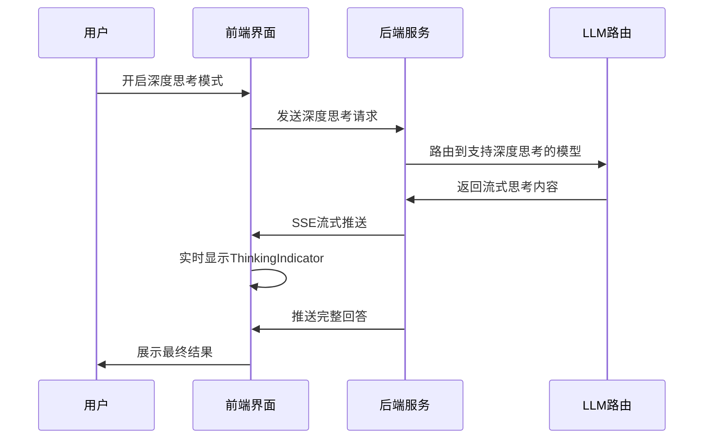
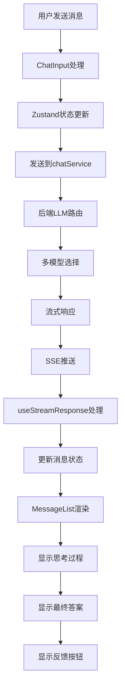

智能对话界面是 Ragent 系统的核心用户交互入口，集成了 RAG 检索、深度思考、多模型路由等先进技术。本指南将详细介绍对话界面的使用方法、功能特性及最佳实践。

## 界面架构概览

对话界面采用现代化 React 架构，结合 Zustand 状态管理和 SSE 流式响应，实现高性能、实时的对话体验。

### 整体架构



### 组件职责划分

| 组件 | 职责 | 文件位置 |
|------|------|----------|
| ChatPage | 页面级状态管理，会话切换 | [ChatPage.tsx](frontend/src/pages/ChatPage.tsx#L1-L103) |
| WelcomeScreen | 首次使用时的引导界面 | [WelcomeScreen.tsx](frontend/src/components/chat/WelcomeScreen.tsx#L1-L314) |
| MessageList | 消息列表展示，虚拟滚动优化 | [MessageList.tsx](frontend/src/components/chat/MessageList.tsx#L1-L212) |
| ChatInput | 输入框功能，深度思考切换 | [ChatInput.tsx](frontend/src/components/chat/ChatInput.tsx#L1-L161) |
| MessageItem | 单条消息渲染与交互 | [MessageItem.tsx](frontend/src/components/chat/MessageItem.tsx#L1-L106) |
| SessionList | 会话列表管理 | [SessionList.tsx](frontend/src/components/session/SessionList.tsx#L1-L58) |

## 核心功能介绍

### 1. 多模态对话体验

对话界面支持多种交互模式，满足不同场景需求：

#### 深度思考模式
- **功能描述**：开启后 AI 将进行更深入的分析推理
- **界面标识**：蓝色"深度思考"按钮，带脉冲动画
- **最佳适用**：复杂问题分析、方案规划、学术探讨
- **状态管理**：通过 `chatStore.deepThinkingEnabled` 控制

#### 智能预设问题
- **动态加载**：系统自动从知识库加载热门问题
- **分类展示**：内容总结、任务拆解、灵感扩展等类别
- **快捷操作**：点击预设即可直接开始对话
- **数据源**：`sampleQuestionService` 提供

### 2. 会话管理系统

#### 会话状态管理
```typescript
interface ChatState {
  sessions: Session[];           // 所有会话列表
  currentSessionId: string | null; // 当前选中会话ID
  messages: Message[];          // 当前会话消息
  isLoading: boolean;           // 加载状态
  isStreaming: boolean;         // 流式响应状态
  deepThinkingEnabled: boolean; // 深度思考开关
}
```

#### 会话操作功能
- **新建会话**：自动生成空白会话或当前状态快照
- **切换会话**：保持上下文，实时切换历史对话
- **重命名会话**：AI自动生成标题或手动编辑
- **删除会话**：支持单独删除或批量操作

### 3. 流式响应体验

#### SSE 流式处理
```typescript
interface StreamHandlers {
  onMeta?: (payload: StreamMetaPayload) => void;     // 元数据回调
  onMessage?: (payload: MessageDeltaPayload) => void; // 消息片段回调
  onThinking?: (payload: MessageDeltaPayload) => void; // 思考过程回调
  onFinish?: (payload: CompletionPayload) => void;   // 完成回调
}
```

#### 响应状态管理
- **首包超时**：60秒超时机制，避免长时间等待
- **中断恢复**：支持随时取消当前生成
- **错误处理**：自动降级到备用模型
- **进度显示**：实时显示生成状态和用时

## 使用指南

### 1. 开始第一次对话

1. **进入对话页面**：系统默认显示欢迎界面
2. **选择对话方式**：
   - 直接输入问题
   - 点击预设问题快速开始
   - 使用推荐问法模板

3. **界面引导**：
   - 输入框自动聚焦
   - 支持Enter发送，Shift+Enter换行
   - 实时字符计数和高度自适应



### 2. 深度思考模式使用

#### 开启深度思考
1. 点击"深度思考"按钮激活模式
2. 输入框提示文字变为"输入需要深度分析的问题..."
3. 按钮变为蓝色激活状态，显示脉冲动画

#### 思考过程展示
- **实时显示**：AI的推理过程以蓝色边框展示
- **可折叠**：支持展开/收起详细思考内容
- **时长统计**：显示思考持续时间和成果



### 3. 会话管理操作

#### 会话切换
```typescript
// 选择现有会话
selectSession(sessionId: string): Promise<void>

// 创建新会话  
createSession(): Promise<string>

// 删除会话
deleteSession(sessionId: string): Promise<void>
```

#### 会话列表管理
- **实时更新**：会话按最后活跃时间排序
- **视觉反馈**：当前会话高亮显示
- **快捷操作**：支持直接导航到指定会话

### 4. 消息交互功能

#### 消息展示
- **用户消息**：灰色背景，左对齐
- **AI回复**：白色背景，带头像和时间戳
- **思考过程**：蓝色边框展开式展示
- **状态标识**：生成中、完成、错误等状态

#### 反馈机制
- **点赞/点踩**：对AI回复进行质量评价
- **复制功能**：一键复制消息内容
- **历史记录**：自动保存所有对话记录



## 技术实现亮点

### 1. 性能优化

#### 虚拟滚动实现
```typescript
<Virtuoso
  ref={virtuosoRef}
  data={messages}
  initialTopMostItemIndex={initialTopMostItemIndex}
  followOutput={(atBottom) => {
    if (isStreaming) return false;
    return atBottom ? "auto" : false;
  }}
/>
```

**优势**：
- 支持上万条消息的流畅滚动
- 自动跟随最新消息
- 智能滚动控制，避免频繁跳动

#### 状态管理优化
- **Zustand 轻量级状态管理**：比 Redux 更简洁
- **状态更新合并**：避免批量更新导致的重渲染
- **记忆复用**：会话切换保持组件状态

### 2. 流式响应体验

#### SSE 连接管理
```typescript
export function createStreamResponse(options: StreamOptions, handlers: StreamHandlers) {
  const controller = new AbortController();
  const mergedOptions = {
    ...options,
    signal: options.signal ?? controller.signal
  };
  
  return {
    start: () => streamWithRetry(mergedOptions, handlers),
    cancel: () => controller.abort()
  };
}
```

#### 错误处理与重试
- **自动重试机制**：默认2次重试，指数退避
- **模型降级策略**：主模型失败自动切换备用
- **首包检测**：60秒内无首包自动切换模型

### 3. 多模型智能路由

#### 后端路由架构
```typescript
public class RoutingLLMService implements LLMService {
    // 智能选择最佳模型
    List<ModelTarget> targets = selector.selectChatCandidates(request.getThinking());
    
    // 逐一尝试模型
    for (ModelTarget target : targets) {
        // 流式请求首包检测
        FirstPacketAwaiter.Result result = awaitFirstPacket(awaiter, handle, callback);
        
        // 成功则返回，失败继续尝试下一个
        if (result.isSuccess()) {
            return handle;
        }
    }
}
```

**路由策略**：
- **意图优先级**：根据问题意图选择合适模型
- **健康检查**：实时监控模型健康状态
- **成本优化**：不同场景选择性价比最优模型

## 最佳实践建议

### 1. 问题优化技巧

#### 有效提问策略
- **明确具体**：避免模糊、开放性问题
- **提供背景**：必要的上下文信息
- **分步询问**：复杂问题拆分为多个小问题

#### 深度思考适用场景
```markdown
**推荐开启场景：**
- 复杂问题分析（"分析某技术方案的优缺点"）
- 创意生成（"设计一个新的系统架构"）
- 决策支持（"评估多个技术方案的风险"）

**不建议开启场景：**
- 事实查询（"什么是Redis"）
- 简单总结（"总结这段文字要点"）
```

### 2. 会话管理建议

#### 命名规范
- AI自动命名：基于首条消息关键词
- 手动命名：按项目/时间/主题分类
- 定期归档：定期清理过期会话

#### 效率提升技巧
- **利用预设问题**：快速启动常见场景对话
- **批量操作**：连续相关问题一起询问
- **会话复用**：相关主题在同一会话中继续

### 3. 反馈机制使用

#### 有效反馈示例
```typescript
// 质量反馈
submitFeedback(messageId, "like/dislike")

// 内容反馈建议：
// 点赞场景：回答准确、逻辑清晰、信息完整
// 点踩场景：回答错误、信息过时、理解偏差
```

#### 反馈价值
- **提升模型质量**：训练数据优化
- **改进路由策略**：选择最适合的模型
- **用户体验优化**：识别常用场景需求

## 故障排除指南

### 常见问题与解决方案

| 问题 | 可能原因 | 解决方案 |
|------|----------|----------|
| 消息发送无响应 | 网络连接问题 | 检查网络连接，刷新页面重试 |
| 流式响应中断 | 模型调用超时 | 切换模型或重试发送 |
| 会话加载缓慢 | 历史消息过多 | 清理历史会话或分页加载 |
| 深度思考不生效 | 模型不支持 | 检查后端配置，选择合适的模型 |

### 性能优化建议
1. **定期清理会话**：保持界面响应速度
2. **合理使用深度思考**：避免长时间占用模型资源
3. **批量处理问题**：减少频繁的网络请求

---

通过本指南，您可以全面了解 Ragent 智能对话界面的功能特性和使用方法。建议结合 [快速开始指南](2-kuai-su-kai-shi-zhi-nan) 和 [知识库管理](7-zhi-shi-ku-guan-li-ru-men) 进一步探索系统的其他能力。

## 相关资源

- [快速开始指南](2-kuai-su-kai-shi-zhi-nan)
- [知识库管理入门](7-zhi-shi-ku-guan-li-ru-men)
- [文档上传与处理](8-wen-dang-shang-chuan-yu-chu-li)
- [多通道检索架构设计](12-duo-tong-dao-jian-suo-jia-gou-she-ji)