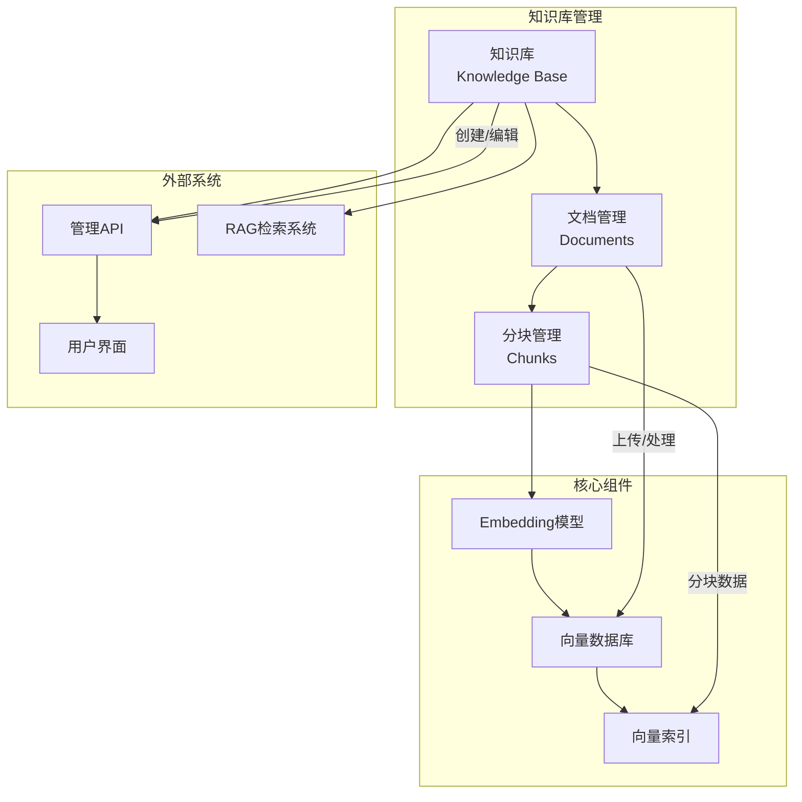
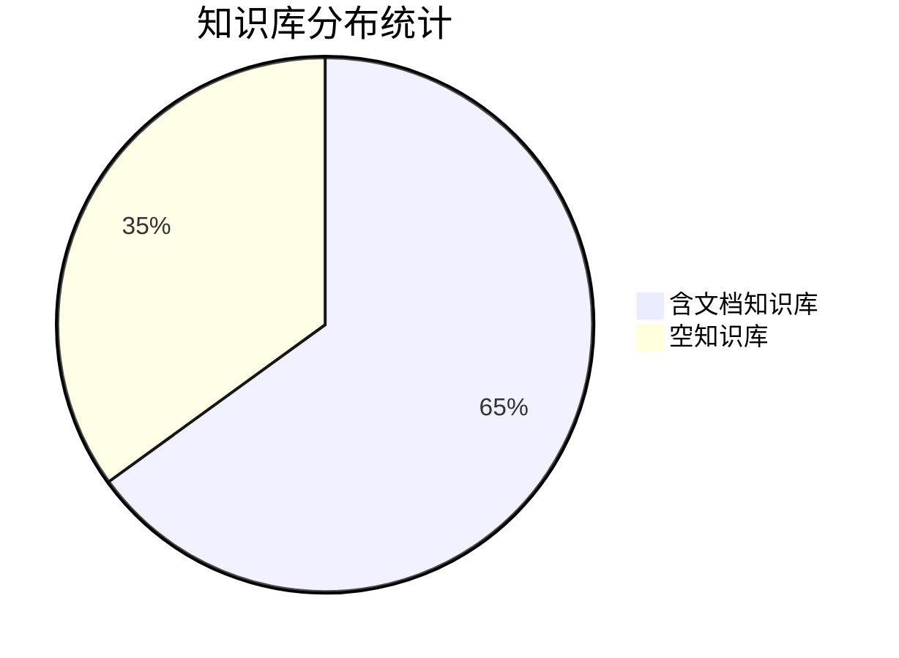
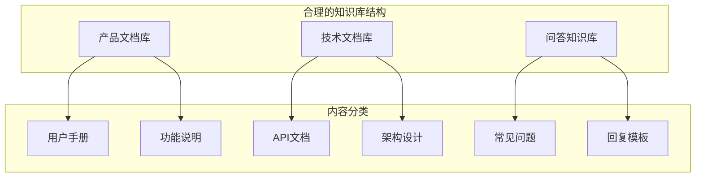

知识库管理是RAG系统的核心功能，本文将帮助您快速理解和使用 ragent 的知识库管理功能，包括知识库创建、文档上传、分块配置等基础操作。

## 什么是知识库

知识库是 RAG 系统中的数据存储单元，用于存放和管理可被检索的文档知识。每个知识库具有以下核心特性：

- **独立的数据空间**：每个知识库拥有独立的文档集合和向量索引
- **Embedding 模型配置**：可指定特定的向量化模型进行处理
- **Collection 管理**：支持自定义 Collection 名称用于向量数据库管理
- **统计信息**：提供文档数量、创建者等维度统计

### 知识库架构概览

## 快速开始指南

### 1. 创建知识库

**操作步骤**：
1. 进入管理后台的"知识库管理"页面
2. 点击"新建知识库"按钮
3. 填写基本信息：

| 配置项 | 说明 | 示例 | 必填 |
|--------|------|------|------|
| 知识库名称 | 易于识别的名称 | 产品文档库 | ✓ |
| Embedding模型 | 用于向量化文档的模型 | bge-base-zh-v1.5 | ✓ |
| Collection名称 | 向量数据库中的标识 | productdocs | ✓ |

**参数说明**：
- **知识库名称**：建议使用有意义的名称，长度不超过50个字符
- **Embedding模型**：系统会自动加载可用的模型选项，建议选择与内容语言匹配的模型
- **Collection名称**：只能包含小写字母和数字，用于向量数据库的命名

### 2. 知识库管理功能

创建知识库后，可以进行以下管理操作：

#### 基础操作

| 操作 | 功能描述 | 安全说明 |
|------|----------|----------|
| **查看列表** | 浏览所有知识库及其状态 | 支持搜索过滤 |
| **编辑重命名** | 修改知识库名称 | 需要唯一性验证 |
| **删除** | 删除知识库及所有数据 | **不可恢复操作** |
| **查看统计** | 实时统计信息更新 | 支持多维度数据 |

#### 状态指标

系统提供了以下关键统计指标：

| 指标 | 说明 | 计算方式 |
|------|------|----------|
| **知识库总数** | 所有创建的知识库数量 | 系统计数 |
| **文档总数** | 所有知识库的文档数量 | 文档计数 |
| **含文档知识库** | 有文档的知识库数量 | 文档数量 > 0 |
| **创建用户数** | 参与创建的用户数量 | 去重计算 |

### 3. 文档管理

每个知识库支持上传和管理多种文档：

#### 支持的文档类型

| 文档类型 | 来源方式 | 处理模式 | 特点 |
|----------|----------|----------|------|
| 本地文件 | 文件上传 | 直接分块/流水线 | 支持各种格式 |
| 远程URL | URL地址 | 直接分块/流水线 | 自动获取内容 |

#### 文档处理配置

| 配置项 | 选项说明 | 推荐使用场景 |
|--------|----------|--------------|
| **处理模式** | 直接分块/数据通道 | 简单文档用直接分块，复杂处理用数据通道 |
| **分块策略** | 固定大小/语义感知 | 代码用固定大小，Markdown用语义感知 |
| **定时同步** | 支持Cron表达式 | URL源文档的定期更新 |

### 4. 分块管理

文档上传后会自动进行分块处理：

#### 分块策略对比

| 策略类型 | 优势 | 适用场景 | 局限性 |
|----------|------|----------|--------|
| **固定大小** | 简单可控，性能稳定 | 纯文本、代码文档 | 可能截断语义 |
| **语义感知** | 保持语义完整性 | Markdown、结构化文档 | 处理稍慢 |

#### 分块管理功能

- **查看分块**：浏览所有分块内容及元信息
- **启用/禁用**：控制分块的检索可用性
- **编辑内容**：手动修改分块文本
- **批量操作**：批量启用或禁用分块

## 最佳实践指南

### 1. 知识库设计建议

**建议**：
- 按业务领域或文档类型划分知识库
- 避免将完全无关的内容放入同一知识库
- 定期清理不再使用的文档

### 2. 文档处理优化

#### 分块配置建议

| 文档类型 | 推荐分块策略 | 字符数设置 | 重叠率 |
|----------|--------------|------------|--------|
| **Markdown** | 语义感知 | 1000-1500 | 10% |
| **PDF文档** | 语义感知 | 800-1200 | 15% |
| **纯文本** | 固定大小 | 1000-2000 | 20% |
| **代码文件** | 固定大小 | 500-1000 | 0% |

### 3. 嵌入模型选择

| 使用场景 | 推荐模型 | 语言支持 | 特点 |
|----------|----------|----------|------|
| **中文内容** | bge-base-zh | 中文优秀 | 开源免费，效果稳定 |
| **英文内容** | bge-base-en | 英文优秀 | 适合纯英文场景 |
| **多语言混合** | text-embedding-ada-002 | 多语言均衡 | 商业模型，效果好 |

## 常见问题解答

### Q: 知识库删除后能否恢复？
**A**: 知识库删除后**无法恢复**，请谨慎操作。建议删除前备份重要文档。

### Q: 如何优化检索效果？
**A**: 以下措施可以提高检索质量：
1. 合理设置分块大小和策略
2. 选择合适的Embedding模型
3. 定期更新和清理过时文档
4. 启用语义感知分块策略

### Q: 文档处理很慢怎么办？
**A**: 处理速度优化建议：
1. 减单批次文档数量
2. 使用直接分块模式
3. 检查网络带宽和服务器性能
4. 优化文档分块参数设置

### Q: 如何监控文档处理状态？
**A**: 系统提供以下监控功能：
1. 文档状态实时显示（pending/running/failed/success）
2. 分块日志查看，包含详细处理时间
3. 错误信息展示和诊断
4. 处理进度可视化

## 下一步学习

完成本入门指南后，您可以继续学习以下进阶主题：

1. **文档上传与处理**：深入了解文档上传和处理的详细流程
   - [文档上传与处理](8-wen-dang-shang-chuan-yu-chu-li)

2. **全链路检索与生成流程**：了解RAG系统的完整工作原理
   - [全链路检索与生成流程](11-quan-lian-lu-jian-suo-yu-sheng-cheng-liu-cheng)

3. **多通道检索架构设计**：掌握更复杂的检索架构
   - [多通道检索架构设计](12-duo-tong-dao-jian-suo-jia-gou-she-ji)

4. **系统配置管理**：学习系统的高级配置选项
   - [系统配置管理](29-xi-tong-pei-zhi-guan-li)