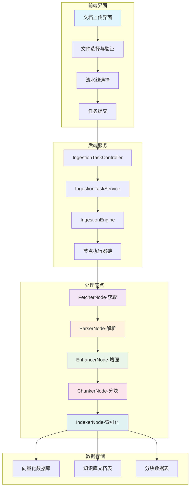
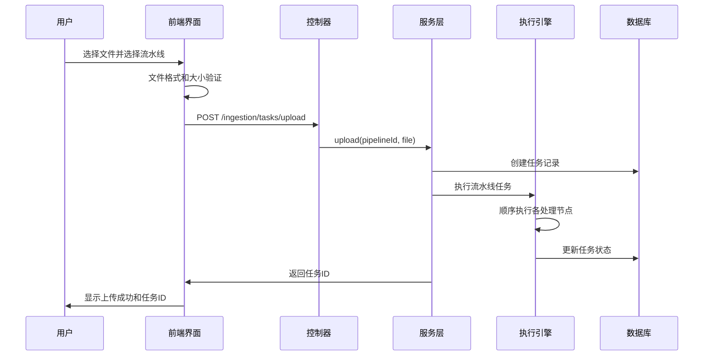
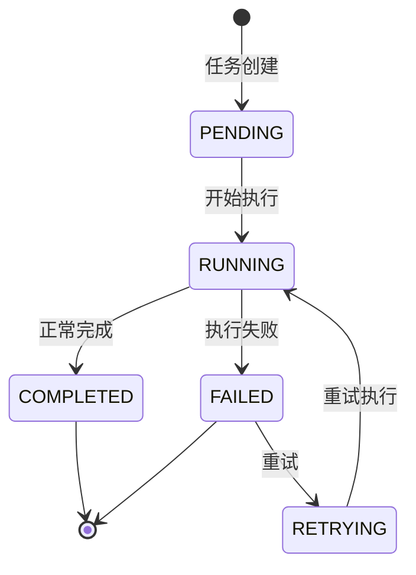

本文档详细介绍 RAGent 系统中的文档上传与处理功能，涵盖了从文件上传到向量化的完整流程，适合初学者理解和实践。

## 🏗️ 系统架构概览

文档上传与处理系统采用**流水线式处理架构**，支持多种文件格式和来源类型，通过可配置的节点链实现灵活的文档处理流程。

### 核心架构图



### 主要组件

| 组件 | 职责 | 技术栈 |
|------|------|--------|
| **前端界面** | 文件选择、验证、UI交互 | React, TypeScript, Ant Design |
| **任务控制器** | HTTP API处理、参数验证 | Spring Boot, REST API |
| **任务服务** | 业务逻辑协调、事务管理 | Spring Boot, MyBatis-Plus |
| **执行引擎** | 流水线编排、节点调度 | 自定义引擎 |
| **处理节点** | 具体文档处理逻辑 | 策略模式 + 模板方法 |
| **数据存储** | 向量数据、元数据持久化 | PostgreSQL + Milvus/PG-Vector |

## 📤 文档上传流程

### 完整上传流程



### 支持的文件来源类型

| 来源类型 | 说明 | 适用场景 |
|----------|------|----------|
| **Local File** | 本地文件上传 | 用户本地文档 |
| **Remote URL** | HTTP/HTTPS链接 | 网页文档 |
| **Feishu** | 飞书文档链接 | 企业协作文档 |
| **S3** | Amazon S3存储 | 云端存储文档 |

## 🔧 流水线配置详解

### 节点类型说明

| 节点类型 | 功能 | 配置参数 | 必需 |
|----------|------|----------|------|
| **FETCHER** | 文档获取 | 超时、重试策略 | ✅ |
| **PARSER** | 文档解析 | MIME类型规则 | ✅ |
| **ENHANCER** | AI内容增强 | 模型ID、提示词 | ❌ |
| **CHUNKER** | 文档分块 | 策略、大小、重叠 | ✅ |
| **INDEXER** | 向量索引 | 向量模型、元数据 | ✅ |

### 完整流水线配置示例

```json
{
  "name": "PDF处理流水线",
  "description": "PDF文档解析、增强、分块、向量化完整流水线",
  "nodes": [
    {
      "nodeId": "fetcher-1",
      "nodeType": "fetcher",
      "nextNodeId": "parser-1"
    },
    {
      "nodeId": "parser-1", 
      "nodeType": "parser",
      "settings": {
        "rules": [{"mimeType": "PDF"}]
      },
      "nextNodeId": "enhancer-1"
    },
    {
      "nodeId": "enhancer-1",
      "nodeType": "enhancer", 
      "settings": {
        "modelId": "qwen-plus",
        "tasks": [
          {
            "type": "context_enhance",
            "systemPrompt": "# 角色\n你是文本格式修复器，专门修复PDF解析后的格式...",
            "userPromptTemplate": "请整理以下内容：\n\n{{text}}"
          }
        ]
      },
      "nextNodeId": "chunker-1"
    },
    {
      "nodeId": "chunker-1",
      "nodeType": "chunker",
      "settings": {
        "strategy": "fixed_size",
        "chunkSize": 512,
        "overlapSize": 128
      },
      "nextNodeId": "indexer-1"
    },
    {
      "nodeId": "indexer-1",
      "nodeType": "indexer",
      "settings": {
        "embeddingModel": "qwen-emb-8b",
        "includeEnhancedContent": true,
        "metadataFields": ["category", "department"]
      }
    }
  ]
}
```

## 🎨 前端实现详解

### 文件上传组件

```tsx
interface UploadDialogProps {
  open: boolean;
  pipelineOptions: IngestionPipeline[];
  onOpenChange: (open: boolean) => void;
  onSubmit: (pipelineId: string, file: File) => Promise<void>;
}

function UploadDialog({ open, pipelineOptions, onOpenChange, onSubmit }: UploadDialogProps) {
  const [pipelineId, setPipelineId] = useState(pipelineOptions[0]?.id || "");
  const [file, setFile] = useState<File | null>(null);
  const [saving, setSaving] = useState(false);
  
  // 文件大小验证
  const maxFileSize = 50 * 1024 * 1024; // 50MB
  
  const handleSubmit = async () => {
    if (!pipelineId) {
      toast.error("请选择流水线");
      return;
    }
    if (!file) {
      toast.error("请选择文件");
      return;
    }
    if (file.size > maxFileSize) {
      const sizeMB = Math.floor(maxFileSize / 1024 / 1024);
      toast.error(`上传文件大小超过限制，最大允许 ${sizeMB}MB`);
      return;
    }
    
    setSaving(true);
    try {
      await onSubmit(pipelineId, file);
      toast.success("上传成功");
      onOpenChange(false);
    } catch (error) {
      toast.error(getErrorMessage(error, "上传失败"));
    } finally {
      setSaving(false);
    }
  };
  
  return (
    <Dialog open={open} onOpenChange={onOpenChange}>
      <DialogContent>
        <DialogHeader>
          <DialogTitle>上传文件并进入通道</DialogTitle>
        </DialogHeader>
        <div className="space-y-4">
          <Select value={pipelineId} onValueChange={setPipelineId}>
            <SelectTrigger>
              <SelectValue placeholder="选择流水线" />
            </SelectTrigger>
            <SelectContent>
              {pipelineOptions.map((pipeline) => (
                <SelectItem key={pipeline.id} value={pipeline.id}>
                  {pipeline.name}
                </SelectItem>
              ))}
            </SelectContent>
          </Select>
          
          <Input
            type="file"
            onChange={(event) => setFile(event.target.files?.[0] || null)}
          />
        </div>
        <DialogFooter>
          <Button variant="outline" onClick={() => onOpenChange(false)}>
            取消
          </Button>
          <Button onClick={handleSubmit} disabled={saving}>
            {saving ? "上传中..." : "上传"}
          </Button>
        </DialogFooter>
      </DialogContent>
    </Dialog>
  );
}
```

### 文件验证逻辑

| 验证类型 | 验证规则 | 错误提示 |
|----------|----------|----------|
| **文件类型** | 允许: PDF, DOCX, MD, TXT | "不支持的文件类型" |
| **文件大小** | 最大: 50MB | "文件大小超过限制" |
| **文件完整性** | 文件可读性检查 | "文件已损坏或无法读取" |
| **文件名** | 长度限制100字符 | "文件名过长" |

## 🖥️ 后端API参考

### 核心API接口

#### 1. 创建流水线
```http
POST /api/ragent/ingestion/pipelines
Content-Type: application/json

{
  "name": "PDF处理流水线",
  "description": "文档处理流程",
  "nodes": [/* 节点配置数组 */]
}
```

#### 2. 文件上传并创建任务
```http
POST /api/ragent/ingestion/tasks/upload
Content-Type: multipart/form-data

pipelineId: 1
file: @document.pdf
```

#### 3. 创建处理任务
```http
POST /api/ragent/ingestion/tasks
Content-Type: application/json

{
  "pipelineId": "1",
  "source": {
    "type": "file",
    "location": "/path/to/file",
    "fileName": "document.pdf",
    "credentials": {}
  },
  "metadata": {
    "category": "manual",
    "department": "IT"
  }
}
```

#### 4. 查询任务状态
```http
GET /api/ragent/ingestion/tasks/{taskId}
```

#### 5. 查询任务节点日志
```http
GET /api/ragent/ingestion/tasks/{taskId}/nodes
```

## 🔄 任务执行状态监控

### 任务生命周期



### 节点执行状态

| 状态 | 描述 | 颜色标识 |
|------|------|----------|
| **PENDING** | 等待执行 | 灰色 |
| **RUNNING** | 执行中 | 蓝色 |
| **SUCCESS** | 执行成功 | 绿色 |
| **FAILED** | 执行失败 | 红色 |

## ⚙️ 高级配置选项

### 分块策略配置

| 策略类型 | 适用场景 | 参数说明 |
|----------|----------|----------|
| **fixed_size** | 规则文档 | `chunkSize`, `overlapSize` |
| **structure_aware** | 结构化文档 | `separator`, `maxChunkSize` |

### AI增强配置

```json
{
  "modelId": "qwen-plus",
  "tasks": [
    {
      "type": "context_enhance",
      "systemPrompt": "# 角色\n你是文本增强专家...",
      "userPromptTemplate": "请增强以下内容：\n\n{{text}}"
    },
    {
      "type": "keywords", 
      "systemPrompt": "# 角色\n你是关键词提取专家...",
      "userPromptTemplate": "请提取关键词：\n\n{{text}}"
    }
  ]
}
```

### 元数据配置

```json
{
  "metadataFields": [
    "category",
    "department", 
    "author",
    "created_at",
    "tags"
  ],
  "includeEnhancedContent": true
}
```

## 🔧 常见问题与最佳实践

### 常见错误及解决方案

| 错误类型 | 原因分析 | 解决方案 |
|----------|----------|----------|
| **文件格式不支持** | MIME类型不匹配 | 检查文件格式或扩展PARSER规则 |
| **分块失败** | 文档结构复杂 | 调整分块策略或启用结构化分块 |
| **AI增强超时** | 模型响应慢 | 优化提示词或切换到轻量模型 |
| **向量化失败** | 模型不可用 | 检查模型服务状态或切换模型 |

### 性能优化建议

1. **批量处理**: 对于大批量文档，使用任务队列异步处理
2. **缓存机制**: 对相同类型文档启用解析结果缓存
3. **并发控制**: 合理设置并发处理数量，避免系统过载
4. **资源监控**: 监控内存和CPU使用情况

### 安全注意事项

1. **文件大小限制**: 设置合理的文件大小上限
2. **病毒扫描**: 重要文档可集成病毒扫描功能
3. **访问控制**: 对敏感文档设置访问权限
4. **数据备份**: 定期备份处理后的数据

## 📚 相关文档

- [快速开始指南](2-kuai-su-kai-shi-zhi-nan)
- [知识库管理入门](7-zhi-shi-ku-guan-li-ru-men) 
- [全链路检索与生成流程](11-quan-lian-lu-jian-suo-yu-sheng-cheng-liu-cheng)
- [API 接口规范](38-api-jie-kou-gui-fan)

## 🔄 下一步

完成文档上传与处理的学习后，建议按照以下顺序继续深入学习：

1. **[知识库管理入门](7-zhi-shi-ku-guan-li-ru-men)** - 了解如何管理处理后的文档
2. **[全链路检索与生成流程](11-quan-lian-lu-jian-suo-yu-sheng-cheng-liu-cheng)** - 理解RAG核心流程
3. **[多通道检索架构设计](12-duo-tong-dao-jian-suo-jia-gou-she-ji)** - 掌握高级检索技术