Ragent 是一个基于 Spring Boot 的企业级 RAG（检索增强生成）智能系统，采用模块化分层架构设计，集成了向量数据库、多模型路由、文档处理流水线等核心组件，为用户提供智能问答、知识库管理、会话记忆等功能。

## 系统总体架构

### 架构概览

Ragent 系统采用分层架构设计，从上至下分为客户端层、应用编排层、AI 基础设施层和存储层：

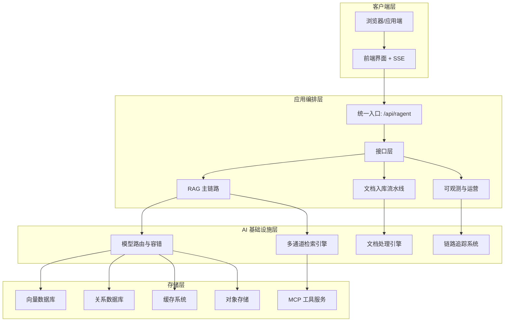

### 核心特性

| 特性 | 描述 | 技术实现 |
|------|------|----------|
| **多通道检索** | 支持向量检索、意图定向检索等多种检索策略 | 可扩展的 SearchChannel 接口设计 |
| **模型路由** | 多模型智能路由与故障切换机制 | Provider 优先级探活机制 |
| **文档流水线** | 完整的文档摄取、处理、索引流程 | 节点式流水线引擎 |
| **会话记忆** | 智能会话管理与上下文维护 | 对话摘要+历史消息机制 |
| **工具集成** | MCP 工具服务支持 | MCP 协议实现 |

## 模块架构

### 模块划分

Ragent 系统采用多模块 Maven 项目结构，主要分为以下核心模块：

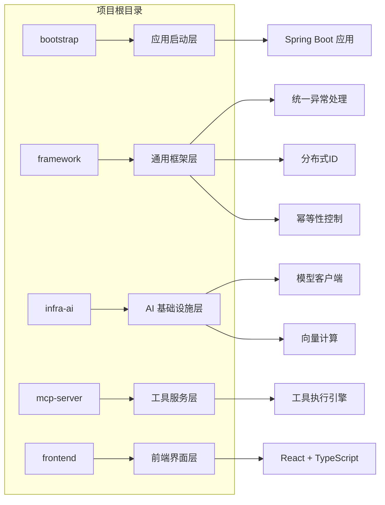

#### 1. Bootstrap 模块（应用启动层）

作为应用的启动入口，负责：
- Spring Boot 应用的启动与配置
- 核心业务模块的组织与协调
- 外部依赖的初始化

主要组件：
- `RagentApplication.java` - 主启动类
- `rag/` - RAG 核心业务逻辑
- `ingestion/` - 文档摄取流水线
- `knowledge/` - 知识库管理
- `admin/` - 管理后台功能

#### 2. Framework 模块（通用框架层）

提供系统通用的基础设施组件：

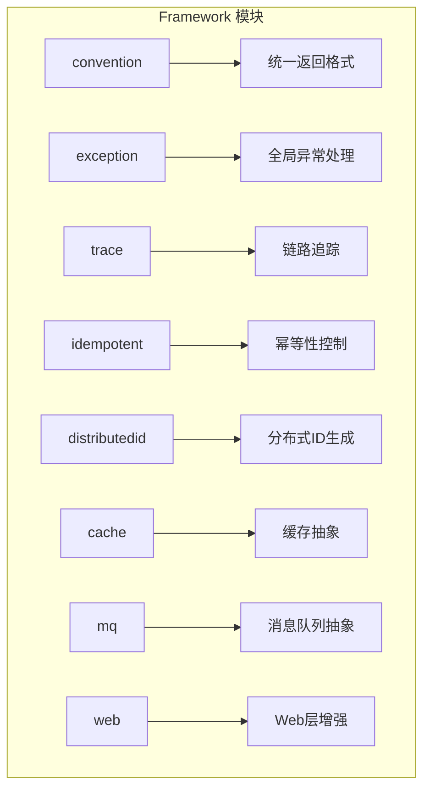

#### 3. Infra-AI 模块（AI 基础设施层）

封装 AI 相关的基础能力：

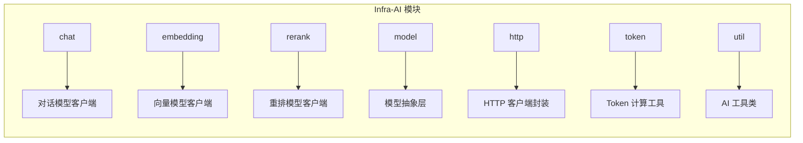

#### 4. MCP-Server 模块（工具服务层）

实现 MCP (Model Context Protocol) 工具服务：

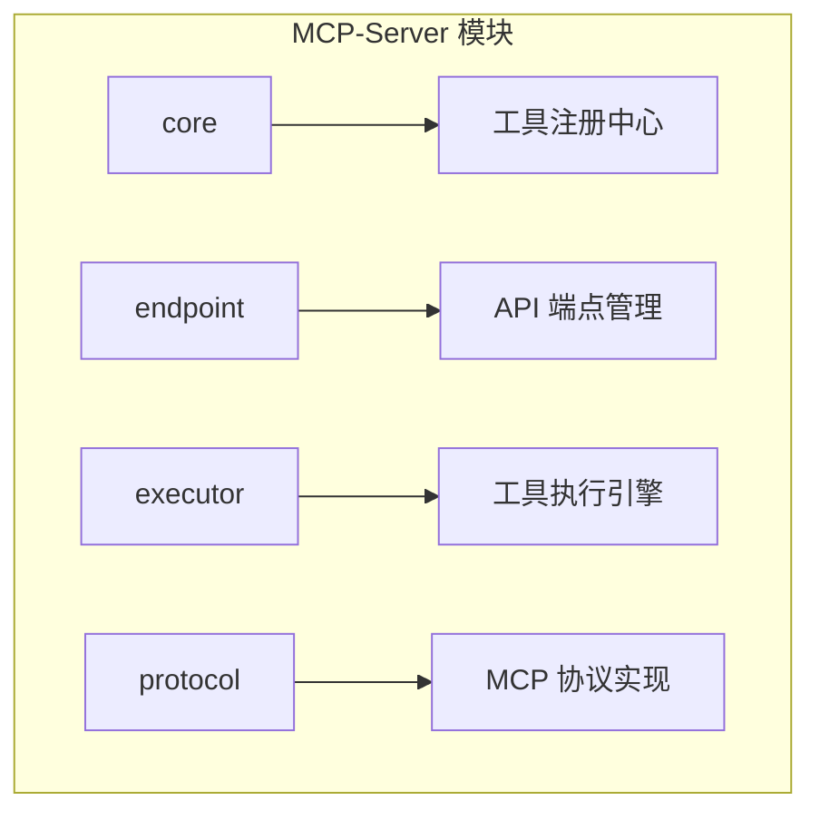

### 数据架构

#### 数据库设计

系统采用多数据库架构设计：

| 数据库 | 用途 | 技术选型 |
|--------|------|----------|
| **关系数据库** | 用户、会话、消息等结构化数据 | PostgreSQL + pgvector |
| **向量数据库** | 向量存储与相似性检索 | Milvus / pgvector |
| **缓存系统** | 会话状态、临时数据 | Redis |
| **对象存储** | 文件存储 | MinIO / S3 兼容 |

#### 核心数据表

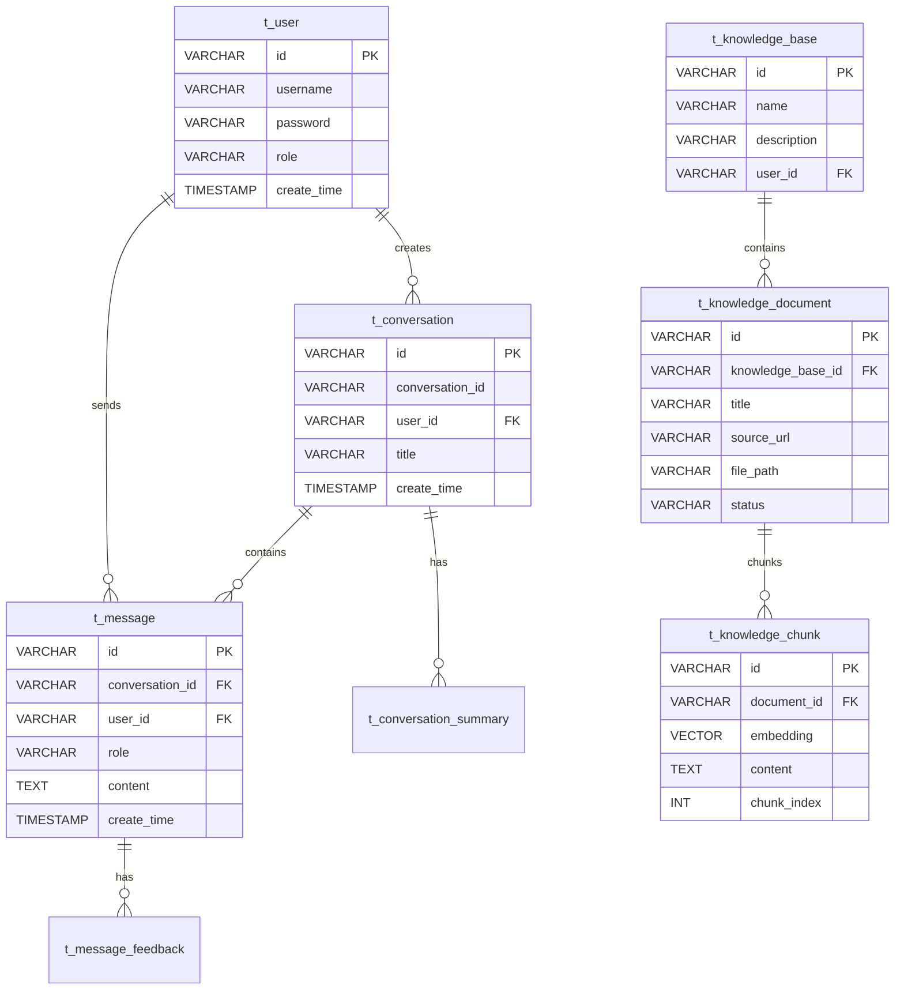

## 核心业务流程

### RAG 主链路流程

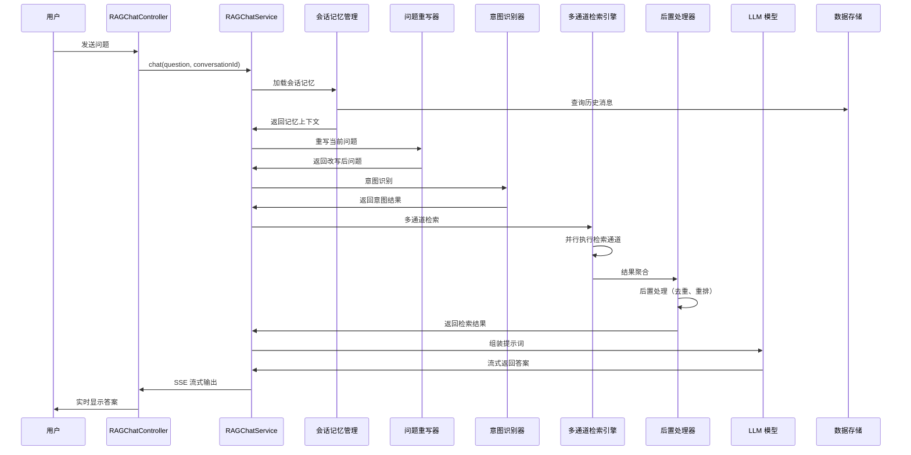

#### 处理步骤详解

1. **会话记忆加载**
   - 从数据库加载最近 N 条对话历史
   - 生成对话摘要（超过指定轮次时）
   - 将上下文信息补入当前问题

2. **问题重写与优化**
   - 基于历史对话重写用户问题
   - 消除歧义，明确意图
   - 优化查询表达

3. **意图识别与引导**
   - 判断用户问题的真实意图
   - 提供可能的选项引导用户
   - 确定检索策略

4. **多通道并行检索**
   - 向量全局检索：在所有知识库中搜索相关内容
   - 意图定向检索：基于意图在特定知识库中搜索
   - 工具检索：调用 MCP 工具获取信息

5. **结果后处理**
   - 去重处理：移除重复的检索结果
   - 质量过滤：基于阈值过滤低质量结果
   - 重排序：使用 Rerank 模型优化结果排序

6. **答案生成**
   - 组装检索结果为提示词上下文
   - 路由到合适的对话模型
   - 流式生成答案

### 文档入库流水线

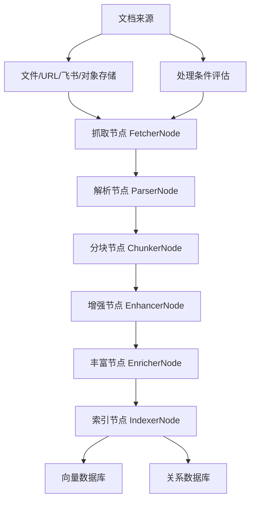

#### 流水线节点

| 节点名称 | 功能描述 | 输入 | 输出 |
|----------|----------|------|------|
| **FetcherNode** | 文档抓取与下载 | 来源URL/文件 | 原始文档内容 |
| **ParserNode** | 文档解析与清理 | 原始文档 | 结构化文本 |
| **ChunkerNode** | 文档分块处理 | 结构化文本 | 文档块集合 |
| **EnhancerNode** | 内容增强与优化 | 文档块 | 增强后内容 |
| **EnricherNode** | 元数据丰富 | 文档块 + 增强内容 | 完整块数据 |
| **IndexerNode** | 索引构建与存储 | 完整块数据 | 向量索引 |

## 技术架构

### 技术栈选型

| 层级 | 组件 | 技术选型 | 用途 |
|------|------|----------|------|
| **应用层** | Spring Boot | 3.5.7 | 应用框架 |
| **Web层** | Spring MVC | - | RESTful API |
| **数据层** | MyBatis Plus | 3.5.14 | ORM 框架 |
| **数据库** | PostgreSQL | - | 主数据库 |
| **向量存储** | pgvector/Milvus | 2.6.6 | 向量检索 |
| **缓存** | Redis | - | 缓存存储 |
| **消息队列** | RocketMQ | 2.3.5 | 异步处理 |
| **前端** | React + TypeScript | 18+ | 前端框架 |
| **构建工具** | Maven | - | 项目构建 |

### 核心依赖

```yaml
# 关键技术依赖
spring-boot: 3.5.7
mybatis-plus: 3.5.14
milvus-sdk: 2.6.6
tika: 3.2.3
hutool: 5.8.37
sa-token: 1.43.0
redisson: 4.0.0
rocketmq: 2.3.5
okhttp: 4.12.0
```

### 配置架构

系统采用分层配置管理：

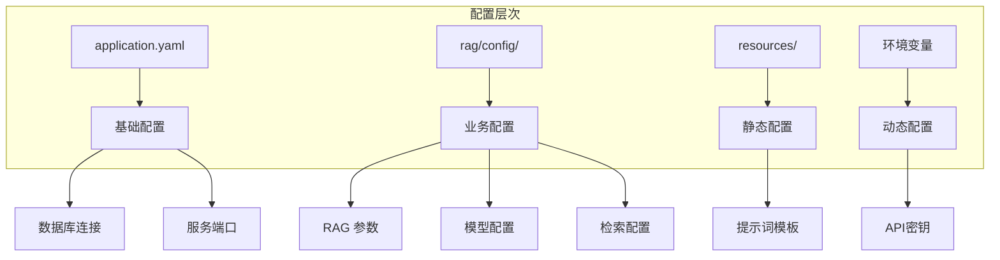

## 可观测性与运维

### 链路追踪系统

系统实现了完整的链路追踪机制：

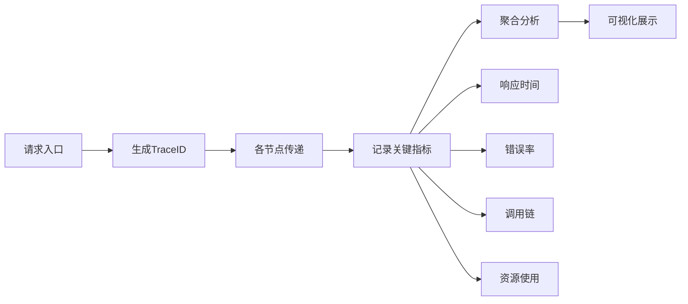

### 监控指标

| 指标类型 | 监控内容 | 告警规则 |
|----------|----------|----------|
| **性能指标** | 响应时间、QPS | > 2s 告警 |
| **错误指标** | 错误率、异常数 | > 5% 告警 |
| **资源指标** | CPU、内存使用 | > 80% 告警 |
| **业务指标** | 检索准确率、用户满意度 | < 90% 告警 |

## 扩展设计

### 插件化扩展机制

系统支持多种扩展方式：

1. **检索通道扩展**
   - 实现 `SearchChannel` 接口
   - 注册为 Spring Bean
   - 配置启用条件

2. **后置处理器扩展**
   - 实现 `SearchResultPostProcessor` 接口
   - 定义处理优先级
   - 配置处理条件

3. **文档解析扩展**
   - 实现 `DocumentParser` 接口
   - 注册解析器类型
   - 配置 MIME 类型映射

4. **AI 模型扩展**
   - 实现 `ModelClient` 接口
   - 配置模型参数
   - 设置路由策略

### 部署架构

系统支持多种部署模式：

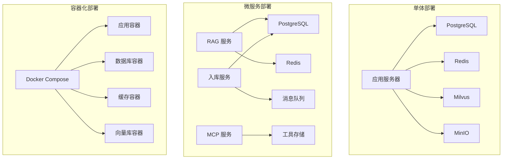

## 总结

Ragent 系统通过模块化的分层架构设计，实现了高性能、可扩展的企业级 RAG 解决方案。其核心优势包括：

1. **灵活的多通道检索架构**，支持不同场景的检索需求
2. **智能的模型路由机制**，确保服务可用性和性能
3. **完整的文档处理流水线**，支持多种文档格式和来源
4. **强大的可观测性能力**，便于运维和问题定位
5. **开放的扩展机制**，支持定制化功能开发

系统设计充分考虑了企业级应用的需求，在性能、可靠性、可维护性等方面进行了充分优化，能够满足复杂的业务场景需求。