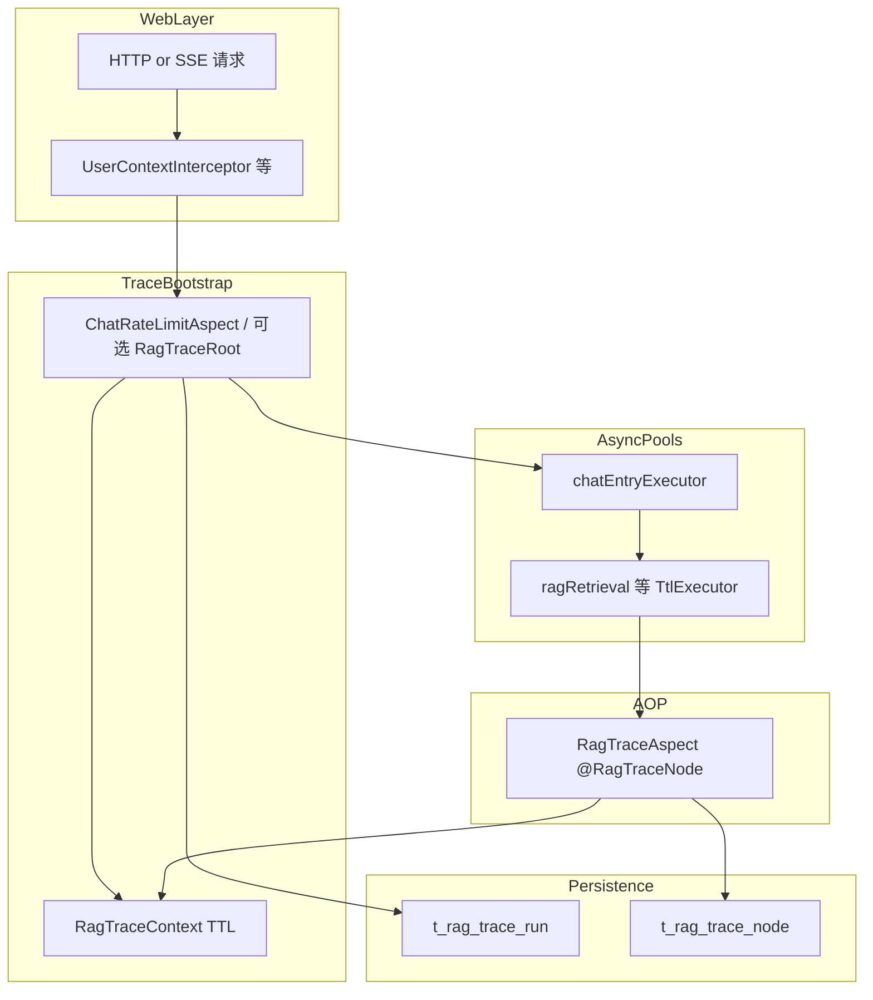
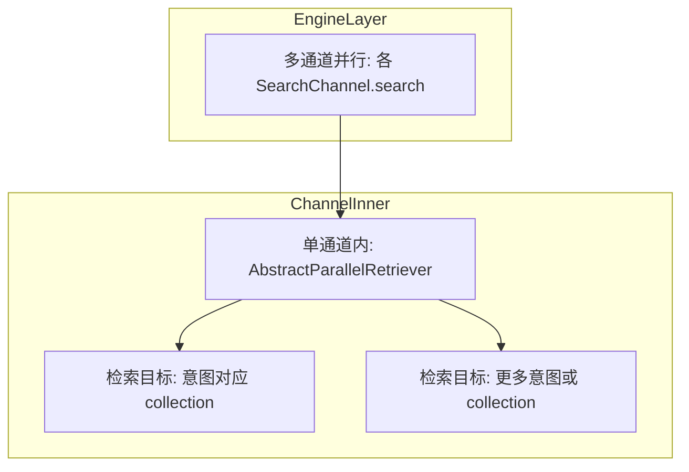
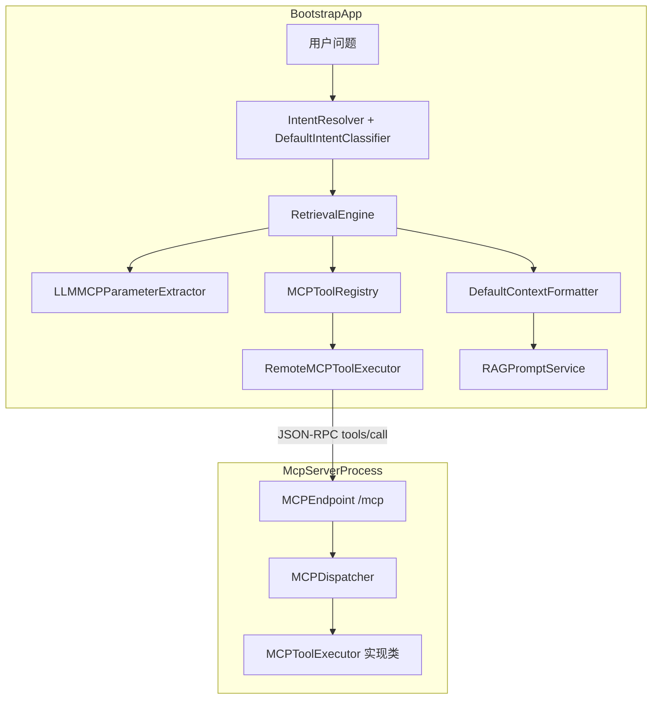

# Ragent 项目：异步场景下的全链路追踪（AOP + TTL + 节点栈 + 多线程池）

#### 解决异步场景下的全链路追踪难题：通过 AOP 实现全链路追踪，使用注解标记关键节点，维护调用层级栈并持久化至数据库；利用TTL实现了用户上下文和Trace上下文在异步线程池中的透传，配置多个专用线程池并使用 TtlExecutors 包装，保障全链路追踪在多线程场景下的完整性，避免线程池资源竞争和任务阻塞。

---


- MultiChannelRetrievalEngine.executeSearchChannels(...)
  - 用 [ragRetrievalExecutor](vscode-file://vscode-app/d:/IDE/Microsoft VS Code/41dd792b5e/resources/app/out/vs/code/electron-browser/workbench/workbench.html) 并行执行各通道
  - 然后 [join()](vscode-file://vscode-app/d:/IDE/Microsoft VS Code/41dd792b5e/resources/app/out/vs/code/electron-browser/workbench/workbench.html) 等待所有通道结果
- [VectorGlobalSearchChannel](vscode-file://vscode-app/d:/IDE/Microsoft VS Code/41dd792b5e/resources/app/out/vs/code/electron-browser/workbench/workbench.html) 只在“没意图”或“最高分太低”时启用(兜底策略）
- [IntentDirectedSearchChannel](vscode-file://vscode-app/d:/IDE/Microsoft VS Code/41dd792b5e/resources/app/out/vs/code/electron-browser/workbench/workbench.html) 只在有 KB 意图时启用


## 知识点 0：整体方案在解决什么问题

### 详解

RAG 链路里大量存在 **线程切换**：Tomcat 处理请求、`CompletableFuture`/`Executor` 并行检索、SSE 排队后换线程执行、流式回调等。普通日志或 `ThreadLocal` 里的 trace 信息 **不会自动跟着任务走**，导致异步方法里「看不见」同一次对话的 `traceId`，排查问题时只能猜。  
本项目的做法是：**用 TTL 在提交任务时捕获上下文、在执行任务时回放**；**用 AOP + 注解** 在关键业务方法边界自动 **插入 Run/Node 记录**；**用节点栈** 表达同步嵌套下的父子关系；**用多张表持久化**，事后可按 `traceId` 还原一次请求的步骤树与耗时。

### 面试一句话

**异步全链路追踪的核心，是在线程池边界用 TTL 做上下文捕获与回放，再配合 AOP 落库，否则池化线程里根本读不到父线程的 trace。**

---

## 知识点 1：核心类与职责地图

### 详解

| 能力                  | 位置                                          | 作用                                                         |
| --------------------- | --------------------------------------------- | ------------------------------------------------------------ |
| Trace / Task / 节点栈 | `RagTraceContext`（`framework`）              | 当前线程（及 TTL 传递后的子线程）上的链路 ID、任务 ID、节点栈 |
| 用户上下文            | `UserContext`（`framework`）                  | 当前登录用户，与 Trace 一样依赖 TTL 才能进异步线程           |
| 注解                  | `RagTraceRoot`、`RagTraceNode`（`framework`） | 声明「根」与「子节点」采集点                                 |
| 切面                  | `RagTraceAspect`（`bootstrap`）               | 拦截注解方法，调 `RagTraceRecordService` 写库并维护 TTL      |
| SSE 建链              | `ChatRateLimitAspect#invokeWithTrace`         | 流式对话在排队通过后创建 Run，并设置 `traceId`、`taskId`     |
| 排队执行线程          | `ChatQueueLimiter` + `chatEntryExecutor`      | 限流/排队逻辑结束后，在 **TTL 包装过的线程池** 上跑真正的对话逻辑 |
| 线程池配置            | `ThreadPoolExecutorConfig`                    | 多 Bean、多队列策略，统一 `TtlExecutors` 包装                |
| 落库                  | `RagTraceRecordServiceImpl` + Mapper          | insert 开始记录，update 结束状态与耗时                       |
| 查询                  | `RagTraceController`                          | 管理端或排查时分页查 Run、查详情与节点列表                   |
| 开关                  | `RagTraceProperties`（`rag.trace`）           | 关闭后切面与流式 trace 分支不再写库                          |

读代码时建议顺序：**`RagTraceContext` → `RagTraceAspect` → `ChatRateLimitAspect` → `ThreadPoolExecutorConfig`**。

### 面试一句话

**实现上把「上下文容器」「切面采集」「流式入口特判」「线程池 TTL 包装」拆成独立类，职责清晰，也方便单独关掉 trace 或换存储。**

---

## 知识点 2：`TransmittableThreadLocal`（TTL）与用户上下文

### 详解

`UserContext` 使用 `TransmittableThreadLocal<LoginUser>` 保存当前用户。Web 层在拦截器里 `UserContext.set(loginUser)`，请求结束 `clear()`。  
**与 `ThreadLocal` 的差异**：线程池 **复用 worker** 时，子线程不会自动拥有「提交任务那一刻」父线程里的 `ThreadLocal` 值；若只用普通 `ThreadLocal`，异步任务里 `getUserId()` 常为 `null`。TTL 的设计目标就是：**在 Runnable/Callable 被包装后，执行前把父线程快照设到子线程，执行后恢复**，避免脏数据泄漏。  
**注意**：只有经过 **TTL 提供的包装**（本项目主要是 `TtlExecutors.getTtlExecutor`）提交的任务，才能保证这份传递；若 `new Thread(...).start()` 或裸用未包装的池子，行为与项目设计不一致。

### 面试一句话

**用户上下文用 TTL 而不是普通 ThreadLocal，是为了在线程池场景下把「谁发起的请求」带到 worker 线程，否则异步里拿不到登录用户。**

---

## 知识点 3：`RagTraceContext` 三件套（traceId / taskId / NODE_STACK）

### 详解

1. **`TRACE_ID`**：一次「可观测链路」的全局 ID，与表 `t_rag_trace_run.trace_id` 对应。`@RagTraceNode` 切面里若为空则 **不采集**，避免无主节点污染数据。  
2. **`TASK_ID`**：更细粒度的业务任务 ID，在 **SSE 流式** 路径里与前端 `MetaPayload` 等对齐，便于把「一次流式输出」和 trace 对上。  
3. **`NODE_STACK`**：`Deque<String>`，栈顶 `peek()` 表示 **当前正在执行的子节点 ID**，用于计算下一节点的 `parentNodeId` 和 `depth`。进入节点前 `pushNode`，`finally` 里 `popNode`，与 Java 调用栈的进入/退出同构。栈为空时 `depth` 为 0，根下的第一层子节点父节点可为 `null`。  

三者都放在 TTL 上，才能在 **父线程 submit → 子线程 run** 后，子线程里继续嵌套 `@RagTraceNode` 时栈与 traceId 仍连贯。

### 面试一句话

**Trace 上下文不仅要有 traceId，还要用 Deque 维护节点栈，这样 AOP 才能在每个方法边界算出 parent 和 depth，异步里靠 TTL 把整份栈复制到子线程。**

---

## 知识点 4：为什么必须配合 `TtlExecutors`（不用会怎样）

### 详解

`RagTraceAspect.aroundNode` 第一行有效逻辑之一是：若 `RagTraceContext.getTraceId()` 为空，直接 `joinPoint.proceed()`。也就是说 **没有 traceId = 完全静默不记**。  
线程池线程若未经过 TTL 包装，执行时 **内存里的 TTL 可能是空的或过期的**，就会出现：**同步在 Controller 里有 trace，一进 `supplyAsync` 全丢**。  
`TtlExecutors.getTtlExecutor(executor)` 返回的 `Executor` 在 `execute` 时会对任务做 **TTL 增强**：提交线程捕获、`TRACE_ID`/`NODE_STACK`/`UserContext` 等注册的 TTL 一并打包，worker 执行前 set、执行后清理或还原，从而与 Spring 请求线程模型解耦。

### 面试一句话

**不用 TtlExecutors 包装线程池的话，异步代码里 getTraceId 为空，切面会直接跳过采集，链路在第一个线程切换点就断。**

---

## 知识点 5：`RagTraceAspect` 与 `@RagTraceRoot`

### 详解

- **`@Order(Ordered.HIGHEST_PRECEDENCE + 10)`**：保证相对其他业务切面较早执行，减少「外层未设 trace、内层节点已执行」的竞态（具体顺序仍取决于全局 Aspect 配置）。  
- **`aroundRoot`**：`rag.trace.enabled` 关闭则穿透；若当前线程 **已有** `traceId`，不再创建第二个 Run（防止嵌套调用重复根）。否则雪花生成 `traceId`，按参数名取 `conversationId`、`taskId`，`startRun` 插入 DB，`setTraceId`，业务结束后 `finishRun`，`finally` **`RagTraceContext.clear()`** 防止线程池复用泄漏。  
- **仓库现状**：业务方法上 **尚未使用** `@RagTraceRoot`，但切面已写好；非 SSE 入口将来只需在入口 Service 方法上打注解即可复用同一套落库逻辑。

### 面试一句话

**RagTraceRoot 由切面在开跑时 insert Run、设 traceId、在 finally 里 clear，并且用「已有 traceId 则不再建根」避免重复根记录。**

---

## 知识点 6：`@RagTraceNode` 与节点栈的 push/pop 语义

### 详解

执行顺序可记为：**算 parent（栈顶）与 depth → insert 节点 RUNNING → push → 执行业务 → finishNode → finally pop**。  

- `parentNodeId = currentNodeId()`：进入本方法前栈顶是谁，谁就是父节点；根下第一层没有父节点时栈空，parent 为 `null`。  
- `depth = depth()`：入栈前的栈深度，表示节点在树中的层级。  
  同步嵌套调用时：A 调 B，A 的节点先入栈，B 看到父节点是 A；B 返回后 pop，再回到 A 的栈状态。  
  若 B 在 **另一个线程** 执行，只要 B 的线程里 TTL 带过来的是 **提交任务时** 的栈快照，B 仍会把父节点指对；B 内部若再嵌套，在 **该线程** 上继续 push/pop 即可。

### 面试一句话

**每个 @RagTraceNode 方法相当于树上的一个节点：入栈前读父节点和深度，入栈执行再出栈，保证嵌套调用和异步传递时父子关系一致。**

---

## 知识点 7：SSE 流式路径 — `ChatRateLimitAspect` 与 `ChatQueueLimiter`

### 详解

流式对话方法带 `@ChatRateLimit`，切面不直接 `proceed()`，而是把逻辑交给 `ChatQueueLimiter.enqueue(..., onAcquire)`。  

- 排队/限流逻辑在 Redisson 信号量、Lua 等与 **调度线程** 配合下完成；真正执行业务的 `onAcquire` 会丢给 **`@Qualifier("chatEntryExecutor")` 的 Executor**。  
- `invokeWithTrace`：**先** `startRun`（`traceName = rag-stream-chat`），**同时** `setTraceId` 与 `setTaskId`（两个雪花 ID），再反射调用原方法；异常时 `finishRun` 记 ERROR 并 `emitter.completeWithError`；`finally` **`RagTraceContext.clear()`**。  
  这样设计的收益：**trace 的根与 taskId 在「获得并发许可、进入业务池」这一刻建立**，与 Meta 下发同源；后续检索、LLM 等 `@RagTraceNode` 挂在同一 trace 下。

### 面试一句话

**SSE 流式不是用 RagTraceRoot 切面建链，而是限流切面在排队通过后于 chatEntryExecutor 上 invokeWithTrace，手写 startRun 并设置 traceId 和 taskId。**

---

## 知识点 8：持久化 — `t_rag_trace_run` 与 `t_rag_trace_node`

### 详解

- **Run 表**：描述「一次链路」——谁（`userId`）、哪次会话（`conversationId`）、哪个任务（`taskId`）、入口方法名、起止时间、总耗时、成功失败、错误摘要等。适合列表筛选与大盘统计。  
- **Node 表**：描述「链路内的步骤」——`nodeId` 唯一、`parentNodeId` 构树、`depth` 辅助展示与排序，另有 `nodeType`（如 `RETRIEVE`、`LLM_PROVIDER`）便于按类型聚合。  
- **写入模式**：开始 **insert**（状态 RUNNING），结束 **按 traceId（及 nodeId）update** 为 SUCCESS/ERROR 并写 `durationMs`。异步下多线程会并发 insert 不同 node，靠 `traceId` 聚合；同一 `traceId` 下 `nodeId` 雪花保证不冲突。  
- **`max-error-length`**：异常堆栈/消息截断后落库，避免单行过大影响索引与备份。

### 面试一句话

**Run 是一次的总览，Node 是步骤树；开始 insert、结束 update，并落 parentNodeId 和 depth 方便事后拼树而不是只靠运行时栈。**

---

## 知识点 9：多专用线程池与资源隔离

### 详解

`ThreadPoolExecutorConfig` 为 **MCP 批处理、RAG 上下文、检索（外/内层）、意图、记忆摘要、模型流、聊天入口、知识分块** 等分别定义 `ThreadPoolExecutor`，核心数、最大线程、队列类型（`SynchronousQueue` vs 有界 `LinkedBlockingQueue`）、拒绝策略（`CallerRunsPolicy` / `AbortPolicy`）各不相同。  
**隔离的意义**：检索高峰不会占满「流式输出」或「分块」的线程；聊天入口池与内部计算池分离，避免 **全局饥饿**。`CallerRunsPolicy` 在背压时让提交线程自己跑，相当于 **减慢入队**；`AbortPolicy` 在极满时快速失败，避免无界堆积拖垮内存。  
每个返回给 Spring 的 Bean 都是 **`TtlExecutors` 包装后的 `Executor`**，因此 **隔离 + TTL** 两件事在同一个配置类里同时完成。

### 面试一句话

**多线程池是为了按业务域隔离队列和线程资源，避免一类任务把另一类拖死，同时每个池都用 TtlExecutors 包装以保留 Trace。**

---

## 知识点 10：`rag.trace` 配置与查询接口

### 详解

- **`enabled`**：为 `false` 时，`RagTraceAspect` 直接 `proceed()`；`ChatRateLimitAspect` 走无 trace 的 `invokeTarget`，**不写 Run**。  
- **`max-error-length`**：控制 `truncateError` 截断长度，防止异常信息过大。  
- **`RagTraceController`**：提供分页查 runs、按 `traceId` 查详情（含节点列表）、仅查 nodes 等 REST 接口，供运维或二次开发对接前端排查页。

### 面试一句话

**trace 用配置开关一键关闭以省库省开销，错误信息截断防止大字段，查询 API 把 Run 和 Node 暴露给管理或排障工具。**

---

## 知识点 11：数据流（Mermaid）



### 面试一句话

**请求进拦截器设用户上下文，流式经限流切面在入口线程池上建 Run，后续异步池里 AOP 持续写 Node，最终都落到两张 trace 表。**

---

## 知识点 12：高频追问（扩展答法 + 面试一句话）

### 12.1 为什么持久化要有 `parentNodeId`，不能只靠运行时栈？

**详解**：运行时栈只在 **单个线程、单次调用链** 内有效；落库后分析是 **离线** 的，且节点可能分布在 **不同线程** 的执行时间片上。把 `parentNodeId` 和 `depth` 写入行内，查询时无需重放 JVM 栈即可 **重建树**。  

**面试一句话**：**栈是运行时的，表是给人查的，所以必须把父子关系写进 Node 行里才能跨线程、跨时间还原调用树。**

### 12.2 `@RagTraceNode` 会拖慢业务吗？

**详解**：每次进入/退出会 **多几次 DB IO**（insert + update）。可通过 `rag.trace.enabled` 关闭；生产上也可后续演进为 **异步批量写** 或 **采样**（当前代码为同步写）。  

**面试一句话**：**默认是同步写库换可观测性，压力大时靠开关或后续异步化、采样来换性能。**

### 12.3 调度用的 `ScheduledThreadPoolExecutor` 没包 TTL 有问题吗？

**详解**：`ChatQueueLimiter` 里 scheduler 主要负责 **通知、轮询** 等，与「执行业务并打 `@RagTraceNode`」的 Runnable 主路径不同；真正带业务与 trace 的代码在 **`chatEntryExecutor`** 上执行且已包装 TTL。若将来在 scheduler 里直接调业务，需要再评估是否包装。  

**面试一句话**：**调度线程池只负责排队唤醒，业务入口在已包装 TTL 的 chatEntryExecutor 上，所以当前分工下 trace 主路径是闭合的。**

---

## 配置摘录

```yaml
rag:
  trace:
    enabled: true
    max-error-length: 1000
```

---

*文档依据仓库当前代码整理；若业务为某入口方法增加 `@RagTraceRoot`，则非 SSE 场景也会走切面自动建 Run。*


# Ragent 项目:

#### 实现基于节点编排的文档入库流水线：支持数据获取、文档解析、文本分块、内容增强、向量索引等节点的可视化连线配置，每个节点独立执行并记录日志，支持条件跳转和环检测，实现灵活的文档处理流程。


# Ragent 项目：多路检索引擎（意图定向 + 全局向量 + CompletableFuture + 后处理链）

#### 构建高性能多路检索引擎：通过多路检索引擎实现意图定向与全局向量的双路召回策略，采用并行执行检索通道，配合去重、重排序等后处理流水线，在保证召回率的同时提升检索精准度，解决单一检索方式覆盖率不足的问题。

## 1. 落点与调用链

总览表：

| 角色           | 位置                                                         |
| -------------- | ------------------------------------------------------------ |
| 多通道编排     | `bootstrap` → `com.nageoffer.ai.ragent.rag.core.retrieve.MultiChannelRetrievalEngine` |
| 上层检索入口   | `RetrievalEngine#retrieve` → `retrieveAndRerank` → `retrieveKnowledgeChannels` |
| 意图定向通道   | `IntentDirectedSearchChannel`（`SearchChannel`，优先级 1）   |
| 全局向量通道   | `VectorGlobalSearchChannel`（优先级 10）                     |
| 通道内并行模板 | `AbstractParallelRetriever`；实现类 `IntentParallelRetriever`、`CollectionParallelRetriever` |
| 去重 / 重排    | `DeduplicationPostProcessor`、`RerankPostProcessor`          |
| 线程池         | `ragRetrievalThreadPoolExecutor`（通道级）、`ragInnerRetrievalThreadPoolExecutor`（单通道多目标）、`ragContextThreadPoolExecutor`（子问题） |

### 1.1 `MultiChannelRetrievalEngine`（多通道编排）

**详解**：KB 检索的「调度中心」。对外方法 `retrieveKnowledgeChannels(subIntents, topK)` 先组 `SearchContext`，再 **并行** 调用所有 **已启用** 的 `SearchChannel#search`，得到多份 `SearchChannelResult` 后进入后置处理器链。异常时单通道可返回空结果而不拖垮整次检索（`supplyAsync` 内有 try/catch）。

**面试一句话：** 多通道检索的编排入口是 `MultiChannelRetrievalEngine`，负责并行跑各 `SearchChannel` 再串行跑后处理链。

### 1.2 `RetrievalEngine`（上层检索入口）

**详解**：RAG 侧总检索门面。`retrieve` 先按 **子问题** 并行 `buildSubQuestionContext`；每个子问题里 KB 部分走 `retrieveAndRerank`，内部 **单个子问题** 调用 `multiChannelRetrievalEngine.retrieveKnowledgeChannels`。因此「子问题并行」与「多通道并行」是上下级关系：子问题用 `ragContextExecutor`，子问题内的多通道用 `ragRetrievalExecutor`。

**面试一句话：** `RetrievalEngine` 在子问题维度并行，每个子问题的 KB 检索再交给 `MultiChannelRetrievalEngine` 做多策略召回。

### 1.3 `IntentDirectedSearchChannel` / `VectorGlobalSearchChannel`

**详解**：二者都实现 `SearchChannel`。意图通道 **priority=1**，从上下文中抽 KB 类 `NodeScore`（过 `minIntentScore`），用 `IntentParallelRetriever` 在对应 collection 上检索；全局通道 **priority=10**，在「无意图或置信度低于阈值」等条件下启用，拉全库 KB collection 用 `CollectionParallelRetriever` 检索。`getPriority` 主要影响 **去重时通道优先级**（见 `DeduplicationPostProcessor`），多通道执行顺序也会按 priority 排序。

**面试一句话：** 意图定向通道按识别到的 KB 意图搜指定库，全局向量通道按条件做全库兜底，都是 `SearchChannel` 的一种实现。

### 1.4 `AbstractParallelRetriever` 与两个子类

**详解**：模板方法：`executeParallelRetrieval` 对每个 target `CompletableFuture.supplyAsync(createRetrievalTask, executor)`，再 `join` 汇总。`IntentParallelRetriever` 的 target 是「意图 + 动态 topK」；`CollectionParallelRetriever` 的 target 是 collection 名。子类只实现「单次 target 怎么调 `RetrieverService`」。

**面试一句话：** 单通道内的多目标并行都走 `AbstractParallelRetriever`，意图路和全局路分别用 `IntentParallelRetriever` 和 `CollectionParallelRetriever`。

### 1.5 去重与 Rerank 处理器

**详解**：实现 `SearchResultPostProcessor` 接口。引擎把各通道 chunks 先 `flatMap` 成列表，再按 `getOrder()` **顺序**执行处理器（与检索并行无关）。去重依赖 `SearchChannelResult` 列表按通道类型排序后合并；Rerank 调用 `RerankService` 按问题与 `topK` 截断。

**面试一句话：** 多通道结果先合并再经去重、Rerank 两个后置步骤，得到最终给上层的 chunk 列表。

### 1.6 三类检索相关线程池（与调用关系）

**详解**：`ragRetrievalThreadPoolExecutor` 只用于 **通道级** `supplyAsync`；`ragInnerRetrievalThreadPoolExecutor` 注入两个 `SearchChannel` 内部的并行检索器；`ragContextThreadPoolExecutor` 用于 `RetrievalEngine` 里 **多个子问题** 的 `supplyAsync`。职责分离，避免一种任务占满另一种任务的线程。

**面试一句话：** 检索链路用三个池：子问题一层、多通道一层、单通道内多目标一层，各干各的并行粒度。

---

## 2. 多通道 vs 单通道内并行（分别做什么）

文档里的「多通道」「单通道」不是「系统只开一条路」，而是 **策略级并行** 与 **目标级并行** 两个层级。

### 2.1 多通道（通道之间）在做什么

**详解**：多个 `SearchChannel` 实现类被 Spring 收集成 `List<SearchChannel>`。引擎对列表 `filter(isEnabled)`、`sorted(priority)`，每个通道异步执行 `search`，彼此 **不知道对方内部怎么拆任务**。适合扩展：新增一种召回策略只需新增 Bean 实现接口。`SearchChannelResult` 带 `channelType`，后处理可按通道类型做偏好（如去重时更信意图通道）。

**面试一句话：** 多通道就是多种检索策略（多个 `SearchChannel`）在同一请求里可并行执行，用 `isEnabled` 控制是否参与。

### 2.2 「单通道」在文档里指什么（通道内部）

**详解**：特指 **一次** `channel.search(context)` 的执行体。意图通道可能在 N 个 collection 上各搜一次；全局通道可能在 M 个 collection 上各搜一次。这些子任务共享同一个 `SearchChannelResult` 的 `chunks` 列表输出。失败隔离在 `createRetrievalTask` 或 try/catch 内，常返回空列表而非抛到外层。

**面试一句话：** 单通道内并行是「同一种策略里对多个意图或多个 collection 拆开并行查，再合并成该通道一份结果」。

### 2.3 两层关系（结构示意）

**详解**：下图强调：只有 **引擎层** 会同时调度多个 `SearchChannel`；每个 `SearchChannel` 内部再决定是否用 `AbstractParallelRetriever` 拆目标。数据流是：多份 `SearchChannelResult` → 合并 chunks → 后处理。

**面试一句话：** 外层并行单位是「通道」，内层并行单位是「该通道下的检索目标」，两层串起来形成完整召回。



### 2.4 为什么要拆成两层线程池

**详解**：通道数量通常 **个位数**；单通道内目标数可能 **几十**（全库 collection）。若共池：大量 `supplyAsync` 占满线程后，连「第二个通道的 search」都排不上队，延迟与饥饿难控。外层用较小并行度 + `SynchronousQueue`，内层用更大 max + **有界** `LinkedBlockingQueue`，可对 IO 密集子任务单独背压。

**面试一句话：** 两层线程池是为了把「策略级少量任务」和「目标级大量 IO 任务」分开限流与扩容，避免相互抢线程。

---

## 3. 双路召回策略（何时启用哪一路）

### 3.1 意图定向通道

**详解**：从 `SearchContext.intents` 里扁平化 `nodeScores`，筛 `node.isKB()` 且分数 ≥ `intentDirected.minIntentScore`。对每个命中节点取 `collectionName` 与 topK（节点可配 topK，再乘 `topKMultiplier`）。无 KB 意图时 `isEnabled` 为 false，该通道不参与本次检索。

**面试一句话：** 意图定向在有合格 KB 意图时启用，按意图绑定的 collection 做向量检索，精度高、依赖意图质量。

### 3.2 向量全局通道

**详解**：从 `KnowledgeBaseMapper` 查未删除 KB 的 `collectionName` 去重列表，对每个 collection 检索，`topK` 会乘全局通道的 `topKMultiplier`。`isEnabled`：① 没有任何意图分数；或 ② 所有分数里 **最大值** 仍低于 `vectorGlobal.confidenceThreshold`。用于意图缺失或模型不自信时的兜底召回。

**面试一句话：** 全局向量通道在「没意图」或「整体置信度低」时启用，扫全库 KB collection 提高召回覆盖面。

### 3.3 两路是否会同时启用

**详解**：由两个 `isEnabled` **独立**判断。若同时 true，引擎会对两路都 `supplyAsync`，后处理再去重、Rerank。实际常出现「只意图」或「只全局」，取决于分数与阈值；配置里也可关掉某一通道。

**面试一句话：** 是否双路同时跑没有写死，完全看两个通道各自的 `isEnabled` 与配置开关。

**面试一句话（本节总括）：** 双路召回 = 意图定向精准搜 + 全局向量条件兜底，组合方式由运行时上下文与配置决定。

---

## 4. CompletableFuture 出现位置（面试可点名）

### 4.1 通道之间：`MultiChannelRetrievalEngine#executeSearchChannels`

**详解**：`enabledChannels.stream().map(channel -> CompletableFuture.supplyAsync(..., ragRetrievalExecutor))`，最后 `future.join()` 收集。必须传 **业务线程池**，避免默认 `ForkJoinPool.commonPool()` 被全应用共享占满。单通道抛错时构造空 `SearchChannelResult`，避免 `join` 直接失败导致整批丢失（视实现而定，代码里在 lambda 内 catch）。

**面试一句话：** 多通道并行用 `CompletableFuture.supplyAsync` 提交到 `ragRetrievalThreadPoolExecutor`，再 join 汇总各通道结果。

### 4.2 通道内部：`AbstractParallelRetriever#executeParallelRetrieval`

**详解**：每个 target 一个 `supplyAsync`，executor 为 `ragInnerRetrievalThreadPoolExecutor`。与 4.1 **嵌套**：外层一个线程进 `channel.search`，内层再向另一池提交多任务。注意：若内层任务过多，占的是内层池，不会把外层池线程全部占死（外层线程会阻塞在 join 上，这是设计权衡）。

**面试一句话：** 单通道内多目标并行同样用 `supplyAsync`，但线程池换成内层 `ragInnerRetrievalThreadPoolExecutor`。

### 4.3 子问题：`RetrievalEngine#retrieve`

**详解**：每个 `SubQuestionIntent` 异步构建 `SubQuestionContext`（内含 KB 多通道 + MCP），线程池 `ragContextThreadPoolExecutor`（core 2 max 4），适合子问题数量通常不多的场景。

**面试一句话：** 子问题级并行在 `RetrievalEngine#retrieve` 里用 `ragContextThreadPoolExecutor` 做 `supplyAsync`。

### 4.4 MCP：`RetrievalEngine#executeMcpTools`

**详解**：每个 `MCPRequest` 对应一个 `supplyAsync(..., mcpBatchExecutor)`，再 join 成 `List<MCPResponse>`。与 KB 检索池分离，避免工具调用阻塞检索线程。

**面试一句话：** MCP 多工具并行用 `mcpBatchThreadPoolExecutor`，和 RAG 检索线程池分开。

**说明（层级关系）**：通道级与单通道内级使用 **两个不同 Executor**，避免任务形态混用难以调参。

**面试一句话（本节总括）：** 项目里 `CompletableFuture` 按「子问题 / 多通道 / 通道内 / MCP」分层绑定不同线程池，而不是一把梭用 commonPool。

---

## 5. 线程池自定义（`ThreadPoolExecutorConfig`）

### 5.1 定义方式与 Bean 命名

**详解**：类路径 `com.nageoffer.ai.ragent.rag.config.ThreadPoolExecutorConfig`。每个 `@Bean` 方法返回 `Executor`，方法名即默认 Bean name，与 `@Qualifier` 注入一致。未使用 `TaskExecutor` 接口自定义名时，就靠方法名对齐。

**面试一句话：** 线程池在 `ThreadPoolExecutorConfig` 里用 `@Bean` 方法声明，方法名对应 `@Qualifier` 注入名。

### 5.2 为何未绑定 `application.yml`

**详解**：core/max、队列容量、存活时间、拒绝策略均在 Java 中写死，改参需发版或通过后续重构引入 `@ConfigurationProperties`。`CPU_COUNT` 随机器核数变化，兼顾不同部署规格。

**面试一句话：** 当前实现里池参数是代码常量加 CPU 推算，不是从配置文件热调。

### 5.3 `TtlExecutors.getTtlExecutor`

**详解**：Alibaba transmittable-thread-local：包装后，提交到线程池的任务会 **捕获并回放** 父线程的 ThreadLocal（如 traceId、租户）。原生 `CompletableFuture` + 普通线程池会丢上下文，TTL 是常见补法。

**面试一句话：** 每个 Executor 包一层 TTL，是为了异步线程里还能拿到请求维度的 ThreadLocal 上下文。

### 5.4 线程命名

**详解**：`ThreadFactoryBuilder.create().setNamePrefix("rag_retrieval_executor_")` 等，出问题时 jstack、日志能快速看出线程归属业务。

**面试一句话：** 用 Hutool 的 `ThreadFactoryBuilder` 打线程名前缀，方便排查并发问题。

### 5.5 检索相关的三个池（参数与意图）

**详解**：

- **ragRetrieval**：`SynchronousQueue` + `CallerRunsPolicy`，队列不囤积任务，满则调用线程自己跑，形成背压；core/max 与 CPU 挂钩，匹配「通道数少」。
- **ragInnerRetrieval**：更大的 core/max，`LinkedBlockingQueue(100)` 有限排队，适合 burst 的多 collection 检索。
- **ragContext**：2～4 线程，控制子问题并发，避免一次拆太多子问题打爆下游。

**面试一句话：** 外层通道池偏小且同步队列背压，内层检索池更大并有界队列，子问题池刻意收紧。

### 5.6 同文件其他池（对比记忆）

**详解**：`mcpBatchThreadPoolExecutor` 与检索类似用 CPU 缩放；`modelStreamExecutor`、`chatEntryExecutor` 等部分用 **`AbortPolicy`**，超载直接拒绝而非调用者执行，与检索侧 `CallerRunsPolicy` 的「慢一点但尽量消化」不同，适合有明确容量上限的入口。

**面试一句话：** 流式、排队入口等池有的用 AbortPolicy 快速失败，检索侧多用 CallerRunsPolicy 做背压，按业务容忍度选型。

**面试一句话（本节总括）：** 线程池按业务域拆分并用 TTL 包装，检索双层池配合队列与拒绝策略做流量整形。

---

## 6. 后处理流水线

### 6.1 处理器链的调度方式

**详解**：Spring 注入 `List<SearchResultPostProcessor>`，引擎内 `filter(isEnabled)` + `sorted(order)`，**for 循环串行** `processor.process(chunks, results, context)`。某步异常会 log 后 **跳过继续下一步**，不中断整条链（具体以代码为准）。初始 `chunks` 为各通道结果的简单扁平合并。

**面试一句话：** 后处理是同步顺序管道，按 order 执行，和检索阶段的并行是分开的。

### 6.2 `DeduplicationPostProcessor`（order=1）

**详解**：按 `SearchChannelResult` 的通道类型排序（意图通道优先于全局等），再依次把 chunk 放入 `LinkedHashMap`，key 由 chunk 唯一键生成（如同一文档段 ID）；已存在则保留 **分数更高** 的实例。这样既去重又体现 **通道优先级**。

**面试一句话：** 去重处理器按通道优先级合并多路结果，同一 chunk 只保留分更高的那条。

### 6.3 `RerankPostProcessor`（order=10）

**详解**：调用 `RerankService.rerank(问题, chunks, topK)`，用独立重排模型或策略对粗排结果精排并截断到 `topK`。若 chunks 为空直接跳过。

**面试一句话：** Rerank 在最后一步用专门服务对候选 chunk 重排序并截断 TopK。

### 6.4 无处理器时的行为

**详解**：若 `enabledProcessors` 为空，引擎直接把各通道 `chunks` flatMap 成列表返回，无去重无精排，依赖上游通道自己控制质量。

**面试一句话：** 没有启用任何 PostProcessor 时，多通道结果就是简单拼接，不做去重和 Rerank。

**面试一句话（本节总括）：** 后处理链 = 先去重融合多路结果，再 Rerank 出最终 TopK，全程顺序执行。

---

## 7. 配置与扩展点

### 7.1 `SearchChannelProperties`

**详解**：绑定 `channels.intent-directed.*`、`channels.vector-global.*`（enabled、minIntentScore、confidenceThreshold、topKMultiplier 等）。控制通道是否参与及检索规模，不改变代码即可调产品行为。

**面试一句话：** 通道开关、意图分阈值、全局置信度阈值、topK 倍率等走 `SearchChannelProperties` 配置。

### 7.2 新增检索通道

**详解**：实现 `SearchChannel`：`getName`、`getPriority`、`getType`、`isEnabled`、`search`。注册为 Spring Bean 后自动进入 `List<SearchChannel>`。注意与现有通道的 `isEnabled` 条件不要逻辑冲突，避免双通道永远只开一个。

**面试一句话：** 扩展新召回策略只要新增 `SearchChannel` Bean，引擎会自动把它纳入并行调度。

### 7.3 新增后置处理器

**详解**：实现 `SearchResultPostProcessor`：`getName`、`getOrder`、`isEnabled`、`process`。`order` 决定与去重、Rerank 的相对位置；可访问原始 `List<SearchChannelResult>` 做通道级特征。

**面试一句话：** 扩展后处理实现接口并指定 order，就能插入去重前后或 Rerank 前后的逻辑。

**面试一句话（本节总括）：** 配置管通道参数，扩展靠新增 `SearchChannel` 与 `SearchResultPostProcessor` 两类插件。

---

## 8. 小结（面试可答）

**全文压缩版：** 本项目 KB 多路检索由 `MultiChannelRetrievalEngine` 对多个 `SearchChannel` 做 `CompletableFuture` 并行，意图定向与全局向量由 `isEnabled` 决定是否同时参与；单通道内用 `AbstractParallelRetriever` 对多意图或多 collection 再并行；结果经去重、Rerank 顺序后处理；线程池在 `ThreadPoolExecutorConfig` 按子问题、通道、通道内、MCP 拆分并用 `TtlExecutors` 传递上下文。

**面试一句话（终极版）：** 多路检索 = 多策略并行召回 + 单策略内多目标并行 + 去重重排流水线 + 分层线程池与 TTL，兼顾覆盖率、延迟和可扩展性。


# Ragent 项目：MCP 协议与智能体工具链（插件化、意图绑定、LLM 参数提取）

#### 集成MCP协议拓展智能体工具链：基于MCP标准构建插件化工具系统，通过意图识别关联 MCP 工具 ID，使用 LLM 自动提取工具参数，成功将系统能力从知识检索扩展至外部系统操作，提升Agent的业务执行边界。

## 0. 你在简历上怎么讲（总括）

**详解**：项目把 **MCP（Model Context Protocol）** 当作「标准工具发现与调用层」：`mcp-server` 独立进程暴露 JSON-RPC（Streamable HTTP），`bootstrap` 通过 `HttpMCPClient` 做 `initialize` / `tools/list` / `tools/call`，把远端工具注册成 `RemoteMCPToolExecutor`；RAG 主链路里 **意图识别** 命中 `kind=MCP` 的叶子节点时，用节点上的 `mcpToolId` 选定工具，再用 **LLM** 按 `MCPTool` 的参数字段从用户问题里抽 JSON 参数，并行调用工具，把结果格式化为「动态数据片段」注入 Prompt，从而从纯知识检索扩展到 **外部系统只读/操作类能力**（具体能力取决于 MCP Server 上挂的实现）。

**面试一句话：** 用 MCP 把工具当插件挂到独立 Server，主应用按意图树里的 `mcpToolId` 选工具、用 LLM 抽参数、HTTP JSON-RPC 调远端执行，再把结果当证据拼进 RAG 提示词。

---

## 1. 模块与运行时关系

| 组件     | 位置                      | 职责                                                         |
| -------- | ------------------------- | ------------------------------------------------------------ |
| 主应用   | `bootstrap`               | 聊天、意图、检索、Prompt；内嵌 MCP **客户端** 与工具注册表   |
| MCP 服务 | `mcp-server`              | 独立 Spring Boot；`/mcp` 接收 JSON-RPC；**服务端**工具注册与执行 |
| 集成方式 | 配置 `ragent.mcp.servers` | **非** Maven 依赖耦合，而是 **HTTP** 连接（见 `application.yaml`） |

**详解**：父 POM 声明 `mcp-server` 子模块，但运行时是两个进程：`bootstrap` 读 `ragent.mcp.servers[].url`（如 `http://localhost:9099`），`HttpMCPClient` 自动补全 `/mcp` 路径发 POST。

**面试一句话：** `bootstrap` 是 MCP 客户端，`mcp-server` 是 MCP 服务端，二者只通过配置的 HTTP 地址通信。

---

## 2. MCP Server：协议层与插件化工具

### 2.1 端点与 JSON-RPC

**详解**：`MCPEndpoint` 提供 `POST /mcp`，请求体为 `JsonRpcRequest`；`MCPDispatcher#dispatch` 按 `method` 分发：`initialize`、`tools/list`、`tools/call`。无 `id` 的请求视为 **notification**（如客户端发来的 `notifications/initialized`），不返回响应体。

**面试一句话：** MCP 入口就是一个 Controller + Dispatcher，把 JSON-RPC 方法路由到初始化、列工具、调工具三件事上。

### 2.2 `initialize` 与协议版本

**详解**：`handleInitialize` 返回 `protocolVersion`（如 `2026-02-28`）、`capabilities.tools`、`serverInfo`，与客户端 `HttpMCPClient#initialize` 中带的 `protocolVersion` / `clientInfo` 对齐；客户端在收到结果后必须再发 `notifications/initialized` 通知，符合 MCP 握手约定。

**面试一句话：** 先 `initialize` 再发 `initialized` 通知，双方约定协议版本和能力位。

### 2.3 `tools/list`：发现工具 Schema

**详解**：从 `MCPToolRegistry#listAllTools` 取出所有 `MCPToolDefinition`，经 `toSchema` 转成 `MCPToolSchema`（含 `inputSchema` 的 `properties` / `required`），封装进 `result.tools` 返回。这样任意新工具只要 **注册进 Registry**，列表即自动更新，无需改协议代码。

**面试一句话：** `tools/list` 就是把注册表里所有工具的 JSON Schema 拉平返回，实现工具发现。

### 2.4 `tools/call`：按 name 执行

**详解**：从 `params.name` 取工具名（即 **toolId**），`toolRegistry.getExecutor(toolName)` 取执行器；`arguments` 映射为 `MCPToolRequest.parameters`，调用 `execute` 后把 `MCPToolResponse` 转成 MCP 标准的 `content` 数组（`type: text`）及 `isError` 标志。

**面试一句话：** `tools/call` 就是根据工具名找 Spring 里注册的 Executor，把 arguments 塞进去执行并包装成标准 content。

### 2.5 服务端插件化：`MCPToolExecutor` + `DefaultMCPToolRegistry`

**详解**：每个具体能力实现 `MCPToolExecutor`：`getToolDefinition()` 声明参数与描述，`execute(MCPToolRequest)` 执行业务。`DefaultMCPToolRegistry` 在 `@PostConstruct` 里注入所有 `MCPToolExecutor` Bean 并 `register`，用 `ConcurrentHashMap<toolId, executor>` 存储，支持覆盖同名工具时的告警日志。示例：`WeatherMCPExecutor`、`TicketMCPExecutor`、`SalesMCPExecutor`。

**面试一句话：** 加一个 MCP 工具就是写一个 Executor Bean，启动时自动进注册表，不用改 Dispatcher。

---

## 3. Bootstrap 侧：远程工具拉取与本地注册

### 3.1 `MCPClientProperties` 与多 Server

**详解**：配置项 `ragent.mcp.servers` 为列表，每项含 `name`、`url`，支持未来对接多个 MCP Server（循环 `registerRemoteTools`）。

**面试一句话：** 配置里是「服务器列表」，可以扩展成多 MCP 源。

### 3.2 `HttpMCPClient`（OkHttp + JSON-RPC 2.0）

**详解**：`sendRequest` 构造 `jsonrpc:2.0`、`id` 自增、`method`、`params`，POST 到 `serverUrl`（自动补 `/mcp`）。解析响应：若有 `error` 打日志并返回 null；否则取 `result`。**`listTools`** 遍历 `result.tools`，`convertToMcpTool` 把 `name`、`description`、`inputSchema.properties/required/enum` 转为 bootstrap 统一的 `MCPTool`。**`callTool`** 发 `tools/call`，`extractTextContent` 拼接多段 `text` 类型 content。

**面试一句话：** 客户端用 OkHttp 发标准 JSON-RPC，把远端 Schema 转成内部 `MCPTool`，调用时只关心返回的文本结果。

### 3.3 `MCPClientAutoConfiguration`

**详解**：`@PostConstruct` 遍历配置的每个 Server：new `HttpMCPClient` → `initialize()` 失败则跳过该 Server → `listTools()` 为空则跳过 → 否则对每个 `MCPTool` 创建 `RemoteMCPToolExecutor(mcpClient, tool)` 并 `toolRegistry.register`。注意：这与 `DefaultMCPToolRegistry` 里扫描 **本进程** Bean 的注册是 **同一套 Registry**，后注册的远程工具与本地 Executor 共用 toolId 空间（重复会覆盖并打 warn）。

**面试一句话：** 启动时连上 MCP Server，拉工具列表，每个工具包一层 `RemoteMCPToolExecutor` 注册进主应用的 Registry。

### 3.4 `RemoteMCPToolExecutor`

**详解**：`execute(MCPRequest)` 把 `request.getParameters()` 交给 `mcpClient.callTool(toolId, parameters)`，成功则 `MCPResponse.success`，失败或 null 则 `REMOTE_CALL_FAILED` 等错误码，并记录耗时 `costMs`。

**面试一句话：** 远程执行器就是「把已经抽好的参数转发给 HTTP MCP 的 `tools/call`」。

### 3.5 `DefaultMCPToolRegistry`（Bootstrap）

**详解**：收集 Spring 容器内所有 `MCPToolExecutor`（含自动配置动态 new 出来的 `RemoteMCPToolExecutor`，若被注册为 Bean 或通过 `register` 注入——当前实现是 **直接调用** `toolRegistry.register`，需确认 `MCPClientAutoConfiguration` 是否在 `DefaultMCPToolRegistry#init` 之后执行：`@PostConstruct` 顺序同类内按依赖，跨 Bean 以 Spring 初始化顺序为准；远程工具是在 `MCPClientAutoConfiguration#init` 里 **显式 register**，不依赖「注入 List<MCPToolExecutor>」）。

**说明（与源码一致）**：`RemoteMCPToolExecutor` 是 `new` 出来的，**不是** Spring Bean；它通过 `MCPClientAutoConfiguration` 直接调用 `toolRegistry.register(executor)` 写入 Map。`DefaultMCPToolRegistry` 的 `autoDiscoveredExecutors` 只包含 **真正的 Bean**。二者共同填满同一张注册表。

**面试一句话：** 本地工具靠 Bean 发现注册，远程工具靠自动配置连上 MCP 后手动 register，最终都进同一张 toolId → Executor 表。

---

## 4. 意图识别如何关联到 MCP 工具 ID

### 4.1 数据模型：`IntentNode` / `IntentNodeDO`

**详解**：意图树节点 `IntentKind` 含 `MCP(2)`。`IntentNode` 上 `mcpToolId` 表示该叶子命中后要调用的工具标识，与 MCP 工具 `name`（toolId）一致。库表 `t_intent_node` 中 `kind=2` 时 `mcp_tool_id` 有效；另有 **`param_prompt_template`**（MCP 专属）可覆盖默认参数提取系统提示。

**面试一句话：** 意图节点上直接配 `mcpToolId`，把「用户想干什么」映射到「调哪个 MCP 工具」。

### 4.2 `DefaultIntentClassifier`：LLM 对叶子节点打分

**详解**：从 Redis/DB 加载意图树，展开叶子节点，构造 `intent_list`：每叶包含 `id`、`path`、`description`、**`type=MCP` 时附带 `toolId=`**，以及 `examples`。用模板 `INTENT_CLASSIFIER_PROMPT_PATH` 渲染成 system prompt，用户问题作为 user message，要求 LLM 输出 JSON 数组 `[{"id","score",...}]`。解析后与内存 `id2Node` 对齐得到 `List<NodeScore>`，按 score 降序。

**面试一句话：** 意图识别是「把带 MCP/KB 类型标注的叶子列表给 LLM」，让它给每个叶子打分，从而选出要不要走某个 `mcpToolId`。

### 4.3 `IntentResolver` 与检索前分组

**详解**：`resolve` 对每个子问题异步 `classifyIntents`，过滤 `score >= INTENT_MIN_SCORE` 并限制数量；`mergeIntentGroup` 可把全量子问题的 MCP/KB 意图拆开，供上层展示或策略使用（如 `RAGChatServiceImpl` 里 `IntentGroup`）。

**面试一句话：** 子问题级并行分类，再按分数阈值和上限截断，避免意图爆炸。

### 4.4 `RetrievalEngine#filterMCPIntents`

**详解**：在 **检索阶段** 再次过滤：`score >= INTENT_MIN_SCORE`、`kind == MCP`、`mcpToolId` 非空。与 KB 分支 `filterKbIntents` 分离，同一子问题可同时有 KB 检索与 MCP 调用。

**面试一句话：** 只有「分数够高 + MCP 叶子 + 配了 toolId」的意图才会真正触发工具调用。

---

## 5. LLM 自动提取工具参数

### 5.1 `MCPParameterExtractor` 与 `LLMMCPParameterExtractor`

**详解**：接口抽象参数提取；默认实现 `LLMMCPParameterExtractor`：拼三条消息——system（**优先** `IntentNode.paramPromptTemplate`，否则加载 `prompt/mcp-parameter-extract.st`）、user 工具定义文本、user 用户问题。`ChatRequest` 低温度 `0.1`、`topP 0.3`，调用 `LLMService.chat`。返回 JSON 经 `LLMResponseCleaner.stripMarkdownCodeFence` 后解析，**只保留 `MCPTool` 里声明过的 key**；再 `fillDefaults` 补默认。异常或 JSON 失败时 `buildDefaultParameters`。

**面试一句话：** 参数提取是单独一次 LLM 调用，严格按工具 Schema 解析 JSON，避免模型乱造字段。

### 5.2 `buildMcpRequest`（`RetrievalEngine`）

**详解**：用 `intentNode.getMcpToolId()` 查 `mcpToolRegistry`；取 `executor.getToolDefinition()` 得 `MCPTool`（远程工具在 `listTools` 时已带完整 parameters）；`mcpParameterExtractor.extractParameters(question, tool, intentNode.getParamPromptTemplate())`；组装 `MCPRequest(toolId, userQuestion, parameters)`。

**面试一句话：** 意图节点决定 **哪个工具** 和 **用哪套参数提取提示词**，Registry 提供 **参数定义**。

---

## 6. 工具执行、并行与结果合并

### 6.1 `executeMcpTools` 并行

**详解**：每个 `NodeScore` 生成一个 `MCPRequest`，`CompletableFuture.supplyAsync(() -> executeSingleMcpTool(request), mcpBatchExecutor)`，线程池为 `mcpBatchThreadPoolExecutor`，与 RAG 检索线程池分离，避免互相堵死。

**面试一句话：** 多个 MCP 意图命中时，工具调用在线程池里并行，和 KB 检索池分开。

### 6.2 `executeSingleMcpTool`

**详解**：Registry 找不到 → `TOOL_NOT_FOUND`；找到则 `executor.execute(request)`，异常包装为 `EXECUTION_ERROR`。远程场景下内部是 `RemoteMCPToolExecutor` → HTTP `tools/call`。

**面试一句话：** 执行路径统一走 `MCPToolExecutor`，本地远程对检索引擎无感。

### 6.3 `executeMcpAndMerge` 与 `ContextFormatter#formatMcpContext`

**详解**：若全部失败则 MCP 上下文为空；否则 `DefaultContextFormatter#formatMcpContext`：按 `toolId` 分组成功响应，结合意图节点上的 `promptSnippet` 生成「意图规则 + 动态数据片段」文本块，多块 `\n\n` 拼接。无意图映射时退化为 `mergeResponsesToText`。

**面试一句话：** MCP 结果不是裸 JSON，而是带业务规则片段、给 LLM 当「证据区」的格式化文本。

---

## 7. Prompt 层：MCP 与 KB 混合

### 7.1 `RAGPromptService#buildStructuredMessages`

**详解**：system 主模板后，若有 `mcpContext`，追加 **system** 消息 `## 动态数据片段`；若有 `kbContext`，追加 **user** 消息 `## 文档内容`；再拼 history 与最终 user。多子问题时会编号列出，降低漏答。

**面试一句话：** 动态工具结果进 system 侧证据，文档检索进 user 侧证据，角色分离减少混淆。

### 7.2 场景模板与温度（`RAGChatServiceImpl`）

**详解**：存在 MCP 上下文时 `temperature` 可略调高（如 `0.3`），相对纯 KB 更允许一点生成灵活性（具体以源码为准）。

**面试一句话：** 有实时数据时模型温度略放宽，仍保持 RAG 以证据为主。

---

## 8. 端到端数据流（Mermaid）



---

## 9. 知识点速查表（含面试一句话）

| 知识点             | 详解要点                                                     | 面试一句话                                         |
| ------------------ | ------------------------------------------------------------ | -------------------------------------------------- |
| MCP 在架构中的位置 | 独立 `mcp-server` + HTTP 客户端；标准 JSON-RPC 方法          | MCP 是独立服务的工具协议，主应用只当客户端。       |
| 插件化             | 实现 `MCPToolExecutor` 并注册；`tools/list` 自动暴露         | 新工具=新 Executor，注册后自动被发现。             |
| 意图 → toolId      | 意图树叶子 `kind=MCP` + `mcpToolId`；分类 Prompt 带 `type/toolId` | LLM 意图分类结果里带上 MCP 节点，节点上绑 toolId。 |
| LLM 抽参           | 独立 Prompt + 工具定义文本 + JSON 输出 + 默认值回填          | 用第二次 LLM 调用把自然语言变成结构化 arguments。  |
| 与 KB 的关系       | 同一子问题可并行 KB 多通道检索与 MCP 调用，再合并上下文      | RAG 不只查库，还能拼实时工具结果当证据。           |
| 失败策略           | 工具不存在/远程失败 → 错误 `MCPResponse`；全失败则 MCP 上下文为空 | 工具挂了不阻塞整条链路，只是没有动态数据段。       |
| 可配置提示词       | `paramPromptTemplate` 按意图覆盖默认 `mcp-parameter-extract.st` | 不同业务意图可以用不同的参数抽取规则。             |

---

## 10. 延伸阅读（源码锚点）

- 检索编排：`bootstrap/.../retrieve/RetrievalEngine.java`
- 参数提取：`bootstrap/.../mcp/LLMMCPParameterExtractor.java`，模板 `bootstrap/src/main/resources/prompt/mcp-parameter-extract.st`
- 远程注册：`bootstrap/.../mcp/client/MCPClientAutoConfiguration.java`、`HttpMCPClient.java`、`RemoteMCPToolExecutor.java`
- 意图分类：`bootstrap/.../intent/DefaultIntentClassifier.java`、`IntentResolver.java`
- 协议分发：`mcp-server/.../endpoint/MCPDispatcher.java`、`MCPEndpoint.java`
- 配置：`bootstrap/src/main/resources/application.yaml` → `ragent.mcp.servers`

---

**全文压缩版：** 项目用独立 `mcp-server` 实现 MCP 的 `initialize` / `tools/list` / `tools/call`，工具以 `MCPToolExecutor` 插件注册；`bootstrap` 通过 `HttpMCPClient` 拉取 Schema 并注册 `RemoteMCPToolExecutor`。RAG 流程中 `DefaultIntentClassifier` 对含 `mcpToolId` 的 MCP 叶子打分，`RetrievalEngine` 用 `LLMMCPParameterExtractor` 抽参后并行调用工具，格式化进 Prompt，实现从知识检索到外部系统能力的扩展。


# Ragent 项目：分布式高并发限流（Redis 信号量 + ZSET + Pub/Sub + Lua + SSE）

---

## 1. 落点与调用链

### 详解

| 角色     | 位置                                                         | 职责                                                         |
| -------- | ------------------------------------------------------------ | ------------------------------------------------------------ |
| 核心类   | `bootstrap` → `com.nageoffer.ai.ragent.rag.aop.ChatQueueLimiter` | 入队、轮询、claim、信号量、Pub/Sub、拒绝时 SSE               |
| Lua      | `bootstrap/src/main/resources/lua/queue_claim_atomic.lua`    | Redis 内原子判断 rank 并 ZREM                                |
| 切面     | `ChatRateLimitAspect`                                        | `@Around @ChatRateLimit`，把 `streamChat` 包成「先入队、拿到许可再反射调用原方法」 |
| 业务入口 | `RAGChatServiceImpl#streamChat`                              | 带 `@ChatRateLimit`，真正 RAG 流式逻辑                       |
| 配置     | `RAGRateLimitProperties`                                     | 绑定 `rag.rate-limit.global.*`                               |

**一次请求的先后关系（概念上）**：

1. `RAGChatController#chat` 创建 `SseEmitter(0L)` 并调用 `ragChatService.streamChat(..., emitter)`，最后 **return 同一个 emitter**。
2. Spring 注入的 `RAGChatService` 是代理，进入 **`ChatRateLimitAspect`**，不再直接同步执行目标方法。
3. 切面调用 **`ChatQueueLimiter.enqueue(..., onAcquire)`**，其中 `onAcquire` 内部才是 **`Method.invoke` → `RAGChatServiceImpl.streamChat`**（并可选带 Trace）。
4. **未开全局限流**：`chatEntryExecutor` 立刻执行 `onAcquire`，行为接近原同步调用。
5. **开启且需排队**：`onAcquire` 延迟到 **Lua claim + 信号量 tryAcquire 成功** 后，在 **`chatEntryExecutor`** 异步执行，避免阻塞 Tomcat 线程一直占着等待。

因此：**排队阶段 SSE 连接已建立，但业务 handler（如首包 `meta`）要等放行后才跑**。

### 面试一句话

**全局限流通过切面把「流式对话方法」改成「先入 Redis 队列、抢到全局许可后再异步执行原方法」，Controller 只负责创建并返回同一条 SSE 连接。**

---

## 2. Redis 信号量（全局并发上限）

### 详解

- **选型**：Redisson **`RPermitExpirableSemaphore`**（可过期许可信号量），名称 **`rag:global:chat`**。分布式环境下多实例共享同一把「并发槽位」。
- **`trySetPermits(globalMaxConcurrent)`**：与配置对齐许可总数（幂等校正，避免 Redis 里历史值与配置长期不一致）。
- **`tryAcquire(0, leaseSeconds, SECONDS)`**：**非阻塞**拿一个许可；第二个参数为 **0** 表示不等待，拿不到立即返回 `null`。这与「排队由 ZSET + 轮询承担」分工一致：只有 Lua 判定可出队后才来抢信号量。
- **租约 `globalLeaseSeconds`**：每个 permit 绑定过期时间，进程宕机、未正常 `release` 时，Redisson 侧机制可自动回收，减轻 **许可泄漏导致全局假死** 的风险。
- **与队列的关系**：ZSET 表达「等待顺序」；信号量表达「同时能跑多少个 LLM 流式任务」。先 **Lua 从 ZSET 摘掉**（占住公平出队名额），再 **tryAcquire**，若失败则 **重新 ZADD**，避免「队里没人但信号量已满」时误删成员。

### 面试一句话

**用 Redisson 可过期信号量做全局并发槽位，非阻塞 acquire 与 ZSET 排队解耦，租约防止异常退出导致许可永久占用。**

---

## 3. ZSET 公平队列

### 详解

- **结构**：`RScoredSortedSet`，Redis 中为 **ZSET**。Key：**`rag:global:chat:queue`**，member：**`requestId`**（雪花串），**score：单调递增序号**。
- **序号来源**：`RAtomicLong` **`rag:global:chat:queue:seq`** 的 `incrementAndGet()`。先入队者 score 更小，在 ZSET 中排在前面，**天然 FIFO**，与「谁先到谁先服务」一致。
- **为何不用 List**：ZSET 支持按 **ZRANK** O(log N) 查名次，与 Lua 脚本 **`rank < maxRank`（队头窗口）** 模型一致；同一 member 也可配合 **ZREM** 精确删除某个请求。
- **与多实例**：入队、出队都走 Redis，**队列状态全局一致**；各节点本地的只是「轮询任务 + PollNotifier」，不各自维护一份队列副本。

### 面试一句话

**用 ZSET + 全局自增 score 做分布式 FIFO 队列，配合 ZRANK 实现「前 K 名」队头窗口，与信号量可用槽位数对齐。**

---

## 4. Lua 脚本与原子性

### 详解

- **脚本文件**：`queue_claim_atomic.lua`。在 **单次 `EVAL`（或 Redisson 等价调用）** 中原子执行，中间不会插入其他命令。
- **逻辑**：`ZRANK` → 若 member 不在队列返回失败；若 **`rank >= tonumber(ARGV[2])`（maxRank，即当前可用许可数）** 则不允许出队；否则 **`ZSCORE` 取分、`ZREM` 删除**，返回 `{1, score}`。
- **`maxRank` 含义**：不是「只放行第一名」，而是 **排名在 `[0, maxRank)` 内的请求** 才允许被脚本移出队列，与「当前有多少个空槽」对应，避免队头多请求同时被多机误判。
- **原子性边界**：保证 **「判断名次 + 从 ZSET 删除」** 一体；**不**包含 `INCR seq`、`ZADD` 入队（入队在 Java 多步完成）。也不包含信号量 acquire，故存在 **Lua 已 ZREM 但 `tryAcquire` 失败** 的窄窗口，代码用 **重新 `ZADD` + publish** 修复。
- **为何 Java 不先 ZREM 再抢信号量**：多实例并发时，**先读后写非原子** 会导致重复出队或顺序错乱；Lua 把 **rank 检查与 ZREM** 绑在一起。

### 面试一句话

**Lua 保证「在可用槽位窗口内、按 ZRANK 安全出队」的原子性，信号量抢占仍在 Java，失败则重新入队并通知集群。**

---

## 5. Pub/Sub（跨节点唤醒）

### 5.1 在栈里的位置

#### 详解

限流逻辑集中在 **`ChatQueueLimiter`**。Redis Pub/Sub（经 Redisson **`RTopic`**）传递的是 **集群内通知**：**浏览器不订阅 Redis**。客户端只维持 **HTTP SSE**；服务端用 Topic 让 **各 JVM 尽快执行本机已注册的 poller**。

#### 面试一句话

**Pub/Sub 只服务服务端多实例协调，用于唤醒本机排队轮询，不替代面向浏览器的 SSE。**

---

### 5.2 Topic 与消息载荷

#### 详解

| 项    | 值                                                           |
| ----- | ------------------------------------------------------------ |
| Topic | `rag:global:chat:queue:notify`                               |
| 发布  | `getTopic(...).publish("permit_released")`                   |
| 载荷  | 固定字符串，**无结构化字段**；订阅方只触发 `fire()`，不解析内容 |

这样实现简单；若以后要区分事件类型，可改为 JSON 字符串，但当前代码未用。

#### 面试一句话

**Topic 上发的是无业务含义的唤醒串，订阅端只关心「有通知」而非载荷内容。**

---

### 5.3 订阅侧（应用启动）

#### 详解

- **`@PostConstruct subscribeQueueNotify()`**：注册 **`String.class`** 监听器，收到消息即 **`pollNotifier.fire()`**。
- **不在监听线程里跑 poller**：避免阻塞 Redisson IO/回调线程，降低死锁或延迟放大风险。
- **`@PreDestroy`**：**`removeListener(notifyListenerId)`**，应用优雅下线时取消订阅。

#### 面试一句话

**每个实例启动订阅同一 Topic，收到消息后只投递给本机 PollNotifier，并在销毁时取消监听防止泄漏。**

---

### 5.4 何时会 `publish`

#### 详解

典型触发：**许可释放、队列成员增减、成功占用新许可**。包括：`releaseOnce`（连接结束且曾持有 permit）、超时 `remove`、信号量 acquire 失败后的重新入队、acquire 成功、`releasePermit` 等。

**语义**：Redis **Pub/Sub 不持久化、不 ACK**，离线实例收不到历史消息；与 **定时轮询** 组合才是完整策略。

#### 面试一句话

**凡可能影响「谁能抢到许可」的状态变更都会 publish，驱动其他节点立刻尝试一轮 claim，而不是干等定时器。**

---

### 5.5 `PollNotifier` 如何配合（本机调度）

#### 详解

- **`register(requestId, poller)`**：排队开始时，把与 **`scheduleAtFixedRate` 相同的 `Runnable`** 登记到 `ConcurrentHashMap`。
- **`fire()`**：`pendingNotifications` + `firing` CAS **合并突发通知**；在 **`chat_queue_notify` 单线程**里执行。
- **关键优化**：若 **`availablePermits() <= 0`**，**不遍历 poller**（避免空转）；有许可时才对所有已注册 poller **`run()`** 一次。
- **`do-while`**：执行期间若再次 `fire()`，再跑一轮，避免丢失唤醒。
- **清理**：每分钟删除 **注册超过 5 分钟** 的条目，防止 map 异常增长。

#### 面试一句话

**PollNotifier 在有可用许可时批量执行本机所有排队 poller，并用 CAS 合并通知、无许可则跳过，兼顾及时性与 CPU。**

---

### 5.6 与定时轮询的关系

#### 详解

- 每个请求在 **`chat_queue_scheduler`** 上还有 **固定间隔**（默认 200ms，最低 50ms）的轮询。
- **跨机释放**：他机 `release` 后本机可能刚错过上一轮 tick；**Topic 触发 `fire()`** 可立刻补一轮。
- **不能单靠 Pub/Sub**：网络抖动、丢消息、监听器短暂故障时，**定时任务仍是正确性与活性的兜底**。

#### 面试一句话

**Pub/Sub 降低多实例下的排队尾延迟，定时轮询保证即使消息丢了仍能推进，两者叠加。**

---

### 5.7 本章收束 · 面试一句话

**Redisson Topic 广播「许可或队列有变」，本机 PollNotifier 在有空许可时唤醒所有 poller，与固定间隔轮询叠加，兼顾跨节点实时性与容错。**

---

## 6. 超时拒绝

### 详解

- **`deadline`**：`入队排队开始时间 + globalMaxWaitSeconds`。
- **调度**：`ScheduledThreadPoolExecutor` **`scheduleAtFixedRate(poller, interval, interval)`**，`interval` 来自 **`globalPollIntervalMs`**（若配置过小则抬到 **50ms**）。
- **poller 内逻辑**：若已 `cancelled` 则注销并取消 future；若 **当前时间 > deadline**：`queue.remove(requestId)`、`publishQueueNotify()`、**`recordRejectedConversation`**（写用户消息 + 助手拒绝文案、新会话标题等）、**`sendRejectEvents`**；若未超时则 **`tryAcquireIfReady`**。
- **`cancelled`**：客户端断开或 `SseEmitter` 完成/超时/错误时 **`releaseOnce`** 置位，避免超时分支对已结束连接再写 SSE。

### 面试一句话

**超过最大等待时间即从全局队列移除，落库拒绝话术并通过 SSE 走 reject 收尾，避免无限占连接。**

---

## 7. SSE（Server-Sent Events）

### 7.1 HTTP 层：连接怎么开

#### 详解

- **路由**：`GET /rag/v3/chat`，`produces = "text/event-stream;charset=UTF-8"`，符合 SSE 的 MIME。
- **`SseEmitter(0L)`**：Spring 中层超时为 0 常表示 **不按默认超时关连接**（具体以 Spring 版本为准），长流由业务与客户端控制。
- **返回**：Controller **return 创建好的 emitter**，MVC 在异步模式下把响应与 **`SseEmitter`** 绑定，后续 **`send` 写入同一 HTTP 响应体**。

#### 面试一句话

**对话接口用 GET + text/event-stream 返回 SseEmitter，由 Spring 把后续 send 写到长连接响应里。**

---

### 7.2 切面与排队：谁先写 SSE

#### 详解

- **`ChatRateLimitAspect`** 拦截 **`@ChatRateLimit`**，在 **`enqueue`** 里挂上 **`emitter.onCompletion/onTimeout/onError`**，保证 **无论是否进入业务**，连接结束都会 **尝试移队列、释许可、notify**。
- **排队中**：多数情况下 **尚未** 执行 `StreamChatEventHandler.initialize()`，故 **可能没有 `meta`**，直到放行。
- **放行**：`chatEntryExecutor` 执行 `onAcquire` → 进入 **`streamChat`** → 新建 **`StreamChatEventHandler`** 才发 **`meta`** 等。

#### 面试一句话

**同一 SseEmitter 先被限流器注册释放回调，放行后业务 handler 才往这条连接里写 meta 与流式正文。**

---

### 7.3 封装类：`SseEmitterSender`

#### 详解

- **位置**：`framework` 模块，业务与限流共用。
- **`sendEvent(name, data)`**：映射为 **`SseEmitter.event().name(...).data(...)`**，前端按 **event 字段** 分发。
- **`closed` + CAS**：**`complete` / `completeWithError` 只执行一次**，防止多线程重复关闭。
- **已关闭再 send**：抛业务异常；**send IO 失败**：`fail` 关连接并打日志，**避免再抛到全局 MVC 异常**（流已开始后全局异常易与半开响应冲突）。

#### 面试一句话

**SseEmitterSender 统一命名事件与关流 CAS，解决多线程发送与重复 complete 的问题。**

---

### 7.4 事件类型约定：`SSEEventType`

#### 详解

与 **`frontend/src/hooks/useStreamResponse.ts`** 的 `switch (eventName)` 一致，前后端契约固定：

| 枚举    | 事件名    | 典型用途                          |
| ------- | --------- | --------------------------------- |
| META    | `meta`    | `conversationId`、`taskId`        |
| MESSAGE | `message` | 增量，`type` 区分 think/response  |
| FINISH  | `finish`  | 完成结构体（messageId、title 等） |
| DONE    | `done`    | 字面量 `[DONE]`，流结束哨兵       |
| CANCEL  | `cancel`  | 用户停止                          |
| REJECT  | `reject`  | 限流拒绝文案                      |

#### 面试一句话

**SSE 事件名与前端 hook 一一对应，保证 meta/message/finish/done/reject 等协议稳定可演进。**

---

### 7.5 正常对话路径（放行后）

#### 详解

- **`StreamChatEventHandler`** 构造时 **`initialize()`**：先发 **`meta`**，再 **`StreamTaskManager.register`**，便于取消与生命周期管理。
- **流中**：按块 **`MESSAGE`**；结束 **`FINISH` + `DONE`**（标题等逻辑见完整类）。

#### 面试一句话

**放行后首包 meta 建立会话与任务上下文，再流式 message，最后 finish/done 收口。**

---

### 7.6 排队拒绝路径

#### 详解

- **`sendRejectEvents`**：**`meta` → `reject` → `finish` → `done` → `complete()`**，让前端能统一走「有 meta、有结束态」的解析路径。
- **`recordRejectedConversation` 为 null**（如无 question）：仍发 **`done` + complete**，避免连接悬挂。

#### 面试一句话

**超时拒绝仍走与成功流类似的事件序列（含 reject），便于前端一套解析逻辑处理失败收尾。**

---

### 7.7 排队阶段与「排队进度」

#### 详解

- **现状**：等待许可期间 **不推送 ZRANK、ETA** 等；用户感知为 **连接已建立但长时间无事件**（取决于客户端超时与 UI）。
- **扩展点**：可在 **`poller` 中节流查询 ZRANK** 并通过 **`SseEmitterSender` 发新事件名**（需前后端同时扩展）。

#### 面试一句话

**当前 SSE 不在排队期推送位次，只保证放行或拒绝时有明确事件；进度需额外事件协议。**

---

### 7.8 本章收束 · 面试一句话

**SSE 负责浏览器可见的实时流；限流器只在拒绝或释资源时介入同连接；业务 handler 负责正常流式协议；Pub/Sub 不参与浏览器推送。**

---

## 8. 配置项一览

### 详解

| 配置键                                   | 作用                                                         |
| ---------------------------------------- | ------------------------------------------------------------ |
| `rag.rate-limit.global.enabled`          | **false** 时 `enqueue` 直接 `chatEntryExecutor.execute(onAcquire)`，Redis 限流旁路。 |
| `rag.rate-limit.global.max-concurrent`   | 信号量许可数，**全局同时执行的流式对话上限**。               |
| `rag.rate-limit.global.max-wait-seconds` | 排队 **最长等待**；超出则拒绝并 SSE 收尾。                   |
| `rag.rate-limit.global.lease-seconds`    | **每个 permit 租约**，超时 Redisson 可回收，防泄漏。         |
| `rag.rate-limit.global.poll-interval-ms` | **本地 poller 周期**；过小增加 Redis 与 CPU 压力，过大拉长尾延迟（Pub/Sub 可部分弥补）。 |

### 面试一句话

**开关控制是否走 Redis；并发与等待时间决定容量与用户体验；租约保活信号量；轮询间隔在延迟与开销之间折中。**

---

## 9. 小结（系统级 · 面试可答）

### 详解

整体 = **可过期分布式信号量**（并发度） + **ZSET + 原子序 score**（公平排队） + **Lua**（队头窗口内原子出队） + **RTopic + PollNotifier**（多实例唤醒） + **SSE**（拒绝与正常流式输出）。**入队非单脚本原子**；**claim 与 rank 在 Lua 内原子**；**信号量在 Java 非阻塞抢，失败则重入队**。

### 面试一句话

**用 Redis 信号量控全局并发、ZSET+Lua 保公平出队原子性，Topic 唤醒多机轮询，SSE 统一对外流式协议并在超时场景发 reject 收尾。**


# Ragent 项目：本地模型部署：**首包探测机制**


# RagentHub 模拟面试

## 说明

- 以下问题和回答全部基于当前仓库源码整理，不按简历措辞做想象扩展。
- 回答里会直接引用关键类名，方便你继续顺着源码复习。
- 如果简历表述和实现细节存在抽象化差异，以代码为准，面试时也建议这样讲，更稳。

## 一、项目总览与技术栈

### 1. 你先整体介绍一下 RagentHub，这个项目到底解决什么问题？

答：RagentHub 是一个企业内部文档智能检索与问答平台，核心链路分成三段。第一段是知识入库，入口在 `knowledge` 和 `ingestion` 模块，负责抓取文档、解析、切块、增强、向量化和索引。第二段是在线问答，入口在 `RAGChatController` 和 `RAGChatServiceImpl`，会做会话记忆加载、问题改写、意图识别、多路检索、Prompt 组装和流式输出。第三段是平台化能力，包括 `Sa-Token` 登录鉴权、`MyBatis Plus` 持久化、`Redis/Redisson` 做队列和分布式控制、`RagTrace` 做链路追踪、`infra-ai` 做多模型路由与熔断降级。

如果让我用一句话概括，我会说这个项目不是“只调一个大模型回答问题”，而是把企业问答拆成了“文档治理 + 检索编排 + 模型调用 + 稳定性治理”四层。

### 2. 如果用户在前端问一个问题，后端主流程是怎样的？

答：主入口是 `RAGChatController.chat()`，它暴露 `/rag/v3/chat` 的 SSE 接口，并且用 `@IdempotentSubmit` 防止重复提交。进入 `RAGChatServiceImpl.streamChat()` 之前，会先被 `ChatRateLimitAspect` 拦截，再交给 `ChatQueueLimiter` 做排队和并发控制。

真正拿到执行资格后，`RAGChatServiceImpl` 会按下面的顺序编排：

1. 生成或确认 `conversationId`、`taskId`。
2. 通过 `StreamCallbackFactory` 创建流式回调处理器。
3. 用 `ConversationMemoryService.loadAndAppend()` 加载历史记忆并追加本轮用户消息。
4. 用 `QueryRewriteService.rewriteWithSplit()` 做问题改写和子问题拆分。
5. 用 `IntentResolver.resolve()` 做意图识别。
6. 用 `IntentGuidanceService.detectAmbiguity()` 判断是否需要澄清。
7. 如果是纯 system 场景，直接走 `streamSystemResponse()`。
8. 否则进入 `RetrievalEngine.retrieve()`，完成知识库检索和 MCP 工具调用。
9. 用 `RAGPromptService.buildStructuredMessages()` 组装最终 Prompt。
10. 调 `LLMService.streamChat()` 流式调用模型。
11. 在 `StreamChatEventHandler` 中把流式内容拆成 SSE 事件回传前端，并在完成时把 assistant 消息落库。

这条链路说明项目已经不是单点问答，而是标准的 RAG 编排型系统。

### 3. 为什么这里用 Spring Boot？

答：因为这个项目明显是一个模块很多、集成点很多的后端平台。比如控制层有用户、知识库、流水线、问答、追踪等多个领域；基础设施层又接了 `Sa-Token`、`MyBatis Plus`、`JdbcTemplate`、`Redisson`、调度任务、AOP、条件装配模型客户端。Spring Boot 在这里的价值不是“启动快”，而是让这些横切能力能自然拼起来。

比如：

- `@MapperScan` 在 `RagentApplication` 统一扫描四个业务域的 mapper。
- `@ConditionalOnProperty` 用于切换 `pgvector` 和 `Milvus` 实现。
- AOP 被用于 `RagTraceAspect` 和 `ChatRateLimitAspect`。
- `@ConfigurationProperties` 被用于检索通道、追踪、记忆、限流、模型配置等参数化治理。

所以面试里可以讲，Spring Boot 在这个项目里主要承担的是“平台装配器”的角色。

### 4. MyBatis Plus 在项目里是怎么用的？为什么不是只说“会 CRUD”？

答：这个项目里 `MyBatis Plus` 的使用是很典型也比较全面的。第一层是 `BaseMapper`，像 `KnowledgeBaseMapper`、`ConversationMapper`、`RagTraceRunMapper` 都直接继承 `BaseMapper`。第二层是条件构造器，代码里大量用了 `Wrappers.lambdaQuery`、`LambdaQueryWrapper`、`LambdaUpdateWrapper`。第三层是分页，多个 controller 都直接使用了 `Page` 和 `IPage`。第四层是实体映射，很多 DO 上用了 `@TableName`、`@TableId`、`@TableField`、`@TableLogic`。

这意味着它不只是减少样板代码，而是在做企业项目里最常见的“统一 ORM 风格”。比如：

- 逻辑删除通过 `@TableLogic` 落地。
- 审计字段通过自动填充风格处理。
- 服务层既有直接 mapper 调用，也有 `ServiceImpl` 风格，例如部分业务服务继承了 `ServiceImpl`。

所以更准确的表达不是“我会 MyBatis Plus”，而是“我在项目里用它统一了 CRUD、分页、条件构造和逻辑删除”。

### 5. pgvector 在项目里具体是怎么落地的？

答：这个仓库里 `pgvector` 是真的落了代码，不是简历上的概念词。向量写入在 `PgVectorStoreService`，核心是往 `t_knowledge_vector` 表批量插入 `id`、`content`、`metadata(jsonb)`、`embedding(vector)`。向量检索在 `PgRetrieverService`，会先调用 `EmbeddingService.embed()` 生成查询向量，再把向量归一化，最后用 PostgreSQL 的 `<=>` 操作符做相似度搜索。

另外 `PgVectorStoreAdmin` 会确保 HNSW 索引存在，执行的是 `CREATE INDEX IF NOT EXISTS ... USING hnsw (embedding vector_cosine_ops)`。检索时还会执行 `SET hnsw.ef_search = 200`，说明开发时已经考虑到召回质量和搜索性能之间的权衡。

还有一个很值得说的点：当前 `pgvector` 模式下不是“每个知识库一张物理向量表”，而是统一存储在 `t_knowledge_vector` 中，再靠 `metadata->>'collection_name'` 做逻辑隔离。这一点面试时讲出来，会显得你是真看过实现。

### 6. Redis 在这个项目里主要承担什么职责？

答：从代码看，Redis 不是拿来做简单缓存，而是承担了多个分布式协调角色。

第一，`ChatQueueLimiter` 用 `RScoredSortedSet` 和 `RPermitExpirableSemaphore` 实现了全局排队和并发准入，属于分布式限流。第二，`StreamTaskManager` 用 Redis cancel flag 和 pub/sub 传播取消指令，解决分布式节点上的流式任务终止问题。第三，`JdbcConversationMemorySummaryService` 用 Redisson 的 `RLock` 做对话摘要压缩锁，避免并发摘要。第四，知识库定时刷新相关代码里还有调度锁管理。

所以更准确的表述是：Redis 在这个项目里是“分布式协调组件”，不是单纯缓存层。

### 7. Sa-Token 在项目里是怎么接入的？

答：认证链路比较清晰。`AuthController` 提供登录登出接口，`AuthServiceImpl.login()` 负责校验用户名密码并调用 `StpUtil.login(loginId)`。请求进入业务前，`SaTokenConfig` 会注册 `SaInterceptor` 做登录校验，同时注册 `UserContextInterceptor`，从 `Sa-Token` 中取出登录态，再从数据库查询用户信息，封装成 `LoginUser` 放进 `UserContext`。

角色鉴权也确实落地了，比如 `UserController` 里多个管理接口直接用 `StpUtil.checkRole("admin")`。`SaTokenStpInterfaceImpl` 则负责返回角色列表。

但这里也要诚实一点：当前实现里 `getPermissionList()` 返回的是空列表，说明权限控制主要是角色级，不是细粒度权限模型。另外 `AuthServiceImpl.passwordMatches()` 现在是明文比较，这更像内网或演示版本实现，面试时不要说成“已做生产级密码安全”。

### 8. Apache Tika 在这个项目里具体扮演什么角色？

答：Tika 主要出现在文档解析阶段。`TikaDocumentParser` 负责把文件字节流解析成可用文本，并配合 `TextCleanupUtil` 做清洗。`DocumentParserSelector` 把解析器做成了策略模式，按 parser type 或 mime type 选择实现。

在入库流水线里，`ParserNode` 会读取 `FetcherNode` 获取的原始字节，交给解析器处理。也就是说，Tika 在这里只解决“非结构化文档到纯文本”的问题，后面的切块、增强、向量化是另外几层职责。

## 二、全链路追踪、AOP 与异步上下文透传

### 9. 你简历里说通过 AOP 实现全链路追踪，源码里是怎么做的？

答：核心是 `RagTraceAspect` 和一套注解驱动机制。`@RagTraceRoot` 用于标记根调用，`@RagTraceNode` 用于标记链路节点。切面在进入根方法时会生成 `traceId`、`taskId`，并通过 `RagTraceRecordService.startRun()` 写入运行记录；进入节点方法时会生成 `nodeId`，记录节点名称、类型、父节点、开始时间等信息；方法返回或异常时再调用 `finishRun()` / `finishNode()` 更新状态、耗时和错误信息。

对应的持久化实体是 `RagTraceRunDO` 和 `RagTraceNodeDO`，说明这个系统不是只在日志里打印 trace，而是把链路结构存到了数据库里，后续还能查询和展示。

### 10. 你说“维护调用层级栈”，具体是怎么维护的？

答：`RagTraceContext` 里除了 `traceId`、`taskId`，还有一个 `TransmittableThreadLocal<Deque<String>> NODE_STACK`。进入一个带 `@RagTraceNode` 的方法时，切面会先读当前栈顶作为 `parentNodeId`，再把当前 `nodeId` 压栈；方法结束后出栈。

这样可以拿到三个关键能力：

- `currentNodeId()` 用于给子节点挂父节点。
- `depth()` 用于记录层级深度。
- `push/pop` 保证嵌套调用关系是严格有序的。

所以这里不是简单的 traceId 打点，而是“树形调用结构”追踪。

### 11. 为什么这里不用 MDC，而是用了 TTL？

答：因为这个项目大量用了线程池和异步任务，单纯 MDC 或普通 `ThreadLocal` 在复用线程池时会丢上下文。当前实现里 `UserContext` 和 `RagTraceContext` 都基于 `TransmittableThreadLocal`，然后在 `ThreadPoolExecutorConfig` 里通过 `TtlExecutors.getTtlExecutor(...)` 包装多个专用线程池，这样异步任务提交时就能把当前线程上下文透传过去。

这套设计尤其适合 RAG 这种“意图识别、检索、MCP 调用、模型流式回调”都可能并发执行的场景。如果没有 TTL，链路追踪和用户上下文一旦进入线程池就容易断掉。

### 12. 哪些异步线程池做了隔离？为什么要分这么多池子？

答：`ThreadPoolExecutorConfig` 里明确配置了多个专用执行器，包括：

- `mcpBatchThreadPoolExecutor`
- `ragContextThreadPoolExecutor`
- `ragRetrievalThreadPoolExecutor`
- `ragInnerRetrievalThreadPoolExecutor`
- `intentClassifyThreadPoolExecutor`
- `memorySummaryThreadPoolExecutor`
- `modelStreamExecutor`
- `chatEntryExecutor`
- `knowledgeChunkExecutor`

这么拆的意义不是“好看”，而是防止不同类型任务互相抢资源。比如检索高峰不应该拖死记忆摘要线程，MCP 工具调用也不应该跟模型流式输出抢一个池。简历里说“避免线程池资源竞争和任务阻塞”，源码上是能对得上的。

不过更严谨一点说，是“核心异步链路做了专用线程池隔离”，不是仓库里每一个 `CompletableFuture` 都显式指定了专用线程池。例如 `DefaultConversationMemoryService.load()` 里仍然用了默认 `supplyAsync`。面试时这样回答会更真实。

### 13. SSE 聊天场景下为什么还要额外做一个 `ChatRateLimitAspect`？

答：这是这个项目里很有价值的一个细节。普通方法可以直接靠 `@RagTraceRoot` 进入根追踪，但聊天接口先要经过排队，真正执行 `streamChat()` 的时机已经不在原始请求线程里了。如果还是沿用普通根切面，trace 根节点可能根本不在真正执行线程里初始化。

所以 `ChatRateLimitAspect` 在 `enqueue` 获取到执行资格后，会显式创建 `traceId` 和 `taskId`，写一条 `rag-stream-chat` 的运行记录，再把 `RagTraceContext` 填进去，然后才反射调用目标方法。这说明开发者已经意识到“排队异步入口”和“普通同步入口”不能用同一套追踪假设。

### 14. 这套链路追踪有没有边界或者盲点？

答：有，面试时主动说出来反而会加分。最大的一个边界是：在聊天流式场景里，`ChatRateLimitAspect.invokeWithTrace()` 在 `method.invoke()` 返回后就会把本次 run 记成 `SUCCESS` 或 `ERROR`。但 `streamChat()` 本身是启动流式生成后很快返回的方法，真正的模型输出和 SSE 结束通常发生在之后。

这意味着当前 run 记录更接近“后端编排启动成功”，不完全等于“整个流式回答已经对用户完成”。也就是说，这套 trace 对编排链路很完整，但对流式尾端完成时机的刻画还有优化空间。

### 15. 链路数据写进数据库之后，怎么做查询和展示？

答：写侧是 `RagTraceRecordServiceImpl`，读侧则有 `RagTraceQueryServiceImpl` 和 `RagTraceController`。这说明它不是一次性调试代码，而是已经形成了“可追踪、可查询”的闭环。

换句话说，项目里的可观测性不是只有日志，而是把 run 和 node 结构化存储下来，后续可以做问题定位、耗时分析和失败排查。

## 三、文档入库流水线与节点编排

### 16. 你简历里说做了“基于节点编排的文档入库流水线”，代码里核心设计是什么？

答：核心是 `IngestionEngine` + `IngestionNode` 接口。`PipelineDefinition` 和 `NodeConfig` 描述一条流水线，每个节点有 `nodeId`、`nodeType`、`settings`、`condition`、`nextNodeId`。运行时 `IngestionTaskServiceImpl.executeInternal()` 会创建任务、构造 `IngestionContext`，再交给 `IngestionEngine.execute()` 统一调度。

`IngestionEngine` 的职责包括：

- 校验流水线定义是否合法。
- 找到起始节点。
- 按 `nextNodeId` 顺序执行链路。
- 评估条件是否成立。
- 记录节点日志、耗时、输出和异常。

也就是说，它本质上是一个轻量级流程引擎。

### 17. 这个“节点编排”是完整 DAG 吗？

答：按当前源码实现，更准确的说法应该是“单后继链式编排 + 条件执行”，还不是完全任意分支的 DAG。原因是 `NodeConfig` 里只有一个 `nextNodeId`，没有多条显式分支边。

所以面试里最好不要直接说“实现了完整 DAG 编排引擎”，而是说“实现了可视化配置的链式节点流水线，支持节点条件判断、跳过执行和环检测”。这既符合代码，也不会被追问时卡住。

### 18. 条件跳转是怎么实现的？

答：条件判断在 `ConditionEvaluator`。它支持三类表达：

- 直接布尔值。
- 文本型 SpEL。
- 对象规则表达式，比如 `all`、`any`、`not`，以及带 `field/operator/value` 的规则。

支持的操作符包括 `eq`、`ne`、`in`、`contains`、`regex`、`gt`、`gte`、`lt`、`lte`、`exists`、`not_exists`。节点执行前，`IngestionEngine.executeNode()` 会先评估条件，不满足就跳过该节点并继续流转。

这说明这里不是写死流程，而是做了一层声明式条件控制。

### 19. 环检测是怎么做的？

答：`IngestionEngine.validatePipeline()` 会基于 `nextNodeId` 做校验，防止流水线形成循环引用。虽然当前是单后继结构，但只要存在回指，就可能造成死循环，所以这个校验是必须的。

从面试表达上可以讲成：“为了避免配置错误导致任务无限执行，我在引擎启动前做了流程合法性校验，包括起始节点识别和环检测。”

### 20. 流水线里具体有哪些节点，它们分别干什么？

答：从实现类看，至少有六类核心节点：

- `FetcherNode`：按 `SourceType` 调度不同 `DocumentFetcher` 获取原始文档字节，并做幂等跳过。
- `ParserNode`：调用文档解析器把二进制内容转成文本，当前主要走 Tika。
- `ChunkerNode`：按切块策略把文本切成 `VectorChunk`，并调用 `ChunkEmbeddingService` 做向量化。
- `EnhancerNode`：面向整篇文档做增强，例如上下文增强、关键词、问题、元数据。
- `EnricherNode`：面向 chunk 做增强，例如摘要、关键词、元数据。
- `IndexerNode`：确保向量空间存在，把 chunk 写入向量库。

这六个节点对应了一条非常标准的企业文档入库链路。

### 21. 你说支持内容增强，这里的“增强”具体体现在哪里？

答：增强不是泛泛而谈，而是拆成了两层。`EnhancerNode` 面向文档级别，适合提炼整篇文档的关键信息；`EnricherNode` 面向 chunk 级别，适合给每个片段补 summary、keywords、metadata。这种拆法的好处是后续检索时既能利用原文向量，也能利用增强后的结构化附加信息。

从工程设计上看，这比“只做切块和 embedding”成熟不少，因为它已经考虑到了后续召回和重排序的可用特征。

### 22. 流水线日志是怎么做的？为什么要记录这么细？

答：`IngestionEngine.executeNode()` 每执行一个节点都会产出 `NodeLog`，记录节点名、类型、执行耗时、是否成功、异常信息和节点输出快照。`IngestionTaskServiceImpl` 再把这些信息保存成任务级和节点级记录。

还有一个很工程化的点：`IngestionTaskServiceImpl` 对超大输出 JSON 做了截断，避免数据库包过大。这说明开发者遇到过真实场景下日志输出过大问题，不是停留在 happy path。

## 四、多路检索、问题理解与回答编排

### 23. 多路检索引擎的整体设计是什么？

答：核心入口是 `MultiChannelRetrievalEngine`。它把检索拆成两个阶段：先跑多个 `SearchChannel`，再跑多个 `PostProcessor`。前者负责“多路召回”，后者负责“后处理提纯”。

`RetrievalEngine` 在更高一层做总编排，它会对每个子问题分别构建上下文：知识库部分交给多路检索引擎，MCP 部分交给工具调用，最后再把 KB 上下文和 MCP 上下文组装成 `RetrievalContext`。

这说明系统里的“检索引擎”不是一个 SQL 查询，而是一个可扩展的召回编排器。

### 24. 简历里说“双路召回”，源码里具体是哪两路？

答：对应两个 `SearchChannel`：

- `IntentDirectedSearchChannel`：意图定向召回。只有识别到 KB 意图且分数达标时才启用，会按意图节点有针对性地做检索。
- `VectorGlobalSearchChannel`：全局向量召回。通常在没有意图、或者意图置信度不足时做全局补召回。

所以它不是简单把两路都无脑跑一遍，而是有“意图优先、全局兜底”的策略判断。这个设计目标很明确，就是兼顾精准度和覆盖率。

### 25. 并行化到底做到了哪几层？

答：至少有三层并行。

第一层是子问题级并行。`RetrievalEngine.retrieve()` 会对每个 `SubQuestionIntent` 异步构建上下文。第二层是通道级并行。`MultiChannelRetrievalEngine` 会并行执行所有启用的 `SearchChannel`。第三层是通道内部并行，比如 `IntentParallelRetriever` 会并行拉不同意图，`CollectionParallelRetriever` 会并行拉不同 collection。

这意味着系统不是靠单线程堆功能，而是把 RAG 场景天然可并行的部分都拆开执行了。

### 26. 检索结果怎么做去重和提纯？

答：后处理链里至少有两步：`DeduplicationPostProcessor` 和 `RerankPostProcessor`。前者会按 chunk id 或文本 hash 去重，并且在保留结果时考虑分数和通道优先级；后者调用 `RerankService` 做重排序。

所以这个系统对“召回多一些”和“最后给模型看的内容要更准”做了分层治理。先让多路召回尽量别漏，再通过去重和 rerank 把噪声压下去。

### 27. 这里的 pgvector 检索细节有哪些可以拿出来讲？

答：有三个细节很值得讲。

第一，`PgRetrieverService` 会先把 embedding 归一化，再用 `vector_cosine_ops` 和 `<=>` 做余弦距离检索，这样数学语义是对齐的。第二，查询前设置 `hnsw.ef_search = 200`，说明不是默认参数瞎跑。第三，结果表里除了向量，还有 `content` 和 `metadata`，所以取回后能继续做上下文格式化和 rerank。

如果面试官继续追问“知识库隔离怎么做”，可以回答：当前 pgvector 模式下是单表逻辑隔离，通过 `metadata->>'collection_name' = ?` 过滤 collection，而不是每个库单独一张向量表。

### 28. 问题改写和意图识别在链路中的位置是什么？

答：在 `RAGChatServiceImpl` 里，记忆加载之后先走 `QueryRewriteService.rewriteWithSplit()`，再走 `IntentResolver.resolve()`。也就是说，系统认为“意图识别的输入”应该是重写后的问题或拆分后的子问题，而不是原始用户输入。

`IntentResolver` 又会把每个子问题丢给 `IntentClassifier` 做识别，当前默认实现是 `DefaultIntentClassifier`。它会把意图树里的叶子节点描述、类型、示例、MCP toolId 等信息拼成 Prompt 交给 LLM 分类。

这套顺序很合理，因为先把问题变规范，再做意图识别，分类质量通常更高。

### 29. 如果问题本身有歧义，系统怎么处理？

答：这里不是一味往下检索，而是有专门的 `IntentGuidanceService`。它会在意图识别之后检查是否存在相近候选、是否需要让用户澄清。如果需要，会返回 `GuidanceDecision.prompt(...)`，然后 `RAGChatServiceImpl` 直接把澄清提示通过 SSE 发给前端并结束本轮。

这说明系统不是只追求“自动化”，而是能在不确定时主动回退到澄清交互，避免误答。

### 30. Prompt 组装是怎么做的？

答：`RAGPromptService` 负责按场景挑模板并组装结构化消息。它会先根据上下文判断是 `KB_ONLY`、`MCP_ONLY` 还是 `MCP_KB_MIXED`，再结合 `PromptTemplateLoader` 加载模板。`DefaultContextFormatter` 会把 KB 片段、MCP 结果、意图规则等格式化成模型更容易消费的文本块。

这一层的价值在于把“检索结果很多很乱”转成“模型能理解的规整输入”，它实际上承担的是 RAG 中间胶水层的职责。

## 五、MCP 工具链与 Agent 扩展能力

### 31. 你简历里说集成了 MCP 协议，代码里是怎样的插件化结构？

答：核心抽象有三层。第一层是 `MCPTool`、`MCPRequest`、`MCPResponse` 这些协议对象。第二层是 `MCPToolExecutor` 和 `MCPToolRegistry`，前者表示“怎么执行一个工具”，后者表示“系统里有哪些工具”。第三层是客户端和自动注册机制，`MCPClientAutoConfiguration` 会在启动时连接远端 MCP Server，调用 `initialize()` 和 `listTools()`，再把远端工具封装成 `RemoteMCPToolExecutor` 注册进来。

所以这里的扩展点不是写死在业务代码里的 if-else，而是工具发现、注册、执行都被抽象成了插件体系。

### 32. MCP 参数提取为什么要让 LLM 来做？具体怎么做的？

答：因为用户提问是自然语言，而远端工具需要结构化参数。`LLMMCPParameterExtractor` 会把工具的 `inputSchema`、参数描述、默认值、可选枚举等信息组织成提示词，再调用 `LLMService.chat()` 让模型输出结构化 JSON。随后再把结果反序列化成 `Map<String, Object>`。

这个方案的价值在于：新增工具时不用为每个工具手写一套参数解析器，只要 schema 描述清楚，就能让 LLM 做通用抽取。

### 33. 意图识别和 MCP 工具是怎么关联起来的？

答：关联点在意图节点。`IntentNode` 里有 `kind`、`mcpToolId` 和 `paramPromptTemplate` 等字段。也就是说，意图树不只是分类标签，它同时承担“路由规则”的角色。识别出某个 MCP 类型意图后，`RetrievalEngine.buildMcpRequest()` 会拿到这个节点的 `mcpToolId`，再去注册表里找对应的执行器。

这套设计把“用户想做什么”和“系统调哪个工具”解耦了，非常适合后续扩展新能力。

### 34. 如果某个 MCP 工具调用失败，会不会把整轮问答打崩？

答：当前实现是相对稳妥的。`RetrievalEngine.executeSingleMcpTool()` 在找不到工具时会返回 `MCPResponse.error(...)`，执行异常也会封装成 error 响应。`executeMcpAndMerge()` 只有在存在成功 MCP 响应时才拼接上下文，否则就返回空字符串。

这意味着工具失败通常不会直接把整个聊天链路打断，而是退化成“没有 MCP 上下文”的回答。`DefaultContextFormatter` 还支持把部分失败信息格式化出来，所以是可观测的降级，而不是静默吞掉。

### 35. 远端 MCP 工具的协议交互是怎么做的？

答：`HttpMCPClient` 走的是基于 HTTP 的 JSON-RPC 2.0 交互，默认访问 `/mcp` 路径，支持 `initialize()`、`listTools()` 和 `callTool(...)`。拿到远端工具描述后，会转换成系统内部的 `MCPTool` 定义。

这说明项目里的 MCP 不是“模糊地兼容某个协议”，而是已经把初始化、工具发现和工具调用流程都落成了可运行代码。

## 六、稳定性、限流、降级与会话记忆

### 36. 你简历里说“通过分布式队列限流保障并发下可用性”，代码里具体是什么方案？

答：核心是 `ChatQueueLimiter`。它不是简单的本地信号量，而是 Redis 分布式队列加信号量组合：

- 用 `RScoredSortedSet` 维护排队顺序。
- 用 `RPermitExpirableSemaphore` 控制并发准入。
- 用 Lua 脚本 `queue_claim_atomic.lua` 做原子 claim。
- 用 notifier 和轮询机制推进队列消费。

如果排队超时，还会记录 rejected conversation，并通过 SSE 把拒绝消息返回前端。这个设计说明它考虑的不是单机限流，而是多节点部署下的统一入口治理。

### 37. 用户如果手动停止回答，系统怎么取消流式任务？

答：控制入口是 `RAGChatController.stop()`，调用 `RAGChatService.stopTask()`，再进入 `StreamTaskManager.cancel(taskId)`。`StreamTaskManager` 内部既维护本地 task handle，也通过 Redis cancel flag 和 pub/sub 同步取消状态。

这说明取消不是只对当前 JVM 生效，而是考虑了分布式场景。如果任务漂移在别的节点上，也能收到取消信号。

### 38. 多模型路由和熔断降级是怎么做的？

答：模型选择在 `ModelSelector`，它会根据用途选择 chat、embedding、rerank 候选，并结合 `defaultModel`、`deepThinkingModel`、`supportsThinking`、`priority`、provider 配置和健康状态做排序。健康状态存在 `ModelHealthStore`，内部有 `CLOSED`、`OPEN`、`HALF_OPEN` 三种状态，以及失败阈值和熔断时长。

同步类能力，比如 embedding 和 rerank，会统一走 `ModelRoutingExecutor.executeWithFallback()`，失败就切下一个模型。流式聊天则由 `RoutingLLMService.streamChat()` 单独处理，因为流式场景比同步场景更复杂。

### 39. 流式聊天的 fallback 为什么单独做？它和普通 fallback 有什么不同？

答：因为流式场景最大的问题是“前一个模型可能已经吐出一部分 token 了”。如果这时候再切模型，很容易把两家模型的输出拼在一起，导致内容污染。

所以 `RoutingLLMService` 做了一个非常关键的机制：首包探测。它用 `ProbeBufferingCallback` 先缓存事件，只有在首包成功到达并通过 `FirstPacketAwaiter` 校验后，才 `commit()` 把缓存内容真正转发给下游；如果首包失败、超时或没有内容，就直接取消当前 handle，切到下一个模型。

这个设计很适合拿来讲，因为它体现的是对流式失败语义的深刻理解。

### 40. 会话记忆是怎么做的？为什么不是只把历史消息全量拼进去？

答：`ConversationMemoryService` 的默认实现是 `DefaultConversationMemoryService`。加载记忆时，它会并行获取“历史摘要”和“最近历史消息”，然后把摘要作为一条 system message 挂到最前面。这样做的目的是控制上下文长度，同时保留长期记忆。

写消息时，`append()` 会把消息落到 `ConversationMemoryStore`，然后触发 `ConversationMemorySummaryService.compressIfNeeded()`。也就是说，消息存储和摘要压缩是分开的，一个保证原始记录，一个保证上下文压缩。

### 41. 摘要压缩怎么避免并发重复执行？

答：`JdbcConversationMemorySummaryService` 里用了 Redisson 的分布式锁，锁 key 是 `ragent:memory:summary:lock:{userId}:{conversationId}`。只有拿到锁的线程才会继续做摘要。摘要触发条件由 `MemoryProperties` 控制，例如 `summaryEnabled`、`summaryStartTurns`、`historyKeepTurns`、`summaryMaxChars`。

而且摘要不是同步阻塞用户请求，而是通过 `memorySummaryThreadPoolExecutor` 异步执行。这种设计比较适合在线聊天场景，不会把用户首响应时间拖长。

### 42. 项目的“可观测性”除了 trace 之外，还有什么体现？

答：有三层。第一层是 trace run/node 数据库存储，负责链路级观察。第二层是入库流水线的任务日志和节点日志，负责文档处理观察。第三层是对话侧的任务管理和 SSE 事件模型，能区分 `meta`、`message`、`finish`、`done` 等状态，便于前端消费和问题排查。

如果要再补一句，可以说这个项目的可观测性不是单点日志，而是“链路、任务、事件”三种粒度并存。

## 七、面试时建议主动说明的边界

### 43. 面试时有哪些地方要避免说得过满？

答：有五个点建议你主动收一收，反而更显得真实。

第一，不要把节点编排说成“完整 DAG 引擎”，当前更准确是“单后继链式流水线，支持条件执行和环检测”。第二，不要把权限系统说成“细粒度 RBAC/ABAC”，当前源码是角色校验为主，`getPermissionList()` 还是空实现。第三，不要把密码安全说成生产级，当前是明文比对。第四，不要把 pgvector 说成“每库独立 collection 物理隔离”，当前是单表逻辑隔离。第五，不要把聊天 trace 说成“完全覆盖到 SSE 收尾时刻”，当前 run 结束时机更接近编排返回。

面试里如果你能自己把这些边界先讲出来，面试官反而会觉得你对系统理解很深。

## 八、可以直接背的一分钟总结

### 44. 如果面试官让你用一分钟讲这个项目，你怎么说？

答：我做的是一个企业级 RAG 平台，不只是简单把文档喂给大模型。离线侧我做了基于节点编排的文档入库流水线，支持抓取、解析、切块、增强和向量索引，并且有任务级和节点级日志。在线问答侧，我把用户问题处理成“记忆加载、问题改写、意图识别、多路检索、MCP 工具调用、Prompt 编排、模型流式输出”这条链路，其中检索采用意图定向和全局向量双路召回，再结合去重和 rerank 提升精准度。稳定性上，我用 Redis 分布式队列和信号量做并发准入，用 AOP 和 TTL 做异步场景全链路追踪，用多模型路由和熔断降级保证可用性，所以这个项目更像一个可运营的企业问答平台，而不是单个问答接口。

