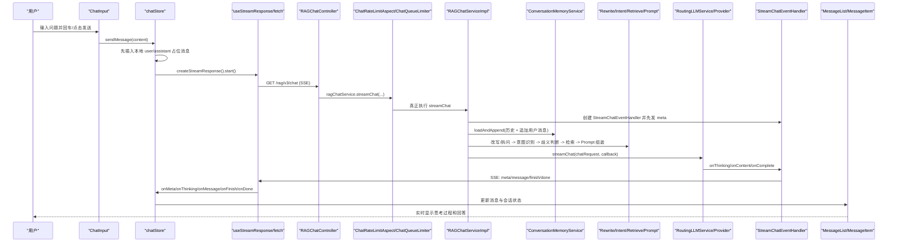

# 从前端提问到后端回答的全链路函数调用

## 0. 先说结论

1. 这个项目的聊天请求不是 `axios POST`，而是前端直接用 `fetch(GET)` 建立 SSE 长连接，请求地址是 `/api/ragent/rag/v3/chat?...`。
2. “新建会话”在前端大多只是清空本地状态，真正把新会话写进数据库，发生在后端收到第一条用户消息后：`ConversationMemoryService.loadAndAppend(...) -> JdbcConversationMemoryStore.append(...) -> ConversationService.createOrUpdate(...)`。
3. 回答是边生成边回推的：模型流式输出 -> 后端 `StreamChatEventHandler` 转成 SSE -> 前端 `readSseStream` 解析 -> `chatStore` 更新消息 -> `MessageList` / `MessageItem` 重渲染。

## 1. 请求入口与实际 URL

- 前端基础地址来自 `frontend/.env`：`VITE_API_BASE_URL=/api/ragent`
- Vite 代理见 `frontend/vite.config.ts`：`/api` 会被代理到 `http://localhost:9090`
- Spring Boot 上下文路径见 `bootstrap/src/main/resources/application.yaml`：`server.servlet.context-path=/api/ragent`

所以用户在浏览器里真正发出的聊天请求是：

```text
GET /api/ragent/rag/v3/chat?question=...&conversationId=...&deepThinking=true|false
Accept: text/event-stream
Authorization: <token>
```

注意：聊天 SSE 请求没有走 `frontend/src/services/api.ts` 的 axios 实例，而是单独在 `chatStore` 里通过 `storage.getToken()` 手动塞 `Authorization` 头。

## 2. 主链路总览



## 3. 正常回答链路（严格按时间顺序）

### 3.1 前端发起提问

1. 用户在输入框输入问题，触发 `frontend/src/components/chat/ChatInput.tsx:45` 的 `handleSubmit()`。
2. `handleSubmit()` 调用 `frontend/src/stores/chatStore.ts:221` 的 `sendMessage(content)`。
3. `sendMessage()` 先做本地乐观更新：
   - 生成一条本地 `userMessage`
   - 生成一条空内容的 `assistantMessage`
   - 如果开启深度思考，还会给 `assistantMessage` 初始化 `thinking`、`isThinking`
4. `sendMessage()` 用 `frontend/src/utils/helpers.ts:18` 的 `buildQuery()` 组装查询参数：
   - `question`
   - `conversationId`
   - `deepThinking`
5. `sendMessage()` 从 `frontend/src/utils/storage.ts` 读取 token，随后创建 SSE 客户端：
   - `frontend/src/stores/chatStore.ts:424` 调用 `createStreamResponse(...)`
   - `frontend/src/hooks/useStreamResponse.ts:164` 返回 `{ start, cancel }`
6. `frontend/src/stores/chatStore.ts:436` 执行 `await start()`。
7. `frontend/src/hooks/useStreamResponse.ts:124` 的 `streamWithRetry()` 用 `fetch()` 发起 GET 请求，并要求 `Accept: text/event-stream`。

### 3.2 请求进入后端前的拦截器/切面

8. 请求到达 Spring MVC 后，先经过 `bootstrap/src/main/java/com/nageoffer/ai/ragent/user/config/SaTokenConfig.java:56` 注册的三个拦截器：
   - `SaInterceptor`：检查登录态
   - `DemoModeInterceptor`：如果是演示模式，可以直接拒绝
   - `UserContextInterceptor.preHandle()`：`bootstrap/.../UserContextInterceptor.java:62`，把当前登录用户写入 `UserContext`
9. 进入 `bootstrap/src/main/java/com/nageoffer/ai/ragent/rag/controller/RAGChatController.java:49` 的 `chat(...)` 前，会先命中 `framework/.../IdempotentSubmitAspect.java:55` 的 `idempotentSubmit(...)`，做防重复提交锁。
10. `RAGChatController.chat(...)` 创建 `new SseEmitter(0L)`，然后调用 `ragChatService.streamChat(question, conversationId, deepThinking, emitter)`。

### 3.3 进入后端聊天主服务

11. `ragChatService.streamChat(...)` 实际实现是 `bootstrap/.../RAGChatServiceImpl.java:82`，但在真正进入实现前，会先被 `bootstrap/.../ChatRateLimitAspect.java:58` 的 `limitStreamChat(...)` 拦截。
12. `ChatRateLimitAspect` 并不直接同步执行业务，而是调用 `bootstrap/.../ChatQueueLimiter.java:111` 的 `enqueue(...)`：
   - 如果全局限流关闭，直接执行
   - 如果全局限流开启，会进入 Redis 队列与信号量控制
13. `ChatQueueLimiter` 获得执行资格后，会回调 `ChatRateLimitAspect.invokeWithTrace(...)`（`bootstrap/.../ChatRateLimitAspect.java:78`），在这里：
   - 生成 `traceId`
   - 生成 `taskId`
   - 写入 `RagTraceContext`
   - 再反射调用真正的 `RAGChatServiceImpl.streamChat(...)`

### 3.4 streamChat 内部编排

14. `RAGChatServiceImpl.streamChat(...)` 开始后，先规范化两个关键 ID：
   - `actualConversationId`
   - `taskId`
15. 然后创建回调对象：`bootstrap/.../StreamCallbackFactory.java:49` 的 `createChatEventHandler(...)`。
16. `createChatEventHandler(...)` 内部 new 出 `bootstrap/.../StreamChatEventHandler.java`，构造时立刻执行 `initialize()`（`bootstrap/.../StreamChatEventHandler.java:78`）：
   - 向前端先发送 `meta` 事件，内容是 `conversationId + taskId`
   - 调用 `bootstrap/.../StreamTaskManager.java:79` 的 `register(...)`，把这次任务与 emitter 注册起来，供后续取消使用

### 3.5 先加载历史，再持久化当前用户问题

17. `RAGChatServiceImpl.streamChat(...)` 调用 `memoryService.loadAndAppend(...)`，位置在 `bootstrap/.../RAGChatServiceImpl.java:93`。
18. `loadAndAppend(...)` 是 `bootstrap/.../ConversationMemoryService.java:60` 的默认方法，内部顺序非常重要：
   - 先 `load(conversationId, userId)`
   - 再 `append(conversationId, userId, ChatMessage.user(question))`
19. `load(...)` 落到 `bootstrap/.../DefaultConversationMemoryService.java:44`：
   - 并行调用 `loadSummaryWithFallback(...)`（79 行）
   - 并行调用 `loadHistoryWithFallback(...)`（91 行）
20. `loadHistoryWithFallback(...)` 最终会进入 `bootstrap/.../JdbcConversationMemoryStore.java:54` 的 `loadHistory(...)`：
   - 调 `ConversationMessageService.listMessages(...)`
   - 从数据库拿最近若干轮消息
   - 转成 `ChatMessage`
21. `append(...)` 落到 `bootstrap/.../DefaultConversationMemoryService.java:102`，继续调用 `JdbcConversationMemoryStore.append(...)`（`bootstrap/.../JdbcConversationMemoryStore.java:75`）。
22. `JdbcConversationMemoryStore.append(...)` 做两件事：
   - 调 `ConversationMessageServiceImpl.addMessage(...)`（`bootstrap/.../ConversationMessageServiceImpl.java:53`）把当前用户消息写入 `conversation_message`
   - 如果这条消息角色是 `USER`，再调用 `ConversationServiceImpl.createOrUpdate(...)`（`bootstrap/.../ConversationServiceImpl.java:92`）创建/更新会话
23. 也就是说：新会话第一次真正落库，不是前端点“新建会话”时，而是这里第一次 `append(USER)` 时。
24. `ConversationServiceImpl.createOrUpdate(...)` 如果发现会话不存在，会调用 `generateTitleFromQuestion(...)`（`bootstrap/.../ConversationServiceImpl.java:186`）用 LLM 根据首问生成标题。

### 3.6 问题改写与多子问题拆分

25. `RAGChatServiceImpl.streamChat(...)` 调用 `queryRewriteService.rewriteWithSplit(question, history)`，位置在 `bootstrap/.../RAGChatServiceImpl.java:95`。
26. 实现类是 `bootstrap/.../MultiQuestionRewriteService.java:70` 的 `rewriteWithSplit(String, List<ChatMessage>)`：
   - 先做术语归一化
   - 如果开启 query rewrite，再进入 `callLLMRewriteAndSplit(...)`（100 行）
27. `callLLMRewriteAndSplit(...)` 会：
   - `buildRewriteRequest(...)`（130 行）构造“问题改写 + 拆问”的提示词
   - 调 `llmService.chat(req)` 获取同步结果
   - `parseRewriteAndSplit(...)`（160 行）把模型 JSON 响应解析成 `RewriteResult`

### 3.7 意图识别与歧义判断

28. `RAGChatServiceImpl.streamChat(...)` 调用 `intentResolver.resolve(rewriteResult)`，位置在 `bootstrap/.../RAGChatServiceImpl.java:96`。
29. `bootstrap/.../IntentResolver.java:53` 的 `resolve(...)` 会对每个子问题并行分类：
   - 每个子问题都会走 `classifyIntents(...)`（85 行）
   - `classifyIntents(...)` 实际依赖 `DefaultIntentClassifier.classifyTargets(...)`
30. `DefaultIntentClassifier.classifyTargets(...)` 的核心逻辑是：
   - 读取 Redis / DB 中的意图树
   - 组装意图分类 Prompt
   - 调 `llmService.chat(...)`
   - 返回按得分排序后的 `NodeScore` 列表
31. `RAGChatServiceImpl.streamChat(...)` 接着调用 `guidanceService.detectAmbiguity(...)`，位置在 `bootstrap/.../RAGChatServiceImpl.java:98`。
32. `bootstrap/.../IntentGuidanceService.java:51` 的 `detectAmbiguity(...)` 用于判断：
   - 当前问题是否命中了多个相近系统
   - 是否应该先返回“请你选择系统/范围”的澄清提示

### 3.8 可能的两个短路出口

33. 如果 `detectAmbiguity(...)` 返回需要澄清：
   - `RAGChatServiceImpl.streamChat(...)` 直接 `callback.onContent(prompt)`
   - 再 `callback.onComplete()`
   - 整个链路不会再进入检索
34. 如果所有意图都是 `SYSTEM` 类型：
   - 走 `streamSystemResponse(...)`（`bootstrap/.../RAGChatServiceImpl.java:148`）
   - 直接用系统 Prompt + 历史消息拼出 `ChatRequest`
   - 跳过知识库检索

### 3.9 检索知识库 / MCP 工具

35. 正常 RAG 场景会进入 `retrievalEngine.retrieve(...)`，位置在 `bootstrap/.../RAGChatServiceImpl.java:119`。
36. `bootstrap/.../RetrievalEngine.java:82` 的 `retrieve(...)` 会对每个子问题并行调用 `buildSubQuestionContext(...)`（128 行）。
37. `buildSubQuestionContext(...)` 会拆成两条子链：
   - `retrieveAndRerank(...)`（198 行）：做 KB 检索
   - `executeMcpTools(...)`（227 行）：做 MCP 工具调用
38. `retrieveAndRerank(...)` 又会进入 `bootstrap/.../MultiChannelRetrievalEngine.java:66` 的 `retrieveKnowledgeChannels(...)`。
39. `MultiChannelRetrievalEngine.retrieveKnowledgeChannels(...)` 内部分两段：
   - `executeSearchChannels(...)`（83 行）：并行执行多个检索通道
   - `executePostProcessors(...)`（167 行）：去重、重排等后处理
40. 检索完成后，`RetrievalEngine` 会把结果格式化成：
   - `kbContext`
   - `mcpContext`
   - `intentChunks`
41. 如果 `ctx.isEmpty()`，`RAGChatServiceImpl.streamChat(...)` 会直接返回固定话术，再 `callback.onComplete()`，不再调用大模型生成正式回答。

### 3.10 Prompt 组装

42. 如果检索有结果，`RAGChatServiceImpl.streamChat(...)` 会调用 `streamLLMResponse(...)`（`bootstrap/.../RAGChatServiceImpl.java:169`）。
43. `streamLLMResponse(...)` 会先构造 `PromptContext`，随后调用 `bootstrap/.../RAGPromptService.java:66` 的 `buildStructuredMessages(...)`：
   - 先放系统 Prompt
   - 再放 MCP 结果
   - 再放 KB 证据
   - 再拼接历史消息
   - 最后放用户问题或多子问题列表
44. 系统 Prompt 的模板选择逻辑在 `bootstrap/.../RAGPromptService.java:55` 的 `buildSystemPrompt(...)`：
   - 纯 KB
   - 纯 MCP
   - MCP + KB 混合

### 3.11 路由到具体大模型并开始流式生成

45. `RAGChatServiceImpl.streamLLMResponse(...)` 最终调用 `llmService.streamChat(chatRequest, callback)`。
46. 实现类是 `infra-ai/.../RoutingLLMService.java:93` 的 `streamChat(...)`。
47. `RoutingLLMService.streamChat(...)` 先通过 `ModelSelector.selectChatCandidates(deepThinking)` 选模型：
   - 如果 `deepThinking=true`，优先 `deep-thinking-model`
   - 否则优先 `default-model`
   - 同时结合 `supportsThinking` 和健康状态筛选候选模型
48. 之后 `RoutingLLMService` 会循环尝试多个 provider client：
   - 百炼：`infra-ai/.../BaiLianChatClient.java:102`
   - SiliconFlow：`infra-ai/.../SiliconFlowChatClient.java:103`
   - Ollama：`infra-ai/.../OllamaChatClient.java:125`
49. 具体 client 的 `doStream(...)` 会读取上游厂商的流式响应：
   - 解析 `reasoning_content` / `content`
   - 转成 `callback.onThinking(...)`
   - 转成 `callback.onContent(...)`
   - 完成时调用 `callback.onComplete()`

### 3.12 后端把模型流转成 SSE

50. 大模型回调传回的是 `StreamChatEventHandler`。
51. `StreamChatEventHandler.onThinking(...)`（`bootstrap/.../StreamChatEventHandler.java:129`）会：
   - 把内容切块
   - 发送 `event: message`
   - `data: {"type":"think","delta":"..."}`
52. `StreamChatEventHandler.onContent(...)`（117 行）会：
   - 追加到 `answer` 缓冲区
   - 发送 `event: message`
   - `data: {"type":"response","delta":"..."}`
53. `StreamChatEventHandler.onComplete(...)`（140 行）会：
   - 调 `memoryService.append(...)` 把完整 assistant 回答落库
   - 取会话标题
   - 发送 `finish` 事件，payload 是 `CompletionPayload(messageId, title)`
   - 再发送 `done`
   - `taskManager.unregister(taskId)`
   - `sender.complete()`
54. SSE 实际发送动作统一经过 `framework/.../SseEmitterSender.java`。

### 3.13 前端消费 SSE 并更新界面

55. 浏览器侧 `frontend/src/hooks/useStreamResponse.ts:33` 的 `readSseStream(...)` 持续读取 `response.body.getReader()`。
56. 每收到一个完整 SSE 事件块，就会进入 `dispatchEvent()`（44 行），再根据 `eventName` 分发：
   - `meta`
   - `message`
   - `finish`
   - `done`
   - `cancel`
   - `reject`
57. `meta` 事件进入 `frontend/src/stores/chatStore.ts:268` 的 `onMeta(...)`：
   - 写入 `currentSessionId`
   - 写入 `streamTaskId`
   - 把当前会话 upsert 到 `sessions`
   - 如果用户已经先点了停止，这里会立刻补发 `stopTask(taskId)`
58. `message(type=think)` 进入 `frontend/src/stores/chatStore.ts:293` 的 `onThinking(...)`，随后调用 `appendThinkingContent(...)`（483 行），把思考过程追加到当前 assistant 消息。
59. `message(type=response)` 进入 `frontend/src/stores/chatStore.ts:288` 的 `onMessage(...)`，随后调用 `appendStreamContent(...)`（462 行），把回答正文追加到当前 assistant 消息。
60. `finish` 进入 `frontend/src/stores/chatStore.ts:302` 的 `onFinish(...)`：
   - 把服务端 messageId 替换本地临时 assistantId
   - 标记消息状态为 `done`
   - 更新会话标题和最后时间
61. `done` 进入 `frontend/src/stores/chatStore.ts:383` 的 `onDone(...)`，清空 `isStreaming / streamTaskId / streamAbort / streamingMessageId`。
62. `frontend/src/pages/ChatPage.tsx:75` 的 effect 观察到 `currentSessionId` 变化后，会自动把路由改成 `/chat/{conversationId}`。
63. `frontend/src/components/chat/MessageList.tsx:16` 收到新 `messages` 后重新渲染列表。
64. `frontend/src/components/chat/MessageItem.tsx:15` 根据消息状态渲染：
   - 用户消息
   - 思考中 UI
   - 折叠/展开的深度思考内容
   - Markdown 正文回答
   - 点赞/点踩入口

## 4. SSE 事件和前后端函数对照

| SSE 事件 | 后端发送位置 | 前端消费位置 | 作用 |
| --- | --- | --- | --- |
| `meta` | `StreamChatEventHandler.initialize()`；排队拒绝时也会由 `ChatQueueLimiter.sendRejectEvents()` 发送 | `readSseStream() -> onMeta()` | 把 `conversationId`、`taskId` 发给前端 |
| `message` + `type=think` | `StreamChatEventHandler.onThinking()` | `readSseStream() -> onThinking()` | 流式显示思考过程 |
| `message` + `type=response` | `StreamChatEventHandler.onContent()` | `readSseStream() -> onMessage()` | 流式显示回答正文 |
| `finish` | `StreamChatEventHandler.onComplete()`；排队拒绝时也会发送 | `readSseStream() -> onFinish()` | 回传最终 `messageId`、`title` |
| `done` | `StreamChatEventHandler.onComplete()` / `StreamTaskManager.sendCancelAndDone()` / `ChatQueueLimiter.sendRejectEvents()` | `readSseStream() -> onDone()` | 告诉前端这次流结束了 |
| `cancel` | `StreamTaskManager.sendCancelAndDone()` | `readSseStream() -> onCancel()` | 返回“已停止生成”的完成态 |
| `reject` | `ChatQueueLimiter.sendRejectEvents()` | `readSseStream() -> onReject()` | 排队超时/系统繁忙时返回拒绝消息 |

## 5. 分支链路

### 5.1 排队超时 / 系统繁忙

1. `ChatQueueLimiter.enqueue(...)`
2. `scheduleQueuePoll(...)`
3. 超时后执行 `recordRejectedConversation(...)`
4. 先落库用户消息，再落库 assistant 的拒绝文案
5. `sendRejectEvents(...)` 依次发送 `meta -> reject -> finish -> done`
6. 前端 `onReject(...)` 最终还是走 `appendStreamContent(...)` 显示拒绝文本

### 5.2 歧义澄清

1. `IntentGuidanceService.detectAmbiguity(...)` 判断用户问法命中多个近似系统
2. `RAGChatServiceImpl.streamChat(...)` 直接：
   - `callback.onContent(guidancePrompt)`
   - `callback.onComplete()`
3. 前端看到的是一条 assistant 消息，但本质上这是澄清提示，不是正式检索答案

### 5.3 纯 SYSTEM 意图

1. `IntentResolver.isSystemOnly(...)` 命中
2. `RAGChatServiceImpl.streamSystemResponse(...)`
3. 直接用系统 Prompt + 历史消息调用 `llmService.streamChat(...)`
4. 不走知识库检索

### 5.4 检索为空

1. `RetrievalEngine.retrieve(...)` 返回空上下文
2. `RAGChatServiceImpl.streamChat(...)` 直接输出固定兜底文案
3. 然后 `callback.onComplete()`

### 5.5 用户主动停止生成

1. 前端点击停止按钮，进入 `frontend/src/stores/chatStore.ts:454` 的 `cancelGeneration()`
2. 如果这时已经拿到 `taskId`，立刻调用 `stopTask(taskId)`，也就是 `/rag/v3/stop`
3. 如果这时还没拿到 `taskId`，只会先把 `cancelRequested=true`
4. 等 `meta` 到达后，`onMeta(...)` 会补发一次 `stopTask(taskId)`
5. 后端停止链路：
   - `RAGChatController.stop(...)`
   - `RAGChatServiceImpl.stopTask(...)`
   - `StreamTaskManager.cancel(...)`
   - `cancelLocal(...)`
6. `cancelLocal(...)` 会：
   - 调 `handle.cancel()` 取消上游模型请求
   - 调 `buildCompletionPayloadOnCancel()` 保存已经生成的部分回答
   - 发送 `cancel -> done`
7. 前端 `onCancel(...)` 把这条 assistant 消息标记成 `cancelled`

### 5.6 模型失败与 fallback

1. `RoutingLLMService.streamChat(...)` 会遍历多个候选模型
2. 如果当前 provider/client 启动流失败、首包超时、无内容或报错，会自动切下一个候选
3. 所有候选都失败时，`notifyAllFailed(...)` 调 `callback.onError(...)`
4. `StreamChatEventHandler.onError(...)` 会 `sender.fail(t)`，SSE 连接异常结束
5. 前端 `await start()` 抛错后进入 `handlers.onError(...)`，把当前消息标记为 `error`

## 6. 这条链路里最容易忽略的 6 个点

1. `createSession()`（`frontend/src/stores/chatStore.ts:111`）只是本地状态切换，不会调用后端创建会话。
2. 真正的会话创建时机，是后端第一次追加 `USER` 消息时。
3. 聊天请求没有走 axios，因此 `api.ts` 的请求/响应拦截器对这条 SSE 链路不生效。
4. 前端真正拿到 `conversationId` 和 `taskId`，依赖的是后端先发出来的 `meta` 事件。
5. assistant 正式消息只有在 `finish` 或 `cancel` 时才会拿到服务端真实 `messageId`；流式阶段用的是前端临时 ID。
6. 前端虽然预留了 `title` 事件处理器，但当前后端主链路真正使用的是 `finish/cancel` payload 里的 `title` 字段。

## 7. 一句话概括

整个问答链路可以压缩成一句话：

`ChatInput.handleSubmit()` -> `chatStore.sendMessage()` -> `fetch(SSE)` -> `RAGChatController.chat()` -> `ChatQueueLimiter` -> `RAGChatServiceImpl.streamChat()` -> `loadAndAppend()` -> `rewriteWithSplit()` -> `resolve()` -> `detectAmbiguity()` -> `retrieve()` -> `buildStructuredMessages()` -> `RoutingLLMService.streamChat()` -> `Provider.streamChat()` -> `StreamChatEventHandler.onThinking/onContent/onComplete()` -> `readSseStream()` -> `chatStore.onMeta/onThinking/onMessage/onFinish/onDone()` -> `MessageList/MessageItem`
