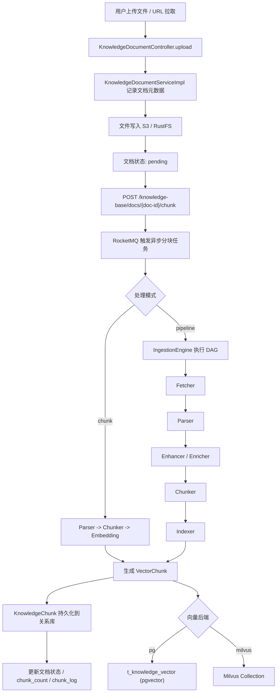
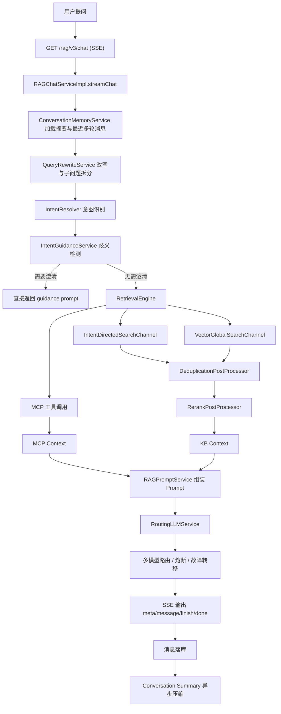

# Ragent 企业级项目说明文档

> 本文基于当前仓库源码、`bootstrap/src/main/resources/application.yaml`、`resources/database/schema_pg.sql`、`mcp-server` 与 `frontend` 工程整理而成。  
> 对于仓库中未完全落地或需按生产环境调整的部分，统一以 `[需根据实际环境配置]` 标注。

## 1. 项目概述 (Project Overview)

### 1.1 一句话描述

Ragent 是一套面向企业知识问答场景的 RAG 平台，通过“文档摄取流水线 + 意图驱动检索 + 多模型路由 + 会话记忆”能力，将非结构化知识资产转化为可追踪、可运营、可扩展的智能问答服务。

### 1.2 核心价值

- 让企业文档从“存着”变成“可被检索、被理解、被问答”。
- 将知识入库、向量化、问答、反馈、追踪、运维配置打通为完整闭环。
- 通过模块化分层设计降低模型供应商、向量库和摄取流程的替换成本。

### 1.3 核心功能特性

- 支持多格式文档摄取：本地文件上传、URL 拉取；解析层支持 Tika/Markdown 解析策略。
- 支持两类知识入库模式：直接分块模式 `chunk`、可编排 DAG 流水线模式 `pipeline`。
- 支持多种分块策略：`fixed_size`、`structure_aware`。
- 支持多向量后端：`pgvector` 与 `Milvus` 二选一，当前仓库默认配置为 `pg`。
- 支持多通道检索：意图定向检索、全局向量检索，并带去重与 Rerank 后处理。
- 支持多轮对话：短期记忆、会话标题生成、长对话摘要压缩。
- 支持查询改写与子问题拆分，提高多轮问答和复杂问句的召回率。
- 支持意图树、歧义引导、术语映射、示例问题等运营能力。
- 支持多模型路由与故障转移：Chat / Embedding / Rerank 分别支持候选模型与熔断。
- 支持流式问答：SSE 增量输出，前端可区分 `think` 与 `response`。
- 支持链路追踪与后台运维：Dashboard、Trace、知识库、摄取流水线、用户管理等。
- 支持 MCP 工具调用：通过独立 `mcp-server` 暴露 JSON-RPC 工具能力。

### 1.4 工程模块结构

| 模块 | 职责 | 说明 |
| --- | --- | --- |
| `bootstrap` | 业务主应用 | 对外 REST API、RAG 问答、知识库、摄取、用户/后台管理 |
| `framework` | 通用基础设施 | 统一响应、异常体系、上下文传递、幂等、SSE 封装、Trace 上下文 |
| `infra-ai` | AI 能力适配层 | Chat/Embedding/Rerank 客户端、模型路由、熔断与容错 |
| `mcp-server` | 独立 MCP 工具服务 | MCP HTTP/JSON-RPC 协议端点、工具注册与调用 |
| `frontend` | Web 前端 | React 18 管理后台与对话页面 |

### 1.5 前端可见功能

- 用户侧：登录、对话页、多轮会话切换、流式消息展示。
- 管理侧：Dashboard、知识库/文档/分块管理、摄取流水线、意图树、查询映射、示例问题、Trace、系统设置、用户管理。

## 2. 系统架构与逻辑结构 (System Architecture & Logic Flow)

### 2.1 逻辑分层

Ragent 可以抽象为五层：

1. 接入层
   - `frontend` 提供浏览器端交互。
   - `bootstrap` 通过 REST/SSE 暴露业务 API。
   - `mcp-server` 通过 JSON-RPC 暴露工具能力。

2. 应用编排层
   - RAG 对话编排：记忆加载、改写、意图识别、检索、Prompt 组装、流式输出。
   - 知识摄取编排：上传、解析、分块、向量化、持久化。
   - 后台管理编排：知识库、摄取流水线、用户、配置、Trace 管理。

3. AI 能力层
   - `infra-ai` 负责 Chat/Embedding/Rerank 调用。
   - `ModelSelector + ModelRoutingExecutor + ModelHealthStore` 负责候选选择、熔断与故障转移。

4. 数据与中间件层
   - PostgreSQL：业务元数据、会话记录、摄取流程、Trace、以及可选 `pgvector` 向量表。
   - Milvus：[需根据实际环境配置] 用作独立向量库。
   - Redis/Redisson：分布式锁、幂等、并发控制。
   - RocketMQ：异步文档分块、消息反馈落库。
   - S3/RustFS：原始文档对象存储。

5. 运维与治理层
   - Dashboard 指标聚合。
   - Trace 运行记录与节点记录。
   - 配置中心能力当前以 `application.yaml` 为主，生产建议外置 [需根据实际环境配置]。

### 2.2 模块依赖关系

| 方向 | 说明 |
| --- | --- |
| `frontend -> bootstrap` | 前端通过 `/api/ragent` 访问主应用 |
| `bootstrap -> framework` | 复用统一响应、异常、上下文、幂等等基础设施 |
| `bootstrap -> infra-ai` | 调用模型路由、Embedding、Rerank、流式对话能力 |
| `bootstrap -> mcp-server` | 通过 `rag.mcp.servers` 配置的 HTTP 地址访问 MCP 工具服务 |
| `bootstrap -> PostgreSQL/Redis/RocketMQ/S3/VectorDB` | 业务数据、缓存锁、消息、文件、向量检索与索引 |

### 2.3 数据摄取流程图 (Ingestion Pipeline)



### 2.4 问答检索流程图 (QA Workflow)



### 2.5 关键设计说明

- 当前源码的“混合检索”更准确地说是“多通道检索编排”：意图定向向量检索 + 全局向量检索 + MCP 工具结果融合。
- `QueryTermMapping` 为术语归一化能力，可在检索前做领域词映射，提升口语化问法命中率。
- 当意图树命中多个相近业务系统时，`IntentGuidanceService` 会主动生成引导问题，而不是直接盲答。
- `RoutingLLMService` 对流式输出做了“首包探测 + 缓冲回放”，避免故障模型的脏数据泄漏到客户端。

## 3. 核心模块解析 (Core Modules)

### 3.1 启动与入口

| 类/文件 | 模块 | 作用 |
| --- | --- | --- |
| `RagentApplication` | `bootstrap` | 主业务应用启动入口 |
| `MCPServerApplication` | `mcp-server` | MCP 工具服务启动入口 |
| `application.yaml` | `bootstrap` | 主应用端口、上下文路径、数据源、AI 模型、RAG 策略配置 |
| `application.yml` | `mcp-server` | MCP 服务端口配置，默认 `9099` |

### 3.2 RAG 对话核心

| 类/文件 | 作用 |
| --- | --- |
| `RAGChatController` | 暴露 `/rag/v3/chat` SSE 问答接口与 `/rag/v3/stop` 停止接口 |
| `RAGChatServiceImpl` | RAG 主编排入口，串联记忆、改写、意图、引导、检索、Prompt 与流式生成 |
| `DefaultConversationMemoryService` | 并行加载会话摘要与最近消息，统一追加对话消息 |
| `JdbcConversationMemoryStore` | 从 `t_message` / `t_conversation` 读取与写入对话历史 |
| `JdbcConversationMemorySummaryService` | 在达到阈值后调用 LLM 生成摘要并写入 `t_conversation_summary` |
| `QueryRewriteService` | 用户问题改写与子问题拆分接口 |
| `IntentResolver` | 基于意图分类器对改写后的问题进行并发意图识别 |
| `IntentGuidanceService` | 处理业务系统歧义，生成澄清式引导提示 |
| `RetrievalEngine` | 汇总 KB 检索与 MCP 工具调用结果，输出可供 Prompt 使用的上下文 |
| `RAGPromptService` | 按 KB-only / MCP-only / Mixed 场景组装结构化 Prompt |
| `StreamChatEventHandler` | 将模型流式回调转换为 SSE 事件，并在完成后落库 |

### 3.3 检索与后处理

| 类/文件 | 作用 |
| --- | --- |
| `IntentDirectedSearchChannel` | 按意图树命中的知识域定向检索，对高置信度意图优先召回 |
| `VectorGlobalSearchChannel` | 低置信度或未识别意图时做全局兜底向量检索 |
| `DeduplicationPostProcessor` | 合并多通道结果并去重，保留更优 chunk |
| `RerankPostProcessor` | 调用 Rerank 模型对检索结果做最终重排序 |
| `PgRetrieverService` | 使用 PostgreSQL `pgvector` 检索 `t_knowledge_vector` |
| `MilvusRetrieverService` | 使用 Milvus Collection 做向量检索 |

### 3.4 知识摄取与知识库

| 类/文件 | 作用 |
| --- | --- |
| `KnowledgeBaseController` | 知识库 CRUD、分页、分块策略查询 |
| `KnowledgeBaseServiceImpl` | 创建知识库时同步创建对象存储桶与向量空间 |
| `KnowledgeDocumentController` | 文档上传、触发分块、搜索、启用/禁用、日志查询 |
| `KnowledgeDocumentServiceImpl` | 文档元数据管理、异步分块、URL 定时拉取、分块日志与向量同步 |
| `KnowledgeChunkController` | 分块 CRUD 与批量启停 |
| `KnowledgeChunkServiceImpl` | 分块内容维护、token 统计、增删改时同步向量库 |
| `IngestionEngine` | DAG 摄取引擎，负责节点校验、串联执行、日志采集 |
| `ParserNode` | 基于 MIME/文件名选择解析器，完成文本提取 |
| `ChunkerNode` | 调用分块策略并执行 embedding |
| `IndexerNode` | 创建向量空间并将 `VectorChunk` 写入向量后端 |
| `ChunkingStrategyFactory` | 统一管理不同分块策略实现 |
| `DocumentParserSelector` | 统一管理 Tika/Markdown 等解析器 |

### 3.5 AI 基础设施层

| 类/文件 | 作用 |
| --- | --- |
| `RoutingLLMService` | Chat/Stream Chat 统一入口，负责模型路由、熔断、流式失败切换 |
| `RoutingEmbeddingService` | Embedding 调用路由与失败降级 |
| `RoutingRerankService` | Rerank 调用路由与失败降级 |
| `ModelSelector` | 根据配置、优先级、思考模式筛选候选模型 |
| `ModelRoutingExecutor` | 按候选列表执行调用并在失败时 fallback |
| `ModelHealthStore` | 维护 `CLOSED / OPEN / HALF_OPEN` 熔断状态 |
| `ChatClient` / `EmbeddingClient` / `RerankClient` | 各供应商能力适配接口 |

### 3.6 基础设施与治理

| 类/文件 | 作用 |
| --- | --- |
| `Result` / `Results` | 统一 API 响应包装 |
| `GlobalExceptionHandler` | 统一处理参数校验、登录异常、上传异常、服务异常 |
| `UserContext` | 基于 `TransmittableThreadLocal` 透传当前登录用户 |
| `UserContextInterceptor` | 从 Sa-Token 会话中恢复 `LoginUser` 到线程上下文 |
| `RagTraceContext` | 透传 `traceId`、`taskId`、节点栈，支撑链路追踪 |
| `IdempotentSubmitAspect` | 基于 Redisson 分布式锁防止重复提交 |
| `SseEmitterSender` | SSE 安全发送封装，统一连接关闭与错误处理 |

### 3.7 MCP 工具服务

| 类/文件 | 作用 |
| --- | --- |
| `MCPEndpoint` | 暴露 `/mcp` HTTP 端点 |
| `MCPDispatcher` | 分发 `initialize`、`tools/list`、`tools/call` |
| `DefaultMCPToolRegistry` | 自动发现并注册 MCP 工具执行器 |
| `WeatherMCPExecutor` / `TicketMCPExecutor` / `SalesMCPExecutor` | 示例工具实现 |

### 3.8 当前实现边界与建议

- 当前鉴权登录基于 Sa-Token，会话模式适合中后台与私有部署。
- 初始化数据里默认存在 `admin/admin`；`AuthServiceImpl` 当前按明文比对密码，仅适合演示/开发环境，生产建议接入 BCrypt/LDAP/SSO `[需根据实际安全要求改造]`。
- 向量检索当前主实现是向量通道 + Rerank；如果需要 BM25/ES 关键词检索，可在 `SearchChannel` 体系中继续扩展 `[需根据实际检索架构扩展]`。

## 4. API 接口文档 (API Reference)

### 4.1 统一约定

- 主应用 Base URL：`http://{host}:9090/api/ragent`
- MCP 服务 Base URL：`http://{host}:9099`
- 鉴权 Header：`Authorization: <token>`
- 除 `/auth/**` 外，其余主应用接口默认要求登录
- `admin` 权限接口主要包括 `/users/**` 与 `/admin/**`

统一响应结构：

```json
{
  "code": "0",
  "message": null,
  "data": {}
}
```

分页响应通常遵循 MyBatis-Plus `Page` 结构，常见字段包括：

```json
{
  "code": "0",
  "data": {
    "records": [],
    "total": 12,
    "size": 10,
    "current": 1,
    "pages": 2
  }
}
```

### 4.2 认证与用户

#### 4.2.1 用户登录

- 接口说明：创建 Sa-Token 会话并返回用户令牌
- 方法：`POST`
- 路径：`/auth/login`

Request:

```json
{
  "username": "admin",
  "password": "admin"
}
```

Response:

```json
{
  "code": "0",
  "data": {
    "userId": "2001523723396308993",
    "role": "admin",
    "token": "6a1b0f9c-xxxx-xxxx-xxxx-xxxxxxxxxxxx",
    "avatar": "https://static.deepseek.com/user-avatar/G_6cuD8GbD53VwGRwisvCsZ6"
  }
}
```

#### 4.2.2 当前登录用户

- 接口说明：获取当前登录用户基础信息
- 方法：`GET`
- 路径：`/user/me`

Response:

```json
{
  "code": "0",
  "data": {
    "userId": "2001523723396308993",
    "username": "admin",
    "role": "admin",
    "avatar": "https://static.deepseek.com/user-avatar/G_6cuD8GbD53VwGRwisvCsZ6"
  }
}
```

### 4.3 知识库管理

#### 4.3.1 创建知识库

- 接口说明：创建知识库元数据，并同步创建对象存储桶、向量空间
- 方法：`POST`
- 路径：`/knowledge-base`

Request:

```json
{
  "name": "人事制度库",
  "embeddingModel": "qwen-emb-8b",
  "collectionName": "kb_hr_policy"
}
```

Response:

```json
{
  "code": "0",
  "data": "2002001000000000001"
}
```

#### 4.3.2 分页查询知识库

- 接口说明：查询知识库列表及文档数量
- 方法：`GET`
- 路径：`/knowledge-base`

Query:

```text
current=1&size=10&name=人事
```

Response:

```json
{
  "code": "0",
  "data": {
    "records": [
      {
        "id": "2002001000000000001",
        "name": "人事制度库",
        "embeddingModel": "qwen-emb-8b",
        "collectionName": "kb_hr_policy",
        "documentCount": 12,
        "createdBy": "admin"
      }
    ],
    "total": 1,
    "size": 10,
    "current": 1
  }
}
```

#### 4.3.3 查询可用分块策略

- 接口说明：返回当前前后端可配置的分块策略与默认参数
- 方法：`GET`
- 路径：`/knowledge-base/chunk-strategies`

Response:

```json
{
  "code": "0",
  "data": [
    {
      "value": "fixed_size",
      "label": "固定大小",
      "defaultConfig": {
        "chunkSize": 512,
        "overlapSize": 128
      }
    },
    {
      "value": "structure_aware",
      "label": "语义感知（Markdown友好）",
      "defaultConfig": {
        "targetChars": 1400,
        "overlapChars": 0,
        "maxChars": 1800,
        "minChars": 600
      }
    }
  ]
}
```

### 4.4 文档与分块管理

#### 4.4.1 上传知识文档

- 接口说明：上传文件或登记 URL 源文档，写入文档元数据
- 方法：`POST`
- 路径：`/knowledge-base/{kb-id}/docs/upload`
- Content-Type：`multipart/form-data`

Form-Data 字段：

| 字段 | 类型 | 说明 |
| --- | --- | --- |
| `file` | File | 本地上传文件，`sourceType=file` 时必填 |
| `sourceType` | String | `file` 或 `url` |
| `sourceLocation` | String | URL 地址，`sourceType=url` 时使用 |
| `scheduleEnabled` | Boolean | URL 文档是否开启定时拉取 |
| `scheduleCron` | String | 定时表达式 |
| `processMode` | String | `chunk` 或 `pipeline` |
| `chunkStrategy` | String | `fixed_size` / `structure_aware` |
| `chunkConfig` | String | JSON 字符串 |
| `pipelineId` | String | 流水线 ID，`processMode=pipeline` 时必填 |

示例：

```text
file=@员工手册.pdf
sourceType=file
processMode=chunk
chunkStrategy=structure_aware
chunkConfig={"targetChars":1400,"maxChars":1800,"minChars":600,"overlapChars":0}
```

Response:

```json
{
  "code": "0",
  "data": {
    "id": "2002001000000000101",
    "kbId": "2002001000000000001",
    "docName": "员工手册.pdf",
    "fileType": "application/pdf",
    "fileSize": 245678,
    "status": "pending",
    "processMode": "chunk",
    "chunkStrategy": "structure_aware",
    "enabled": true
  }
}
```

#### 4.4.2 触发文档分块

- 接口说明：异步触发文档解析、分块、向量化与持久化
- 方法：`POST`
- 路径：`/knowledge-base/docs/{doc-id}/chunk`

Response:

```json
{
  "code": "0",
  "data": null
}
```

#### 4.4.3 查询文档列表

- 接口说明：按知识库分页查询文档
- 方法：`GET`
- 路径：`/knowledge-base/{kb-id}/docs`

Query:

```text
current=1&size=10&status=success&keyword=员工
```

Response:

```json
{
  "code": "0",
  "data": {
    "records": [
      {
        "id": "2002001000000000101",
        "kbId": "2002001000000000001",
        "docName": "员工手册.pdf",
        "sourceType": "file",
        "enabled": true,
        "chunkCount": 38,
        "status": "success",
        "processMode": "chunk",
        "chunkStrategy": "structure_aware"
      }
    ],
    "total": 1,
    "size": 10,
    "current": 1
  }
}
```

#### 4.4.4 查询分块列表

- 接口说明：按文档分页查看 chunk 内容
- 方法：`GET`
- 路径：`/knowledge-base/docs/{doc-id}/chunks`

Query:

```text
current=1&size=20&enabled=1
```

Response:

```json
{
  "code": "0",
  "data": {
    "records": [
      {
        "id": "2002001000000000201",
        "docId": "2002001000000000101",
        "chunkIndex": 0,
        "content": "第一章 总则……",
        "enabled": 1,
        "tokenCount": 245
      }
    ],
    "total": 38,
    "size": 20,
    "current": 1
  }
}
```

#### 4.4.5 手工新增分块

- 接口说明：针对已启用且未处于 `running` 状态的文档补充 chunk，并同步向量库
- 方法：`POST`
- 路径：`/knowledge-base/docs/{doc-id}/chunks`

Request:

```json
{
  "index": 39,
  "content": "补充的制度说明文本"
}
```

Response:

```json
{
  "code": "0",
  "data": {
    "id": "2002001000000000202",
    "docId": "2002001000000000101",
    "chunkIndex": 39,
    "content": "补充的制度说明文本",
    "enabled": 1
  }
}
```

### 4.5 对话与检索问答

#### 4.5.1 发起流式问答

- 接口说明：通过 SSE 发起对话；服务端会自动创建或复用会话，并返回流式事件
- 方法：`GET`
- 路径：`/rag/v3/chat`
- 返回类型：`text/event-stream`

Query:

```text
question=如何申请年假
conversationId=2003001000000000001
deepThinking=false
```

SSE 事件说明：

| 事件名 | 载荷 | 说明 |
| --- | --- | --- |
| `meta` | `{"conversationId":"...","taskId":"..."}` | 会话与任务元信息 |
| `message` | `{"type":"think|response","delta":"..."}` | 增量输出 |
| `finish` | `{"messageId":"...","title":"..."}` | 模型输出完成，消息已落库 |
| `done` | `"[DONE]"` | SSE 结束标记 |

示例：

```text
event: meta
data: {"conversationId":"2003001000000000001","taskId":"2003001000000000009"}

event: message
data: {"type":"response","delta":"根据公司制度，年假申请需要"}

event: finish
data: {"messageId":"2003001000000000011","title":"年假申请说明"}

event: done
data: [DONE]
```

#### 4.5.2 停止问答任务

- 接口说明：根据 `taskId` 取消正在进行的流式问答
- 方法：`POST`
- 路径：`/rag/v3/stop`

Request:

```text
taskId=2003001000000000009
```

Response:

```json
{
  "code": "0",
  "data": null
}
```

#### 4.5.3 查询会话列表

- 接口说明：获取当前用户会话列表
- 方法：`GET`
- 路径：`/conversations`

Response:

```json
{
  "code": "0",
  "data": [
    {
      "conversationId": "2003001000000000001",
      "title": "年假申请说明",
      "lastTime": "2026-04-06T21:30:00"
    }
  ]
}
```

#### 4.5.4 查询会话消息

- 接口说明：查看指定会话的消息历史
- 方法：`GET`
- 路径：`/conversations/{conversationId}/messages`

Response:

```json
{
  "code": "0",
  "data": [
    {
      "id": "2003001000000000010",
      "conversationId": "2003001000000000001",
      "role": "user",
      "content": "如何申请年假？",
      "vote": null,
      "createTime": "2026-04-06T21:29:58"
    },
    {
      "id": "2003001000000000011",
      "conversationId": "2003001000000000001",
      "role": "assistant",
      "content": "根据公司制度，年假申请需要……",
      "vote": 1,
      "createTime": "2026-04-06T21:30:05"
    }
  ]
}
```

#### 4.5.5 提交消息反馈

- 接口说明：为某条回答提交点赞/点踩，服务端通过 MQ 异步持久化
- 方法：`POST`
- 路径：`/conversations/messages/{messageId}/feedback`

Request:

```json
{
  "vote": 1,
  "reason": "准确",
  "comment": "回答引用了正确制度条款"
}
```

Response:

```json
{
  "code": "0",
  "data": null
}
```

### 4.6 摄取流水线与任务

#### 4.6.1 创建摄取流水线

- 接口说明：定义可编排的 DAG 节点链路
- 方法：`POST`
- 路径：`/ingestion/pipelines`

Request:

```json
{
  "name": "标准文档摄取流水线",
  "description": "用于 PDF/Markdown 文档入库",
  "nodes": [
    {
      "nodeId": "n1",
      "nodeType": "fetcher",
      "settings": {
        "sourceType": "file"
      },
      "nextNodeId": "n2"
    },
    {
      "nodeId": "n2",
      "nodeType": "parser",
      "settings": {
        "rules": [
          {
            "mimeType": "PDF"
          }
        ]
      },
      "nextNodeId": "n3"
    },
    {
      "nodeId": "n3",
      "nodeType": "chunker",
      "settings": {
        "strategy": "structure_aware",
        "chunkSize": 1400,
        "overlapSize": 0
      },
      "nextNodeId": "n4"
    },
    {
      "nodeId": "n4",
      "nodeType": "indexer",
      "settings": {},
      "nextNodeId": null
    }
  ]
}
```

Response:

```json
{
  "code": "0",
  "data": {
    "id": "2004001000000000001",
    "name": "标准文档摄取流水线",
    "description": "用于 PDF/Markdown 文档入库",
    "nodes": [
      {
        "nodeId": "n1",
        "nodeType": "fetcher",
        "nextNodeId": "n2"
      }
    ]
  }
}
```

#### 4.6.2 创建并执行摄取任务

- 接口说明：显式执行一次摄取流水线
- 方法：`POST`
- 路径：`/ingestion/tasks`

Request:

```json
{
  "pipelineId": "2004001000000000001",
  "source": {
    "type": "url",
    "location": "https://example.com/policy.pdf",
    "fileName": "policy.pdf"
  },
  "metadata": {
    "department": "HR"
  },
  "vectorSpaceId": {
    "logicalName": "kb_hr_policy"
  }
}
```

Response:

```json
{
  "code": "0",
  "data": {
    "taskId": "2004001000000000101",
    "pipelineId": "2004001000000000001",
    "status": "COMPLETED",
    "chunkCount": 24,
    "message": "摄取完成"
  }
}
```

#### 4.6.3 上传文件并触发摄取任务

- 接口说明：通过 multipart 文件直接执行某条摄取流水线
- 方法：`POST`
- 路径：`/ingestion/tasks/upload`
- Content-Type：`multipart/form-data`

Form-Data 字段：

| 字段 | 类型 | 说明 |
| --- | --- | --- |
| `pipelineId` | String | 流水线 ID |
| `file` | File | 待摄取文件 |

### 4.7 系统配置、追踪与运维

#### 4.7.1 查询系统设置

- 接口说明：返回前端所需的 RAG / AI / 上传限制配置
- 方法：`GET`
- 路径：`/rag/settings`

Response:

```json
{
  "code": "0",
  "data": {
    "upload": {
      "maxFileSize": 52428800,
      "maxRequestSize": 104857600
    },
    "rag": {
      "default": {
        "collectionName": "rag_default_store",
        "dimension": 1536,
        "metricType": "COSINE"
      },
      "queryRewrite": {
        "enabled": true,
        "maxHistoryMessages": 4,
        "maxHistoryChars": 500
      }
    },
    "ai": {
      "chat": {
        "defaultModel": "qwen3-max"
      }
    }
  }
}
```

#### 4.7.2 查询 RAG Trace 列表

- 接口说明：分页查看链路运行记录
- 方法：`GET`
- 路径：`/rag/traces/runs`

#### 4.7.3 Dashboard 概览

- 接口说明：查询管理后台聚合指标
- 方法：`GET`
- 路径：`/admin/dashboard/overview`

### 4.8 MCP JSON-RPC 接口

#### 4.8.1 初始化

- 接口说明：MCP 客户端初始化握手
- 方法：`POST`
- 路径：`/mcp`

Request:

```json
{
  "jsonrpc": "2.0",
  "id": 1,
  "method": "initialize",
  "params": {}
}
```

Response:

```json
{
  "jsonrpc": "2.0",
  "id": 1,
  "result": {
    "protocolVersion": "2026-02-28",
    "capabilities": {
      "tools": {
        "listChanged": false
      }
    },
    "serverInfo": {
      "name": "ragent-mcp-server",
      "version": "0.0.1"
    }
  }
}
```

#### 4.8.2 查询工具列表

- 接口说明：返回注册到 MCP 注册表中的工具定义
- 方法：`POST`
- 路径：`/mcp`

Request:

```json
{
  "jsonrpc": "2.0",
  "id": 2,
  "method": "tools/list",
  "params": {}
}
```

#### 4.8.3 调用工具

- 接口说明：执行具体 MCP 工具，例如天气查询
- 方法：`POST`
- 路径：`/mcp`

Request:

```json
{
  "jsonrpc": "2.0",
  "id": 3,
  "method": "tools/call",
  "params": {
    "name": "weather_query",
    "arguments": {
      "city": "北京",
      "queryType": "forecast",
      "days": 3
    }
  }
}
```

Response:

```json
{
  "jsonrpc": "2.0",
  "id": 3,
  "result": {
    "content": [
      {
        "type": "text",
        "text": "北京未来3天天气预报……"
      }
    ],
    "isError": false
  }
}
```

## 5. 数据与存储设计 (Data & Storage Design)

### 5.1 数据分层原则

Ragent 的数据设计遵循“元数据进关系库、语义向量进向量库、原始文件进对象存储、锁与异步控制交给中间件”的原则：

- 关系型数据库负责强一致元数据、流程状态、权限与审计。
- 向量数据库负责语义近邻检索与 TopK 召回。
- 对象存储负责原始文件保存与二次拉取。
- Redis/Redisson 负责锁、并发控制和幂等。
- RocketMQ 负责异步任务解耦。

### 5.2 关系型数据库职责

主业务表按领域可以分为五组：

1. 用户与认证
   - `t_user`

2. 会话与反馈
   - `t_conversation`
   - `t_message`
   - `t_conversation_summary`
   - `t_message_feedback`
   - `t_sample_question`

3. 知识库管理
   - `t_knowledge_base`
   - `t_knowledge_document`
   - `t_knowledge_chunk`
   - `t_knowledge_document_chunk_log`
   - `t_knowledge_document_schedule`
   - `t_knowledge_document_schedule_exec`

4. RAG 运营与治理
   - `t_intent_node`
   - `t_query_term_mapping`
   - `t_rag_trace_run`
   - `t_rag_trace_node`

5. 摄取编排
   - `t_ingestion_pipeline`
   - `t_ingestion_pipeline_node`
   - `t_ingestion_task`
   - `t_ingestion_task_node`

### 5.3 向量数据库职责

Ragent 通过 `rag.vector.type` 在两种模式间切换：

#### 方案 A：`pgvector`（当前仓库默认）

- 向量表：`t_knowledge_vector`
- 字段：
  - `id`：分块 ID
  - `content`：分块文本
  - `metadata`：JSONB 元数据，包含 `collection_name`、`doc_id`、`chunk_index`
  - `embedding`：`vector(1536)`
- 检索方式：
  - 使用 `<=>` 余弦距离
  - 使用 HNSW 索引 `idx_kv_embedding`

适用场景：

- 中小规模知识库
- 希望元数据与向量共库管理
- 运维栈尽量简化

#### 方案 B：Milvus

- 每个知识库对应一个 Collection
- 由 `VectorStoreAdmin` 创建向量空间
- `MilvusVectorStoreService` 负责插入、删除、更新

适用场景：

- 大规模语义检索
- 独立向量集群治理
- 更高的检索性能与容量需求 `[需根据实际负载评估]`

### 5.4 PostgreSQL/MySQL 与向量数据库分工

| 维度 | 关系库 (PostgreSQL/MySQL) | 向量库 (pgvector/Milvus) |
| --- | --- | --- |
| 数据类型 | 用户、会话、文档、任务、日志、配置 | 分块 embedding 与相似度检索索引 |
| 写入方式 | 事务型写入 | 批量写入/更新 |
| 查询方式 | 条件过滤、分页、聚合、审计 | TopK 相似召回 |
| 一致性角色 | 事实源、主数据 | 检索加速副本 |
| 删除策略 | 逻辑删除为主 | 物理删除向量记录 |

### 5.5 对象存储

- 当前代码通过 `FileStorageService` 对接 S3 兼容存储。
- 默认示例配置为 `rustfs`，端口 `9000`。
- 知识库创建时会以 `collectionName` 创建 bucket。
- 如果生产环境使用 MinIO、AWS S3、OSS 等，可保持 S3 协议兼容 `[需根据实际环境配置]`。

### 5.6 Redis 与 RocketMQ 分工

Redis / Redisson：

- `IdempotentSubmitAspect` 的防重复提交锁
- 会话摘要压缩分布式锁
- 全局并发控制、文档上传信号量等

RocketMQ：

- 文档分块任务异步触发
- 消息反馈异步落库
- 生产环境建议补充重试、死信、幂等消费治理 `[需根据实际消息中间件规范配置]`

## 6. 环境依赖与部署指南 (Deployment & Configuration)

### 6.1 运行时依赖

| 组件 | 当前源码信息 | 是否必需 | 说明 |
| --- | --- | --- | --- |
| Java | 17 | 是 | 后端运行时 |
| Maven | Wrapper 已提供 | 是 | `mvnw` / `mvnw.cmd` |
| Node.js | [需根据前端构建环境选择，建议 18+] | 是 | 前端构建与启动 |
| PostgreSQL | `application.yaml` 默认 `5432/ragent` | 是 | 主业务库；默认启用 `pgvector` 时也承担向量存储 |
| pgvector 扩展 | `schema_pg.sql` 启用 `CREATE EXTENSION vector` | 默认是 | `rag.vector.type=pg` 时必需 |
| Milvus 2.6.x | `resources/docker/milvus-stack-2.6.6.compose.yaml` | 条件必需 | `rag.vector.type=milvus` 时使用 |
| Redis | 默认 `127.0.0.1:6379` | 是 | 锁、并发控制、Sa-Token 持久化 |
| RocketMQ 5.2 | `resources/docker/rocketmq-stack-5.2.0.compose.yaml` | 建议启用 | 异步分块与反馈 |
| S3 兼容对象存储 | 默认 `rustfs` | 是 | 文档原始文件存储 |
| MCP Server | 默认 `http://localhost:9099` | 条件必需 | 启用 MCP 工具问答时必需 |
| Ollama | 默认 `http://localhost:11434` | 可选 | 本地模型接入 |

### 6.2 关键配置项

#### 主应用网络与上下文

| 配置项 | 默认值 | 说明 |
| --- | --- | --- |
| `server.port` | `9090` | 主应用端口 |
| `server.servlet.context-path` | `/api/ragent` | API 根路径 |
| `spring.servlet.multipart.max-file-size` | `50MB` | 单文件上传限制 |
| `spring.servlet.multipart.max-request-size` | `100MB` | 单请求上传限制 |

#### 数据源与中间件

| 配置项 | 默认值 | 说明 |
| --- | --- | --- |
| `spring.datasource.url` | `jdbc:postgresql://127.0.0.1:5432/ragent?client_encoding=UTF8` | PostgreSQL 连接串 |
| `spring.datasource.username` | `postgres` | 数据库用户名 |
| `spring.datasource.password` | `postgres` | 数据库密码 |
| `spring.data.redis.host` | `127.0.0.1` | Redis 地址 |
| `spring.data.redis.password` | `123456` | Redis 密码 |
| `rocketmq.name-server` | `127.0.0.1:9876` | RocketMQ NameServer |
| `milvus.uri` | `http://localhost:19530` | Milvus 地址 |
| `rustfs.url` | `http://localhost:9000` | S3 兼容存储地址 |

#### RAG 相关

| 配置项 | 默认值 | 说明 |
| --- | --- | --- |
| `rag.vector.type` | `pg` | `pg` 或 `milvus` |
| `rag.default.collection-name` | `rag_default_store` | 默认向量空间 |
| `rag.default.dimension` | `1536` | 向量维度 |
| `rag.query-rewrite.enabled` | `true` | 是否启用问题改写 |
| `rag.memory.history-keep-turns` | `4` | 保留最近轮次 |
| `rag.memory.summary-start-turns` | `5` | 触发摘要压缩阈值 |
| `rag.search.channels.vector-global.confidence-threshold` | `0.6` | 低置信度时启用全局检索 |
| `rag.mcp.servers[0].url` | `http://localhost:9099` | MCP 服务地址 |

#### AI Provider 相关

| 配置项 | 默认值 | 说明 |
| --- | --- | --- |
| `ai.providers.ollama.url` | `http://localhost:11434` | 本地模型服务 |
| `ai.providers.bailian.url` | `https://dashscope.aliyuncs.com` | 百炼地址 |
| `ai.providers.siliconflow.url` | `https://api.siliconflow.cn` | SiliconFlow 地址 |
| `ai.chat.default-model` | `qwen3-max` | 默认对话模型 |
| `ai.embedding.default-model` | `qwen-emb-8b` | 默认向量模型 |
| `ai.rerank.default-model` | `qwen3-rerank` | 默认重排序模型 |

### 6.3 推荐环境变量清单

当前仓库只有部分字段通过环境变量读取，生产环境建议将以下配置统一外置：

| 环境变量 | 作用 | 备注 |
| --- | --- | --- |
| `BAILIAN_API_KEY` | 百炼 API Key | 代码已支持 |
| `SILICONFLOW_API_KEY` | SiliconFlow API Key | 代码已支持 |
| `SPRING_DATASOURCE_URL` | PostgreSQL 连接串 | `[需根据实际环境配置]` |
| `SPRING_DATASOURCE_USERNAME` | PostgreSQL 用户名 | `[需根据实际环境配置]` |
| `SPRING_DATASOURCE_PASSWORD` | PostgreSQL 密码 | `[需根据实际环境配置]` |
| `SPRING_DATA_REDIS_HOST` | Redis 地址 | `[需根据实际环境配置]` |
| `SPRING_DATA_REDIS_PASSWORD` | Redis 密码 | `[需根据实际环境配置]` |
| `ROCKETMQ_NAME_SERVER` | RocketMQ NameServer | `[需根据实际环境配置]` |
| `MILVUS_URI` | Milvus 地址 | 使用 Milvus 时需要 |
| `RAG_VECTOR_TYPE` | `pg` / `milvus` | 建议外置 |
| `RUSTFS_URL` | 对象存储地址 | 或替换为真实 S3 Endpoint |
| `RUSTFS_ACCESS_KEY_ID` | 对象存储 AK | `[需根据实际环境配置]` |
| `RUSTFS_SECRET_ACCESS_KEY` | 对象存储 SK | `[需根据实际环境配置]` |
| `RAG_MCP_SERVER_URL` | MCP Server 地址 | `[需根据实际环境配置]` |
| `UNIQUE_NAME` | 多实例区分后缀 | 当前代码使用 `unique-name` 占位符 |
| `VITE_API_BASE_URL` | 前端访问后端基础路径 | 默认 `.env` 为 `/api/ragent` |

> 说明：`SPRING_*`、`ROCKETMQ_*`、`MILVUS_URI` 等变量当前并未在仓库配置文件中全部显式使用，但生产部署强烈建议通过环境变量/配置中心外置，这里按最佳实践给出推荐项。

### 6.4 数据初始化

1. 创建数据库并执行：

```sql
\i resources/database/schema_pg.sql
\i resources/database/init_data_pg.sql
```

2. 初始化后会生成默认管理员：

- 用户名：`admin`
- 密码：`admin`

> 仅适用于本地演示，请在首次部署后立即修改 `[需根据实际安全规范处理]`。

### 6.5 Docker 依赖启动示例

#### 方案 A：启用 Milvus

```powershell
docker compose -f resources/docker/milvus-stack-2.6.6.compose.yaml up -d
```

这会拉起：

- `rustfs`
- `etcd`
- `milvus-standalone`
- `attu`

#### 方案 B：启用 RocketMQ

```powershell
docker compose -f resources/docker/rocketmq-stack-5.2.0.compose.yaml up -d
```

### 6.6 服务启动顺序建议

1. PostgreSQL + pgvector 扩展
2. Redis
3. RocketMQ
4. S3/RustFS
5. Milvus（如果 `rag.vector.type=milvus`）
6. `mcp-server`
7. `bootstrap`
8. `frontend`

### 6.7 本地启动示例

#### 启动主应用

```powershell
.\mvnw.cmd -pl bootstrap -am spring-boot:run
```

#### 启动 MCP 服务

```powershell
.\mvnw.cmd -pl mcp-server -am spring-boot:run
```

#### 启动前端

```powershell
cd frontend
npm install
npm run dev
```

### 6.8 生产部署建议

- 建议使用 Nginx / APISIX / Ingress 将前端、`/api/ragent`、`/mcp` 统一暴露。
- 建议将 PostgreSQL、Redis、RocketMQ、对象存储独立部署，不与应用进程共机 `[需根据实际容量规划]`。
- 建议将 `application.yaml` 中的数据库、Redis、对象存储、模型 API Key 全部外置到环境变量或配置中心。
- 建议为 `bootstrap` 与 `mcp-server` 分别配置健康检查、日志采集和 JVM 参数。
- 建议补充密码加密、审计日志、RBAC 细粒度授权、消息重试/死信策略、对象存储生命周期策略 `[需根据企业规范扩展]`。

## 7. 附录：源码与文档结论摘要

### 7.1 可以直接确认的事实

- 主服务端口默认为 `9090`，上下文路径为 `/api/ragent`。
- MCP 服务端口默认为 `9099`。
- 当前默认向量后端是 `pgvector`，但代码同时支持 Milvus。
- 文档处理模式已落地 `chunk` 与 `pipeline` 两条路径。
- 已实现的摄取节点类型包括：`fetcher`、`parser`、`enhancer`、`chunker`、`enricher`、`indexer`。
- 登录会话依赖 Sa-Token，除 `/auth/**` 以外接口默认要求登录。

### 7.2 标注为推测或需现场确认的内容

- 生产环境推荐的环境变量外置方案 `[需根据实际环境配置]`
- Milvus / pgvector 二选一时的容量与性能边界 `[需根据实际压测结果确认]`
- 消息中间件在生产环境的重试、死信与监控策略 `[需根据实际运维规范配置]`
- 若接入更多外部知识源（飞书、S3、多租户对象存储等），需要扩展 `SourceType` 与 `FetcherNode` `[需根据实际业务扩展]`
