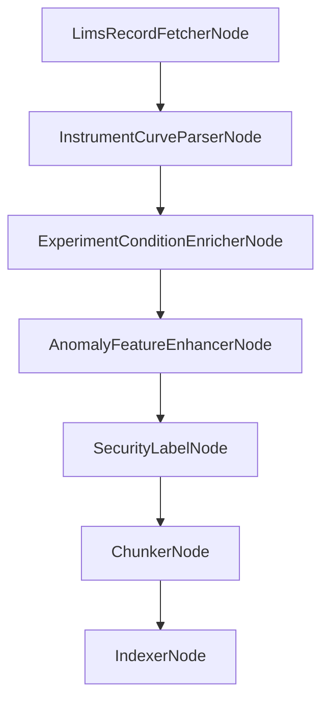
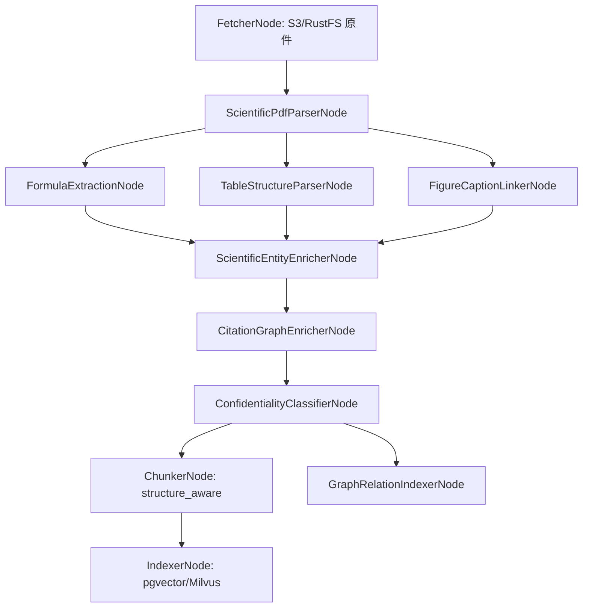
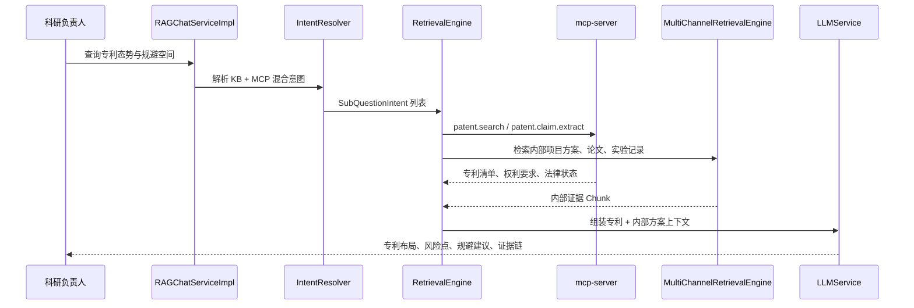
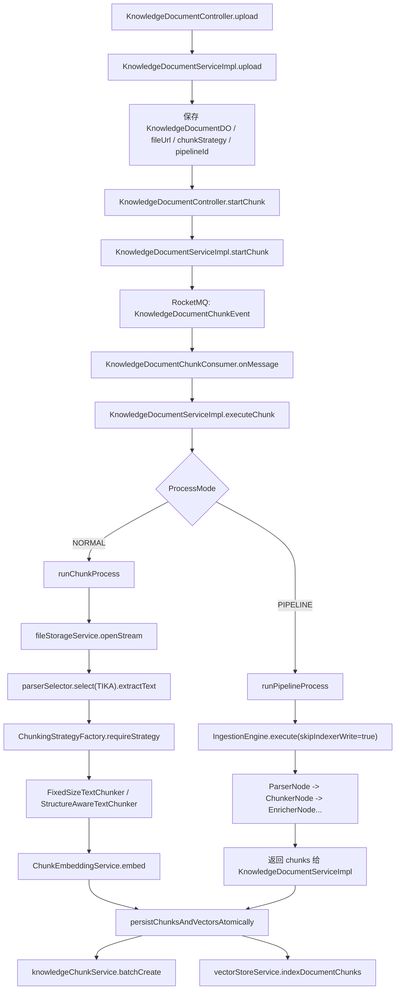
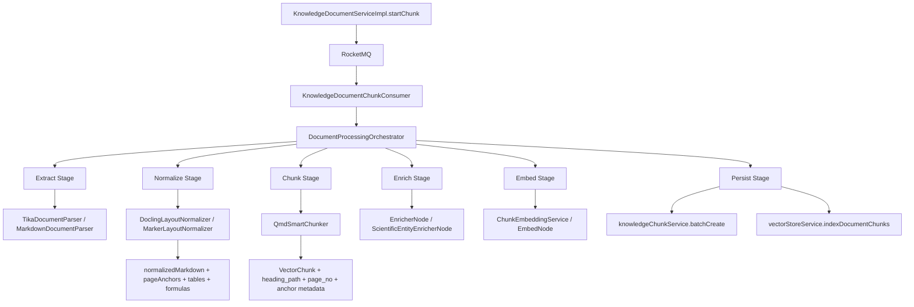
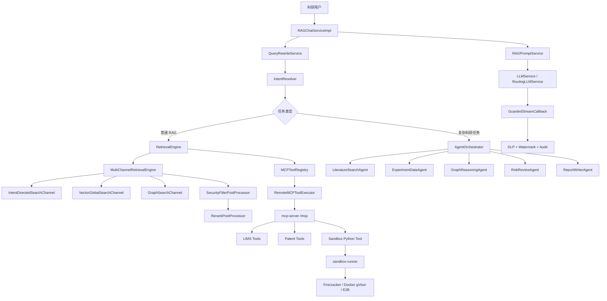

# Ragent 深度科研业务场景定义及架构重构建议

## 0. 背景与总体判断

当前 `Ragent` 已经具备企业级 RAG 平台的核心骨架：

- 对话主链路由 `RAGChatServiceImpl.streamChat()` 串联 `QueryRewriteService`、`IntentResolver`、`RetrievalEngine`、`RAGPromptService` 和 `LLMService`。
- 检索链路由 `RetrievalEngine.retrieve()` 负责统一编排 KB 检索与 MCP 工具调用。
- 多路检索由 `MultiChannelRetrievalEngine.retrieveKnowledgeChannels()` 并行执行多个 `SearchChannel`，再经过 `SearchResultPostProcessor` 链路，其中 `RerankPostProcessor` 负责最终重排。
- 文档摄取由 `IngestionEngine.execute()` 调度 `IngestionNode`，现有节点包含 `FetcherNode`、`ParserNode`、`ChunkerNode`、`EnhancerNode`、`EnricherNode`、`IndexerNode`。
- MCP 服务独立部署在 `mcp-server`，通过 `MCPEndpoint` 暴露 `/mcp` JSON-RPC 入口，由 `MCPDispatcher` 分发 `initialize`、`tools/list`、`tools/call`。
- 权限侧当前 `AuthServiceImpl` 主要完成登录、登出、基础角色返回，适合进一步演进为保密科研场景下的 RBAC + ABAC + Chunk-Level 权限体系。
- 审计侧已有 `RagTraceRunDO` 对应 `t_rag_trace_run`，并通过 `RagTraceAspect`、`RagTraceContext` 记录业务链路，适合作为安全审计的基础事件源继续扩展。

面向 200+ 人保密科研实验室，下一阶段不应只增强“问答效果”，而应把平台升级为 **科研任务型智能体中台**：能够接入实验系统、专利系统、仪器数据、保密论文、组内权限、代码沙盒和审计合规。

---

## 1. 任务一：基于 DAG 引擎与 MCP 服务的深度科研业务场景

## 1.1 场景一：实验数据溯源与异常复核 Agent

### 1.1.1 业务价值

该场景面向保密科研实验室中最常见的问题：实验结果异常后，科研人员需要同时排查样品批次、仪器日志、实验记录、历史论文、标准曲线和操作者记录。传统方式需要人工跨系统查询，耗时长且容易遗漏。

目标是让用户输入：

```text
请帮我复核 2026-04-18 的 A-17 批次催化剂活性异常，比较同配方历史批次，并找出最可能的异常来源。
```

系统自动完成：

- 从 LIMS 查询实验批次、样品、试剂、仪器、操作者。
- 从仪器系统拉取原始谱图、曲线或日志。
- 从 RAG 知识库检索相关 SOP、历史报告、论文和实验记录。
- 通过 MCP 工具执行统计检测。
- 输出异常原因排序、证据链和建议复现实验方案。

### 1.1.2 定制化 MCP Tool 设计

建议在 `mcp-server` 中新增以下工具执行器，均实现 `com.nageoffer.ai.ragent.mcp.core.MCPToolExecutor`：

- `LimsExperimentQueryExecutor`：查询实验批次、样品、操作人、实验条件。
- `LimsSampleLineageExecutor`：查询样品来源、前处理记录、同批次关联样本。
- `InstrumentRawDataFetchExecutor`：拉取仪器原始数据、日志、校准记录。
- `ExperimentAnomalyDetectExecutor`：执行统计异常检测，如 Z-Score、IQR、控制图。
- `LabNotebookSearchExecutor`：查询电子实验记录本 ELN 中的观察记录。

工具定义建议：

```java
@Component
public class LimsExperimentQueryExecutor implements MCPToolExecutor {

    @Override
    public MCPToolDefinition getToolDefinition() {
        return MCPToolDefinition.builder()
                .toolId("lims.experiment.query")
                .description("查询 LIMS 中的实验批次、样品、试剂、仪器和操作记录")
                .parameter("experimentNo", "string", "实验编号", true)
                .parameter("batchNo", "string", "样品批次号", false)
                .parameter("dateRange", "string", "实验日期范围", false)
                .build();
    }

    @Override
    public MCPToolResponse execute(MCPToolRequest request) {
        try {
            Map<String, Object> params = request.getParameters();
            String experimentNo = String.valueOf(params.get("experimentNo"));
            LimsExperimentDTO dto = limsClient.queryExperiment(experimentNo);
            return MCPToolResponse.success(JsonUtil.toJson(dto));
        } catch (Exception ex) {
            log.error("LIMS experiment query failed, request={}", request, ex);
            return MCPToolResponse.error("LIMS_QUERY_FAILED", ex.getMessage());
        }
    }
}
```

### 1.1.3 与现有 `RetrievalEngine` 的交互工作流

当前 `RetrievalEngine.buildMcpRequest()` 已经会基于 `IntentNode.getMcpToolId()` 找到 `MCPToolExecutor`，再通过 `MCPParameterExtractor` 提取参数。因此落地方式是：

- 在意图树中新增 `IntentNode`，`kind=MCP`，`mcpToolId=lims.experiment.query`。
- 为该节点配置 `paramPromptTemplate`，约束 LLM 提取 `experimentNo`、`batchNo`、`dateRange`。
- `RAGChatServiceImpl.streamChat()` 中现有 `IntentResolver.resolve()` 命中该 MCP 意图后，`RetrievalEngine.executeMcpTools()` 自动并行调用工具。
- 工具返回结果进入 `ContextFormatter.formatMcpContext()`，再由 `RAGPromptService` 拼装到最终 Prompt。

```mermaid
flowchart LR
    A["用户问题：复核 A-17 批次异常"] --> B["RAGChatServiceImpl.streamChat"]
    B --> C["QueryRewriteService.rewriteWithSplit"]
    C --> D["IntentResolver.resolve"]
    D --> E1["KB Intent: SOP/历史报告/论文"]
    D --> E2["MCP Intent: lims.experiment.query"]
    E1 --> F1["MultiChannelRetrievalEngine"]
    E2 --> F2["RetrievalEngine.executeMcpTools"]
    F2 --> G["mcp-server /mcp tools/call"]
    G --> H["LimsExperimentQueryExecutor"]
    F1 --> I["RerankPostProcessor"]
    H --> J["ContextFormatter.formatMcpContext"]
    I --> K["ContextFormatter.formatKbContext"]
    J --> L["RAGPromptService.buildStructuredMessages"]
    K --> L
    L --> M["LLMService.streamChat"]
```



### 1.1.4 DAG 摄取扩展方案

对于 LIMS 和仪器数据，建议新增以下 `IngestionNode`：

- `LimsRecordFetcherNode`：从 LIMS 拉取实验结构化数据。
- `InstrumentCurveParserNode`：解析 CSV、XLSX、谱图、曲线文件。
- `ExperimentConditionEnricherNode`：补全温度、压力、试剂、仪器、操作者、批次关系。
- `AnomalyFeatureEnhancerNode`：生成异常检测特征，如峰面积偏移、反应收率偏移、重复实验方差。
- `SecurityLabelNode`：写入 `security_level`、`project_id`、`group_id`、`owner_user_id` 等权限标签。
- `IndexerNode`：继续复用现有向量写入能力，写入 PostgreSQL(pgvector) 或 Milvus。

推荐 DAG：



---

## 1.2 场景二：多模态保密科研论文解析与证据图谱构建

### 1.2.1 业务价值

科研论文和实验报告通常包含：

- 图表、曲线、显微图、谱图。
- 公式、变量、单位。
- 实验条件、材料配比、设备型号。
- 结论、局限性、后续工作。

普通 RAG 只把 PDF 文本切块，会丢失图表、公式和实验关系。建议把 Ingestion 从“文本切块”升级为“多模态结构化理解 + 实体关系抽取 + 权限标注”。

用户可以问：

```text
总结近三年关于固态电解质 LLZO 掺杂策略的论文，按掺杂元素、烧结温度、离子电导率和稳定性做对比。
```

系统输出应包含：

- 表格化对比。
- 图表证据来源。
- 公式和单位归一化。
- 与实验室内部数据的差异。
- 可追溯到 chunk、页码、图编号。

### 1.2.2 自定义 DAG 节点设计

建议新增节点：

- `ScientificPdfParserNode`：基于 Apache Tika + PDFBox + OCR，解析正文、页码、标题层级。
- `FormulaExtractionNode`：抽取 LaTeX / MathML / 图片公式，生成变量说明。
- `TableStructureParserNode`：抽取复杂表格，输出结构化 JSON。
- `FigureCaptionLinkerNode`：将图片、图注、正文引用关联。
- `ScientificEntityEnricherNode`：抽取材料、设备、指标、温度、压力、单位、方法。
- `CitationGraphEnricherNode`：抽取引用关系、被比较对象、实验对照组。
- `ConfidentialityClassifierNode`：对论文或实验记录做密级分类。
- `GraphRelationIndexerNode`：把实体关系写入图数据库或关系型边表。

建议扩展 `StructuredDocument`：

```java
public class ScientificStructuredDocument extends StructuredDocument {

    private List<ScientificFigure> figures;
    private List<ScientificTable> tables;
    private List<FormulaBlock> formulas;
    private List<ScientificEntity> entities;
    private List<RelationTriple> triples;
    private SecurityLabel securityLabel;
}
```

### 1.2.3 多模态保密论文 DAG



### 1.2.4 与 `EnhancerNode` / `EnricherNode` 的关系

当前系统已有 `EnhancerNode` 和 `EnricherNode`，建议保留这两个通用节点，但将科研增强拆成插件化策略：

```java
public interface ScientificEnrichmentStrategy {

    boolean supports(StructuredDocument document, NodeConfig config);

    ScientificEnrichmentResult enrich(StructuredDocument document, IngestionContext context);
}
```

然后由 `ScientificEntityEnricherNode` 聚合策略：

```java
@Component
public class ScientificEntityEnricherNode implements IngestionNode {

    private final List<ScientificEnrichmentStrategy> strategies;

    @Override
    public String getNodeType() {
        return "scientific_entity_enricher";
    }

    @Override
    public NodeResult execute(IngestionContext context, NodeConfig config) {
        try {
            StructuredDocument document = context.getStructuredDocument();
            for (ScientificEnrichmentStrategy strategy : strategies) {
                if (strategy.supports(document, config)) {
                    ScientificEnrichmentResult result = strategy.enrich(document, context);
                    context.mergeMetadata(result.toMetadata());
                }
            }
            return NodeResult.success("科研实体增强完成");
        } catch (Exception ex) {
            log.error("scientific entity enrich failed, taskId={}", context.getTaskId(), ex);
            return NodeResult.fail(ex);
        }
    }
}
```

---

## 1.3 场景三：专利态势分析与科研立项辅助 Agent

### 1.3.1 业务价值

保密科研实验室经常需要在立项前判断：

- 某个方向是否已有专利壁垒。
- 内部方案是否有侵权风险。
- 哪些技术路线仍有空白区。
- 哪些竞争机构正在布局。

该场景把 RAG 从“查资料”升级为“辅助战略判断”。

用户可以问：

```text
围绕高熵合金抗辐照涂层，分析近五年国内外专利布局，找出我们当前 A 方案可能规避的权利要求空间。
```

### 1.3.2 MCP Tool 设计

建议新增工具：

- `patent.search`：按关键词、IPC、申请人、日期检索专利。
- `patent.claim.extract`：抽取权利要求技术特征。
- `patent.family.trace`：追踪同族专利、法律状态。
- `patent.risk.compare`：将内部方案与权利要求做相似度和重叠度分析。
- `internal.project.summary`：从内部知识库读取当前项目方案摘要。

### 1.3.3 工作流



### 1.3.4 DAG 摄取节点

专利摄取建议走独立 Pipeline：

- `PatentFetcherNode`：从内部专利库或外部合规镜像库抓取。
- `PatentParserNode`：解析说明书、权利要求、附图。
- `ClaimFeatureEnricherNode`：抽取技术特征、材料、工艺、参数范围。
- `LegalStatusEnricherNode`：补充授权、驳回、失效、同族。
- `PatentRiskTaggerNode`：打上 `blocking_patent`、`freedom_to_operate` 等标签。
- `IndexerNode`：写入向量库。
- `GraphRelationIndexerNode`：写入“申请人-技术路线-材料-参数范围”的图谱关系。

---

## 2. 任务二：源码深水区架构扩展与重构建议

## 2.1 保密级多租户与 RBAC/ABAC 重构

### 2.1.1 当前问题定位

从源码看，`AuthServiceImpl.login()` 当前主要完成：

- 用户名密码校验。
- `StpUtil.login(loginId)`。
- 返回 `LoginVO(loginId, user.getRole(), token, avatar)`。

这说明目前权限更接近“登录态 + 简单角色”。而 200+ 人保密科研实验室至少需要：

- 公共知识库。
- 课题组私有知识库。
- 跨课题组协作知识库。
- 按密级划分的文档、分块、原件访问。
- 对 MCP 工具、导出、代码执行、外部联网进行单独授权。

### 2.1.2 推荐模型：RBAC + ABAC + Chunk-Level ACL

建议将权限拆成三层：

- **RBAC**：用户、角色、组织、课题组。
- **ABAC**：基于属性的访问控制，如 `security_level <= user.clearance_level`、`project_id in user.projects`。
- **Chunk-Level ACL**：最终检索返回的每个 chunk 都要带权限标签，并在检索前后双重过滤。

核心新增表：

```sql
CREATE TABLE t_org_group (
    id VARCHAR(64) PRIMARY KEY,
    name VARCHAR(128) NOT NULL,
    parent_id VARCHAR(64),
    group_type VARCHAR(32),
    deleted INT DEFAULT 0
);

CREATE TABLE t_user_group_role (
    id VARCHAR(64) PRIMARY KEY,
    user_id VARCHAR(64) NOT NULL,
    group_id VARCHAR(64) NOT NULL,
    role_code VARCHAR(64) NOT NULL,
    deleted INT DEFAULT 0
);

CREATE TABLE t_security_policy_subject (
    id VARCHAR(64) PRIMARY KEY,
    subject_type VARCHAR(32) NOT NULL,
    subject_id VARCHAR(64) NOT NULL,
    clearance_level INT NOT NULL,
    allowed_project_ids TEXT,
    allowed_group_ids TEXT,
    denied_tags TEXT,
    deleted INT DEFAULT 0
);

CREATE TABLE t_chunk_acl (
    id VARCHAR(64) PRIMARY KEY,
    chunk_id VARCHAR(64) NOT NULL,
    kb_id VARCHAR(64) NOT NULL,
    doc_id VARCHAR(64) NOT NULL,
    owner_user_id VARCHAR(64),
    group_id VARCHAR(64),
    project_id VARCHAR(64),
    security_level INT NOT NULL,
    acl_tags TEXT,
    deleted INT DEFAULT 0
);
```

### 2.1.3 实体字段扩展

建议扩展 `KnowledgeBaseDO`：

```java
public class KnowledgeBaseDO {
    private String id;
    private String name;
    private String collectionName;
    private String createdBy;

    // 新增：租户、组织、项目、密级
    private String tenantId;
    private String groupId;
    private String projectId;
    private Integer securityLevel;
    private String visibility; // PUBLIC / GROUP / PROJECT / PRIVATE
}
```

建议扩展 `KnowledgeChunkDO`：

```java
public class KnowledgeChunkDO {
    private String id;
    private String kbId;
    private String docId;
    private String content;

    // 新增：检索后权限校验需要直接命中
    private String tenantId;
    private String groupId;
    private String projectId;
    private Integer securityLevel;
    private String aclTags;
    private String ownerUserId;
}
```

### 2.1.4 Sa-Token 落地方式

建议引入 `PermissionContext`，在 `UserContextInterceptor` 或 Sa-Token 拦截器中加载：

```java
public class PermissionContext {
    private String userId;
    private String tenantId;
    private Set<String> groupIds;
    private Set<String> projectIds;
    private Set<String> roles;
    private Integer clearanceLevel;
    private Set<String> deniedTags;
}
```

```java
@Component
public class SecurityContextLoader {

    public PermissionContext loadCurrent() {
        String userId = StpUtil.getLoginIdAsString();
        UserSecurityProfile profile = userSecurityProfileService.load(userId);
        return PermissionContext.builder()
                .userId(userId)
                .tenantId(profile.getTenantId())
                .groupIds(profile.getGroupIds())
                .projectIds(profile.getProjectIds())
                .roles(profile.getRoles())
                .clearanceLevel(profile.getClearanceLevel())
                .deniedTags(profile.getDeniedTags())
                .build();
    }
}
```

### 2.1.5 检索前过滤：改造 `RetrieveRequest`

当前 `RetrievalEngine` 调用 `MultiChannelRetrievalEngine`，再由 `PgRetrieverService` 或 `MilvusRetrieverService` 查询。建议把权限条件下沉进 `RetrieveRequest`：

```java
public class RetrieveRequest {
    private String query;
    private String collectionName;
    private int topK;

    // 新增权限过滤条件
    private String tenantId;
    private Set<String> allowedGroupIds;
    private Set<String> allowedProjectIds;
    private Integer maxSecurityLevel;
    private Set<String> deniedTags;
}
```

### 2.1.6 PostgreSQL(pgvector) 查询过滤

如果使用 pgvector，建议把权限标签写入 `metadata` JSONB，同时保留关系表字段用于审计和后台管理。检索 SQL 必须先过滤权限，再 ANN 排序：

```sql
SELECT
    id,
    content,
    metadata,
    1 - (embedding <=> ?::vector) AS score
FROM t_knowledge_vector
WHERE metadata->>'tenant_id' = ?
  AND (metadata->>'security_level')::int <= ?
  AND (
      metadata->>'visibility' = 'PUBLIC'
      OR metadata->>'group_id' = ANY(?)
      OR metadata->>'project_id' = ANY(?)
      OR metadata->>'owner_user_id' = ?
  )
  AND NOT (metadata->'acl_tags' ?| ?)
ORDER BY embedding <=> ?::vector
LIMIT ?;
```

### 2.1.7 Milvus 过滤表达式

如果使用 `MilvusRetrieverService`，建议将权限字段作为 scalar field 建索引，查询时带 expr：

```java
String expr = """
tenant_id == "%s"
&& security_level <= %d
&& (visibility == "PUBLIC" || group_id in %s || project_id in %s || owner_user_id == "%s")
""".formatted(
        ctx.getTenantId(),
        ctx.getClearanceLevel(),
        toMilvusArray(ctx.getGroupIds()),
        toMilvusArray(ctx.getProjectIds()),
        ctx.getUserId()
);
```

### 2.1.8 检索后过滤：新增 `SecurityFilterPostProcessor`

检索前过滤用于减少越权候选，检索后过滤用于兜底，建议加入 `SearchResultPostProcessor` 链，顺序放在 `RerankPostProcessor` 前。

```java
@Component
public class SecurityFilterPostProcessor implements SearchResultPostProcessor {

    private final PermissionEvaluator permissionEvaluator;
    private final SecurityContextLoader securityContextLoader;

    @Override
    public String getName() {
        return "SecurityFilter";
    }

    @Override
    public int getOrder() {
        return 1;
    }

    @Override
    public boolean isEnabled(SearchContext context) {
        return true;
    }

    @Override
    public List<RetrievedChunk> process(List<RetrievedChunk> chunks,
                                        List<SearchChannelResult> results,
                                        SearchContext context) {
        PermissionContext permission = securityContextLoader.loadCurrent();
        return chunks.stream()
                .filter(chunk -> permissionEvaluator.canReadChunk(permission, chunk))
                .toList();
    }
}
```

### 2.1.9 MCP 工具权限控制

当前 `RetrievalEngine.executeSingleMcpTool()` 只检查工具是否存在，建议在调用前加入 `MCPToolPermissionService`：

```java
private MCPResponse executeSingleMcpTool(MCPRequest request) {
    String toolId = request.getToolId();
    PermissionContext permission = securityContextLoader.loadCurrent();

    if (!mcpToolPermissionService.canCall(permission, toolId, request.getParameters())) {
        return MCPResponse.error(toolId, "ACCESS_DENIED", "无权调用该工具");
    }

    Optional<MCPToolExecutor> executorOpt = mcpToolRegistry.getExecutor(toolId);
    if (executorOpt.isEmpty()) {
        return MCPResponse.error(toolId, "TOOL_NOT_FOUND", "工具不存在: " + toolId);
    }
    return executorOpt.get().execute(request);
}
```

---

## 2.2 从 Advanced RAG 演进到 GraphRAG / Agentic RAG

### 2.2.1 当前检索架构的优势与瓶颈

当前链路：

```text
RAGChatServiceImpl
 -> QueryRewriteService
 -> IntentResolver
 -> RetrievalEngine
 -> MultiChannelRetrievalEngine
 -> SearchChannel
 -> SearchResultPostProcessor
 -> RerankPostProcessor
 -> RAGPromptService
 -> LLMService
```

优势：

- 通道化好，`SearchChannel` 易扩展。
- 后处理链清晰，适合加入权限过滤、RRF、图谱重排。
- `RetrievalEngine` 已经同时编排 KB 与 MCP，适合扩展 Agentic Tool。

瓶颈：

- `RetrievalEngine.retrieve()` 当前输出仍是 `RetrievalContext`，偏“文本上下文聚合”。
- 多通道检索结果无法精确映射回每个 `IntentNode`，代码里已有注释说明 chunks 会分配给每个意图节点。
- 缺少实体关系层，难以回答“材料-工艺-指标-设备-项目”之间的多跳问题。

### 2.2.2 GraphRAG 扩展点：新增 `GraphSearchChannel`

建议保持 `SearchChannel` 不变，新增图谱检索通道：

```java
@Component
public class GraphSearchChannel implements SearchChannel {

    private final ScientificGraphService graphService;
    private final PermissionEvaluator permissionEvaluator;

    @Override
    public String getName() {
        return "GraphRAG";
    }

    @Override
    public int getPriority() {
        return 3;
    }

    @Override
    public boolean isEnabled(SearchContext context) {
        return context.getIntents().stream()
                .anyMatch(intent -> requiresMultiHopReasoning(intent.subQuestion()));
    }

    @Override
    public SearchChannelResult search(SearchContext context) {
        GraphQueryPlan plan = graphService.plan(context.getMainQuestion());
        List<GraphEvidence> evidences = graphService.execute(plan);
        List<RetrievedChunk> chunks = graphService.toRetrievedChunks(evidences);
        return SearchChannelResult.builder()
                .channelName(getName())
                .channelType(SearchChannelType.GRAPH)
                .chunks(chunks)
                .confidence(0.85)
                .build();
    }
}
```

图谱存储可以选：

- PostgreSQL 边表：适合早期落地，运维简单。
- Neo4j / NebulaGraph：适合多跳查询和可视化。
- Milvus + Graph 混合：向量召回实体，再沿边扩展。

### 2.2.3 图谱数据模型

建议科研实体：

- `Material`
- `Formula`
- `Process`
- `Instrument`
- `Sample`
- `Experiment`
- `Metric`
- `Patent`
- `Paper`
- `Project`

核心关系：

- `Material -[HAS_DOPANT]-> Element`
- `Experiment -[USES_SAMPLE]-> Sample`
- `Experiment -[MEASURED_BY]-> Instrument`
- `Paper -[REPORTS_METRIC]-> Metric`
- `Patent -[CLAIMS]-> TechnicalFeature`
- `Project -[RELATED_TO]-> Material`

### 2.2.4 Agentic RAG：从单引擎到多 Agent 编排

建议不要直接推翻 `RAGChatServiceImpl`，而是新增 `AgentOrchestrator`，让 `RAGChatServiceImpl` 根据意图复杂度选择：

- 简单问答：走当前 `RetrievalEngine`。
- 多步骤科研任务：走 `AgentOrchestrator`。

```java
public interface ResearchAgent {

    String getName();

    boolean supports(ResearchTask task);

    AgentResult execute(AgentContext context);
}
```

建议 Agent：

- `LiteratureSearchAgent`：负责论文、专利、SOP 检索。
- `ExperimentDataAgent`：负责 LIMS、ELN、仪器数据 MCP 调用。
- `GraphReasoningAgent`：负责实体关系、多跳推理。
- `RiskReviewAgent`：负责保密、合规、越权、数据泄露风险检查。
- `ReportWriterAgent`：负责生成结构化报告。

编排伪代码：

```java
@Service
public class AgentOrchestrator {

    private final List<ResearchAgent> agents;
    private final AgentMemoryService memoryService;

    public AgentResult execute(ResearchTask task) {
        AgentContext context = AgentContext.from(task);
        for (ResearchAgent agent : selectAgents(task)) {
            try {
                AgentResult result = agent.execute(context);
                context.merge(result);
                memoryService.append(task.getTaskId(), agent.getName(), result);
            } catch (Exception ex) {
                log.error("agent execute failed, agent={}", agent.getName(), ex);
                context.addWarning(agent.getName() + " 执行失败: " + ex.getMessage());
            }
        }
        return context.toFinalResult();
    }
}
```

对 `RAGChatServiceImpl` 的最小侵入式改造：

```java
if (agenticTaskClassifier.isComplexResearchTask(rewriteResult, subIntents)) {
    AgentResult agentResult = agentOrchestrator.execute(
            ResearchTask.from(question, rewriteResult, subIntents, actualConversationId)
    );
    callback.onContent(agentResult.toMarkdown());
    callback.onComplete();
    return;
}
```

---

## 2.3 代码执行与 MCP 工具调用安全沙盒

### 2.3.1 风险模型

引入智能体和 Python 数据分析脚本后，必须假设 LLM 可能生成：

- 读取宿主机敏感文件的代码。
- 发起外网请求泄露数据。
- 扫描内网服务。
- 持久化恶意脚本。
- 绕过工具参数访问高密级数据。
- 通过 prompt injection 诱导 MCP 工具越权。

因此代码执行不能发生在 `bootstrap` 主服务，也不能直接发生在 `mcp-server` JVM 进程内。

### 2.3.2 推荐架构：`mcp-server` + `sandbox-runner`

建议新增独立服务 `sandbox-runner`，由 `mcp-server` 的工具执行器调用。


### 2.3.3 技术选型建议

优先级建议：

- **Firecracker**：隔离最强，适合保密实验室，高密级数据分析推荐。
- **Docker rootless + gVisor/Kata Containers**：落地成本中等，隔离强于普通容器。
- **E2B 开源方案**：适合快速接入代码解释器能力，但保密内网环境需要私有化部署。
- **普通 Docker**：只适合低密级、非敏感任务，不建议执行高密级代码。

### 2.3.4 `PythonAnalysisMCPExecutor` 设计

```java
@Component
public class PythonAnalysisMCPExecutor implements MCPToolExecutor {

    private final SandboxClient sandboxClient;
    private final SandboxPolicyService policyService;

    @Override
    public MCPToolDefinition getToolDefinition() {
        return MCPToolDefinition.builder()
                .toolId("sandbox.python.execute")
                .description("在隔离沙盒中执行 Python 数据分析脚本")
                .parameter("code", "string", "Python 代码", true)
                .parameter("datasetIds", "array", "允许挂载的数据集 ID", true)
                .parameter("timeoutSeconds", "number", "超时时间", false)
                .build();
    }

    @Override
    public MCPToolResponse execute(MCPToolRequest request) {
        PermissionContext permission = policyService.currentPermission();
        SandboxPolicy policy = policyService.buildPolicy(permission, request);

        if (!policyService.canExecute(policy)) {
            return MCPToolResponse.error("SANDBOX_DENIED", "当前用户无权执行代码或访问数据集");
        }

        SandboxRunRequest runRequest = SandboxRunRequest.builder()
                .code(String.valueOf(request.getParameters().get("code")))
                .image("ragent-python-sci:readonly")
                .timeoutSeconds(policy.getTimeoutSeconds())
                .cpuLimit(policy.getCpuLimit())
                .memoryLimitMb(policy.getMemoryLimitMb())
                .networkMode("none")
                .readOnlyDatasetMounts(policy.getDatasetMounts())
                .writableOutputMount(policy.getOutputMount())
                .build();

        SandboxRunResult result = sandboxClient.run(runRequest);
        return MCPToolResponse.success(result.toSafeText());
    }
}
```

### 2.3.5 数据挂载原则

必须遵守：

- 数据集只读挂载。
- 挂载范围由 `datasetIds` + 用户权限共同决定。
- 输出目录单独挂载，执行后扫描。
- 默认禁网。
- 默认无宿主机路径。
- 默认无 Docker socket。
- 默认无数据库凭证。
- 高密级数据执行后禁止导出原始文件，只允许导出脱敏统计结果。

建议挂载模型：

```text
/mnt/input/{datasetId}/        read-only
/mnt/output/{taskId}/          write-only during run, read after scan
/mnt/tmp/                      ephemeral
```

### 2.3.6 沙盒审计

每次工具调用写入：

- `toolId`
- `userId`
- `traceId`
- `datasetIds`
- `securityLevel`
- `codeHash`
- `imageDigest`
- `networkMode`
- `timeout`
- `outputHash`
- `exitCode`
- `riskScore`

可复用 `RagTraceRunDO.extraData` 做短期落地，长期建议新增 `t_tool_audit_event`。

---

## 2.4 可观测性与合规审计扩展

### 2.4.1 当前 Trace 的基础

当前已有：

- `RagTraceRunDO` 映射 `t_rag_trace_run`。
- 字段包含 `traceId`、`conversationId`、`taskId`、`userId`、`status`、`errorMessage`、`durationMs`、`extraData`。
- `RagTraceAspect` 通过注解记录节点级链路。
- `RagTraceContext` 负责线程上下文传递。

这适合扩展成合规审计，但还缺少安全语义。

### 2.4.2 审计事件模型

建议新增 `t_security_audit_event`：

```sql
CREATE TABLE t_security_audit_event (
    id VARCHAR(64) PRIMARY KEY,
    trace_id VARCHAR(64) NOT NULL,
    task_id VARCHAR(64),
    conversation_id VARCHAR(64),
    user_id VARCHAR(64),
    event_type VARCHAR(64) NOT NULL,
    resource_type VARCHAR(64),
    resource_id VARCHAR(128),
    action VARCHAR(64),
    decision VARCHAR(32),
    security_level INT,
    risk_score DOUBLE PRECISION,
    reason TEXT,
    request_hash VARCHAR(128),
    response_hash VARCHAR(128),
    extra_data TEXT,
    create_time TIMESTAMP DEFAULT CURRENT_TIMESTAMP
);
```

事件类型建议：

- `AUTH_LOGIN`
- `KB_RETRIEVE`
- `CHUNK_FILTERED`
- `MCP_TOOL_CALL`
- `SANDBOX_EXECUTE`
- `LLM_REQUEST`
- `LLM_RESPONSE`
- `EXPORT_REPORT`
- `DLP_BLOCK`
- `WATERMARK_APPLIED`

### 2.4.3 在 `RetrievalEngine` 中记录检索审计

```java
@RagTraceNode(name = "retrieval-engine", type = "RETRIEVE")
public RetrievalContext retrieve(List<SubQuestionIntent> subIntents, int topK) {
    PermissionContext permission = securityContextLoader.loadCurrent();
    String traceId = RagTraceContext.getTraceId();

    auditService.record(SecurityAuditEvent.builder()
            .traceId(traceId)
            .userId(permission.getUserId())
            .eventType("KB_RETRIEVE")
            .action("SEARCH")
            .decision("PENDING")
            .extraData(JsonUtil.toJson(subIntents))
            .build());

    RetrievalContext context = doRetrieve(subIntents, topK);

    auditService.record(SecurityAuditEvent.builder()
            .traceId(traceId)
            .userId(permission.getUserId())
            .eventType("KB_RETRIEVE")
            .action("SEARCH")
            .decision("ALLOW")
            .riskScore(dlpService.score(context))
            .build());

    return context;
}
```

### 2.4.4 DLP 防泄露检测

建议在 LLM 输出前增加 `ResponseSecurityGuard`，接入 `StreamCallbackFactory` 或 `StreamCallback` 包装层：

```java
public class GuardedStreamCallback implements StreamCallback {

    private final StreamCallback delegate;
    private final DlpService dlpService;
    private final WatermarkService watermarkService;

    @Override
    public void onContent(String content) {
        DlpDecision decision = dlpService.inspect(content);
        if (decision.isBlocked()) {
            auditService.recordDlpBlock(decision);
            delegate.onContent("当前回答包含敏感信息，已根据保密策略拦截。");
            return;
        }

        String marked = watermarkService.applyBlindWatermark(content, currentUserId(), currentTraceId());
        delegate.onContent(marked);
    }
}
```

DLP 检测维度：

- 密级词表。
- 项目代号。
- 样品编号。
- 未公开专利技术特征。
- 大段原文复制。
- 表格数据导出。
- 跨组敏感实体组合。

### 2.4.5 生成内容盲水印

对保密科研环境，建议输出加盲水印：

- 明水印：报告页脚显示用户、时间、traceId 后 8 位。
- 盲水印：在 Markdown 空白、标点、同义替换、句式节奏中嵌入用户 ID 哈希。
- 导出 PDF 时写入不可见元数据。
- 对复制文本进行最小扰动编码。

建议新增：

```java
public interface WatermarkService {

    String applyBlindWatermark(String content, String userId, String traceId);

    String applyVisibleWatermark(String content, WatermarkContext context);

    WatermarkVerifyResult verify(String leakedContent);
}
```

### 2.4.6 LLM 请求响应审计

你前面已经加入了 LLM JSON request/response 打印。保密环境不建议长期只打印到普通日志，应改为：

- 日志脱敏。
- 高密级内容只记录 hash。
- request/response 存审计表或安全对象存储。
- 支持按 `traceId` 回放。
- 对外部模型调用记录出域审批。

推荐新增：

```java
public class LLMComplianceEvent {
    private String traceId;
    private String step;
    private String provider;
    private String modelId;
    private String requestHash;
    private String responseHash;
    private Integer maxSecurityLevel;
    private Boolean externalProvider;
    private String approvalId;
}
```

---

## 2.5 文档上传、切分与向量化链路审计与重构建议

这部分基于当前源码实际实现做判断，重点查看了：

- `KnowledgeDocumentController.upload()` / `KnowledgeDocumentServiceImpl.upload()`
- `KnowledgeDocumentController.startChunk()` / `KnowledgeDocumentServiceImpl.startChunk()`
- `KnowledgeDocumentChunkConsumer.onMessage()`
- `KnowledgeDocumentServiceImpl.runChunkProcess()`
- `KnowledgeDocumentServiceImpl.runPipelineProcess()`
- `DocumentParserSelector` / `TikaDocumentParser` / `MarkdownDocumentParser`
- `ChunkingStrategyFactory` / `FixedSizeTextChunker` / `StructureAwareTextChunker`
- `ChunkEmbeddingService`
- `ParserNode` / `ChunkerNode` / `IndexerNode`

### 2.5.1 当前代码中的真实主链路

当前上传到向量化的大致流程如下：



其中最关键的现状有 4 点：

- 默认主链路 `runChunkProcess()` 是一个很明确的线性四段式：`Extract -> Chunk -> Embed -> Persist`。
- `Extract` 阶段当前被硬编码为 `parserSelector.select(ParserType.TIKA.getType()).extractText(...)`，并不是按 MIME 自动路由。
- `Chunk` 阶段当前只有两种策略：`fixed_size` 和 `structure_aware`。
- `PIPELINE` 模式虽然引入了 `IngestionEngine`，但最终向量写入仍然由 `KnowledgeDocumentServiceImpl` 在事务里统一落库；也就是说，主链路和 DAG 链路在“最终持久化”层仍然是收口的。

### 2.5.2 对照你提出的三段式高阶方案进行判定

你提出的目标方案是：

1. `Apache Tika` 负责复杂文档解析。
2. `Marker/Docling` 负责版面规整和 Markdown 化。
3. `QMD` 负责基于 Markdown AST 和评分机制的智能切块。

对照当前源码，结论如下：

| 目标步骤 | 当前实现 | 判定 | 说明 |
| --- | --- | --- | --- |
| 第一步：Tika 解析 PDF/Docx | 已实现 | 部分符合 | `TikaDocumentParser` 已在主链路和 `ParserNode` 中使用，但结果主要是纯文本 `text`，不是高保真结构化版面结果。 |
| 第二步：Marker/Docling 规整 | 未实现 | 不符合 | 当前没有 `Marker`、`Docling`、版面分析服务适配器，也没有中间 Markdown 规整阶段。 |
| 第三步：QMD 智能切块 | 未实现 | 不符合 | 当前只有 `FixedSizeTextChunker` 和 `StructureAwareTextChunker`，没有 QMD AST、score-based chunking、heading tree scoring 等机制。 |
| Markdown 专用解析链路 | 代码里存在，但主链路未真正用上 | 部分符合 | `MarkdownDocumentParser` 已存在，`DocumentParserSelector.selectByMimeType()` 也已支持，但 `runChunkProcess()` 和 `ParserNode` 实际都写死选了 `TIKA`。 |
| 中间结构表示层 | 有雏形，但未真正承载复杂结构 | 部分符合 | `StructuredDocument` 有 `sections/tables/metadata` 字段，但当前 `ParserNode` 只把 `result.text()` 填进去，没把复杂版面真正结构化。 |

结论必须说清楚：

- 当前系统不是 `Tika -> Marker/Docling -> QMD`。
- 当前系统更准确的表述是：`Tika/纯文本抽取 -> 启发式切分 -> Embedding -> 向量库写入`。
- `DAG + ParserNode/ChunkerNode` 说明你已经有很好的扩展底座，但“版面规整层”和“AST 智能切块层”还没有真正接进去。

### 2.5.3 当前链路的主要问题定义

如果面向保密科研论文、复杂实验记录、公式密集型 PDF，这条链路会遇到几个典型问题：

- **版面信息在切块前已经损失**：
  `TikaDocumentParser` 输出的是清洗后的纯文本，表格结构、图注关联、公式块边界、页码锚点很容易在进入 `ChunkingStrategy` 前就丢失。
- **当前“结构感知”不等于“科研文档智能切块”**：
  `StructureAwareTextChunker` 更像 Markdown 友好的块边界打包器，依赖标题、空行、代码围栏和链接等规则；它不是 AST 级 chunking，也不具备 QMD 的评分与语义裁剪能力。
- **主链路没有真正利用解析器多态**：
  `DocumentParserSelector` 支持 `selectByMimeType()`，仓库里也已经有 `MarkdownDocumentParser`，但当前主链路和 `ParserNode` 仍然显式选择 `TIKA`，导致“原生 Markdown 文档”和“复杂 PDF/Docx 文档”没有被分开处理。
- **Pipeline 与默认链路存在能力分叉**：
  默认链路自己做 `Extract -> Chunk -> Embed`，DAG 链路则在 `ChunkerNode` 内部直接 `embed()`。这会导致切分和嵌入职责耦合，后续一旦引入 `QMD` 或多版本 Chunker，会让维护复杂度上升。
- **Chunk 元数据过薄**：
  当前 `IndexerNode` 和 `vectorStoreService.indexDocumentChunks()` 最终保留下来的主要是 `chunk_index`、`task_id`、`pipeline_id`、`source_type`、`source_location` 等，缺少科研检索特别重要的 `heading_path`、`page_no`、`table_id`、`figure_id`、`formula_id`、`caption_ref` 等结构锚点。

### 2.5.4 基于 `Tika -> 版面规整 -> QMD` 的重构定义

建议你把文档摄取从现在的“文本处理链”升级为“文档中间表示链”。推荐定义如下：

#### 定义 1：引入统一中间产物 `DocumentIR`

当前的 `ParseResult` 只有：

- `text`
- `metadata`

这对于科研文档不够。建议新增：

```java
public class DocumentIR {
    private String rawText;
    private String normalizedMarkdown;
    private Map<String, Object> metadata;
    private List<LayoutBlock> layoutBlocks;
    private List<TableBlock> tables;
    private List<FigureBlock> figures;
    private List<FormulaBlock> formulas;
    private List<PageAnchor> pageAnchors;
}
```

并在 `IngestionContext` 中新增以下字段：

- `documentIr`
- `normalizedMarkdown`
- `layoutBlocks`
- `pageAnchors`
- `processingArtifacts`

这样 `ParserNode`、`LayoutNormalizeNode`、`ChunkerNode`、`EnricherNode` 才能围绕同一份中间语义对象协作，而不是只传一份 `rawText`。

#### 定义 2：把“版面规整”提升为独立阶段

建议明确把摄取过程拆成以下 6 个标准阶段：

1. `Extract`
2. `Normalize`
3. `Chunk`
4. `Enrich`
5. `Embed`
6. `Persist`

对应到你现有代码，可以演进为：

- `ParserNode` 只负责 `Extract`
- 新增 `LayoutNormalizeNode` 负责 `Normalize`
- `ChunkerNode` 只负责 `Chunk`
- `EnricherNode` 负责 `Enrich`
- 新增 `EmbedNode` 负责 `Embed`
- `IndexerNode` 只负责 `Persist`

这里最关键的重构点是：**把 `ChunkerNode` 里当前的 `chunkEmbeddingService.embed(chunks, null)` 拆出去**。  
否则未来你同时支持 `fixed_size`、`structure_aware`、`qmd_smart` 三套切块器时，切块和嵌入耦合会越来越重。

#### 定义 3：把 QMD 作为新的 `ChunkingMode`

当前 `ChunkingMode` 只有：

- `FIXED_SIZE`
- `STRUCTURE_AWARE`

建议新增：

- `QMD_SMART`

并增加如下实现：

```java
public enum ChunkingMode {
    FIXED_SIZE,
    STRUCTURE_AWARE,
    QMD_SMART
}
```

```java
@Component
public class QmdSmartChunker implements ChunkingStrategy {

    @Override
    public ChunkingMode getType() {
        return ChunkingMode.QMD_SMART;
    }

    @Override
    public List<VectorChunk> chunk(String text, ChunkingOptions config) {
        // 实际不建议直接吃纯 text
        // 推荐从 IngestionContext.documentIr.normalizedMarkdown 或 AST 产物进行切块
        throw new UnsupportedOperationException("Use QMD AST input instead of plain text");
    }
}
```

更进一步，建议把 `ChunkingStrategy` 从只接受 `String text` 升级为可接受 `DocumentIR` 或 `ChunkingInput`，否则 QMD 的 AST 信息仍然没有传输通道。

### 2.5.5 面向现有类的直接重构建议

#### 建议 1：`runChunkProcess()` 不要继续写死 `Tika`

当前：

```java
String text = parserSelector.select(ParserType.TIKA.getType()).extractText(is, documentDO.getDocName());
```

建议改为：

```java
DocumentParser parser = parserSelector.selectByMimeType(documentDO.getFileType());
String text = parser.extractText(is, documentDO.getDocName());
```

价值：

- `.md` 文档可以真正走 `MarkdownDocumentParser`
- PDF/Word 仍然默认走 `TikaDocumentParser`
- 为后续接 `DoclingDocumentParser`、`MarkerDocumentParser` 留出扩展点

#### 建议 2：新增 `LayoutNormalizeNode`

建议在 `ParserNode` 之后新增：

- `LayoutNormalizeNode`
- 或者 `MarkdownNormalizeNode`

职责：

- 接收 `TikaDocumentParser` 输出的 `rawText` 或轻结构结果
- 调用外部版面分析服务，如 `docling-service`、`marker-service`
- 输出统一的 `normalizedMarkdown`
- 建立 `heading_path/page_anchor/table_anchor/formula_anchor`

推荐接口如下：

```java
public interface LayoutNormalizer {
    NormalizeResult normalize(byte[] rawBytes, String mimeType, Map<String, Object> options);
}
```

```java
public class NormalizeResult {
    private String markdown;
    private List<Map<String, Object>> blocks;
    private Map<String, Object> metadata;
}
```

#### 建议 3：主链路与 DAG 链路统一到一个编排服务

当前：

- 默认模式在 `KnowledgeDocumentServiceImpl.runChunkProcess()` 自己做解析、切块、嵌入
- Pipeline 模式在 `IngestionEngine` 中跑 DAG

建议新增：

- `DocumentProcessingOrchestrator`
- `DocumentProcessingArtifact`

统一入口：

```java
public interface DocumentProcessingOrchestrator {
    DocumentProcessingArtifact process(KnowledgeDocumentDO documentDO);
}
```

由它统一封装：

- 解析器选择
- 版面规整
- Chunking 策略选择
- Embedding 模型选择
- 中间产物缓存

这样 `KnowledgeDocumentServiceImpl` 只负责：

- 状态流转
- RocketMQ 任务编排
- 事务性持久化

#### 建议 4：`StructuredDocument` 要真正承载复杂科研结构

你现在的 `StructuredDocument` 已经有：

- `sections`
- `tables`
- `metadata`

但当前 `ParserNode` 并没有真正填充这些字段。  
建议扩展为：

- `sections`
- `tables`
- `figures`
- `formulas`
- `captions`
- `references`
- `pageAnchors`

然后让：

- `DoclingLayoutNormalizer` 负责写入 `sections/tables/pageAnchors`
- `FigureCaptionLinkerNode` 负责补 `figures/captions`
- `FormulaExtractionNode` 负责补 `formulas`

#### 建议 5：为 `KnowledgeChunkDO` / 向量 metadata 增加科研结构字段

建议每个 chunk 增加以下 metadata：

- `doc_id`
- `chunk_index`
- `heading_path`
- `page_no`
- `section_level`
- `section_type`
- `table_id`
- `figure_id`
- `formula_id`
- `citation_ids`
- `layout_score`
- `chunk_strategy`
- `normalize_engine`

这样以后无论是：

- `RetrievalEngine`
- `RerankPostProcessor`
- `GraphSearchChannel`
- `EvidenceTraceFormatter`

都能基于更强的结构上下文做召回、重排和证据回链。

### 2.5.6 推荐目标流程

基于你提出的方法，建议最终把科研文档摄取链收敛成下面这个形态：



### 2.5.7 推荐分阶段实施路径

#### 第一阶段：低风险收敛现有主链路

优先做这些，不引入外部新引擎也能提升不少：

- `runChunkProcess()` 改为 `selectByMimeType()`，不再写死 `TIKA`
- `ParserNode` 支持按配置路由 parser，而不是固定 `ParserType.TIKA`
- `ChunkerNode` 去掉内置 `embed()`，拆成独立 `EmbedNode`
- 主链路与 Pipeline 模式统一到 `DocumentProcessingOrchestrator`

#### 第二阶段：引入版面规整层

再做：

- 新增 `LayoutNormalizeNode`
- 外挂 `docling-service` 或 `marker-service`
- 在 `IngestionContext` 中保存 `normalizedMarkdown`
- 在 chunk metadata 中保留 `heading_path/page_no/table_id/formula_id`

#### 第三阶段：引入 QMD 智能切块

最后做：

- `ChunkingMode.QMD_SMART`
- `QmdSmartChunker`
- `MarkdownAst` 或 `DocumentIR` 输入模型
- 针对科研论文定义 `title/abstract/method/result/table/formula` 不同 score 规则

这一步完成后，你的摄取链才真正接近高阶知识库系统常见的：

`Tika -> 版面规整 -> Markdown AST/QMD -> Embedding -> Vector Store`

---

## 3. 建议的演进路线

## 3.1 第一阶段：安全底座优先

建议先做：

- 扩展 `AuthServiceImpl` 后的用户权限模型。
- 新增 `PermissionContext`。
- 扩展 `KnowledgeBaseDO`、`KnowledgeChunkDO` 权限字段。
- 在 `PgRetrieverService`、`MilvusRetrieverService` 做检索前过滤。
- 在 `MultiChannelRetrievalEngine` 后处理链加入 `SecurityFilterPostProcessor`。
- 在 `RetrievalEngine.executeSingleMcpTool()` 前加入 MCP 工具权限判断。

原因：保密实验室中，权限错误比召回效果差更危险。

## 3.2 第二阶段：科研业务 MCP 工具

优先接：

- `lims.experiment.query`
- `lims.sample.lineage`
- `lab.notebook.search`
- `instrument.rawdata.fetch`
- `patent.search`
- `patent.claim.extract`

这些工具能把系统从“文档问答”升级为“科研工作流入口”。

## 3.3 第三阶段：多模态 DAG、版面规整与 GraphRAG

再做：

- `ScientificPdfParserNode`
- `LayoutNormalizeNode`
- `DoclingLayoutNormalizer`
- `QmdSmartChunker`
- `EmbedNode`
- `FormulaExtractionNode`
- `TableStructureParserNode`
- `FigureCaptionLinkerNode`
- `ScientificEntityEnricherNode`
- `GraphRelationIndexerNode`
- `GraphSearchChannel`

这样能解决复杂科研论文、专利、实验记录的结构化理解问题。

## 3.4 第四阶段：Agentic 与沙盒执行

最后做：

- `AgentOrchestrator`
- `LiteratureSearchAgent`
- `ExperimentDataAgent`
- `GraphReasoningAgent`
- `RiskReviewAgent`
- `ReportWriterAgent`
- `sandbox-runner`
- `PythonAnalysisMCPExecutor`

原因：Agentic 和代码执行能力价值高，但风险也最高，应在权限、审计、DLP 基础成熟后引入。

---

## 4. 总体落地架构图



---

## 5. 关键结论

- `Ragent` 的现有架构已经具备向科研智能体平台演进的核心条件，尤其是 `IngestionEngine`、`RetrievalEngine`、`MultiChannelRetrievalEngine` 和 `mcp-server` 的边界都比较清晰。
- 但就“文档上传 -> 切分 -> 向量化”这一段而言，当前真实实现还不是 `Tika -> Marker/Docling -> QMD`，而是以 `Tika/纯文本抽取 -> 启发式切分 -> Embedding` 为主。
- 200+ 人保密科研实验室的优先级应是：先权限隔离，再 MCP 业务工具，再多模态/GraphRAG，最后引入 Agentic 与沙盒代码执行。
- 权限控制不能只做 Controller 拦截，必须下沉到 `PgRetrieverService` / `MilvusRetrieverService` 的检索前过滤，并在 `SearchResultPostProcessor` 做检索后兜底。
- MCP 工具必须接入工具级授权、参数级授权和审计，尤其是 LIMS、专利、代码执行类工具。
- `t_rag_trace_run` 可以作为链路追踪基础，但保密合规需要新增安全审计事件、DLP、盲水印和 LLM 出域审计。
- 代码沙盒不应部署在主服务 JVM 内，建议通过 `mcp-server` 调用独立 `sandbox-runner`，高密级任务优先 Firecracker，低密级任务可使用 Docker rootless + gVisor。
