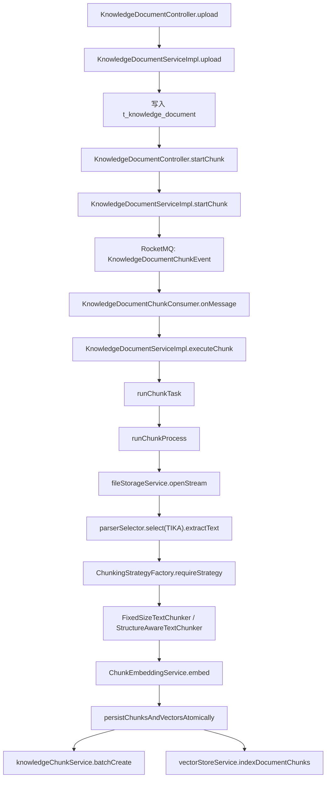
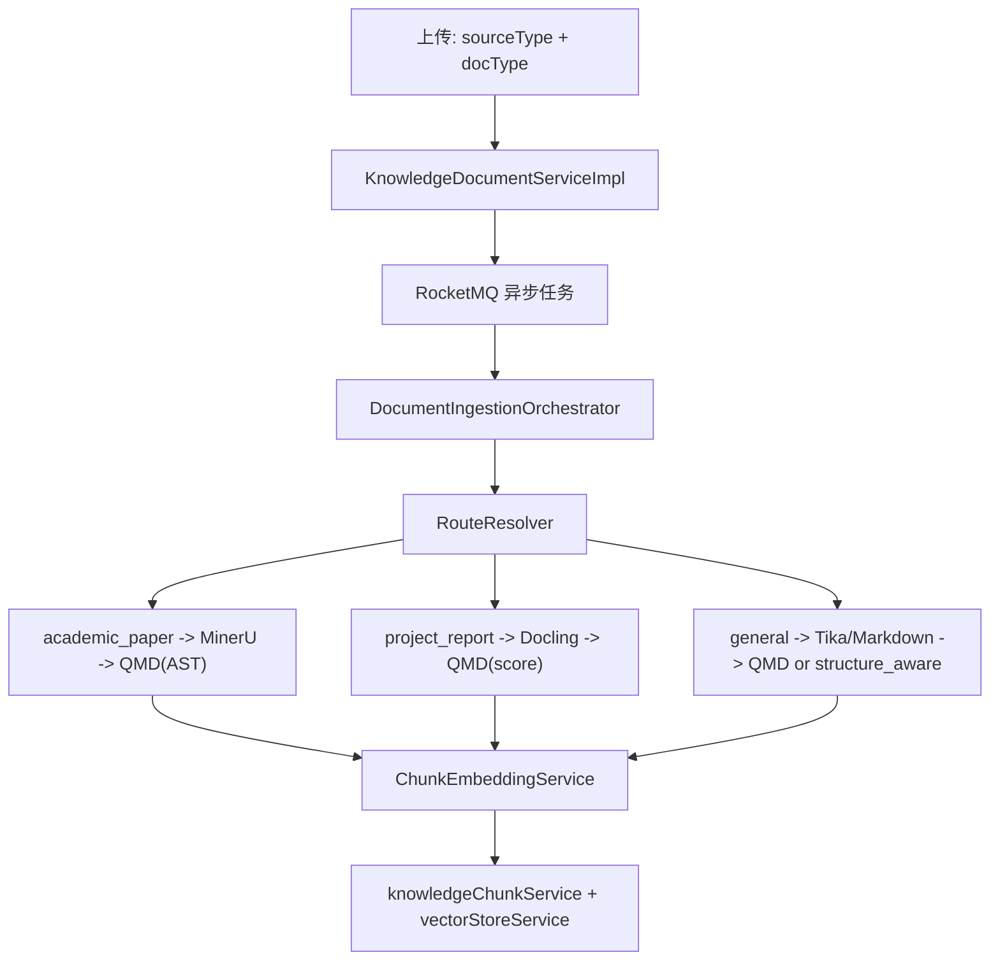

# Ragent 知识库重构方案

## 面向“项目报告 + 学术论文”双路场景的可落地实施版

## 实施状态（2026-04-26）

- 阶段一：已完成。实施记录见 `docs/知识库重构/阶段一-指挥中枢实施记录.md`，验收清单见 `docs/知识库重构/阶段一-验收清单.md`
- 阶段二：已补齐到 100% 可验收，已暂停等待人工确认。实施记录见 `docs/知识库重构/阶段二-QMD切块引擎实施记录.md`，验收清单见 `docs/知识库重构/阶段二-验收清单.md`
- 阶段三：未开始

说明：本文第 1 节保留了重构前的代码现状判断，作为方案基线。阶段二完成后，`docType`、编排器、metadata 写入/过滤、聊天入口文档类型筛选、`parse_engine / chunk_engine` 可观测字段、`qmd_smart` 默认切块、QMD 适配脚本、`DocumentChunkEngine` 边界与回退机制已经落地。

## 0. 结论

基于当前仓库实际代码，`Ragent` 现在的文档入库主链路已经不是旧版 `Pipeline/DAG`，而是一个很清晰的线性异步流程：

`上传 -> MQ 异步分块任务 -> Tika/Markdown 解析 -> fixed_size/structure_aware 切块 -> embedding -> DB + 向量库入库`

因此，这次重构**不应该再围绕已经被删除的 Pipeline 引擎设计**，而应该围绕当前这条主链路做“路由解耦 + 切块升级 + 解析替换”三阶段演进。

你的三段式目标是正确的，但必须翻译成当前仓库可直接落地的版本：

1. 第一阶段先建立 `doc_type` 路由和统一编排层，不动现有 Tika 主力地位。
2. 第二阶段把旧切块器从主链路中抽象出来，并接入 QMD 作为默认智能切块引擎。
3. 第三阶段按 `academic_paper / project_report / general` 三路分别接入 `MinerU / Docling / Tika`，完成“绞杀者模式”替换。

这条路线和当前源码、当前数据库、当前前端页面都是兼容的，且每一阶段都可以独立上线、可回滚、可验收。

---

## 1. 当前代码的真实现状

这部分只基于当前仓库实际存在的代码判断，重点看了这些文件：

- `bootstrap/src/main/java/com/nageoffer/ai/ragent/knowledge/controller/KnowledgeDocumentController.java`
- `bootstrap/src/main/java/com/nageoffer/ai/ragent/knowledge/service/impl/KnowledgeDocumentServiceImpl.java`
- `bootstrap/src/main/java/com/nageoffer/ai/ragent/knowledge/mq/KnowledgeDocumentChunkConsumer.java`
- `bootstrap/src/main/java/com/nageoffer/ai/ragent/core/parser/DocumentParserSelector.java`
- `bootstrap/src/main/java/com/nageoffer/ai/ragent/core/parser/TikaDocumentParser.java`
- `bootstrap/src/main/java/com/nageoffer/ai/ragent/core/parser/MarkdownDocumentParser.java`
- `bootstrap/src/main/java/com/nageoffer/ai/ragent/core/chunk/ChunkingMode.java`
- `bootstrap/src/main/java/com/nageoffer/ai/ragent/core/chunk/ChunkingStrategyFactory.java`
- `bootstrap/src/main/java/com/nageoffer/ai/ragent/core/chunk/strategy/FixedSizeTextChunker.java`
- `bootstrap/src/main/java/com/nageoffer/ai/ragent/core/chunk/strategy/StructureAwareTextChunker.java`
- `bootstrap/src/main/java/com/nageoffer/ai/ragent/core/chunk/ChunkEmbeddingService.java`
- `bootstrap/src/main/java/com/nageoffer/ai/ragent/rag/core/vector/PgVectorStoreService.java`
- `bootstrap/src/main/java/com/nageoffer/ai/ragent/rag/core/vector/MilvusVectorStoreService.java`
- `bootstrap/src/main/java/com/nageoffer/ai/ragent/rag/core/retrieve/RetrieveRequest.java`
- `bootstrap/src/main/java/com/nageoffer/ai/ragent/rag/core/retrieve/PgRetrieverService.java`
- `bootstrap/src/main/java/com/nageoffer/ai/ragent/rag/core/retrieve/MilvusRetrieverService.java`
- `frontend/src/services/knowledgeService.ts`
- `frontend/src/pages/admin/knowledge/KnowledgeDocumentsPage.tsx`
- `resources/database/schema_pg.sql`
- `resources/database/upgrade_v1.1_to_v1.2_remove_pipeline.sql`

### 1.1 当前真实主链路



### 1.2 必须说清楚的现状

- 当前仓库已经没有旧版 `IngestionEngine / ParserNode / ChunkerNode / IndexerNode` 可供接入。
- `resources/database/upgrade_v1.1_to_v1.2_remove_pipeline.sql` 已明确删除 `process_mode`、`pipeline_id` 以及整套 ingestion pipeline 表。
- 当前默认解析器在主链路里被写死为 `Tika`，并没有真正按 MIME 自动路由。
- 当前切块器只有两种：`fixed_size` 和 `structure_aware`。
- 当前向量写入层已经支持 `VectorChunk.metadata` 透传到 PostgreSQL JSONB / Milvus metadata。
- 当前检索请求 `RetrieveRequest` 已预留 `metadataFilters`，但 Pg/Milvus 检索实现还没有真正使用它。

### 1.3 当前链路的关键问题

#### 问题 1：缺少业务路由维度

当前上传接口只有：

- `sourceType`: `file / url`
- `chunkStrategy`
- `chunkConfig`

没有：

- `docType`: `academic_paper / project_report / general`

这意味着系统无法在入口处决定“该走哪一条解析/切块链路”。

#### 问题 2：`MarkdownDocumentParser` 已存在，但主链路没用上

`DocumentParserSelector.selectByMimeType()` 已经支持按 MIME 路由，`MarkdownDocumentParser` 也已经存在，但 `KnowledgeDocumentServiceImpl.runChunkProcess()` 仍然写死：

```java
parserSelector.select(ParserType.TIKA.getType()).extractText(...)
```

这会导致：

- Markdown 文档也走 Tika
- `selectByMimeType()` 成了“存在但未接入主链路”的扩展点

#### 问题 3：当前切块能力还停留在“文本切割”层

`FixedSizeTextChunker` 和 `StructureAwareTextChunker` 已经比“简单 substring”好很多，但本质上仍是：

- 纯文本/轻 Markdown 规则切块
- 没有 AST
- 没有基于标题树的语义评分
- 没有公式、表格、图注锚点的结构感知

这对“项目报告 / 学术论文”场景是不够的。

#### 问题 4：向量 metadata 已可写，但还没有被体系化使用

当前 `PgVectorStoreService` / `MilvusVectorStoreService` 最终写入的 metadata 主要是：

- `collection_name`
- `doc_id`
- `chunk_index`
- `chunk.getMetadata()` 里的透传字段

这说明“写 metadata”能力是现成的，但还没有统一约束写入：

- `doc_type`
- `source_type`
- `parse_engine`
- `chunk_engine`
- `page_no`
- `heading_path`

等字段。

#### 问题 5：检索层还没有真正吃到 metadata 过滤能力

`RetrieveRequest.metadataFilters` 已有字段设计，但：

- `PgRetrieverService` 现在只按 `collection_name` 查
- `MilvusRetrieverService` 现在没有拼接 expr

所以“类型隔离/命名空间检索”的最后一公里还没打通。

---

## 2. 本次重构的目标定义

本次重构不是“再造一套抽象框架”，而是让当前主链路升级为以下目标流程：



### 2.1 三类文档的职责边界

#### `academic_paper`

面向：

- 论文 PDF
- 公式密集型技术文档
- 多栏排版、参考文献、复杂图表说明

目标：

- 尽量保留 LaTeX 公式
- 优先保证公式、章节、标题树完整
- 后续检索可回到页码、章节、公式附近

#### `project_report`

面向：

- 项目报告
- 实验报告
- 评审材料
- 交付文档

目标：

- 优先保留跨页表格、章节结构、图表标题
- 为汇总比对类问答提供更完整的表格上下文

#### `general`

面向：

- 简单 Word
- Markdown
- 纯文本
- 普通说明文档

目标：

- 保持低成本、稳定、可兜底
- 不强依赖外部 GPU 解析服务

### 2.2 设计原则

#### 原则 1：不再引回旧 Pipeline

旧 Pipeline 已被当前仓库删除，这不是缺陷，反而是好事。当前链路足够简单，应该继续保持：

- 统一入口
- 统一异步编排
- 统一持久化收口

新增的复杂性应该通过“路由 + 策略适配器”承接，而不是重造 DAG。

#### 原则 2：保留当前 `sourceType=file/url` 语义，不与业务类型混淆

当前系统中的 `sourceType` 已经表示“文件来源”：

- `file`
- `url`

而你的新场景里说的“source_type 标签”其实是“业务文档类型”。为了避免语义打架，建议：

- API / DB 新增 `docType`
- 向量 metadata 写入：
  - `doc_type`: `academic_paper / project_report / general`
  - `source_type`: 同 `doc_type`，用于兼容你希望的命名方式
  - `ingest_source_type`: `file / url`

这样既不破坏现有代码，也保留未来检索语义。

#### 原则 3：外部引擎全部放在 JVM 外部

不论是：

- QMD
- MinerU
- Docling

都不应直接嵌入 Java 进程内部实现，而应通过以下方式接入：

- `ProcessBuilder` 调本地适配脚本
- 或独立 Python / HTTP 服务

这样便于：

- 独立升级
- 独立限流
- 故障隔离
- 灰度切换

#### 原则 4：每一阶段都必须可回退

任何一个外部引擎失败时，都必须存在回退链：

- `MinerU -> Tika`
- `Docling -> Tika`
- `QMD -> structure_aware`

否则上线风险过高。

---

## 3. 推荐的目标代码结构

建议新增一个轻量但明确的摄取编排层：

```text
bootstrap/src/main/java/com/nageoffer/ai/ragent/knowledge/ingest/
  DocumentType.java
  DocumentRoute.java
  DocumentIngestionOrchestrator.java
  RouteResolver.java
  ParseArtifact.java
  ChunkInput.java
  ChunkOutput.java
  metadata/ChunkMetadataBuilder.java
  parser/ParseEngine.java
  parser/TikaParseEngine.java
  parser/MineruParseEngine.java
  parser/DoclingParseEngine.java
  chunk/ChunkEngine.java
  chunk/DefaultChunkEngine.java
  chunk/QmdChunkEngine.java
  client/QmdProcessClient.java
  client/MineruClient.java
  client/DoclingClient.java
```

### 3.1 核心对象建议

#### `DocumentType`

```java
public enum DocumentType {
    GENERAL,
    PROJECT_REPORT,
    ACADEMIC_PAPER
}
```

#### `DocumentRoute`

```java
public record DocumentRoute(
        DocumentType docType,
        String parseEngine,
        String chunkEngine,
        boolean fallbackToTika,
        boolean fallbackToStructureAware
) {
}
```

#### `ParseArtifact`

```java
public record ParseArtifact(
        String rawText,
        String normalizedMarkdown,
        Map<String, Object> metadata
) {
}
```

#### `ChunkInput`

```java
public record ChunkInput(
        String rawText,
        String normalizedMarkdown,
        Map<String, Object> metadata,
        KnowledgeDocumentDO document
) {
}
```

这里刻意不引入过重的 `DocumentIR` 体系，原因很简单：

- 当前仓库还没有结构化摄取底座
- 先用 `normalizedMarkdown + metadata` 已足够承接 QMD / MinerU / Docling
- 如果第三阶段跑通，再考虑把 `pageAnchors / tables / formulas` 升级成真正 IR

---

## 4. 分阶段实施方案

## 4.1 第一阶段：建立“指挥中枢”

### 目标

- 建立 `docType` 路由
- 抽出统一编排层
- 让 metadata 标签真正落库并可检索
- **不替换 Tika**
- **不引回旧 Pipeline**

### 关键判断

这一阶段实际上是把你说的“架构解耦”落实到当前仓库。

其中“删掉复杂的 Pipeline 引擎”这一条，在当前仓库里已经被完成了大半：

- 旧 Pipeline 已在 `v1.2` migration 中删除
- 现在只需要把剩余的线性流程从 `KnowledgeDocumentServiceImpl` 中抽离出来

### 具体改造点

#### 4.1.1 API、前端、数据库新增 `docType`

后端新增字段：

- `KnowledgeDocumentUploadRequest.docType`
- `KnowledgeDocumentUpdateRequest.docType`
- `KnowledgeDocumentDO.docType`
- `KnowledgeDocumentVO.docType`
- `KnowledgeDocumentChunkLogDO.docType`
- `KnowledgeDocumentChunkLogVO.docType`

前端新增字段：

- `frontend/src/services/knowledgeService.ts`
- `frontend/src/pages/admin/knowledge/KnowledgeDocumentsPage.tsx`

数据库新增字段：

```sql
ALTER TABLE t_knowledge_document
    ADD COLUMN doc_type VARCHAR(32) NOT NULL DEFAULT 'general';

ALTER TABLE t_knowledge_document_chunk_log
    ADD COLUMN doc_type VARCHAR(32);

CREATE INDEX idx_doc_type ON t_knowledge_document (doc_type);
```

默认值统一为：

- `general`

第一阶段**不要做自动识别**，只允许用户显式选择。原因是：

- 自动分类会引入额外误判
- 先把路由链路打通，比“让模型猜”更重要

#### 4.1.2 引入统一编排器，接管 `runChunkProcess()`

当前 `KnowledgeDocumentServiceImpl.runChunkProcess()` 直接承担了：

- 解析
- 切块
- embedding

建议改为：

- `KnowledgeDocumentServiceImpl` 只负责任务状态、日志、事务收口
- 新增 `DocumentIngestionOrchestrator` 真正执行文档处理

伪代码如下：

```java
public ChunkProcessResult process(KnowledgeDocumentDO documentDO) {
    DocumentRoute route = routeResolver.resolve(documentDO);
    ParseArtifact artifact = parse(route, documentDO);
    List<VectorChunk> chunks = chunk(route, artifact, documentDO);
    chunkEmbeddingService.embed(chunks, resolveEmbeddingModel(documentDO));
    return new ChunkProcessResult(chunks, route);
}
```

这一步的价值是：

- 第二阶段接 QMD 不再改 `KnowledgeDocumentServiceImpl`
- 第三阶段接 MinerU / Docling 也不再改主业务类

#### 4.1.3 第一阶段的路由策略

第一阶段先只做“路由骨架”，真正的解析器暂时保持保守：

| `docType` | Parse Engine               | Chunk Engine         |
| --------- | -------------------------- | -------------------- |
| `general` | `selectByMimeType()`       | 维持现有策略         |
| `project_report` | `Tika` 暂代               | 维持现有策略         |
| `academic_paper` | `Tika` 暂代               | 维持现有策略         |

这里有一个必须立即修掉的问题：

当前主链路必须从：

```java
parserSelector.select(ParserType.TIKA.getType())
```

改为：

```java
parserSelector.selectByMimeType(documentDO.getFileType())
```

这样：

- Markdown 才能真正走 `MarkdownDocumentParser`
- `general` 轨道才能做到“简单文档轻处理”

#### 4.1.4 metadata 隔离与命名空间准备

第一阶段必须统一要求所有 `VectorChunk` 写 metadata：

```java
metadata.put("doc_type", documentDO.getDocType());
metadata.put("source_type", documentDO.getDocType());
metadata.put("ingest_source_type", documentDO.getSourceType());
metadata.put("doc_id", documentDO.getId());
metadata.put("kb_id", documentDO.getKbId());
metadata.put("file_type", documentDO.getFileType());
metadata.put("chunk_strategy", documentDO.getChunkStrategy());
metadata.put("parse_engine", route.parseEngine());
metadata.put("chunk_engine", route.chunkEngine());
```

为什么第一阶段就要做这件事：

- `PgVectorStoreService` 和 `MilvusVectorStoreService` 已经支持透传 metadata
- 这几乎是最低成本高收益改造
- 以后无论检索过滤、A/B 对比、回溯问题，都依赖这些标签

#### 4.1.5 让检索层真正支持 metadataFilters

第一阶段要把“写标签”做完整，就必须顺手补齐“按标签检索”。

建议：

- `PgRetrieverService` 根据 `RetrieveRequest.metadataFilters` 拼接 `metadata->>'key' = ?`
- `MilvusRetrieverService` 根据 `metadataFilters` 生成 expr

这样才能真正支持：

- 只查 `academic_paper`
- 只查 `project_report`
- 或混合查

这一步是“Namespace 方案”真正闭环的关键。

### 第一阶段涉及文件

- `bootstrap/src/main/java/com/nageoffer/ai/ragent/knowledge/controller/request/KnowledgeDocumentUploadRequest.java`
- `bootstrap/src/main/java/com/nageoffer/ai/ragent/knowledge/controller/request/KnowledgeDocumentUpdateRequest.java`
- `bootstrap/src/main/java/com/nageoffer/ai/ragent/knowledge/controller/vo/KnowledgeDocumentVO.java`
- `bootstrap/src/main/java/com/nageoffer/ai/ragent/knowledge/dao/entity/KnowledgeDocumentDO.java`
- `bootstrap/src/main/java/com/nageoffer/ai/ragent/knowledge/dao/entity/KnowledgeDocumentChunkLogDO.java`
- `bootstrap/src/main/java/com/nageoffer/ai/ragent/knowledge/controller/vo/KnowledgeDocumentChunkLogVO.java`
- `bootstrap/src/main/java/com/nageoffer/ai/ragent/knowledge/service/impl/KnowledgeDocumentServiceImpl.java`
- `bootstrap/src/main/java/com/nageoffer/ai/ragent/core/parser/DocumentParserSelector.java`
- `bootstrap/src/main/java/com/nageoffer/ai/ragent/rag/core/retrieve/RetrieveRequest.java`
- `bootstrap/src/main/java/com/nageoffer/ai/ragent/rag/core/retrieve/PgRetrieverService.java`
- `bootstrap/src/main/java/com/nageoffer/ai/ragent/rag/core/retrieve/MilvusRetrieverService.java`
- `frontend/src/services/knowledgeService.ts`
- `frontend/src/pages/admin/knowledge/KnowledgeDocumentsPage.tsx`
- `resources/database/schema_pg.sql`
- `resources/database/upgrade_*.sql`

### 第一阶段验收标准

- 上传页面可选择 `general / project_report / academic_paper`
- 文档表成功保存 `doc_type`
- 主链路不再写死 `Tika`，Markdown 能走 `MarkdownDocumentParser`
- 每个 chunk 的向量 metadata 都带有 `doc_type/source_type/ingest_source_type`
- 检索层支持 metadata 过滤
- 不引入任何新外部解析依赖，系统稳定性与当前版本等价

---

## 4.2 第二阶段：切块引擎升级为 QMD

### 目标

- 把“切块”从当前主链路中彻底抽象出来
- 用 QMD 替换默认切块能力
- 在不替换解析器的前提下，先把“语义被切断”的问题解决一大半

### 关键判断

这一阶段的核心不是“直接赌一个未验证的 CLI 子命令”，而是：

- 在当前 orchestrator 上增加稳定的 QMD 接入口
- 让 Java 只依赖标准 JSON 输入输出
- 出错时能立刻退回 `structure_aware`

### 4.2.1 为什么第二阶段就能见效

即使当前输入仍然来自 Tika 纯文本，QMD 依然会优于当前两套策略，因为它更适合：

- 按段落/标题边界切块
- 避免把标题和正文强行切开
- 避免无脑固定长度截断

所以第二阶段是低风险高收益。

### 4.2.2 QMD 接入方式不要赌“未验证的 chunk CLI”

截至 **2026-04-25**，官方 QMD 项目确认存在：

- CLI：`qmd embed` / `qmd query`
- Bun / Node 安装方式：`bunx @tobilu/qmd ...`
- 默认 smart chunk：约 `900 tokens + 15% overlap`
- Markdown 文档默认走正则/智能边界切块，代码文件可启用 AST-aware chunking

但官方公开 CLI 重点是“索引/查询”，不是“给你一个稳定的独立 chunk 子命令”。

因此，**完全可行且当前仓库已经落地的方式**不是在 Java 里硬编码一个假定存在的 `qmd chunk` 命令，而是：

1. 新增一个很薄的 Node 适配脚本：
   - `scripts/qmd/chunker.mjs`
2. 适配脚本内部调用：
   - 已安装的 `@tobilu/qmd`
   - 或你们封装后的固定 Node/Bun API
3. Java 侧通过 `ProcessBuilder` 调用这个适配脚本
4. 适配脚本返回稳定 JSON，由 Java 反序列化成 `VectorChunk`

这样做的好处是：

- Java 与 QMD 的耦合点只有“输入输出 JSON”
- 未来 QMD 升级，只改适配脚本，不改 Java 主链路
- 不依赖未文档化 CLI
- 在当前仓库环境中，直接复用 Node 22 运行时，比额外引入 Bun 更容易部署和验证

### 4.2.3 第二阶段已落地结构

当前仓库第二阶段的真实实现没有再额外引入一层 `ChunkEngine` 抽象，而是沿用第一阶段已经落地的 `KnowledgeDocumentIngestionOrchestrator`，直接增加 QMD 分支。

当前实际链路：

```java
KnowledgeDocumentIngestionOrchestrator
    -> QmdProcessClient
    -> node scripts/qmd/chunker.mjs
    -> @tobilu/qmd
```

QMD 成功时：

- `chunk_engine = qmd`
- `chunk_fallback = false`

QMD 失败时自动回退：

- `chunk_engine = structure_aware`
- `chunk_fallback = true`

### 4.2.4 第二阶段推荐路由

| `docType` | Parse Engine | Chunk Engine |
| --------- | ------------ | ------------ |
| `general` | MIME 路由      | `QMD` 主用，失败回退 `structure_aware` |
| `project_report` | `Tika`       | `QMD` 主用，失败回退 `structure_aware` |
| `academic_paper` | `Tika`       | `QMD` 主用，失败回退 `structure_aware` |

### 4.2.5 `ChunkingMode` 的演进

建议在现有枚举基础上新增：

- `QMD_SMART`

并保留：

- `FIXED_SIZE`
- `STRUCTURE_AWARE`

原因不是为了继续让用户长期三选一，而是为了：

- 灰度
- 排障
- 回退

第二阶段默认值已从：

- `fixed_size`

切换到：

- `qmd_smart`

### 4.2.6 QMD 失败回退策略

QMD 适配层必须内建：

- 启动超时
- stderr 捕获
- JSON 解析失败兜底
- 返回空 chunk 兜底

任一异常都回退为：

- `StructureAwareTextChunker`

只有这样，第二阶段才能安全上线。

### 第二阶段验收标准

- QMD 能通过 Node/Bun 适配脚本被 Java 主链路调用
- 文档分块默认走 QMD
- QMD 异常时自动回退 `structure_aware`
- chunk 平均长度、标题完整率、跨段落误切率优于当前实现
- 现有嵌入与入库逻辑保持不变

---

## 4.3 第三阶段：解析引擎替换，进入“双路专轨”

### 目标

- `academic_paper` 走 `MinerU`
- `project_report` 走 `Docling`
- `general` 保留 `Tika / Markdown`
- 让 QMD 真正吃到高质量 Markdown，而不是粗糙纯文本

### 关键判断

这是最核心的一阶段，也是算力和工程复杂度最高的一阶段。

但它依然可以在当前仓库里平滑落地，因为：

- 第一阶段已经有了 `docType` 路由
- 第二阶段已经有了稳定的 QMD 接入口与回退逻辑
- 第三阶段只需要把 `ParseEngine` 换掉

### 4.3.1 推荐解析引擎路由

| `docType` | Primary Parse Engine | Fallback Parse Engine | Chunk Engine |
| --------- | -------------------- | --------------------- | ------------ |
| `academic_paper` | `MinerU`             | `Tika`                | `QMD(AST 优先)` |
| `project_report` | `Docling`            | `Tika`                | `QMD(score 优先)` |
| `general` | `selectByMimeType()`  | `Tika`                | `QMD` 或 `structure_aware` |

### 4.3.2 为什么论文优先 MinerU，报告优先 Docling

截至 **2026-04-25**，官方公开资料显示：

- `MinerU` 强项在复杂 PDF、公式转 LaTeX、跨页表格、多栏阅读顺序、复杂版面重建
- `Docling` 强项在统一文档对象、Markdown/JSON 导出、PDF/DOCX/PPTX/XLSX 多格式转换、表格和页面结构理解

因此建议：

- `academic_paper` 以 MinerU 为主，因为学术论文最敏感的是公式和复杂版面
- `project_report` 以 Docling 为主，因为项目报告更看重表格、章节结构、通用 Office 文档兼容性

### 4.3.3 第三阶段建议接口

```java
public interface ParseEngine {
    String getName();
    boolean supports(DocumentRoute route, KnowledgeDocumentDO documentDO);
    ParseArtifact parse(KnowledgeDocumentDO documentDO, byte[] fileBytes);
}
```

#### `TikaParseEngine`

职责：

- 复用当前 `DocumentParserSelector`
- 保底支持 Markdown / 普通文档

#### `MineruParseEngine`

建议接入方式：

- 首选独立服务或 CLI
- Java 只传文件路径/文件字节和参数
- 返回 Markdown / JSON / metadata

注意事项：

- 必须和主服务隔离部署
- 要有限流和超时
- 要支持失败自动降级到 Tika

#### `DoclingParseEngine`

建议接入方式：

- Python service
- 或 CLI 适配层

返回：

- Markdown
- 可选结构化 JSON

### 4.3.4 第三阶段建议补充 `chunk_meta`

如果第三阶段只把结构信息放进向量 metadata，而不保留到业务库，那么后续：

- 后台页查看
- 证据链展示
- chunk 级人工修正

都会很痛苦。

因此第三阶段建议给 `t_knowledge_chunk` 新增一个 JSONB 字段：

```sql
ALTER TABLE t_knowledge_chunk
    ADD COLUMN chunk_meta JSONB;

CREATE INDEX idx_chunk_meta ON t_knowledge_chunk USING gin(chunk_meta);
```

建议写入：

- `heading_path`
- `page_no`
- `section_type`
- `table_ids`
- `figure_ids`
- `formula_ids`
- `parse_engine`
- `chunk_engine`

这样既能同步写进向量 metadata，也能保存在业务库。

### 4.3.5 第三阶段建议扩展 `RetrievedChunk`

当前 `RetrievedChunk` 只有：

- `id`
- `text`
- `score`

第三阶段建议扩展：

```java
private Map<String, Object> metadata;
```

原因是后续问答很可能需要引用：

- 第几页
- 哪个标题
- 来自论文还是报告

这对项目报告输出和论文证据链都很重要。

### 第三阶段验收标准

- `academic_paper` 文档默认走 MinerU，失败能回退 Tika
- `project_report` 文档默认走 Docling，失败能回退 Tika
- QMD 能直接吃 Markdown，而不是只吃 Tika 纯文本
- 公式、表格、页码、章节路径等结构信息能进入 chunk metadata
- 检索结果能按 `doc_type` 过滤，并携带基础 metadata 回到上层

---

## 5. 数据模型改造建议

## 5.1 文档表

建议最少新增：

```sql
ALTER TABLE t_knowledge_document
    ADD COLUMN doc_type VARCHAR(32) NOT NULL DEFAULT 'general',
    ADD COLUMN parse_engine VARCHAR(32),
    ADD COLUMN chunk_engine VARCHAR(32);
```

解释：

- `doc_type`：业务路由
- `parse_engine`：最终使用的解析器，便于排障
- `chunk_engine`：最终使用的切块器，便于灰度和回溯

## 5.2 分块日志表

建议新增：

```sql
ALTER TABLE t_knowledge_document_chunk_log
    ADD COLUMN doc_type VARCHAR(32),
    ADD COLUMN parse_engine VARCHAR(32),
    ADD COLUMN chunk_engine VARCHAR(32);
```

## 5.3 分块表

第三阶段建议新增：

```sql
ALTER TABLE t_knowledge_chunk
    ADD COLUMN chunk_meta JSONB;
```

---

## 6. 推荐实施顺序

### 第 1 周

- 增加 `docType`
- 改造上传接口与前端表单
- `runChunkProcess()` 改为 orchestrator 编排
- 主链路 parser 从写死 Tika 改为 MIME 路由
- 统一写入 metadata

### 第 2 周

- 补齐 `RetrieveRequest.metadataFilters`
- Pg / Milvus 实现 metadata 过滤
- 增加 `parse_engine/chunk_engine` 记录
- 打通第一阶段验收

### 第 3 周

- 新增 `ChunkEngine`
- 新增 Bun 适配脚本
- 接入 QMD
- 加入回退策略

### 第 4 周

- QMD 灰度上线
- 对比 `fixed_size / structure_aware / qmd_smart`
- 确认默认切块策略切换

### 第 5-6 周

- 部署 MinerU
- 部署 Docling
- 新增 `ParseEngine`
- 完成第三阶段双路专轨

### 第 7 周以后

- 扩展 `chunk_meta`
- 扩展 `RetrievedChunk.metadata`
- 做项目报告/论文证据链展示

---

## 7. 风险与回滚策略

## 7.1 QMD 风险

风险：

- QMD 当前官方公开能力重点是索引/搜索，不是独立 chunk 子命令
- 直接硬编码某个 CLI 调用方式，后续升级可能断

对策：

- Java 只调用内部 Bun 适配脚本
- 适配脚本负责吸收 QMD 版本变化
- Java 主链路保留 `structure_aware` 回退

## 7.2 MinerU 风险

风险：

- 资源占用高
- 文档类型复杂时效果虽好，但部署成本也高
- 许可证需要在正式商用前复核

对策：

- 独立服务部署
- 路由只对 `academic_paper` 生效
- 失败直接退 Tika

## 7.3 Docling 风险

风险：

- 不同版本功能演进较快
- 需要单独 Python 环境

对策：

- 独立环境部署
- 主链路只依赖固定输出契约：Markdown + metadata
- 失败退 Tika

---

## 8. 最终建议

如果只看“完全可行”和“收益最大”，建议你按下面顺序推进：

1. 先做 `docType + orchestrator + metadataFilters`，这是所有后续能力的地基。
2. 再做 `QMD`，因为它能在不替换解析器的前提下最快提升切块质量。
3. 最后做 `MinerU / Docling`，让论文和报告真正分轨。

最终的稳定目标应该是：

- `academic_paper -> MinerU -> QMD(AST) -> Embed -> Vector Store`
- `project_report -> Docling -> QMD(score) -> Embed -> Vector Store`
- `general -> Tika/Markdown -> QMD or structure_aware -> Embed -> Vector Store`

而不是重新回到一个庞大、抽象过度、难以灰度的 Pipeline 系统。

---

## 9. 外部引擎接入依据（截至 2026-04-25 校验）

- QMD 官方仓库：<https://github.com/tobi/qmd>
  - 官方 README 明确支持 `bunx @tobilu/qmd ...`
  - 默认 smart chunk 约 `900 tokens + 15% overlap`
- Docling 官方仓库：<https://github.com/docling-project/docling>
  - 官方 README 明确支持 PDF / DOCX / PPTX / XLSX / Markdown 等格式，并可导出 Markdown
- Docling 官方最小示例：<https://docling-project.github.io/docling/examples/minimal/>
  - `DocumentConverter().convert(...).document.export_to_markdown()`
- MinerU 官方仓库：<https://github.com/opendatalab/MinerU>
  - 官方 README 明确支持 PDF / DOCX / PPTX / XLSX / image -> Markdown / JSON
  - 论文/复杂版面强项包括公式转 LaTeX、跨页表格、多栏阅读顺序
- PDF-Extract-Kit 官方仓库：<https://github.com/opendatalab/PDF-Extract-Kit>
  - 官方说明已明确：如果目标是高质量文档转 Markdown，应优先使用 MinerU
